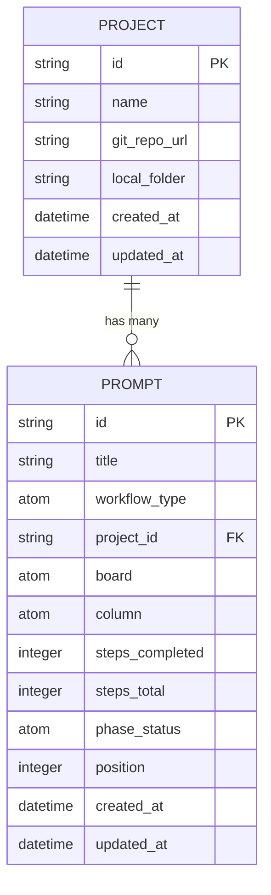

# Introduce Project Entity

## Overview

Replace the current `repo_url` string field on prompts with a first-class **Project** entity. A Project represents a codebase that prompts operate against, with a name, an optional git repository URL, and an optional local folder path (at least one of the latter two is required). Projects are shared across prompts and managed independently.

## Problem Statement / Motivation

Currently, each prompt stores a raw `repo_url` string. This has limitations:

- No way to share repository context across prompts — the same URL is duplicated
- No structured representation of where a codebase lives (git URL vs local folder)
- AI phases only receive a URL string, losing richer context (project name, local path)
- No management UI for repositories — they're just free-text fields in the wizard

A first-class Project entity solves these by providing a shared, structured representation.

## Proposed Solution

Add a Project entity to ETS alongside existing prompts and messages, with a CRUD management page, integration into the wizard, and updated AI phase context.

## Technical Approach

### Entity Relationship



### Architecture

**Storage layer** (`lib/destila/store.ex`): Add Project CRUD to the existing ETS table using `{:project, id}` composite keys, following the established pattern for prompts (`{:prompt, id}`) and messages (`{:message, prompt_id, id}`).

**PubSub**: Use the existing `"store:updates"` topic with new event tuples: `{:project_created, project}`, `{:project_updated, project}`, `{:project_deleted, project}`.

**Prompt schema change**: Replace `repo_url` field with `project_id` (string or nil). Remove `repo_url` entirely.

### Implementation Phases

#### Phase 1: Storage & Data Layer

Add Project CRUD to `Destila.Store`:

- `lib/destila/store.ex` — Add functions:

```elixir
# Project CRUD
def list_projects do
  :ets.match_object(@table, {{:project, :_}, :_})
  |> Enum.map(fn {_key, project} -> project end)
  |> Enum.sort_by(& &1.name)
end

def get_project(id) do
  case :ets.lookup(@table, {:project, id}) do
    [{_, project}] -> project
    [] -> nil
  end
end

def create_project(attrs) do
  id = generate_id()
  now = DateTime.utc_now()

  project =
    Map.merge(
      %{id: id, name: "", git_repo_url: nil, local_folder: nil, created_at: now, updated_at: now},
      attrs
    )
    |> Map.put(:id, id)

  :ets.insert(@table, {{:project, id}, project})
  Phoenix.PubSub.broadcast(Destila.PubSub, "store:updates", {:project_created, project})
  project
end

def update_project(id, attrs) do
  case get_project(id) do
    nil -> nil
    project ->
      updated = Map.merge(project, attrs) |> Map.put(:updated_at, DateTime.utc_now())
      :ets.insert(@table, {{:project, id}, updated})
      Phoenix.PubSub.broadcast(Destila.PubSub, "store:updates", {:project_updated, updated})
      updated
  end
end

def delete_project(id) do
  case get_project(id) do
    nil -> {:error, :not_found}
    project ->
      linked = list_prompts() |> Enum.any?(&(&1[:project_id] == id))
      if linked do
        {:error, :has_linked_prompts}
      else
        :ets.delete(@table, {:project, id})
        Phoenix.PubSub.broadcast(Destila.PubSub, "store:updates", {:project_deleted, project})
        :ok
      end
  end
end
```

- `lib/destila/store.ex` — Update `create_prompt/1` defaults: replace `repo_url: nil` with `project_id: nil`

**Files to modify:**
- `lib/destila/store.ex` — Add 5 project functions, update prompt defaults

#### Phase 2: Seeds Migration

Update `lib/destila/seeds.ex` to create Project entities and link prompts via `project_id`.

**Deduplication mapping** (current seed `repo_url` values → projects):

| Project Name | git_repo_url | Used by prompts |
|---|---|---|
| Acme Webapp | `https://github.com/acme/webapp` | "Add dark mode toggle", "Fix flaky test" |
| Acme API Server | `https://github.com/acme/api-server` | "Refactor authentication middleware" |
| Acme Payments | `https://github.com/acme/payments` | "Refactor payment gateway error handling" |
| Acme Webhooks | `https://github.com/acme/webhooks` | "Implement webhook retry logic" |
| Acme Gateway | `https://github.com/acme/gateway` | "Add rate limiting to API gateway" |
| Acme Notifications | `https://github.com/acme/notifications` | "Build notification service" |
| Acme Auth | `https://github.com/acme/auth` | "Migrate user sessions to Redis" |
| Acme Reports | `https://github.com/acme/reports` | "GraphQL schema for reporting API" |
| Acme Store | `https://github.com/acme/store` | "E2E test suite for checkout flow" |
| Acme Search | `https://github.com/acme/search` | "Search indexing pipeline" |

Prompts with `repo_url: nil` (project workflow type) get `project_id: nil`.

**Structure:**
- Add `seed_projects/0` called before `seed_crafting_board/0`
- Use `insert_project/1` (direct ETS insert, no PubSub) mirroring `insert_prompt/1`
- Store project IDs in module attribute or map for referencing in prompts

**Files to modify:**
- `lib/destila/seeds.ex` — Add project seeds, update all prompt seeds to use `project_id` instead of `repo_url`

#### Phase 3: Update All `repo_url` References

Replace all `repo_url` references across the codebase with `project_id` + project lookups.

**Files to modify (9 files):**

1. `lib/destila/store.ex:40` — Change default from `repo_url: nil` to `project_id: nil`
2. `lib/destila_web/live/new_prompt_live.ex:11,89` — Change assign and prompt creation (full rework in Phase 5)
3. `lib/destila_web/live/prompt_detail_live.ex:734` — Look up project by `@prompt.project_id`, display project name + URL/folder
4. `lib/destila/workflows/chore_task_phases.ex:66` — Look up project in `system_prompt/2`:
   ```elixir
   def system_prompt(2, prompt) do
     project = if prompt[:project_id], do: Destila.Store.get_project(prompt[:project_id])
     repo_ref = cond do
       project && project.git_repo_url -> project.git_repo_url
       project && project.local_folder -> project.local_folder
       true -> "unknown"
     end
     # ... use repo_ref in the prompt string
   end
   ```
5. `lib/destila/seeds.ex` — (done in Phase 2)
6. `test/destila_web/live/new_prompt_live_test.exs` — Update test assertions and setup
7. `test/destila_web/live/chore_task_workflow_live_test.exs` — Update `create_prompt_in_phase/2` helper to use `project_id`
8. `test/destila_web/live/generated_prompt_viewing_live_test.exs` — Update test setup

#### Phase 4: Project Management Page

Create a new LiveView at `/projects` for listing, creating, editing, and deleting projects.

**New files:**
- `lib/destila_web/live/projects_live.ex` — Single LiveView handling all CRUD via assigns

**UI design:**

- **List view**: Card-based list showing project name, git URL (if set), local folder (if set), and linked prompt count. Each card has edit/delete actions.
- **Create/Edit**: Inline form that appears at top of list (not a separate page). Fields: name (required), git_repo_url (optional), local_folder (optional). Validation: name required + at least one of git_repo_url/local_folder.
- **Delete**: Confirmation via a "Confirm delete" button that replaces the delete button. If project has linked prompts, show error message instead.
- **Empty state**: "No projects yet" message with "Create your first project" CTA.

**State management:**
- `@projects` — stream of projects
- `@form` — `to_form` for create/edit
- `@editing_project_id` — nil or the ID being edited
- `@creating` — boolean for showing create form

**PubSub:** Subscribe to `"store:updates"` on mount, handle `{:project_created, _}`, `{:project_updated, _}`, `{:project_deleted, _}` to re-stream.

**Router:** Add `live "/projects", ProjectsLive` to the authenticated scope.

**Sidebar:** Add nav item after "Implementation":
```heex
<.sidebar_item
  navigate={~p"/projects"}
  icon="hero-folder"
  label="Projects"
  active={@page_title == "Projects"}
/>
```

**Files to modify:**
- `lib/destila_web/live/projects_live.ex` — New file
- `lib/destila_web/router.ex` — Add route
- `lib/destila_web/components/layouts.ex` — Add sidebar item

#### Phase 5: Wizard Step 2 Redesign

Replace the repository URL text input in `NewPromptLive` step 2 with a project selection interface.

**UI design for step 2:**

Two sub-views controlled by an `@project_step` assign (`:select` or `:create`):

**Select view** (default):
- Heading: "Link a project"
- Project list: clickable cards showing project name + git URL or local folder. Selected project gets a highlighted border.
- "Create New Project" button below the list
- "Continue" button (enabled when a project is selected)
- "Skip" button (only for `:project` workflow type)
- "Back" button

**Empty state** (no projects exist, non-project workflow):
- "No projects yet. Create one to get started."
- "Create New Project" button (prominent CTA)

**Create view** (inline creation):
- Heading: "Create a new project"
- Form: name, git_repo_url, local_folder fields
- "Create & Select" submit button
- "Back to selection" button
- Validation: name required + at least one of git_repo_url/local_folder

**Assigns changes:**
- Remove `repo_url` assign
- Add `project_id` (selected project ID or nil)
- Add `projects` (list of all projects, refreshed on mount and PubSub events)
- Add `project_step` (`:select` or `:create`)
- Add `project_form` (for inline creation form)

**Event handlers:**
- `select_project` — set `project_id` assign
- `continue_project` — validate project selected (for non-project types), advance to step 3
- `skip_project` — only for `:project` workflow type, advance to step 3 with `project_id: nil`
- `show_create_project` — switch to `:create` sub-view
- `back_to_select` — switch back to `:select` sub-view
- `create_and_select_project` — validate, create project via Store, set `project_id`, switch to `:select` view with new project selected
- `back` (from step 2) — go to step 1
- `back_to_project` (from step 3) — go to step 2

**PubSub:** Subscribe to `"store:updates"` for project events to keep the list current.

**Prompt creation:** In `create_prompt_with_idea/3`, change `repo_url: socket.assigns.repo_url` to `project_id: socket.assigns.project_id`.

**Files to modify:**
- `lib/destila_web/live/new_prompt_live.ex` — Major rework of step 2

#### Phase 6: AI Phase Context Update

Update `ChoreTaskPhases.system_prompt/2` (phase 2) to resolve full project context.

Pass both `git_repo_url` and `local_folder` to the AI prompt so it can use whichever is available:

```elixir
def system_prompt(2, prompt) do
  project = if prompt[:project_id], do: Destila.Store.get_project(prompt[:project_id])

  repo_context = cond do
    project && project.git_repo_url && project.local_folder ->
      "The project \"#{project.name}\" has a git repository at #{project.git_repo_url} and a local folder at #{project.local_folder}."
    project && project.git_repo_url ->
      "The project \"#{project.name}\" has a git repository at #{project.git_repo_url}."
    project && project.local_folder ->
      "The project \"#{project.name}\" has a local folder at #{project.local_folder}."
    true ->
      "The repository location is unknown."
  end

  """
  You are reviewing Gherkin feature files for a coding task. #{repo_context}
  ...
  """
end
```

**Files to modify:**
- `lib/destila/workflows/chore_task_phases.ex` — Update `system_prompt/2` for phase 2

#### Phase 7: Feature Files & Tests

**Update existing feature file:**
- `features/create_prompt_wizard.feature` — Replace all "repository URL" scenarios with project selection scenarios

**New feature files:**
- `features/project_management.feature` — CRUD scenarios
- `features/project_inline_creation.feature` — Inline creation from wizard

**Update existing tests:**
- `test/destila_web/live/new_prompt_live_test.exs` — Rewrite step 2 tests for project selection
- `test/destila_web/live/chore_task_workflow_live_test.exs` — Update `create_prompt_in_phase/2` to use `project_id`
- `test/destila_web/live/generated_prompt_viewing_live_test.exs` — Update setup

**New test files:**
- `test/destila_web/live/projects_live_test.exs` — Tests for project management page

## Acceptance Criteria

### Functional Requirements

- [ ] Projects can be created, listed, edited, and deleted at `/projects`
- [ ] A project has a name (required) + at least one of git_repo_url or local_folder
- [ ] Projects cannot be deleted while linked to one or more prompts
- [ ] Wizard step 2 shows project selection (select existing or create inline)
- [ ] `feature_request` and `chore_task` prompts require a project; `project` type can skip
- [ ] Inline project creation in wizard creates the project and auto-selects it
- [ ] Prompt detail header shows project name instead of repo_url
- [ ] AI phase 2 receives full project context (name, git URL, local folder)
- [ ] All seed data uses projects instead of repo_url
- [ ] PubSub broadcasts project CRUD events on `"store:updates"` topic
- [ ] "Projects" link appears in sidebar navigation

### Quality Gates

- [ ] All existing tests pass after migration
- [ ] New tests cover project CRUD, wizard integration, and inline creation
- [ ] Feature files updated to reflect new behavior
- [ ] `mix precommit` passes

## Dependencies & Risks

**No external dependencies.** All changes are within the existing codebase.

**Risks:**
- **Broad refactoring scope**: 9+ files reference `repo_url`. Missing a reference will cause runtime errors. Mitigated by grepping thoroughly and running full test suite.
- **Wizard complexity increase**: Step 2 goes from a simple text input to a selection + inline creation flow. Keep the UI simple to avoid over-engineering.

## File Impact Summary

| File | Change Type |
|---|---|
| `lib/destila/store.ex` | Modify — add project CRUD, update prompt defaults |
| `lib/destila/seeds.ex` | Modify — add project seeds, update prompt seeds |
| `lib/destila_web/router.ex` | Modify — add `/projects` route |
| `lib/destila_web/components/layouts.ex` | Modify — add sidebar item |
| `lib/destila_web/live/projects_live.ex` | **New** — project management page |
| `lib/destila_web/live/new_prompt_live.ex` | Modify — rework step 2 |
| `lib/destila_web/live/prompt_detail_live.ex` | Modify — show project instead of repo_url |
| `lib/destila/workflows/chore_task_phases.ex` | Modify — resolve project in system_prompt |
| `test/destila_web/live/new_prompt_live_test.exs` | Modify — update step 2 tests |
| `test/destila_web/live/chore_task_workflow_live_test.exs` | Modify — update setup |
| `test/destila_web/live/generated_prompt_viewing_live_test.exs` | Modify — update setup |
| `test/destila_web/live/projects_live_test.exs` | **New** — project management tests |
| `features/create_prompt_wizard.feature` | Modify — update for project selection |
| `features/project_management.feature` | **New** |
| `features/project_inline_creation.feature` | **New** |

## Gherkin Scenarios

### `features/create_prompt_wizard.feature` (updated)

```gherkin
Feature: Create Prompt Wizard
  The Create Prompt wizard guides the user through a three-step flow:
  1. Choose a workflow type (Feature Request, Chore/Task, or Project)
  2. Link a project (select existing or create new)
  3. Describe the initial idea
  After completing the wizard, the user can save and continue to the chat,
  or save and close to return to their previous page.

  Background:
    Given I am logged in

  Scenario: Complete the wizard with Save & Continue
    When I navigate to the new prompt page
    Then I should see three step indicators
    And I should see three workflow type options: "Feature Request", "Chore / Task", and "Project"
    When I select one of the workflow types
    Then I should be on step 2
    And I should see a project selection interface
    When I select an existing project
    And I click "Continue"
    Then I should be on step 3
    And I should see the initial idea question
    When I enter an initial idea
    And I click "Save & Continue"
    Then a new prompt should be created linked to the selected project
    And the prompt title should be AI-generated based on the user input
    And I should be redirected to the prompt detail page
    And the chat should show the initial idea as the first user message

  Scenario: Complete the wizard with Save & Close
    When I navigate to the new prompt page from the crafting board
    And I select one of the workflow types
    And I complete the project step
    Then I should be on step 3
    When I enter an initial idea
    And I click "Save & Close"
    Then a new prompt should be created linked to the selected project
    And the prompt title should be AI-generated based on the user input
    And I should be redirected to the crafting board

  Scenario: Create a new project inline during step 2
    When I navigate to the new prompt page
    And I select one of the workflow types
    Then I should be on step 2
    When I create a new project
    Then the new project should be selected
    When I click "Continue"
    Then I should be on step 3

  Scenario: Project is required for non-Project workflow types
    When I navigate to the new prompt page
    And I select a non-Project workflow type
    Then I should be on step 2
    And the "Skip" button should not be available
    When I click "Continue" without selecting a project
    Then I should see an error message indicating a project is required
    And I should remain on step 2

  Scenario: Skip project for Project workflow type
    When I navigate to the new prompt page
    And I select the Project workflow type
    Then I should be on step 2
    When I click "Skip"
    Then I should be on step 3
    And the prompt should not be linked to a project when saved

  Scenario: Attempt to save without an initial idea
    When I navigate to the new prompt page
    And I select one of the workflow types
    And I complete the project step
    Then I should be on step 3
    When I click "Save & Continue" without entering an idea
    Then I should see an error message asking me to describe my initial idea
    And I should remain on step 3
    And no prompt should be created

  Scenario: Navigate back from step 3 to step 2
    When I navigate to the new prompt page
    And I select one of the workflow types
    And I complete the project step
    Then I should be on step 3
    When I click "Back"
    Then I should be on step 2
    And I should see a project selection interface

  Scenario: Navigate back from step 2 to step 1
    When I navigate to the new prompt page
    And I select one of the workflow types
    Then I should be on step 2
    When I click "Back"
    Then I should be on step 1
    And I should see three workflow type options: "Feature Request", "Chore / Task", and "Project"
```

### `features/project_management.feature` (new)

```gherkin
Feature: Project Management
  Users can manage projects independently from prompts. A project has a name,
  an optional git repository URL, and an optional local folder path. At least
  one of git repository URL or local folder must be provided. Projects can be
  shared across multiple prompts.

  Background:
    Given I am logged in

  Scenario: View list of projects
    Given there are existing projects
    When I navigate to the projects page
    Then I should see a list of all projects
    And each project should display its name, git repository URL, and local folder

  Scenario: Create a new project with git repository URL
    When I navigate to the projects page
    And I click "New Project"
    Then I should see a form with fields for name, git repository URL, and local folder
    When I fill in the name and a git repository URL
    And I click "Create"
    Then the project should be created
    And I should see it in the projects list

  Scenario: Create a new project with local folder only
    When I navigate to the projects page
    And I click "New Project"
    When I fill in the name and a local folder path
    And I click "Create"
    Then the project should be created

  Scenario: Create a new project with both git URL and local folder
    When I navigate to the projects page
    And I click "New Project"
    When I fill in the name, a git repository URL, and a local folder path
    And I click "Create"
    Then the project should be created

  Scenario: Cannot create a project without git URL or local folder
    When I navigate to the projects page
    And I click "New Project"
    When I fill in only the name
    And I click "Create"
    Then I should see an error indicating at least a git repository URL or local folder is required

  Scenario: Cannot create a project without a name
    When I navigate to the projects page
    And I click "New Project"
    When I fill in a git repository URL but leave the name empty
    And I click "Create"
    Then I should see an error indicating a name is required

  Scenario: Edit an existing project
    Given there is an existing project
    When I navigate to the projects page
    And I click edit on the project
    Then I should see the project form pre-filled with the current values
    When I update the project name
    And I click "Save"
    Then the project should be updated

  Scenario: Delete a project not linked to any prompts
    Given there is a project with no linked prompts
    When I navigate to the projects page
    And I click delete on the project
    And I confirm the deletion
    Then the project should be removed from the list

  Scenario: Cannot delete a project linked to prompts
    Given there is a project linked to one or more prompts
    When I navigate to the projects page
    And I click delete on the project
    Then I should see a message indicating the project cannot be deleted while linked to prompts
```

### `features/project_inline_creation.feature` (new)

```gherkin
Feature: Project Inline Creation
  Users can create a new project inline from contexts such as the Create Prompt
  wizard. A project requires a name and at least one of a git repository URL or
  a local folder path.

  Background:
    Given I am logged in

  Scenario: Create a project with a git repository URL
    When I am prompted to select a project
    And I click "Create New Project"
    Then I should see fields for project name, git repository URL, and local folder
    When I fill in the project name and a git repository URL
    And I click "Create & Select"
    Then the new project should be created and selected

  Scenario: Create a project with a local folder only
    When I am prompted to select a project
    And I click "Create New Project"
    When I fill in the project name and a local folder path
    And I click "Create & Select"
    Then the new project should be created and selected

  Scenario: Create a project with both git URL and local folder
    When I am prompted to select a project
    And I click "Create New Project"
    When I fill in the project name, a git repository URL, and a local folder path
    And I click "Create & Select"
    Then the new project should be created and selected

  Scenario: Cannot create a project without git URL or local folder
    When I am prompted to select a project
    And I click "Create New Project"
    When I fill in only the project name
    And I click "Create & Select"
    Then I should see an error indicating at least a git repository URL or local folder is required

  Scenario: Cannot create a project without a name
    When I am prompted to select a project
    And I click "Create New Project"
    When I fill in a git repository URL but leave the name empty
    And I click "Create & Select"
    Then I should see an error indicating a name is required
```

## References

### Internal References

- Store pattern: `lib/destila/store.ex` — ETS table with composite keys, PubSub broadcasts
- Wizard pattern: `lib/destila_web/live/new_prompt_live.ex` — Multi-step form with assign-based state
- AI phases: `lib/destila/workflows/chore_task_phases.ex:66` — Phase 2 uses `prompt[:repo_url]`
- Sidebar: `lib/destila_web/components/layouts.ex:49-66` — Navigation items
- Seeds: `lib/destila/seeds.ex` — Direct ETS inserts, no PubSub
- Prompt detail header: `lib/destila_web/live/prompt_detail_live.ex:734` — Displays `repo_url`
- Router: `lib/destila_web/router.ex:27-35` — Authenticated scope
