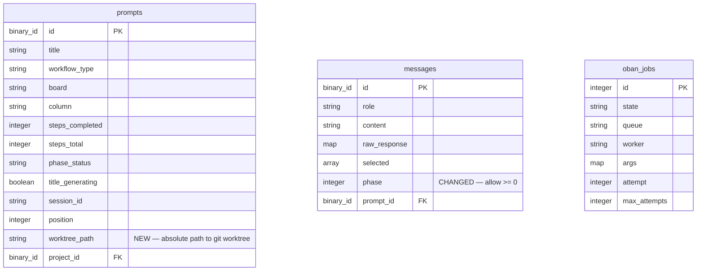

# Phase 0 — Setup Project Worktree and AI Session After Prompt Wizard

## Overview

After the prompt creation wizard completes, the chat page shows a "Phase 0 — Setup" section that prepares the project environment before the conversation begins. Phase 0 runs as Oban background jobs so the user can navigate away without losing progress. Once setup completes, Phase 0 auto-collapses and Phase 1 begins automatically.

This feature introduces **Oban** (background job library with native SQLite support) and migrates existing `Task`-based async work to Oban workers.

## Problem Statement / Motivation

Currently, the prompt creation wizard:
1. Spawns a `Task` for title generation that is lost if the BEAM node restarts
2. Starts the AI session eagerly in the LiveView `mount` — tightly coupling session lifecycle to page visits
3. Has no concept of project environment setup (git operations, worktrees)

These limitations prevent reliable background processing, make the system fragile to navigation/disconnection, and block the introduction of per-prompt git worktrees needed for AI-assisted code changes.

## Proposed Solution

### Architecture

```
Wizard completes
  |
  +---> Oban: TitleGenerationWorker (parallel)
  |       |-> Create "Generating title..." message (phase: 0)
  |       |-> Call AI.generate_title/3
  |       |-> Update prompt title
  |       |-> Create "Title: <result>" message (phase: 0)
  |       |-> Broadcast via PubSub
  |
  +---> Oban: SetupWorker (parallel, sequential steps internally)
          |-> Step 1: Pull or Clone repo
          |     |-> Create progress message (phase: 0)
          |     |-> git pull (local) or git clone (remote-only)
          |     |-> Create completion message (phase: 0)
          |
          |-> Step 2: Create worktree
          |     |-> git worktree add <local-folder>/.claude/worktrees/<prompt-id>
          |     |-> Update prompt.worktree_path
          |     |-> Create completion message (phase: 0)
          |
          |-> Step 3: Start AI session
                |-> AI.Session.for_prompt/2 with worktree as working dir
                |-> Create "AI session ready" message (phase: 0)
                |-> Update prompt phase_status -> :conversing
                |-> Trigger Phase 1 start (first AI query)
```

### ERD Changes



## Technical Approach

### Phase 1: Add Oban with SQLite Support

**Dependency**: `{:oban, "~> 2.20"}` — the standard `oban` package includes `Oban.Engines.Lite` for SQLite. No separate SQLite adapter needed.

**Files to modify:**

- `mix.exs` — add `{:oban, "~> 2.20"}` to deps
- `config/config.exs` — add Oban config:
  ```elixir
  config :destila, Oban,
    engine: Oban.Engines.Lite,
    queues: [default: 2, setup: 1],
    repo: Destila.Repo
  ```
- `config/test.exs` — add `config :destila, Oban, testing: :manual`
- `lib/destila/application.ex` — add `{Oban, Application.fetch_env!(:destila, Oban)}` after `Destila.Repo` in supervision tree
- `priv/repo/migrations/<timestamp>_add_oban_jobs_table.exs` — new migration with `Oban.Migration.up()`
- `test/support/conn_case.ex` — add `use Oban.Testing, repo: Destila.Repo`

**Queue design:**
- `default` (concurrency: 2) — title generation, AI queries
- `setup` (concurrency: 1) — git operations per project; concurrency 1 avoids concurrent git operations on the same repo

### Phase 2: Schema Changes

**`lib/destila/prompts/prompt.ex`:**
- Add `worktree_path` field (`:string`, optional)
- Add `:worktree_path` to changeset cast list
- Add `:setup` to `phase_status` enum values: `[:setup, :generating, :conversing, :advance_suggested]`

**`lib/destila/messages/message.ex`:**
- Change validation from `validate_number(:phase, greater_than_or_equal_to: 1)` to `validate_number(:phase, greater_than_or_equal_to: 0)`

**`priv/repo/migrations/20260322060351_create_projects_prompts_messages.exs`:**
- Add `worktree_path` column to prompts table
- Modify phase default comment (no DB-level constraint change needed since SQLite doesn't enforce check constraints from Ecto)

**Reset DB** after migration changes (early-stage app, per project convention).

### Phase 3: Create Oban Workers

#### `lib/destila/workers/title_generation_worker.ex`

```elixir
defmodule Destila.Workers.TitleGenerationWorker do
  use Oban.Worker, queue: :default, max_attempts: 3

  @impl Oban.Worker
  def perform(%Oban.Job{args: %{"prompt_id" => prompt_id}}) do
    prompt = Destila.Prompts.get_prompt(prompt_id)
    # 1. Create "Generating title..." phase 0 message
    # 2. Generate title via AI (creates temp session, generates, stops)
    # 3. Update prompt title + title_generating: false
    # 4. Create "Title: <result>" phase 0 message
    # 5. Broadcast prompt_updated
    :ok
  end
end
```

Phase 0 messages use structured `raw_response` for state derivation:
```elixir
%{
  "setup_step" => "title_generation",
  "status" => "completed",  # or "in_progress", "failed"
  "result" => "My Generated Title"
}
```

#### `lib/destila/workers/setup_worker.ex`

```elixir
defmodule Destila.Workers.SetupWorker do
  use Oban.Worker, queue: :setup, max_attempts: 3

  @impl Oban.Worker
  def perform(%Oban.Job{args: %{"prompt_id" => prompt_id}}) do
    prompt = Destila.Prompts.get_prompt(prompt_id)
    project = prompt.project

    with :ok <- pull_or_clone(prompt, project),
         :ok <- create_worktree(prompt, project),
         :ok <- start_ai_session(prompt) do
      # Update prompt: phase_status -> :conversing
      # Trigger Phase 1 (first AI query) via separate Oban job
      :ok
    end
  end
end
```

Each step:
1. Creates an "in_progress" phase 0 message
2. Performs the operation
3. Updates the message to "completed" (or creates a new completion message)
4. Broadcasts via PubSub

**Git operations** use `System.cmd/3`:
- `System.cmd("git", ["pull"], cd: local_folder)`
- `System.cmd("git", ["clone", url, target_dir])`
- `System.cmd("git", ["worktree", "add", "-b", prompt_id, worktree_path], cd: local_folder)`

**Clone destination**: `Path.join([System.get_env("XDG_CACHE_HOME", Path.expand("~/.cache")), "destila", project_id])`

**Idempotency**: Each step checks if already done (worktree exists, repo already cloned) and skips.

#### `lib/destila/workers/ai_query_worker.ex`

Migrate existing `spawn_ai_query` from `prompt_detail_live.ex`:

```elixir
defmodule Destila.Workers.AiQueryWorker do
  use Oban.Worker, queue: :default, max_attempts: 1

  @impl Oban.Worker
  def perform(%Oban.Job{args: %{"prompt_id" => prompt_id, "query" => query}}) do
    # Same logic as current handle_ai_query_result
    # Query AI session, create system message, derive phase_status
    :ok
  end
end
```

### Phase 4: Git Operations Module

#### `lib/destila/git.ex`

Encapsulate git operations:

```elixir
defmodule Destila.Git do
  def pull(local_folder)
  def clone(url, target_dir)
  def worktree_add(repo_path, worktree_path, branch_name)
  def worktree_exists?(repo_path, worktree_path)
end
```

### Phase 5: Phase 0 Metadata in ChoreTaskPhases

**`lib/destila/workflows/chore_task_phases.ex`:**
- Add `0 => "Setup"` to `@phase_names` map

### Phase 6: LiveView Changes

#### `lib/destila_web/live/new_prompt_live.ex` — Wizard Changes

Modify `create_prompt_with_idea/3`:
1. Keep synchronous: prompt creation, initial messages (phase 1 system + user message)
2. Move to Oban: title generation, AI session start
3. New: enqueue `SetupWorker` (if project linked) and `TitleGenerationWorker`
4. Set initial `phase_status: :setup` on prompt creation

Remove `Task.Supervisor.start_child` calls. Remove `trigger_ai_response/3` (moved to `SetupWorker` completion).

#### `lib/destila_web/live/prompt_detail_live.ex` — Chat Page Changes

**Mount changes:**
- Remove `ensure_ai_session/3` call from mount
- On mount, check if Phase 0 is complete by examining phase 0 messages
- If Phase 0 still in progress: show Phase 0 section open, disable chat input
- If Phase 0 complete: show Phase 0 collapsed, show conversation normally

**New `handle_info` clauses:**
- `{:setup_progress, prompt_id, step, status}` — insert/update Phase 0 messages in the stream
- `{:setup_complete, prompt_id}` — collapse Phase 0, enable chat input, trigger Phase 1

**Chat input disabled during setup:**
- When `@prompt.phase_status == :setup`, disable the text input
- Show placeholder: "Setting up project environment..."

**Template changes** (phase rendering):
- Current `current_phase = max(@prompt.steps_completed, 1)` stays — Phase 0 is always < current_phase so auto-collapses when steps_completed >= 1
- Phase 0 renders with distinct styling: setup steps as a checklist rather than chat bubbles
- Add Phase 0 section before the existing phase loop

### Phase 7: Phase 0 UI Rendering

Phase 0 messages render differently from conversation messages — as a **setup checklist**:

```
Phase 0 — Setup
  [checkmark] Title generated: "My Prompt Title"
  [checkmark] Repository up to date
  [checkmark] Worktree ready
  [spinner]   Starting AI session...
```

Each item derives its icon from `raw_response.status`:
- `"in_progress"` → spinner
- `"completed"` → checkmark
- `"failed"` → error icon + retry button

#### `lib/destila_web/components/chat_components.ex`

Add `setup_step_message/1` component for Phase 0 items with:
- Step label from `raw_response.setup_step`
- Status icon from `raw_response.status`
- Error details from `raw_response.error` (if failed)
- Retry button (if failed) that sends `phx-click="retry_setup"`

### Phase 8: Retry Mechanism

**Retry button** in the Phase 0 UI sends a `"retry_setup"` event to the LiveView.

**`handle_event("retry_setup", _, socket)`:**
1. Find the failed Oban job for this prompt's setup
2. Call `Oban.retry_job(job_id)` to re-enqueue
3. Update the failed Phase 0 message status to "retrying"
4. Broadcast update

Oban's built-in retry (max 3 attempts, exponential backoff) handles automatic retries for transient failures. The manual retry button is for user-initiated recovery after all automatic retries are exhausted.

### Phase 9: Prompts Without a Linked Project

When `prompt.project_id` is nil:
- Only `TitleGenerationWorker` is enqueued (no `SetupWorker`)
- Phase 0 shows only the title generation step
- AI session starts without a working directory (same as current behavior)
- `phase_status` transitions from `:setup` to `:conversing` after title generation completes

### Phase 10: Migrate Existing Async Work

Replace all `Task.Supervisor.start_child(Destila.TaskSupervisor, ...)` with Oban job insertion:

| Current | New |
|---------|-----|
| `new_prompt_live.ex:213` — title gen Task | `TitleGenerationWorker` Oban job |
| `prompt_detail_live.ex:346` — AI query Task | `AiQueryWorker` Oban job |

After migration, `Destila.TaskSupervisor` can be removed from the supervision tree.

## Acceptance Criteria

### Functional Requirements

- [ ] Oban is configured with SQLite Lite engine and running
- [ ] After wizard completion, Phase 0 appears on the prompt detail page
- [ ] Title generation runs as an Oban job, progress shown in Phase 0
- [ ] For prompts with local projects: git pull, worktree creation, AI session start run as sequential Oban steps
- [ ] For prompts with remote-only projects: git clone replaces pull, followed by worktree + session
- [ ] For prompts without a project: only title generation runs in Phase 0
- [ ] Phase 0 auto-collapses when all steps complete
- [ ] Phase 1 begins automatically after Phase 0 completes
- [ ] Failed steps show error message and retry button
- [ ] Retry button re-enqueues the failed Oban job
- [ ] Chat input is disabled during Phase 0 (phase_status: :setup)
- [ ] User can navigate away during setup; jobs continue in background
- [ ] Returning to the page shows current setup progress
- [ ] Existing title generation and AI query async work migrated to Oban workers

### Non-Functional Requirements

- [ ] Git operations are idempotent (safe to retry)
- [ ] No race conditions on prompt updates between concurrent workers (use targeted field updates)
- [ ] Phase 0 messages use structured `raw_response` (consistent with project convention)

## Dependencies & Risks

**Dependencies:**
- `oban ~> 2.20` hex package
- Git CLI available on the host system
- SSH keys / tokens configured for private repos (if applicable)

**Risks:**
- **SQLite write contention**: Two concurrent Oban workers updating the same prompt record. Mitigate with targeted `Repo.update_all` for specific columns instead of full changeset updates.
- **Git clone on slow networks**: Could take a long time. Oban's default job timeout should be set high or disabled for setup queue.
- **AI session timeout**: If SetupWorker starts the session but user doesn't interact for 5+ minutes, session may auto-terminate. The LiveView's mount should handle this gracefully (session recreated on demand).

## Gherkin Scenarios

```gherkin
Feature: Phase 0 - Project Setup
  After completing the prompt creation wizard, the chat page shows a
  "Phase 0 — Setup" section that prepares the project environment before
  the conversation begins. Setup runs in the background and the user can
  navigate away without interrupting it.

  Background:
    Given I am logged in

  Scenario: Setup for a prompt with a local project
    Given I have a project with a local folder that is a git repository
    When I complete the prompt wizard linked to that project
    Then I should be redirected to the prompt detail page
    And I should see a "Phase 0 — Setup" section
    And I should see the step "Generating title..."
    When the title is generated
    Then I should see the generated title
    And I should see the step "Pulling latest changes..."
    When the pull completes
    Then I should see "Repository up to date"
    And I should see the step "Creating worktree..."
    When the worktree is created
    Then I should see "Worktree ready"
    And I should see the step "Starting AI session..."
    When the AI session starts
    Then I should see "AI session ready"
    And Phase 0 should auto-collapse
    And Phase 1 should begin automatically

  Scenario: Setup for a prompt with a remote-only project
    Given I have a project with only a git repo URL and no local folder
    When I complete the prompt wizard linked to that project
    Then I should be redirected to the prompt detail page
    And I should see a "Phase 0 — Setup" section
    And I should see the step "Generating title..."
    And I should see the step "Cloning repository..."
    When the clone completes
    Then I should see "Repository cloned"
    And the repository should be stored in the local cache folder
    And I should see the step "Creating worktree..."
    When the worktree is created
    Then the worktree should be at "<cache-folder>/.claude/worktrees/<prompt-id>"
    And setup should continue through to AI session start

  Scenario: Setup for a prompt without a linked project
    Given I completed the wizard without linking a project
    When I am redirected to the prompt detail page
    Then I should see a "Phase 0 — Setup" section
    And I should only see the step "Generating title..."
    When the title is generated
    Then Phase 0 should auto-collapse
    And Phase 1 should begin automatically
    And the AI session should start without a working directory

  Scenario: A setup step fails
    Given I have a project with a local folder
    And the git pull fails due to a network error
    When I am on the prompt detail page during setup
    Then I should see the error message for the failed step
    And I should see a "Retry" button
    When I click "Retry"
    Then the failed step should be attempted again

  Scenario: User navigates away during setup
    Given setup is in progress for my prompt
    When I navigate to another page
    Then the setup should continue running in the background
    When I return to the prompt detail page
    Then I should see the current setup progress

  Scenario: Chat input disabled during setup
    Given setup is in progress for my prompt
    When I am on the prompt detail page
    Then the chat input should be disabled
    And the input placeholder should say "Setting up project environment..."
    When setup completes
    Then the chat input should be enabled
```

### Updates to Existing Features

**`create_prompt_wizard.feature`** — Update "Save & Continue" scenario:
```gherkin
  Scenario: Complete the wizard with Save & Continue
    ...
    And I click "Save & Continue"
    Then a new prompt should be created linked to the selected project
    And I should be redirected to the prompt detail page
    And I should see a "Phase 0 — Setup" section in progress
    And the chat should show the initial idea as the first user message
```

## Implementation Phases

### Phase A: Foundation (Oban + Schema)
1. Add Oban dependency, config, migration
2. Add `worktree_path` to Prompt schema
3. Add `:setup` to `phase_status` enum
4. Change Message phase validation to `>= 0`
5. Add `0 => "Setup"` to `ChoreTaskPhases.phase_names`
6. Reset DB
7. Verify Oban starts correctly

### Phase B: Workers + Git Module
1. Create `Destila.Git` module with pull/clone/worktree operations
2. Create `TitleGenerationWorker` (extracted from `new_prompt_live.ex`)
3. Create `SetupWorker` with sequential steps
4. Create `AiQueryWorker` (extracted from `prompt_detail_live.ex`)
5. Test workers in isolation

### Phase C: Wizard Integration
1. Modify `create_prompt_with_idea/3` to enqueue Oban jobs instead of Tasks
2. Set `phase_status: :setup` on prompt creation
3. Remove `Task.Supervisor.start_child` calls from wizard
4. Remove `trigger_ai_response/3` from wizard

### Phase D: LiveView + UI
1. Remove `ensure_ai_session` from `PromptDetailLive.mount`
2. Add Phase 0 rendering with setup checklist component
3. Disable chat input when `phase_status == :setup`
4. Handle PubSub messages for setup progress
5. Handle Phase 0 completion -> Phase 1 transition
6. Handle retry button events

### Phase E: Cleanup + Edge Cases
1. Remove `Destila.TaskSupervisor` from supervision tree
2. Handle "Save & Close" flow (jobs run, user not on page)
3. Handle reconnection (mount with Phase 0 already complete)
4. Update Gherkin feature files
5. Write tests

## References & Research

### Internal References
- `lib/destila_web/live/new_prompt_live.ex:149-236` — current `create_prompt_with_idea` with Task spawning
- `lib/destila_web/live/prompt_detail_live.ex:345-405` — current `spawn_ai_query` and `handle_ai_query_result`
- `lib/destila_web/live/prompt_detail_live.ex:407-442` — current `ensure_ai_session`
- `lib/destila_web/live/prompt_detail_live.ex:687-714` — phase rendering template
- `lib/destila/messages/message.ex:31` — phase validation constraint (currently `>= 1`)
- `lib/destila/prompts/prompt.ex:21` — phase_status enum (needs `:setup` added)
- `lib/destila/workflows/chore_task_phases.ex:11-16` — phase names map (needs `0 => "Setup"`)
- `lib/destila/application.ex:15` — `Task.Supervisor` to be replaced
- `lib/destila/ai/session.ex` — AI Session GenServer (session start moves to SetupWorker)

### External References
- [Oban HexDocs](https://hexdocs.pm/oban/Oban.html) — `Oban.Engines.Lite` for SQLite
- [Oban.Worker](https://hexdocs.pm/oban/Oban.Worker.html) — worker pattern
- [Oban.Testing](https://hexdocs.pm/oban/Oban.Testing.html) — test helpers
- [Oban Reporting Progress](https://hexdocs.pm/oban/reporting-progress.html) — PubSub broadcasting from workers

### Key Design Decisions
- **Oban Lite engine** over separate adapter — built into the standard `oban` package
- **Two separate Oban jobs** (title + setup) run in parallel for faster Phase 0 completion
- **Structured `raw_response`** on Phase 0 messages — consistent with project pattern of deriving UI state at read time
- **Setup queue with concurrency 1** — prevents concurrent git operations on the same repo
- **Phase 0 outside step counting** — `steps_total` stays 4, `steps_completed` stays 0 during Phase 0, avoiding disruption to progress bar logic
- **Chat input disabled during Phase 0** — prevents user from sending messages before AI session exists
