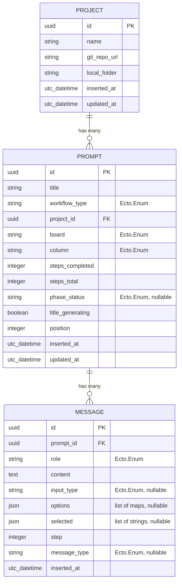

# Replace ETS Store with SQLite via Ecto

## Overview

Replace the in-memory ETS-based `Destila.Store` GenServer with a durable SQLite database using Ecto. All three entities (Projects, Prompts, Messages) migrate to Ecto schemas with changesets, associations, and context modules. End-user behavior remains identical — all 35 Gherkin scenarios must continue passing.

## Problem Statement / Motivation

The current ETS store loses all data on application restart or crash. There is no data persistence, no migration path, and no query capabilities beyond full-table scans. SQLite provides durable storage with zero operational overhead (no external database process), making it ideal for this single-node application.

## Proposed Solution

Replace `Destila.Store` with three Phoenix context modules (`Destila.Projects`, `Destila.Prompts`, `Destila.Messages`) backed by Ecto schemas and a SQLite database via `ecto_sqlite3`. Preserve the existing PubSub broadcasting contract so LiveViews require minimal changes.

## Technical Approach

### Entity Relationship Diagram



### Architecture

#### Dependencies (`mix.exs`)

Add `ecto_sql` and `ecto_sqlite3`:

```elixir
{:ecto_sql, "~> 3.12"},
{:ecto_sqlite3, "~> 0.17"}
```

#### Repo (`lib/destila/repo.ex`)

```elixir
defmodule Destila.Repo do
  use Ecto.Repo,
    otp_app: :destila,
    adapter: Ecto.Adapters.SQLite3
end
```

#### Schemas

Three schemas mirroring the current ETS data shapes:

**`lib/destila/projects/project.ex`** — `Destila.Projects.Project`
- Fields: `id` (binary_id PK), `name`, `git_repo_url`, `local_folder`, timestamps
- Associations: `has_many :prompts, Destila.Prompts.Prompt`
- Changeset validates: `name` required, at least one of `git_repo_url`/`local_folder`

**`lib/destila/prompts/prompt.ex`** — `Destila.Prompts.Prompt`
- Fields: `id` (binary_id PK), `title`, `workflow_type` (Ecto.Enum), `board` (Ecto.Enum), `column` (Ecto.Enum), `steps_completed`, `steps_total`, `phase_status` (Ecto.Enum, nullable), `title_generating` (boolean), `position`, timestamps
- Associations: `belongs_to :project`, `has_many :messages`
- Virtual field: `ai_session` (not persisted — runtime PID)
- Enum values:
  - `workflow_type`: `[:feature_request, :chore_task, :project]`
  - `board`: `[:crafting, :implementation]`
  - `column`: `[:request, :distill, :done, :todo, :in_progress, :review, :qa, :impl_done]`
  - `phase_status`: `[:generating, :conversing, :advance_suggested]`

**`lib/destila/messages/message.ex`** — `Destila.Messages.Message`
- Fields: `id` (binary_id PK), `prompt_id` (FK), `role` (Ecto.Enum), `content` (text), `input_type` (Ecto.Enum, nullable), `options` (`{:array, :map}`), `selected` (`{:array, :string}`), `step` (integer), `message_type` (Ecto.Enum, nullable), `inserted_at` only (no `updated_at` — messages are immutable)
- Enum values:
  - `role`: `[:system, :user]`
  - `input_type`: `[:text, :single_select, :multi_select, :file_upload, :questions]`
  - `message_type`: `[:phase_divider, :phase_advance, :skip_phase, :generated_prompt]`

#### Context Modules

Three contexts following Phoenix conventions, each broadcasting PubSub events after successful writes:

**`lib/destila/projects.ex`** — `Destila.Projects`
- `list_projects/0` → `Repo.all(from p in Project, order_by: p.name)`
- `get_project/1` → `Repo.get(Project, id)`
- `get_project!/1` → `Repo.get!(Project, id)`
- `create_project/1` → insert + broadcast `{:project_created, project}`
- `update_project/2` → update + broadcast `{:project_updated, project}`
- `delete_project/1` → check for linked prompts via DB query, then delete + broadcast `{:project_deleted, project}`. Returns `{:error, :has_linked_prompts}` if blocked.
- `change_project/2` → returns changeset for form usage

**`lib/destila/prompts.ex`** — `Destila.Prompts`
- `list_prompts/0` → ordered by position
- `list_prompts/1` → filtered by board, ordered by position
- `get_prompt/1` → `Repo.get(Prompt, id)`
- `get_prompt!/1` → `Repo.get!(Prompt, id)`
- `create_prompt/1` → insert with defaults + broadcast `{:prompt_created, prompt}`
- `update_prompt/2` → update + broadcast `{:prompt_updated, prompt}`
- `move_card/3` → convenience wrapper calling `update_prompt(id, %{column: col, position: pos})`
- `change_prompt/2` → returns changeset
- `count_by_project/1` → `Repo.aggregate(from(p in Prompt, where: p.project_id == ^id), :count)` (replaces the expensive `list_prompts() |> Enum.count` pattern)

**`lib/destila/messages.ex`** — `Destila.Messages`
- `list_messages/1` → messages for a prompt, ordered by `inserted_at`
- `create_message/2` → insert + broadcast `{:message_added, message}`

#### PubSub Contract

All contexts broadcast on the same topic `"store:updates"` with the same event names:
- `{:project_created, %Project{}}`, `{:project_updated, %Project{}}`, `{:project_deleted, %Project{}}`
- `{:prompt_created, %Prompt{}}`, `{:prompt_updated, %Prompt{}}`
- `{:message_added, %Message{}}`

The payloads change from plain maps to Ecto structs. Since LiveView handlers use dot access on these (e.g., `updated_prompt.id`), this is compatible. The catch-all handlers that re-fetch data are unaffected.

#### Runtime State: `ai_session` PID

The `ai_session` field becomes a `virtual: true` field on the Prompt schema. It is **not** persisted. LiveViews that set `ai_session` on prompts (via `update_prompt/2`) need a different approach:

- **Option**: Store the PID mapping in a lightweight ETS table or `Registry` keyed by prompt ID
- **Simpler option**: Keep `ai_session` as a LiveView assign (`:ai_session`) rather than on the prompt struct. The PID is only accessed within the LiveView process that owns it.

The simpler option is preferred. `ai_session` is only read in `prompt_detail_live.ex` and `new_prompt_live.ex` — always within the same LiveView process that started the session. Move it to a socket assign.

#### Bracket Access Migration

All `prompt[:field]` and `message[:field]` bracket access (17 call sites across 3 files) must be converted to dot access (`prompt.field` / `message.field`). Ecto structs do not implement the Access behaviour.

**Files affected:**
- `lib/destila_web/live/prompt_detail_live.ex` — 12 occurrences
- `lib/destila_web/components/chat_components.ex` — 3 occurrences
- `lib/destila/workflows/chore_task_phases.ex` — 2 occurrences

#### Timestamp Rename

The current Store uses `created_at` / `updated_at`. Ecto convention is `inserted_at` / `updated_at`. The migration will use Ecto conventions. All references to `created_at` in LiveViews and templates must be updated to `inserted_at`.

Messages sort by `inserted_at` (was `created_at`). Since messages are created sequentially, microsecond-precision timestamps provide sufficient ordering.

### Implementation Phases

#### Phase 1: Foundation

Add dependencies, create Repo, write migration, define schemas with changesets.

- [ ] Add `ecto_sql` and `ecto_sqlite3` to `mix.exs` deps
- [ ] Add `ecto.setup`, `ecto.reset` to aliases in `mix.exs`
- [ ] Create `lib/destila/repo.ex`
- [ ] Add database config to `config/config.exs`, `config/dev.exs`, `config/test.exs`, `config/runtime.exs`
- [ ] Add `Destila.Repo` to supervision tree in `application.ex` (before Endpoint, after PubSub)
- [ ] Run `mix ecto.create`
- [ ] Create migration: `priv/repo/migrations/TIMESTAMP_create_projects_prompts_messages.exs`
  - `projects` table: `id` binary_id PK, `name` string not null, `git_repo_url` string, `local_folder` string, timestamps
  - `prompts` table: `id` binary_id PK, `title` string not null default "Untitled Prompt", `workflow_type` string not null, `project_id` references projects (on_delete: restrict, null: true), `board` string not null, `column` string not null, `steps_completed` integer default 0, `steps_total` integer default 4, `phase_status` string, `title_generating` boolean default false, `position` integer not null, timestamps
  - `messages` table: `id` binary_id PK, `prompt_id` references prompts (on_delete: delete_all, not null), `role` string not null, `content` text not null default "", `input_type` string, `options` text (JSON), `selected` text (JSON), `step` integer default 1, `message_type` string, `inserted_at` utc_datetime_usec not null
  - Indexes: `prompts.project_id`, `messages.prompt_id`
- [ ] Run `mix ecto.migrate`
- [ ] Create `lib/destila/projects/project.ex` with schema and changeset
- [ ] Create `lib/destila/prompts/prompt.ex` with schema, changeset, and virtual `ai_session` field
- [ ] Create `lib/destila/messages/message.ex` with schema and changeset

#### Phase 2: Context Modules

Create the three context modules matching the current Store API.

- [ ] Create `lib/destila/projects.ex` with all CRUD functions + PubSub broadcasting
- [ ] Create `lib/destila/prompts.ex` with all CRUD functions + `move_card/3` + PubSub broadcasting
- [ ] Create `lib/destila/messages.ex` with `list_messages/1` and `create_message/2` + PubSub broadcasting
- [ ] Verify context module functions return Ecto structs (compatible with dot access)

#### Phase 3: Update All Callers

Swap `Destila.Store` calls for context module calls across all LiveViews and workflow modules.

- [ ] Update `lib/destila_web/live/dashboard_live.ex`: `Store.list_prompts/1` → `Prompts.list_prompts/1`
- [ ] Update `lib/destila_web/live/crafting_board_live.ex`: `Store.list_prompts/1` → `Prompts.list_prompts/1`, `Store.move_card/3` → `Prompts.move_card/3`
- [ ] Update `lib/destila_web/live/implementation_board_live.ex`: same as crafting
- [ ] Update `lib/destila_web/live/projects_live.ex`: all `Store.*` → `Projects.*` and `Prompts.*`
  - Replace `linked_prompt_count/1` with `Prompts.count_by_project/1`
  - Replace manual `validate_project_params/1` with `Projects.change_project/2` changeset forms
- [ ] Update `lib/destila_web/live/new_prompt_live.ex`: all `Store.*` → `Projects.*`, `Prompts.*`, `Messages.*`
  - Move `ai_session` from prompt struct to socket assign `:ai_session`
- [ ] Update `lib/destila_web/live/prompt_detail_live.ex`: all `Store.*` → `Projects.*`, `Prompts.*`, `Messages.*`
  - Move `ai_session` from prompt struct to socket assign `:ai_session`
- [ ] Update `lib/destila/workflows/chore_task_phases.ex`: `Store.get_project/1` → `Projects.get_project/1`
- [ ] Convert all `prompt[:field]` bracket access to `prompt.field` dot access (17 sites)
- [ ] Convert all `message[:field]` bracket access to `message.field` dot access
- [ ] Rename `created_at` references to `inserted_at` where applicable (templates, sort comparisons)
- [ ] Update LiveView form handling for projects to use changeset-based forms where appropriate

#### Phase 4: Test Migration

Configure Ecto sandbox and update all tests.

- [ ] Add `Ecto.Adapters.SQL.Sandbox` setup to `test/test_helper.exs`
- [ ] Update `test/support/conn_case.ex` with sandbox checkout (shared mode for async: false tests with Task.Supervisor)
- [ ] Update `test/destila_web/live/new_prompt_live_test.exs`: `Store.create_project` → `Projects.create_project`
- [ ] Update `test/destila_web/live/projects_live_test.exs`: all Store calls → context module calls
- [ ] Update `test/destila_web/live/chore_task_workflow_live_test.exs`: all Store calls → context module calls
  - The `create_prompt_in_phase/2` helper needs updating — it creates prompts with `ai_session: session` which now goes to a socket assign, not the prompt struct
- [ ] Update `test/destila_web/live/generated_prompt_viewing_live_test.exs`: all Store calls → context module calls
- [ ] Verify all 35 Gherkin-tagged scenarios pass: `mix test`

#### Phase 5: Cleanup

Remove old Store code and update supervision tree.

- [ ] Delete `lib/destila/store.ex`
- [ ] Delete `lib/destila/seeds.ex`
- [ ] Remove `Destila.Store` from children list in `lib/destila/application.ex`
- [ ] Update `mix.exs` aliases: add `"ecto.create --quiet"`, `"ecto.migrate --quiet"` to `setup`
- [ ] Run `mix precommit` to verify everything passes

## Acceptance Criteria

### Functional Requirements

- [ ] All 35 Gherkin scenarios pass unchanged
- [ ] Data persists across application restarts
- [ ] PubSub real-time updates work identically (all 5 subscribing LiveViews)
- [ ] Project delete guard works (cannot delete project with linked prompts)
- [ ] AI workflow (title generation, phase conversations) works end-to-end
- [ ] Board drag-and-drop (move_card) works on both boards

### Non-Functional Requirements

- [ ] No `Destila.Store` references remain in production code
- [ ] No `Destila.Seeds` references remain
- [ ] All tests pass with `mix test`
- [ ] No compiler warnings (`mix compile --warnings-as-errors`)
- [ ] Code formatted (`mix format`)

### Quality Gates

- [ ] `mix precommit` passes clean
- [ ] No bracket access (`[:field]`) on Ecto structs

## Dependencies & Prerequisites

- `ecto_sql ~> 3.12` — SQL adapter for Ecto
- `ecto_sqlite3 ~> 0.17` — SQLite3 adapter
- Both are mature, well-maintained Hex packages

## Risk Analysis & Mitigation

| Risk | Impact | Mitigation |
|------|--------|------------|
| Bracket access missed somewhere | Runtime crash | Grep audit: `prompt\[:\|message\[:\|project\[:` — fix all before testing |
| PubSub payload change (maps → structs) | LiveView handlers break | All handlers use dot access or catch-all re-fetch — compatible with structs |
| `ai_session` PID on prompt struct | Virtual field lost on Repo.get | Move to socket assign — only accessed within owning LiveView process |
| Message ordering with same timestamps | Messages appear out of order | Sequential inserts ensure unique microsecond timestamps; add `ORDER BY inserted_at` |
| Test isolation | Flaky tests | Use SQL Sandbox in shared mode (tests already `async: false`) |
| `title_generating` reset on restart | UI shows stale generating state | Boolean persists in DB; on restart, a cleanup job could reset stale `title_generating: true` to `false`, or the UI handles it gracefully |

## References

### Internal References

- Brainstorm: `docs/brainstorms/2026-03-22-sqlite-migration-brainstorm.md`
- Current Store: `lib/destila/store.ex` (to be deleted)
- Current Seeds: `lib/destila/seeds.ex` (to be deleted)
- Application supervisor: `lib/destila/application.ex:15-24`
- Feature files: `features/*.feature` (35 scenarios, unchanged)

### Callers to Update

| File | Store Calls | Notes |
|------|-------------|-------|
| `lib/destila_web/live/dashboard_live.ex` | `list_prompts/1` (x3) | Simple swap |
| `lib/destila_web/live/crafting_board_live.ex` | `list_prompts/1` (x2), `move_card/3` | Simple swap |
| `lib/destila_web/live/implementation_board_live.ex` | `list_prompts/1` (x2), `move_card/3` | Simple swap |
| `lib/destila_web/live/projects_live.ex` | 11 Store calls | Also migrate validation to changeset forms |
| `lib/destila_web/live/new_prompt_live.ex` | 18 Store calls | Move `ai_session` to assign |
| `lib/destila_web/live/prompt_detail_live.ex` | 30+ Store calls | Move `ai_session` to assign, most complex file |
| `lib/destila/workflows/chore_task_phases.ex` | `get_project/1` (x1) | Simple swap |

### Test Files to Update

| File | Store Calls |
|------|-------------|
| `test/destila_web/live/new_prompt_live_test.exs` | `create_project/1` |
| `test/destila_web/live/projects_live_test.exs` | `create_project/1` (x5), `create_prompt/1` |
| `test/destila_web/live/chore_task_workflow_live_test.exs` | `create_prompt/1`, `add_message/2` (x3), `get_prompt/1` |
| `test/destila_web/live/generated_prompt_viewing_live_test.exs` | `create_prompt/1`, `add_message/2`, `get_prompt/1` |
