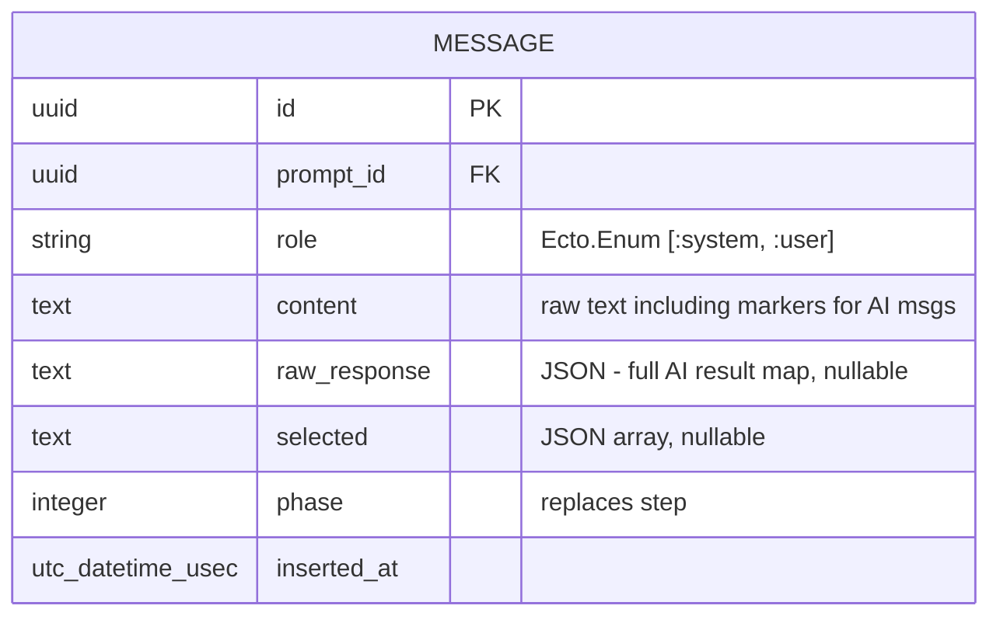

# Store Raw AI Responses and Derive Display State at Read Time

## Overview

Refactor the Message schema to store the full raw AI agent response and derive all display fields (`input_type`, `options`, `questions`, `message_type`) at read time. Replace `step` with `phase`, eliminate synthetic phase divider messages, and simplify the schema. This preserves full AI context for future UI changes without needing to re-generate non-deterministic prompts.

## Problem Statement

When the AI responds, we immediately extract derived fields and discard the raw result. If we later change how we parse markers or render questions, old messages are stuck. The `questions` field bug (silently dropped by the changeset) proved this is fragile. Storing the raw response makes messages future-proof.

## Proposed Solution

Add a `raw_response` JSON column to messages. For AI-generated messages, store the full result map. Derive all display state via a `Messages.process/2` function called at read time. Drop the derived columns from the schema. Rename `step` to `phase`. Eliminate synthetic phase divider messages — the UI derives phase breaks from `phase` number transitions.

## Technical Approach

### Updated Message Schema



**Columns removed**: `input_type`, `options`, `questions`, `message_type`
**Column renamed**: `step` → `phase`
**Column added**: `raw_response` (text/JSON, nullable)

### Message Processing Function

`Destila.Messages.process/2` takes a message and prompt, returns display-ready data:

```elixir
# lib/destila/messages.ex
def process(%Message{role: :user} = msg, _prompt), do: %{message: msg, display: :user_message}

def process(%Message{raw_response: raw} = msg, prompt) when not is_nil(raw) do
  # AI message — derive everything from raw_response
  {content, message_type} = parse_markers(msg.content, msg.phase, prompt)
  {input_type, options, questions} = extract_tool_input(raw)
  %{message: msg, display: :ai_message, content: content, message_type: message_type,
    input_type: input_type, options: options, questions: questions}
end

def process(%Message{} = msg, _prompt) do
  # Static workflow message — content is source of truth
  %{message: msg, display: :static_message, content: msg.content,
    input_type: derive_static_input_type(msg), options: derive_static_options(msg)}
end
```

The `parse_markers/3` function strips `<<READY_TO_ADVANCE>>` / `<<SKIP_PHASE>>` from content and returns the message_type. It also checks if `phase == prompt.steps_total` to mark `:generated_prompt`.

The `extract_tool_input/1` function parses `mcp_tool_uses` from the raw_response to derive `input_type`, `options`, and `questions`.

### Phase-Based Grouping (No Synthetic Dividers)

Currently, synthetic "Phase N — Name" messages with `message_type: :phase_divider` are inserted. These are eliminated. The UI groups messages by the `phase` field:

```elixir
# In prompt_detail_live.ex — replaces phase_groups/1
defp phase_groups(messages) do
  messages
  |> Enum.chunk_by(& &1.phase)
  |> Enum.map(fn group -> {List.first(group).phase, group} end)
end
```

The template renders a divider header between groups using `ChoreTaskPhases.phase_name(phase)`.

### Implementation Phases

#### Phase 1: Schema and Migration

Modify the original migration (reset DB since early stage) and update schemas.

- [ ] Update migration `create_projects_prompts_messages.exs`: drop `input_type`, `options`, `questions`, `message_type` columns; rename `step` to `phase`; add `raw_response` text column
- [ ] Delete the `add_questions_to_messages` migration (consolidate into the original)
- [ ] Update `lib/destila/messages/message.ex`: remove `input_type`, `options`, `questions`, `message_type` fields; rename `step` to `phase`; add `raw_response` field as `:map`; update changeset cast list
- [ ] Run `mix ecto.reset` for dev and test

#### Phase 2: Processing Function

Create the read-time processing logic.

- [ ] Add `Destila.Messages.process/2` function to `lib/destila/messages.ex`
  - Pattern match on role and raw_response presence
  - `parse_markers/3`: strip `<<READY_TO_ADVANCE>>`, `<<SKIP_PHASE>>` from content; determine message_type (`:phase_advance`, `:skip_phase`, `:generated_prompt`, or nil)
  - `extract_tool_input/1`: parse `mcp_tool_uses` from raw_response to get `input_type`, `options`, `questions`
  - Handle static workflow messages (no raw_response): derive input_type/options from content context
- [ ] Move `parse_ai_response/1` and `extract_questions_from_tool_uses/1` from LiveViews into `Messages` module (or a dedicated `Destila.Messages.Processing` module)

#### Phase 3: Update Writers

Update all message creation sites to store raw_response and use new field names.

- [ ] Update `handle_ai_query_result/5` in `prompt_detail_live.ex`: store `raw_response: result` with raw AI text in `content`; stop pre-computing `input_type`, `options`, `questions`, `message_type`
- [ ] Update `trigger_ai_response/3` in `new_prompt_live.ex`: same changes
- [ ] Update all `create_message` calls: rename `step:` to `phase:` everywhere (15+ sites across both LiveViews and tests)
- [ ] Remove phase divider message insertions (2 sites in `prompt_detail_live.ex`: `confirm_advance` and `handle_skip_phase`)
- [ ] Update static workflow message creation: remove `input_type:` / `options:` from attrs (these will be passed differently or handled by processing)
- [ ] Update error message creation: remove `input_type: :text` (unnecessary)

#### Phase 4: Update Readers

Update all code that reads message fields to use processed data.

- [ ] Update `ai_step_info/2` in `prompt_detail_live.ex`: call `Messages.process/2` on last system message to get display fields
- [ ] Update `static_step_info/2`: same approach
- [ ] Update `phase_groups/1` → use `Enum.chunk_by(& &1.phase)` instead of detecting `:phase_divider` messages
- [ ] Update template in `prompt_detail_live.ex`: use `phase` field and derived phase name instead of divider message content
- [ ] Update `chat_components.ex`: pattern match on processed display data instead of `message_type` field on struct
- [ ] Update `build_conversation_context/1` in `chore_task_phases.ex`: use `phase` instead of `step`; remove `:phase_divider` filter (no more divider messages)

#### Phase 5: Update Tests

- [ ] Update test helper `create_prompt_in_phase/2`: rename `step:` to `phase:` in message attrs; remove `message_type: :phase_advance` (now derived)
- [ ] Update `create_prompt_with_generated_prompt/0`: rename `step:` to `phase:`; remove `message_type: :generated_prompt` (derived from phase context)
- [ ] Verify all 65 tests pass
- [ ] Run `mix precommit`

## Acceptance Criteria

- [ ] All 65 tests pass, all 35 Gherkin scenarios continue working
- [ ] No `input_type`, `options`, `questions`, or `message_type` columns in messages table
- [ ] `raw_response` stored as JSON on all AI-generated messages
- [ ] `step` renamed to `phase` everywhere
- [ ] No synthetic phase divider messages created
- [ ] UI derives phase breaks from `phase` field transitions
- [ ] `Messages.process/2` handles: user messages, AI messages (with raw_response), static messages (without raw_response)
- [ ] `mix precommit` passes clean

## Key Files to Modify

| File | Changes |
|------|---------|
| `priv/repo/migrations/*_create_projects_prompts_messages.exs` | Update messages table schema |
| `priv/repo/migrations/*_add_questions_to_messages.exs` | Delete |
| `lib/destila/messages/message.ex` | Schema: drop derived fields, add `raw_response`, rename `step` → `phase` |
| `lib/destila/messages.ex` | Add `process/2`, move parsing logic here |
| `lib/destila_web/live/prompt_detail_live.ex` | Writers: store raw_response; Readers: use process/2; Template: phase-based grouping |
| `lib/destila_web/live/new_prompt_live.ex` | Writers: store raw_response, rename step → phase |
| `lib/destila_web/components/chat_components.ex` | Pattern match on processed data |
| `lib/destila/workflows/chore_task_phases.ex` | Use `phase` instead of `step`, remove divider filter |
| `test/destila_web/live/chore_task_workflow_live_test.exs` | Rename step → phase, adjust for derived message_type |
| `test/destila_web/live/generated_prompt_viewing_live_test.exs` | Rename step → phase |

## References

- Brainstorm: `docs/brainstorms/2026-03-22-raw-ai-response-storage-brainstorm.md`
- Current Message schema: `lib/destila/messages/message.ex`
- AI result structure: `%{text: String, result: String, session_id: String, mcp_tool_uses: list, is_error: boolean}`
- Processing logic to extract: `prompt_detail_live.ex:408-473` (`handle_ai_query_result`), `prompt_detail_live.ex:556-582` (`extract_questions_from_tool_uses`)
