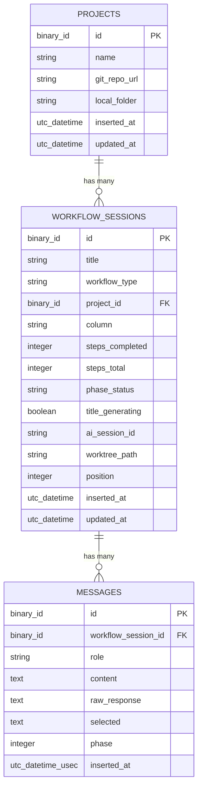

# Rename Prompt to WorkflowSession and Restructure Workflows

## Overview

Rename the core entity from "prompt" to "workflow session" throughout the entire codebase, restructure the available workflow types, and remove the Feature Request workflow. The internal name is `WorkflowSession` (avoiding collision with `Destila.AI.Session`, `Plug.Session`, etc.). The UI-facing label is "Session".

This is a broad rename touching ~30 files across schema, context, LiveViews, components, workers, AI modules, PubSub, router, tests, and feature files.

## Problem Statement / Motivation

The word "prompt" is overloaded: it refers to both the core entity (a workflow session) and the output artifact (the generated implementation prompt from Phase 4). Renaming the entity to "workflow session" eliminates this ambiguity while preserving "prompt" for the generated artifact.

Additionally, the Feature Request workflow is no longer needed, and a new scaffold workflow type ("Implement a Generic Prompt") is being introduced.

## Proposed Solution

A phased rename following the established pattern from prior refactorings in this project (schema -> context -> callers -> UI -> tests). The database can be reset, so a fresh migration replaces the old tables.

## ERD



## Technical Approach

### Phase 1: Migration + Schema (Data Layer)

Create a new migration that drops the old `prompts` and `messages` tables and creates `workflow_sessions` and updated `messages`. Since the DB can be reset, this is a clean replacement.

#### 1.1 New migration

**File**: `priv/repo/migrations/<timestamp>_rename_prompts_to_workflow_sessions.exs`

Changes from old `prompts` table to new `workflow_sessions` table:
- Table name: `prompts` -> `workflow_sessions`
- `session_id` field -> `ai_session_id`
- All other fields remain the same (no `board` field exists to remove; `column` enum already has only `:request`, `:distill`, `:done`)

Changes to `messages` table:
- FK: `prompt_id` -> `workflow_session_id`
- Index: `[:prompt_id, :inserted_at]` -> `[:workflow_session_id, :inserted_at]`

Drop old migration file: `priv/repo/migrations/20260322060351_create_projects_prompts_messages.exs` — replace with a single new migration that creates all three tables (`projects`, `workflow_sessions`, `messages`).

#### 1.2 WorkflowSession schema

**Rename**: `lib/destila/prompts/prompt.ex` -> `lib/destila/workflow_sessions/workflow_session.ex`
**Module**: `Destila.Prompts.Prompt` -> `Destila.WorkflowSessions.WorkflowSession`

Field changes:
- `session_id` -> `ai_session_id`
- `workflow_type` enum values: `[:feature_request, :chore_task, :project]` -> `[:prompt_chore_task, :prompt_new_project, :implement_generic_prompt]`

Association changes:
- `has_many :messages` FK stays conceptually the same but the Message schema's `belongs_to` changes

#### 1.3 Message schema

**File**: `lib/destila/messages/message.ex`

- `belongs_to :prompt, Destila.Prompts.Prompt` -> `belongs_to :workflow_session, Destila.WorkflowSessions.WorkflowSession`
- Changeset: validate required `[:prompt_id, :role]` -> `[:workflow_session_id, :role]`

#### 1.4 Project schema

**File**: `lib/destila/projects/project.ex`

- `has_many :prompts, Destila.Prompts.Prompt` -> `has_many :workflow_sessions, Destila.WorkflowSessions.WorkflowSession`

---

### Phase 2: Context Layer

#### 2.1 WorkflowSessions context

**Rename**: `lib/destila/prompts.ex` -> `lib/destila/workflow_sessions.ex`
**Module**: `Destila.Prompts` -> `Destila.WorkflowSessions`

Function renames:
- `list_prompts/0` -> `list_workflow_sessions/0`
- `get_prompt/1` -> `get_workflow_session/1`
- `get_prompt!/1` -> `get_workflow_session!/1`
- `create_prompt/1` -> `create_workflow_session/1`
- `update_prompt/2` -> `update_workflow_session/2`
- `classify/1` -> `classify/1` (unchanged name, but references `WorkflowSession`)
- `count_by_project/1` -> `count_by_project/1` (unchanged)
- `count_by_projects/0` -> `count_by_projects/0` (unchanged)

PubSub events:
- `:prompt_created` -> `:workflow_session_created`
- `:prompt_updated` -> `:workflow_session_updated`

#### 2.2 Messages context

**File**: `lib/destila/messages.ex`

- `list_messages/1` param: `prompt_id` -> `workflow_session_id`
- `create_message/2` first param: `prompt_id` -> `workflow_session_id`
- All internal references to `prompt_id` -> `workflow_session_id`
- PubSub event `:message_added` payload key: `prompt_id` -> `workflow_session_id`

#### 2.3 Projects context

**File**: `lib/destila/projects.ex`

- `delete_project/1`: query on `:prompts` association -> `:workflow_sessions`
- `count_by_project` references if any

---

### Phase 3: Workflow Definitions

#### 3.1 Workflows module

**File**: `lib/destila/workflows.ex`

- Delete `:feature_request` workflow definition entirely (steps, total_steps, phase_columns, completion_message)
- Rename `:chore_task` -> `:prompt_chore_task` in all pattern matches
- Rename `:project` -> `:prompt_new_project` in all pattern matches
- Add `:implement_generic_prompt` with:
  - `steps/1` -> single placeholder step (e.g., text input "Describe what you want to implement")
  - `total_steps/1` -> `1`
  - `phase_name/2` -> `{1, "Implementation"}` (placeholder)
  - `phase_columns/1` -> single column definition
  - `completion_message/1` -> appropriate message

#### 3.2 ChoreTaskPhases module

**File**: `lib/destila/workflows/chore_task_phases.ex`

- No structural changes — this module is specific to the chore/task workflow
- Update any references from "prompt" to "session" in system prompt text if applicable
- The module name stays `ChoreTaskPhases` (it describes the workflow phases, not the entity)

---

### Phase 4: Workers + AI + Supporting Modules

#### 4.1 Workers

All three workers reference `Prompts.get_prompt!/1`, `Prompts.update_prompt/2`, `prompt.session_id`, etc.

**`lib/destila/workers/title_generation_worker.ex`**:
- `args: %{"prompt_id" => id}` -> `args: %{"workflow_session_id" => id}`
- `Prompts.get_prompt!/1` -> `WorkflowSessions.get_workflow_session!/1`
- `Prompts.update_prompt/2` -> `WorkflowSessions.update_workflow_session/2`

**`lib/destila/workers/setup_worker.ex`**:
- Same pattern as above
- `prompt.session_id` -> `workflow_session.ai_session_id`
- `prompt.project` -> `workflow_session.project`
- Function params: `prompt` -> `workflow_session` (variable names)

**`lib/destila/workers/ai_query_worker.ex`**:
- Same pattern
- `prompt_id` -> `workflow_session_id` in args and throughout

#### 4.2 AI modules

**`lib/destila/ai.ex`**:
- `generate_title/2` and `generate_title/3`: parameter name `prompt_id` -> `workflow_session_id` if used, update doc strings

**`lib/destila/ai/session.ex`**:
- Registry key: `prompt_id` -> `workflow_session_id`
- `for_prompt/2` -> `for_workflow_session/2`
- All internal references to `prompt_id` -> `workflow_session_id`

**`lib/destila/ai/tools.ex`**:
- References to prompt in MCP tool descriptions -> session

#### 4.3 Setup module

**File**: `lib/destila/setup.ex`

- `prompt_id` references -> `workflow_session_id`
- `Prompts.get_prompt!/1` -> `WorkflowSessions.get_workflow_session!/1`
- `Prompts.update_prompt/2` -> `WorkflowSessions.update_workflow_session/2`

#### 4.4 PubSubHelper

**File**: `lib/destila/pub_sub_helper.ex`

- Event atoms: `:prompt_created` -> `:workflow_session_created`, `:prompt_updated` -> `:workflow_session_updated`
- Payload keys: `prompt_id` -> `workflow_session_id`, `prompt` -> `workflow_session`

---

### Phase 5: LiveViews + Components + Router

#### 5.1 Router

**File**: `lib/destila_web/router.ex`

```elixir
# Before
live "/prompts/new", NewPromptLive
live "/prompts/:id", PromptDetailLive

# After
live "/sessions/new", NewSessionLive
live "/sessions/:id", SessionDetailLive
```

#### 5.2 LiveView renames

| Before | After | File rename |
|--------|-------|-------------|
| `DestilaWeb.NewPromptLive` | `DestilaWeb.NewSessionLive` | `new_prompt_live.ex` -> `new_session_live.ex` |
| `DestilaWeb.PromptDetailLive` | `DestilaWeb.SessionDetailLive` | `prompt_detail_live.ex` -> `session_detail_live.ex` |

Internal changes in each LiveView:
- All `@prompt` assigns -> `@workflow_session`
- All `Prompts.` calls -> `WorkflowSessions.`
- PubSub event pattern matches updated
- Route paths: `/prompts/` -> `/sessions/`
- UI text: "New Prompt" -> "New Session", "Untitled Prompt" -> "Untitled Session", etc.
- The generated prompt artifact output in Phase 4 still says "prompt" (it IS a prompt)

**NewSessionLive** specific changes:
- Workflow type options: remove `:feature_request`, rename `:chore_task` -> `:prompt_chore_task`, `:project` -> `:prompt_new_project`, add `:implement_generic_prompt`
- UI labels: "Feature Request" removed, "Chore / Task" -> "Prompt for a Chore / Task", "New Project" -> "Prompt for a New Project", add "Implement a Generic Prompt"
- Project skip logic: only allowed for `:prompt_new_project` (previously `:project`)
- Setup worker enqueue: only for `:prompt_chore_task` (previously `:chore_task`)

**SessionDetailLive** specific changes:
- `ai_workflow?/1` check: `:chore_task` -> `:prompt_chore_task`
- Static workflow handling: `:project` -> `:prompt_new_project`
- Remove `:feature_request` handling entirely
- Add `:implement_generic_prompt` placeholder handling (single phase, basic display)

#### 5.3 CraftingBoardLive

**File**: `lib/destila_web/live/crafting_board_live.ex`

- `@prompts` / stream references -> `@workflow_sessions`
- `Prompts.list_prompts/0` -> `WorkflowSessions.list_workflow_sessions/0`
- `Prompts.classify/1` -> `WorkflowSessions.classify/1`
- PubSub event matches updated
- Link to `/prompts/new` -> `/sessions/new`
- Link to `/prompts/:id` -> `/sessions/:id`
- UI text: "prompts" -> "sessions" in empty states, headings
- Workflow type groups updated (remove feature_request, use new atom names)

#### 5.4 DashboardLive

**File**: `lib/destila_web/live/dashboard_live.ex`

- Any references to prompts/prompt paths updated

#### 5.5 Components

**`lib/destila_web/components/board_components.ex`**:
- `crafting_card/1` attr: `prompt` -> `workflow_session`
- `workflow_badge/1`, `workflow_label/1`: update type atoms and display labels
- Remove `:feature_request` label/badge
- Add `:implement_generic_prompt` label/badge
- `progress_indicator/1`: `prompt` -> `workflow_session`

**`lib/destila_web/components/chat_components.ex`**:
- Any prompt references in assigns or template text

**`lib/destila_web/components/layouts.ex`**:
- Sidebar: "Create Prompt" -> "New Session"
- Link: `/prompts/new` -> `/sessions/new`

#### 5.6 ProjectsLive

**File**: `lib/destila_web/live/projects_live.ex`

- `Prompts.count_by_project/1` -> `WorkflowSessions.count_by_project/1`
- `Prompts.count_by_projects/0` -> `WorkflowSessions.count_by_projects/0`
- UI text: "linked prompts" -> "linked sessions", "has linked prompts" -> "has linked sessions"

---

### Phase 6: Tests

Update all test files in-place. No restructuring — just rename references.

#### 6.1 Test file renames

| Before | After |
|--------|-------|
| `test/destila_web/live/new_prompt_live_test.exs` | `test/destila_web/live/new_session_live_test.exs` |
| `test/destila_web/live/generated_prompt_viewing_live_test.exs` | `test/destila_web/live/generated_prompt_viewing_live_test.exs` (keep name — it tests the generated prompt viewing, not the entity) |

#### 6.2 Test content changes

All test files:
- Module names: `NewPromptLiveTest` -> `NewSessionLiveTest`
- Route paths: `/prompts/new` -> `/sessions/new`, `/prompts/#{id}` -> `/sessions/#{id}`
- Factory/setup: `create_prompt` helpers -> `create_workflow_session` helpers
- Assertions: text matching "New Prompt" -> "New Session", etc.
- `@tag feature:` annotations: `"create_prompt_wizard"` -> `"create_session_wizard"`
- Workflow type atoms updated throughout
- `prompt_id` -> `workflow_session_id` in worker args assertions

**`test/destila/ai_test.exs`** and **`test/destila/ai/session_test.exs`**:
- `prompt_id` -> `workflow_session_id`
- `for_prompt` -> `for_workflow_session`

**`test/destila_web/live/crafting_board_live_test.exs`**:
- Prompt creation helpers -> workflow session creation helpers
- Workflow type atoms updated

**`test/destila_web/live/projects_live_test.exs`**:
- "linked prompts" text assertions -> "linked sessions"

---

### Phase 7: Feature Files

Rename and update all `.feature` files.

| Before | After |
|--------|-------|
| `features/create_prompt_wizard.feature` | `features/create_session_wizard.feature` |
| `features/chore_task_workflow.feature` | `features/chore_task_workflow.feature` (keep name) |
| `features/generated_prompt_viewing.feature` | `features/generated_prompt_viewing.feature` (keep name — it's about the prompt artifact) |
| `features/crafting_board.feature` | `features/crafting_board.feature` (keep name) |
| `features/phase_zero_setup.feature` | `features/phase_zero_setup.feature` (keep name) |
| `features/project_management.feature` | `features/project_management.feature` (keep name) |
| `features/project_inline_creation.feature` | `features/project_inline_creation.feature` (keep name) |

Content updates:
- `create_session_wizard.feature`: Full rewrite with new workflow type names, "session" terminology
- `chore_task_workflow.feature`: "prompt" entity references -> "session", workflow type name updated
- `crafting_board.feature`: "prompt" -> "session" in entity references, workflow type names updated, remove feature_request references
- `phase_zero_setup.feature`: "prompt" -> "session" in entity references
- `generated_prompt_viewing.feature`: "prompt" in entity context -> "session", but "prompt" for the artifact stays
- `project_management.feature`: "linked to prompts" -> "linked to sessions"
- `project_inline_creation.feature`: "Create Prompt wizard" -> "Create Session wizard"

---

## Implementation Phases Summary

| Phase | Scope | Files | Risk |
|-------|-------|-------|------|
| 1. Migration + Schema | Data layer | 4 files | Low (DB reset) |
| 2. Context layer | Business logic | 3 files | Medium (broad API surface) |
| 3. Workflow definitions | Workflow types | 2 files | Low |
| 4. Workers + AI + Support | Background jobs, AI | 7 files | Medium (many references) |
| 5. LiveViews + Components + Router | UI layer | 8 files | High (most code, templates) |
| 6. Tests | Test suite | 6 files | Medium (must pass) |
| 7. Feature files | Specs | 7 files | Low (documentation) |

## Acceptance Criteria

### Functional Requirements

- [ ] `workflow_sessions` table exists with correct schema (including `ai_session_id`)
- [ ] `messages` table references `workflow_session_id` FK
- [ ] Three workflow types available: `:prompt_chore_task`, `:prompt_new_project`, `:implement_generic_prompt`
- [ ] Feature Request workflow fully removed (no dead code)
- [ ] Routes `/sessions/new` and `/sessions/:id` work correctly
- [ ] Sidebar shows "New Session" linking to `/sessions/new`
- [ ] Wizard shows three workflow type options with correct labels
- [ ] Project skip only available for `:prompt_new_project`
- [ ] Chore/Task 4-phase AI workflow functions identically under new naming
- [ ] New Project static workflow functions identically under new naming
- [ ] Implement a Generic Prompt shows single placeholder phase
- [ ] Crafting board displays sessions with updated labels
- [ ] Generated prompt card still says "prompt" (the artifact)
- [ ] "Mark as Done" moves session to done column
- [ ] Project management shows "linked sessions" (not "linked prompts")

### Quality Gates

- [ ] `mix precommit` passes (compile, format, credo, tests)
- [ ] All existing tests pass after rename (updated in-place)
- [ ] No references to old atom names (`:feature_request`, `:chore_task`, `:project`) remain
- [ ] No references to `Destila.Prompts.Prompt` or `Destila.Prompts` module remain
- [ ] No `/prompts/` route paths remain
- [ ] Grep for `prompt_id` in non-test Elixir files returns zero matches (replaced by `workflow_session_id`)

## Risk Analysis & Mitigation

| Risk | Impact | Mitigation |
|------|--------|------------|
| Missing a rename site causes compile error | Medium | `mix compile` catches most; grep for old names after each phase |
| PubSub event name mismatch between publisher/subscriber | High (silent failure) | Search all `handle_info` for old event atoms |
| AI session registry key change breaks running sessions | Low (DB reset clears state) | DB reset means no running sessions exist |
| Template text still says "prompt" where it should say "session" | Low | Manual UI review after implementation |

## File Change Inventory

### Files to rename (move)

```
lib/destila/prompts/prompt.ex          -> lib/destila/workflow_sessions/workflow_session.ex
lib/destila/prompts.ex                 -> lib/destila/workflow_sessions.ex
lib/destila_web/live/new_prompt_live.ex -> lib/destila_web/live/new_session_live.ex
lib/destila_web/live/prompt_detail_live.ex -> lib/destila_web/live/session_detail_live.ex
test/destila_web/live/new_prompt_live_test.exs -> test/destila_web/live/new_session_live_test.exs
features/create_prompt_wizard.feature  -> features/create_session_wizard.feature
priv/repo/migrations/20260322060351_create_projects_prompts_messages.exs -> (delete, replaced by new migration)
```

### Files to modify in-place

```
lib/destila/messages/message.ex
lib/destila/messages.ex
lib/destila/projects/project.ex
lib/destila/projects.ex
lib/destila/workflows.ex
lib/destila/workflows/chore_task_phases.ex
lib/destila/workers/title_generation_worker.ex
lib/destila/workers/setup_worker.ex
lib/destila/workers/ai_query_worker.ex
lib/destila/ai.ex
lib/destila/ai/session.ex
lib/destila/ai/tools.ex
lib/destila/setup.ex
lib/destila/pub_sub_helper.ex
lib/destila_web/router.ex
lib/destila_web/components/layouts.ex
lib/destila_web/components/board_components.ex
lib/destila_web/components/chat_components.ex
lib/destila_web/live/crafting_board_live.ex
lib/destila_web/live/dashboard_live.ex
lib/destila_web/live/projects_live.ex
test/destila_web/live/crafting_board_live_test.exs
test/destila_web/live/generated_prompt_viewing_live_test.exs
test/destila_web/live/projects_live_test.exs
test/destila/ai_test.exs
test/destila/ai/session_test.exs
features/chore_task_workflow.feature
features/generated_prompt_viewing.feature
features/crafting_board.feature
features/phase_zero_setup.feature
features/project_management.feature
features/project_inline_creation.feature
```

## References

### Internal References

- Current migration: `priv/repo/migrations/20260322060351_create_projects_prompts_messages.exs`
- Current schema: `lib/destila/prompts/prompt.ex`
- Current context: `lib/destila/prompts.ex`
- Workflow definitions: `lib/destila/workflows.ex`
- Prior rename plan (field rename pattern): `docs/plans/2026-03-22-refactor-raw-ai-response-storage-plan.md`
- Prior entity introduction plan: `docs/plans/2026-03-21-feat-introduce-project-entity-plan.md`
