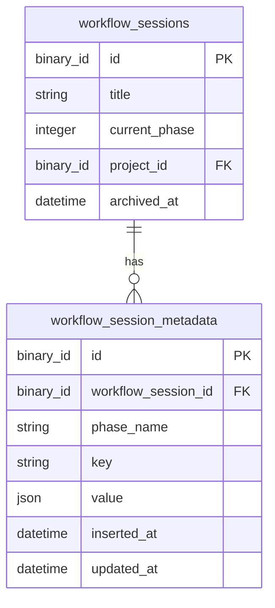

# Replace setup_steps JSON with workflow_session_metadata table

## Overview

Replace the `setup_steps` map column on `workflow_sessions` with a dedicated `workflow_session_metadata` table providing per-phase key/value storage. This eliminates the read-modify-write race condition where concurrent Oban workers (`TitleGenerationWorker` and `SetupWorker`) overwrite each other's changes to the shared JSON column. Each worker writes to its own row, making concurrent writes naturally safe.

## Problem Statement

Multiple Oban workers concurrently update `setup_steps` using a read-modify-write pattern:

1. Worker A reads `ws.setup_steps` → `%{"idea" => "..."}`
2. Worker B reads `ws.setup_steps` → `%{"idea" => "..."}`
3. Worker A writes `%{"idea" => "...", "title_gen" => %{"status" => "completed"}}`
4. Worker B writes `%{"idea" => "...", "repo_sync" => %{"status" => "completed"}}` — **overwrites Worker A's `title_gen` entry**

The `setup_steps` column also mixes two concerns: workflow state data (`idea`) and step progress tracking (`title_gen`, `repo_sync`, `worktree`).

## Proposed Solution

A normalized `workflow_session_metadata` table with a composite unique constraint on `(workflow_session_id, phase_name, key)` that supports upsert semantics. Each worker writes only its own key, eliminating write conflicts.

## Technical Approach

### New Table: `workflow_session_metadata`

```
┌──────────────────────────────────────────────────────────┐
│ workflow_session_metadata                                 │
├──────────────────────────────────────────────────────────┤
│ id              : binary_id (PK, autogenerate)           │
│ workflow_session_id : binary_id (FK → workflow_sessions)  │
│ phase_name      : string, null: false                    │
│ key             : string, null: false                    │
│ value           : map (JSON), null: false                │
│ inserted_at     : utc_datetime                           │
│ updated_at      : utc_datetime                           │
├──────────────────────────────────────────────────────────┤
│ UNIQUE INDEX: (workflow_session_id, phase_name, key)     │
│ FK: workflow_session_id → workflow_sessions (delete_all)  │
└──────────────────────────────────────────────────────────┘
```

**ERD:**



### Design Decisions

**Phase name is a string, not an integer.** The spec says "phase_name" and string values like `"wizard"`, `"setup"` are more descriptive than integer phase numbers. This decouples metadata from `current_phase` ordering and is self-documenting.

**`idea` becomes a metadata entry.** Stored as `(session_id, "wizard", "idea", "the user's idea text")`. The `value` column is jsonb — it naturally stores strings, maps, and lists. This keeps everything in one table instead of splitting between metadata and a new column.

**Retrieval returns a flat map keyed by `key`.** The returned shape preserves the current `setup_steps` access pattern: `%{"title_gen" => %{"status" => "completed"}, "idea" => "Fix login bug", "worktree" => %{"status" => "completed", "worktree_path" => "/path"}}`. Readers don't need to change their key-access logic, only how they obtain the map.

**Upsert broadcasts `:workflow_session_updated`.** The upsert function re-fetches the associated `WorkflowSession` and broadcasts via the existing PubSub channel. This preserves UI reactivity — `SetupPhase` and `WorkflowRunnerLive` continue handling the same event without changes to their PubSub subscriptions.

**DB reset instead of data migration.** Per project convention (early stage), create a new migration and reset the database. No need to migrate existing `setup_steps` data.

**`title_generating` boolean stays.** It serves the UI title pulse animation and is orthogonal to step progress metadata. Consolidation can happen in a follow-up.

### Context API

Add to `Destila.WorkflowSessions`:

```elixir
# Write — upserts a single metadata entry, broadcasts :workflow_session_updated
upsert_metadata(workflow_session_id, phase_name, key, value)
# → {:ok, %WorkflowSessionMetadata{}} | {:error, changeset}

# Read — returns flat map: %{"key" => value, ...} merged across all phases
get_metadata(workflow_session_id)
# → %{"title_gen" => %{"status" => "completed"}, "idea" => "...", ...}
```

The `upsert_metadata/4` function:
1. Inserts or updates via `Repo.insert/2` with `on_conflict: {:replace, [:value, :updated_at]}` and `conflict_target: [:workflow_session_id, :phase_name, :key]`
2. Re-fetches the `WorkflowSession` by ID
3. Broadcasts `{:workflow_session_updated, workflow_session}` via PubSub

The `get_metadata/1` function:
1. Queries all rows for the given `workflow_session_id`
2. Reduces into `%{key => value}` (last-write-wins on key collision across phases)

### Writer Updates

| Current Code | New Code |
|---|---|
| `WorkflowRunnerLive` line 165: `setup_steps: %{"idea" => data[:idea]}` in `create_workflow_session` | Call `upsert_metadata(ws.id, "wizard", "idea", data[:idea])` after session creation |
| `TitleGenerationWorker.update_setup_step/3` | Replace with `upsert_metadata(ws_id, "setup", "title_gen", %{"status" => status})` |
| `SetupWorker.update_setup_step/5` for `repo_sync` | Replace with `upsert_metadata(ws_id, "setup", "repo_sync", %{"status" => status, ...})` |
| `SetupWorker.update_setup_step/5` for `worktree` | Replace with `upsert_metadata(ws_id, "setup", "worktree", %{"status" => status, "worktree_path" => path, ...})` |

### Reader Updates

| Current Code | New Code |
|---|---|
| `SetupCoordinator`: `ws.setup_steps \|\| %{}` | `WorkflowSessions.get_metadata(ws.id)` |
| `SetupPhase`: `ws.setup_steps \|\| %{}` | `WorkflowSessions.get_metadata(ws.id)` |
| `AiConversationPhase`: `get_in(ws.setup_steps, ["worktree", "worktree_path"])` | `metadata = WorkflowSessions.get_metadata(ws.id)` then `get_in(metadata, ["worktree", "worktree_path"])` |
| `PromptChoreTaskWorkflow`: `get_in(ws.setup_steps, ["idea"])` | `metadata = WorkflowSessions.get_metadata(ws.id)` then `metadata["idea"]` |

### Schema Removal

Remove from `WorkflowSession`:
- `field(:setup_steps, :map, default: %{})` from schema
- `:setup_steps` from `cast/3` in changeset
- Drop column in migration

## Acceptance Criteria

- [x] New `workflow_session_metadata` table with composite unique index on `(workflow_session_id, phase_name, key)`
- [x] `WorkflowSessionMetadata` Ecto schema with `binary_id` PK, `belongs_to :workflow_session`
- [x] `upsert_metadata/4` in `WorkflowSessions` context — insert or update, then broadcast
- [x] `get_metadata/1` in `WorkflowSessions` context — returns flat map preserving current shape
- [x] `TitleGenerationWorker` writes via `upsert_metadata` instead of `update_setup_step`
- [x] `SetupWorker` writes via `upsert_metadata` instead of `update_setup_step`
- [x] `WorkflowRunnerLive` writes `idea` via `upsert_metadata` after session creation
- [x] `SetupPhase` reads from `get_metadata` — UI progress display unchanged
- [x] `SetupCoordinator` reads from `get_metadata` — phase advancement unchanged
- [x] `AiConversationPhase` reads `worktree_path` from `get_metadata`
- [x] `PromptChoreTaskWorkflow` reads `idea` from `get_metadata`
- [x] `setup_steps` field removed from `WorkflowSession` schema and changeset
- [x] `setup_steps` column dropped from `workflow_sessions` table
- [x] All existing tests updated and passing
- [x] No Gherkin feature file changes needed (behavior preserved)

## Implementation Phases

### Phase 1: Foundation (schema + migration + context API)

**Files to create:**
- `priv/repo/migrations/<timestamp>_create_workflow_session_metadata.exs` — new table + drop `setup_steps` column
- `lib/destila/workflow_sessions/workflow_session_metadata.ex` — Ecto schema

**Files to modify:**
- `lib/destila/workflow_sessions/workflow_session.ex` — remove `setup_steps` field and from changeset
- `lib/destila/workflow_sessions.ex` — add `upsert_metadata/4` and `get_metadata/1`

**New test file:**
- `test/destila/workflow_sessions_metadata_test.exs` — context-level tests for upsert (insert, update/overwrite, different phases) and retrieval (flat merge, empty state, single key)

### Phase 2: Migrate writers

**Files to modify:**
- `lib/destila/workers/title_generation_worker.ex` — replace `update_setup_step/3` with `upsert_metadata`; remove helper function
- `lib/destila/workers/setup_worker.ex` — replace `update_setup_step/5` with `upsert_metadata`; remove helper function
- `lib/destila_web/live/workflow_runner_live.ex` — write `idea` via `upsert_metadata` after `create_workflow_session` instead of passing it in attrs

### Phase 3: Migrate readers

**Files to modify:**
- `lib/destila/workflows/setup_coordinator.ex` — read from `get_metadata` instead of `ws.setup_steps`
- `lib/destila_web/live/phases/setup_phase.ex` — read from `get_metadata`; remove `get_step_status/2` and `get_step_error/2` helper functions (or adapt them to work with the metadata map)
- `lib/destila_web/live/phases/ai_conversation_phase.ex` — read `worktree_path` from `get_metadata`
- `lib/destila/workflows/prompt_chore_task_workflow.ex` — read `idea` from `get_metadata`

### Phase 4: Cleanup + tests

**Files to modify:**
- `test/destila_web/live/chore_task_workflow_live_test.exs` — update test fixtures at lines ~162 and ~369 to insert metadata rows instead of passing `setup_steps` in session attrs
- Remove any remaining references to `setup_steps` across the codebase
- Run `mix precommit` to verify everything compiles and passes

## Dependencies & Risks

**SQLite upsert support:** SQLite supports `ON CONFLICT` natively. Ecto's `Repo.insert/2` with `on_conflict` and `conflict_target` works with `ecto_sqlite3`. The unique index on `(workflow_session_id, phase_name, key)` serves as the conflict target.

**Broadcast after upsert adds a DB read:** Each `upsert_metadata` call will re-fetch the `WorkflowSession` to broadcast it. This is one extra query per step update, but step updates are infrequent (3-5 per session lifecycle). Acceptable trade-off for preserving UI reactivity.

**Worker error on deleted session:** If a session is deleted while workers are running, `upsert_metadata` will fail with a foreign key constraint error. This matches current behavior — workers already call `get_workflow_session!` which raises. Oban retries handle this gracefully.

## References

- `lib/destila/workflow_sessions/workflow_session.ex` — current `setup_steps` field definition
- `lib/destila/workflow_sessions.ex` — context module to extend
- `lib/destila/workers/setup_worker.ex` — primary writer (13 call sites)
- `lib/destila/workers/title_generation_worker.ex` — secondary writer (2 call sites)
- `lib/destila_web/live/workflow_runner_live.ex:165` — `idea` write at session creation
- `lib/destila/workflows/setup_coordinator.ex` — reads + phase advancement
- `lib/destila_web/live/phases/setup_phase.ex` — reads for UI display
- `lib/destila_web/live/phases/ai_conversation_phase.ex:367-368` — reads worktree_path
- `lib/destila/workflows/prompt_chore_task_workflow.ex:79` — reads idea
- `test/destila_web/live/chore_task_workflow_live_test.exs:162,369` — test fixtures to update
