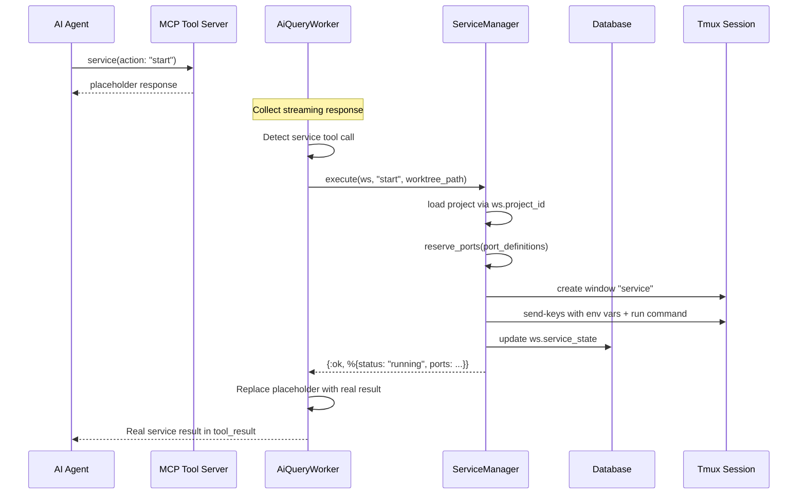
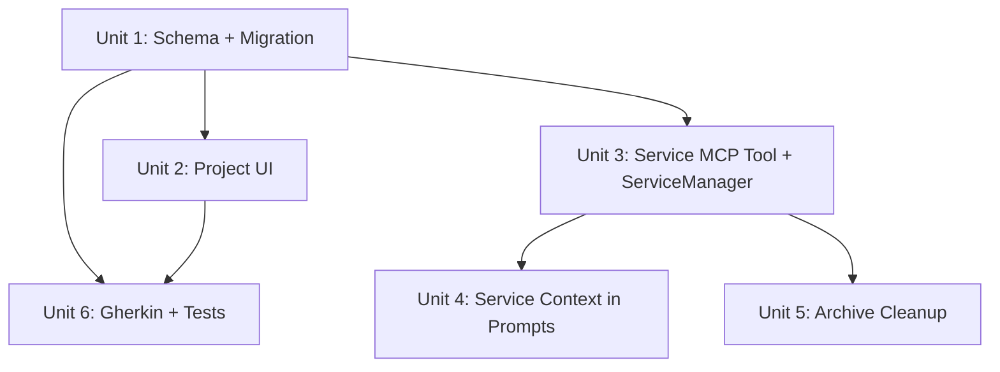

# feat: Add project service management with MCP tool

## Overview

Add the ability for projects to define a run command and port environment variables. During workflow sessions, the AI agent manages the service lifecycle (start/stop/restart/status) via a new `service` MCP tool. The service runs inside the workflow's existing tmux session, with dynamically assigned ports exposed as environment variables.

## Problem Frame

Workflow sessions operate on projects that often need a running development server (e.g., `mix phx.server`, `npm run dev`). Currently, the AI agent has no way to start, stop, or check the status of a project's service. Users must manually manage this outside of the workflow, which breaks the autonomous workflow loop. Adding service management as a first-class MCP tool lets the AI agent control the project's dev server lifecycle within the tmux session that already exists for terminal access.

## Requirements Trace

- R1. Projects can optionally define a run command (shell string) and port definitions (list of env var names)
- R2. Project management UI (dedicated page + inline wizard form) supports creating/editing run command and port definitions with dynamic add/remove
- R3. A `service` MCP tool with `start`, `stop`, `restart`, `status` actions manages the service lifecycle
- R4. Service state (status, PID, port mappings) is persisted in a `service_state` JSON column on `workflow_sessions`
- R5. Service state and port assignments are included in the AI's session context (system prompt)
- R6. Ports are dynamically assigned from available OS ports at start time
- R7. Service runs in a tmux window named "service" inside the session's tmux session
- R8. Session archival stops the service and cleans up the tmux window
- R9. Port definition env var names are validated: must start with an uppercase letter (A-Z) and contain only uppercase letters, digits (0-9), and underscores
- R10. Gherkin scenarios for project_management.feature and project_inline_creation.feature are updated

## Scope Boundaries

- No service management Gherkin feature file (AI-agent behavior, not user-facing)
- No cleanup when a session is merely marked as done (only on archive)
- No default port values; all ports are dynamically assigned at runtime
- No UI for service management; it is entirely AI-driven via the MCP tool
- No persistent port reservation; ports are reserved only on `start`

## Context & Research

### Relevant Code and Patterns

- `lib/destila/projects/project.ex` -- Project schema with `name`, `git_repo_url`, `local_folder` fields, `changeset/2` with custom validators
- `lib/destila/projects.ex` -- Project context with CRUD + PubSub broadcasting on `"store:updates"`
- `lib/destila/ai/tools.ex` -- MCP tool definitions using `tool :name, "desc" do ... end` macro, `@tool_details` module attrs for prompt injection, `@tool_descriptions` map
- `lib/destila/ai/claude_session.ex:11` -- `@default_allowed_tools` list that controls available tools
- `lib/destila/ai/conversation.ex:20-65` -- `phase_start/1` assembles system prompt from tool descriptions + skills + phase prompt
- `lib/destila/ai/response_processor.ex` -- Extracts session actions and export actions from MCP tool uses; pattern to follow for extracting service actions
- `lib/destila/workflows/session.ex` -- Session schema; target for `service_state` column
- `lib/destila/workflows.ex:206-213` -- `archive_workflow_session/1` stops ClaudeSession; needs service cleanup
- `lib/destila/terminal/server.ex` -- Tmux session creation pattern with `build_tmux_command/1`, uses `ExPTY` and `escape_shell/1`
- `lib/destila_web/live/projects_live.ex` -- Projects page with inline create/edit forms, `validate_project_params/1` manual validation, streams
- `lib/destila_web/components/project_components.ex` -- `project_selector/1` component for inline creation in wizard
- `features/project_management.feature` -- Current Gherkin scenarios
- `features/project_inline_creation.feature` -- Current inline creation scenarios
- `test/destila_web/live/projects_live_test.exs` -- Test file with `@tag feature:, scenario:` pattern
- `test/destila_web/live/project_inline_creation_live_test.exs` -- Inline creation tests

### Institutional Learnings

- The DB is SQLite and can be freely reset; no backward compatibility needed for migrations
- All schemas use `binary_id` primary keys with `@foreign_key_type :binary_id`
- Race condition avoidance: the metadata table pattern uses composite unique keys + upsert; `service_state` on the session itself avoids this since only one tool call writes at a time
- `DynamicSupervisor` + `Registry` naming pattern is established for per-session processes
- PubSub + `Process.monitor/1` is the established health-checking pattern (no polling)
- Tool execution in `tools.ex` returns `{:ok, "..."}` immediately; actual side effects happen in `ResponseProcessor`/worker after the tool use is extracted from the AI response

## Key Technical Decisions

- **`service_state` as a JSON column on `workflow_sessions`**: Simpler than a separate table since there's exactly one service state per session. No concurrent write risk since only one AI tool call processes at a time per session. Rationale: follows the principle of least complexity for a 1:1 relationship.

- **`port_definitions` as a `{:array, :string}` on `projects`**: A simple list of env var name strings stored as a JSON array in SQLite. No need for a join table since these are just string labels with no additional attributes.

- **Service tool processes actions in the worker, not in `execute/1`**: The existing MCP tools (`session`, `ask_user_question`) return immediately from `execute/1` with a confirmation string. The actual side effects are processed by `ResponseProcessor` and the worker. However, the `service` tool is different: it needs to perform real side effects (port reservation, tmux commands, process management) and return actual results (port mappings, PID, status). The service tool's `execute/1` will need access to the workflow session context. This means the tool execution needs to be intercepted in the response processing pipeline, similar to how `session` actions are extracted. The `ResponseProcessor` will extract `service` tool calls, and the worker will execute the service actions and include the results in the response.

  **Revised approach**: The service tool's actions must execute *before* the AI sees the tool result, so port mappings and status are returned in the same conversational turn. The `AiQueryWorker` already collects the streaming response and extracts MCP tool uses. After collecting the response but before passing it to `SessionProcess`, the worker should detect `service` tool calls, execute them via `ServiceManager`, and inject the real result into the tool result text that Claude sees. This way the AI gets `{"status": "running", "ports": {"PORT": 54321}}` instead of a placeholder. A new `Destila.Services.ServiceManager` module handles port reservation, tmux commands, and state persistence.

- **Port reservation via `:gen_tcp.listen/2` with port 0**: Erlang's `:gen_tcp.listen(0, ...)` asks the OS for an available port, then immediately close the socket to release it. This is the standard Erlang idiom. There's a small TOCTOU window, but it's acceptable for dev tooling.

- **Tmux window management**: Create a tmux window named "service" inside the session's existing tmux session. The tmux session name must be derived using the same logic as `Terminal.Server` (which uses a configurable `session_name` opt, not `ws.title` directly). If the tmux session doesn't exist yet (terminal hasn't been opened), create it with a "shell" window first (matching the terminal convention), then add the "service" window. Use `tmux send-keys` to run the command with env vars set inline. Service lifecycle is managed via tmux window commands (`tmux kill-window`, `tmux send-keys C-c`) rather than raw PID tracking, to avoid PID reuse risks.

- **PID liveness checking**: Use `System.cmd("kill", ["-0", to_string(pid)])` to check process liveness (macOS does not have `/proc`). The `status` action always checks PID liveness and corrects stale "running" state.

## Open Questions

### Resolved During Planning

- **Where does service_state context go in the AI prompt?**: Injected by the workflow's `system_prompt` function, which already receives the full `ws` struct. Each workflow's prompt function can read `ws.service_state` and include port/status info when non-nil.

- **Which phases get the service tool?**: All phases that have `system_prompt` (AI-driven phases). The `service` tool is added to `@default_allowed_tools` in `claude_session.ex` so it's available in every AI session, just like `session` and `ask_user_question`. Its description is always injected.

- **How to handle the service tool's response data**: The `service` tool needs to return actual port mappings and status to the AI. Since `execute/1` runs without session context, the tool's result text will be a placeholder. The actual service action is processed after response collection (like `session` actions), and the result is stored in `service_state`. The AI reads service state from the next prompt's context, or the tool result can be enriched in the worker before being sent back.

  **Resolution**: The `AiQueryWorker` intercepts `service` tool calls after collecting the AI response but before passing it to `SessionProcess`. It calls `ServiceManager` to execute the action, then replaces the placeholder tool result text with the actual result (port mappings, status, or error). The results are also persisted to `ws.service_state`. This way the AI receives real service data in the same conversational turn.

### Deferred to Implementation

- Exact `tmux send-keys` command syntax for setting env vars inline with the run command
- How to derive the tmux session name for a given workflow session -- must match `Terminal.Server`'s naming to target the correct session
- Whether to use `tmux send-keys C-c` (graceful) or `tmux kill-window` (force) for service stop, or a combination (try graceful first, force after timeout)

## High-Level Technical Design

> *This illustrates the intended approach and is directional guidance for review, not implementation specification. The implementing agent should treat it as context, not code to reproduce.*

## Implementation Units

- [ ] **Unit 1: Project schema + session migration**

**Goal:** Add `run_command` and `port_definitions` fields to Project schema, add `service_state` column to workflow_sessions.

**Requirements:** R1, R4, R9

**Dependencies:** None

**Files:**
- Modify: `lib/destila/projects/project.ex`
- Modify: `lib/destila/workflows/session.ex`
- Create: `priv/repo/migrations/TIMESTAMP_add_service_fields.exs`

**Approach:**
- Add `run_command` (`:string`, optional) and `port_definitions` (`{:array, :string}`, default `[]`) to the Project schema
- Add both to `cast/3` fields list; add validation for port_definitions (each entry must be non-empty, match `~r/^[A-Z][A-Z0-9_]*$/`). Add a denylist rejecting critical system env var names (`PATH`, `HOME`, `SHELL`, `USER`, `TERM`, `LANG`, `LD_PRELOAD`, `LD_LIBRARY_PATH`) to prevent environment variable collision when launching the service
- Add `service_state` (`:map`, optional) to Session schema and its `cast/3` list
- Single migration adds all three columns

**Patterns to follow:**
- `lib/destila/projects/project.ex` changeset structure with custom validators (`validate_at_least_one_location`, `validate_git_repo_url`)
- Existing migration in `priv/repo/migrations/20260324111938_create_projects_workflow_sessions_messages.exs`

**Test scenarios:**
- Happy path: Project changeset accepts valid `run_command` and `port_definitions` (e.g., `["PORT", "API_PORT"]`)
- Happy path: Project changeset accepts nil/empty `run_command` and `port_definitions` (both optional)
- Happy path: Session changeset accepts a `service_state` map
- Edge case: Port definition with empty string is rejected
- Edge case: Port definition with lowercase or special chars (e.g., `"my-port"`, `"123"`) is rejected
- Edge case: Port definition with valid underscore names (e.g., `"DB_PORT"`, `"PORT_3000"`) is accepted
- Happy path: Existing project and session validations still pass unchanged

**Verification:**
- `mix test test/destila/projects/project_test.exs` passes (create this test file)
- Migration runs cleanly with `mix ecto.migrate`

- [ ] **Unit 2: Project management UI updates**

**Goal:** Add run command and port definitions fields to both the dedicated projects page form and the inline creation form in the workflow wizard.

**Requirements:** R2

**Dependencies:** Unit 1

**Files:**
- Modify: `lib/destila_web/live/projects_live.ex`
- Modify: `lib/destila_web/components/project_components.ex`
- Modify: `lib/destila_web/live/create_session_live.ex`

**Approach:**
- Extend `project_form/1` in `ProjectsLive` with:
  - A text input for `run_command` (optional, labeled "Run command", placeholder e.g. `mix setup && mix phx.server`)
  - A dynamic list section for port definitions: each entry is a text input for the env var name with a remove button, plus an "Add port" button
- Use hidden inputs with indexed names (e.g., `port_definitions[0]`, `port_definitions[1]`) for the port list
- Handle `add_port` and `remove_port` events in the LiveView to manipulate a `@port_definitions` assign (list of strings)
- Extend `validate_project_params/1` to include `run_command` and `port_definitions` validation
- Extend `new_form/0` to include `run_command` and `port_definitions` defaults
- Extend `edit_project` handler to populate form with existing `run_command` and `port_definitions`
- Mirror the same fields in `project_selector/1` component's `:create` step
- Show run command and port count in the project display card (similar to how git URL and local folder are shown)

**Patterns to follow:**
- Existing `project_form/1` component in `ProjectsLive` with fieldset structure, error display, class list pattern
- Existing inline form in `project_components.ex` with `phx-target={@target}` pattern
- Manual `validate_project_params/1` approach (not changeset-based) for LiveView validation

**Test scenarios:**
- Happy path: Create a project with run command and port definitions -- form submits, project appears in list with run command displayed
- Happy path: Edit a project's run configuration -- existing values pre-fill, update saves
- Happy path: Add multiple port definitions dynamically -- clicking "Add port" adds input rows
- Happy path: Remove a port definition -- clicking remove button removes the row
- Edge case: Empty port definition env var name shows validation error
- Edge case: Create project without run command or ports (optional fields) -- succeeds as before
- Integration: Port definitions with invalid format rejected on form submit

**Verification:**
- Project form renders with run command and port definition fields
- Dynamic add/remove of port definition entries works
- Validation errors display for empty/invalid port names
- Existing project CRUD behavior unchanged

- [ ] **Unit 3: Service MCP tool + ServiceManager**

**Goal:** Add the `service` MCP tool definition and a `Destila.Services.ServiceManager` module that handles port reservation, tmux commands, PID tracking, and service_state persistence.

**Requirements:** R3, R4, R6, R7

**Dependencies:** Unit 1

**Files:**
- Modify: `lib/destila/ai/tools.ex`
- Modify: `lib/destila/ai/claude_session.ex`
- Modify: `lib/destila/ai/response_processor.ex`
- Modify: `lib/destila/workers/ai_query_worker.ex`
- Modify: `lib/destila/workflows/implement_general_prompt_workflow.ex` (add to `@implementation_tools`)
- Modify: `lib/destila/workflows/code_chat_workflow.ex` (add to `@chat_tools`)
- Create: `lib/destila/services/service_manager.ex`

**Approach:**

**Tool definition** (`tools.ex`):
- Add `tool :service` with a single `:action` string field (required, description lists start/stop/restart/status)
- Add `@service_details` markdown describing the tool's behavior, when to use each action, and that port mappings are returned in the tool result. Include guidance that the AI should not combine a service start with immediate port-dependent actions in the same response
- Add `"mcp__destila__service"` to `@tool_descriptions`
- `execute/1` returns `{:ok, "Service action will be processed."}`

**Tool registration** (`claude_session.ex`):
- Add `"mcp__destila__service"` to `@default_allowed_tools`

**Per-workflow tool lists**:
- Add `"mcp__destila__service"` to `@implementation_tools` in `implement_general_prompt_workflow.ex`
- Add `"mcp__destila__service"` to `@chat_tools` in `code_chat_workflow.ex`
- Do NOT add to `brainstorm_idea_workflow.ex` (brainstorm phases are conversational, no service management needed)

**Response processing** (`response_processor.ex`):
- Add `@service_tool_names ["service", "mcp__destila__service"]`
- Add `extract_service_action/1` that finds the first service tool call and returns `%{action: action}` or `nil`

**Worker integration** (`ai_query_worker.ex`):
- After collecting the streaming response but before passing the result to `SessionProcess`, detect service tool calls via `ResponseProcessor.extract_service_action(result)`
- If a service action is found, call `ServiceManager.execute(ws, action, worktree_path: worktree_path)` where `worktree_path` comes from the AI session (already available in the worker context)
- Replace the placeholder tool result text in the response with the actual ServiceManager result (JSON-encoded port mappings, status, or error message)
- Service actions must be processed BEFORE session actions (phase transitions) to ensure service state is persisted before any phase advance

**ServiceManager** (`lib/destila/services/service_manager.ex`):
- `execute(ws, action, opts)` dispatches to `do_start/2`, `do_stop/1`, `do_restart/2`, `do_status/1`
- `do_start/2`:
  1. Load the project via `Destila.Projects.get_project(ws.project_id)` (NOT via ws.project which is not preloaded)
  2. Return error if project is nil or `run_command` is nil
  3. Reserve ports via `:gen_tcp.listen(0, ...)` + `:inet.port/1` for each port definition
  4. Get worktree_path from opts
  5. Derive the tmux session name using the same logic as `Terminal.Server` (escape_shell on the session name). If the tmux session doesn't exist, create it with a "shell" window first (matching terminal convention), then add the "service" window
  6. Create a tmux window named "service" with env vars and run command via `tmux send-keys`
  7. Update `ws.service_state` with `%{"status" => "running", "ports" => port_map}`. Validate that `pid` (if tracked) is always a positive integer before storing
  8. Return the service state
- `do_stop/1`: Use `tmux send-keys -t session:service C-c` to send SIGINT, or `tmux kill-window -t session:service` to force-stop. Update `service_state` to `%{"status" => "stopped", ...}`, keep port info for reference. Prefer tmux-level control over raw PID kill to avoid PID reuse risks
- `do_restart/2`: Call `do_stop/1` then `do_start/2`. On restart, reuse previously assigned ports from `service_state` rather than reserving new ones, to avoid breaking port references
- `do_status/1`: Check if the tmux "service" window exists and if the process is alive, correct stale state, return current `service_state`

**Patterns to follow:**
- `ResponseProcessor.extract_session_action/1` pattern for extracting tool calls
- `Terminal.Server.build_tmux_command/1` and `escape_shell/1` for tmux command construction
- `Workflows.update_workflow_session/2` for persisting state changes

**Test scenarios:**
- Happy path: `ServiceManager.execute(ws, "start")` with valid project run_command reserves ports, returns running state with port mappings
- Happy path: `ServiceManager.execute(ws, "stop")` on a running service updates state to stopped
- Happy path: `ServiceManager.execute(ws, "restart")` stops then starts with new ports
- Happy path: `ServiceManager.execute(ws, "status")` on running service returns current state
- Error path: `start` on a project with no run_command returns an error tuple
- Error path: `stop` when no service is running returns appropriate error/message
- Edge case: `status` when PID is no longer alive corrects state to "stopped"
- Edge case: `start` when tmux session doesn't exist yet creates it first
- Integration: `ResponseProcessor.extract_service_action/1` correctly extracts service tool calls from MCP tool uses
- Integration: Port reservation finds actually available ports (`:gen_tcp` approach)

**Verification:**
- Service MCP tool appears in tool descriptions
- `ServiceManager` correctly manages tmux windows and tracks PIDs
- Port reservation produces valid, available ports
- Service state is persisted to the database after each action

- [ ] **Unit 4: Service state in AI session context**

**Goal:** Include service state and port assignments in the AI's system prompt so the AI always knows current service status.

**Requirements:** R5

**Dependencies:** Unit 3

**Files:**
- Modify: `lib/destila/ai/conversation.ex`

**Approach:**
- Inject service state context centrally in `conversation.ex`'s `phase_start/1`, alongside the existing `tool_section` and `skill_section` assembly. This avoids modifying individual workflow modules (many of whose prompt functions ignore the `ws` argument with `_workflow_session`)
- Add a `service_section` that reads `ws.service_state` and formats it as a prompt section when non-nil
- Format: `## Service Status\n\nThe project service is currently {status}.\nPorts: PORT=54321, API_PORT=54322`
- When `service_state` is nil, omit the section entirely
- The `ws` struct is loaded via `Workflows.get_workflow_session!/1` which does NOT preload `:project`. Service state is already on the `ws` struct directly (the `:map` column), so no preload is needed for this unit
- Append the service section to the `sections` list in `phase_start/1` so it appears in every phase prompt automatically

**Patterns to follow:**
- Existing `tool_section` and `skill_section` assembly pattern in `conversation.ex:42-61`
- `Destila.Workflows.Skills.assemble_skills/1` pattern for composing prompt sections

**Test scenarios:**
- Happy path: When `ws.service_state` is `%{"status" => "running", "ports" => %{"PORT" => 54321}}`, assembled prompt includes service status and port mappings
- Happy path: When `ws.service_state` is nil, assembled prompt has no service section
- Edge case: When service state is `%{"status" => "stopped"}`, prompt indicates service is stopped

**Verification:**
- AI system prompts include service context when service is running
- AI system prompts omit service context when no service has been started

- [ ] **Unit 5: Archive cleanup**

**Goal:** Stop the service and clean up the tmux service window when a workflow session is archived.

**Requirements:** R8

**Dependencies:** Unit 3

**Files:**
- Modify: `lib/destila/workflows.ex`

**Approach:**
- In `archive_workflow_session/1`, before the existing `ClaudeSession.stop_for_workflow_session`, call `ServiceManager.cleanup(ws)` if `ws.service_state` is non-nil
- `ServiceManager.cleanup/1` kills the tmux "service" window (which terminates the service process) and updates `service_state` to nil
- In `unarchive_workflow_session/1`, clear `service_state` to nil so the AI starts fresh rather than seeing stale port/PID data from before archival

**Patterns to follow:**
- Existing `archive_workflow_session/1` which already calls `ClaudeSession.stop_for_workflow_session/1`
- Existing `unarchive_workflow_session/1` which resets phase execution status

**Test scenarios:**
- Happy path: Archiving a session with a running service stops the process and cleans up tmux window
- Happy path: Archiving a session with no service (nil service_state) proceeds without error
- Edge case: Archiving a session where the service process already died still cleans up tmux window
- Happy path: Unarchiving a session clears stale service_state to nil
- Integration: After archive, service_state is nil

**Verification:**
- Archive stops service process when running
- Archive cleans up tmux "service" window
- Archive of session without service still works

- [ ] **Unit 6: Gherkin scenarios and tests**

**Goal:** Update Gherkin feature files and add/update LiveView tests for the new project fields.

**Requirements:** R10

**Dependencies:** Unit 1, Unit 2

**Files:**
- Modify: `features/project_management.feature`
- Modify: `features/project_inline_creation.feature`
- Modify: `test/destila_web/live/projects_live_test.exs`
- Modify: `test/destila_web/live/project_inline_creation_live_test.exs`

**Approach:**
- Update `project_management.feature` description to mention run command and port definitions
- Add three new scenarios as specified in the prompt: create with run config, edit run config, port definitions require env var name
- Update `project_inline_creation.feature` description to mention optional run command and port definitions
- Add corresponding `@tag feature: @feature, scenario: "..."` tests in the test files
- Tests should use `has_element?/2` and `element/2` to verify form fields and validation errors

**Patterns to follow:**
- Existing `@tag feature: @feature, scenario: "..."` pattern in test files
- Existing test structure using `Phoenix.LiveViewTest` functions
- Existing Gherkin scenario writing style in feature files

**Test scenarios:**
- Happy path: "Create a project with run command and port definitions" -- fill form, submit, verify project created with fields
- Happy path: "Edit a project's run configuration" -- edit existing project, verify pre-fill, update, verify saved
- Error path: "Port definitions require an environment variable name" -- add empty port def, submit, verify error
- Integration: Existing scenarios still pass unchanged

**Verification:**
- `mix test test/destila_web/live/projects_live_test.exs` passes with new scenarios
- `mix test test/destila_web/live/project_inline_creation_live_test.exs` passes
- Gherkin files accurately describe current behavior

## System-Wide Impact

- **Interaction graph:** The `service` tool's actions are extracted by `ResponseProcessor` in `AiQueryWorker` after collecting the AI response. `ServiceManager` executes the action and writes to `workflow_sessions`. The result is injected back into the tool result before passing to `SessionProcess`. The archive path in `Workflows.archive_workflow_session/1` gains a new cleanup step. `update_workflow_session/2` broadcasts `:workflow_session_updated` after each service state write, which triggers UI refreshes in connected LiveViews -- this is acceptable since service actions are infrequent.
- **Error propagation:** Service action failures (port unavailable, tmux command failure, project has no run_command) should be returned as error messages in the tool result text, and also stored in `service_state`. The AI sees the error in the tool result and can react in the same turn. Service failures do not affect the session state machine return value (`:awaiting_input`, `:phase_complete`, etc.).
- **State lifecycle risks:** The `service_state` JSON column is written by `ServiceManager` via `Workflows.update_workflow_session/2`. Since only one AI tool call processes at a time per session (sequential Oban worker), there's no concurrent write risk. Stale "running" state is corrected on `status` checks via tmux window existence.
- **API surface parity:** No external API affected. The MCP tool is internal to the AI agent loop.
- **Integration coverage:** The critical cross-layer path is: AI calls service tool -> ResponseProcessor extracts it -> Conversation calls ServiceManager -> ServiceManager runs tmux commands + writes DB -> next prompt reads service_state. This end-to-end flow should have at least one integration test.
- **Unchanged invariants:** Existing project CRUD, session lifecycle, terminal opening, and all other MCP tools remain unchanged. The `session` and `ask_user_question` tools are not affected.

## Risks & Dependencies

| Risk | Mitigation |
|------|------------|
| TOCTOU window in port reservation (port freed then grabbed by another process) | Acceptable for dev tooling; document the limitation. On restart, reuse previously assigned ports to minimize exposure. |
| Tmux session might not exist when service start is called | ServiceManager checks for tmux session existence and creates it (with "shell" window first) if needed, matching `Terminal.Server` convention. |
| Tmux session name must match between Terminal.Server and ServiceManager | Both derive the session name from the same source. ServiceManager must use the same naming/escaping logic as `Terminal.Server.build_tmux_command/1`. |
| Service process crash between status checks leaves stale state | `status` action checks if the tmux "service" window still exists and corrects state. AI prompt context shows last-known state. |
| SQLite JSON column handling for service_state and {:array, :string} | Ecto's `:map` type and `{:array, :string}` with `ecto_sqlite3` store as JSON text; verify roundtrip behavior during implementation. |
| Environment variable collision in port definitions | Denylist validation rejects critical system env var names (PATH, HOME, etc.) to prevent accidental override. |
| run_command enables arbitrary shell execution | Intentional for dev tooling. Trust boundary: only the user sets this via project UI. The AI agent does not have write access to `run_command` via any MCP tool. |

## Sources & References

- Related code: `lib/destila/ai/tools.ex` (MCP tool pattern)
- Related code: `lib/destila/terminal/server.ex` (tmux integration)
- Related code: `lib/destila/ai/response_processor.ex` (tool action extraction)
- Related code: `lib/destila/workflows.ex:206-213` (archive cleanup)
- Related code: `lib/destila_web/live/projects_live.ex` (project form UI)
