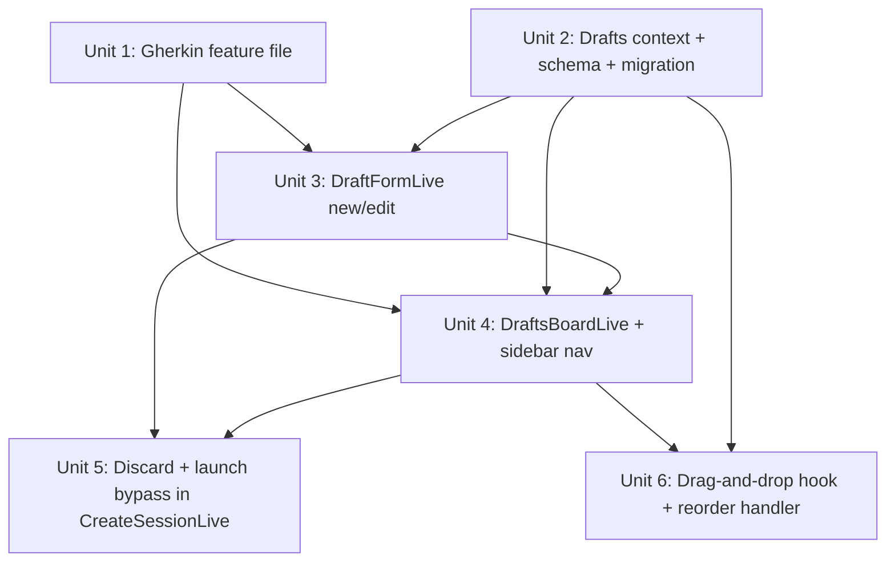

# feat: Drafts Board

## Overview

Add a "Draft" concept to destila: a lightweight pairing of a prompt + project + priority that lives on a top-level kanban-style board at `/drafts` with three priority columns (High, Medium, Low). Drafts capture ideas before they become real workflow sessions. From a draft's detail page the user can edit it, drag-reorder within/across priority columns, discard (soft archive), or launch a workflow that bypasses the existing prompt + project selection form and navigates straight to the workflow runner, archiving the originating draft on success.

This feature introduces a new domain context, two LiveViews, a drag-and-drop hook, and a bypass seam in `DestilaWeb.CreateSessionLive`. It mirrors the soft-archive pattern used by `Destila.Projects` and the stream-based list pattern used by `DestilaWeb.ProjectsLive`.

## Problem Frame

Today, the only way to capture an idea in destila is to start a full workflow session. That forces a user to commit to a prompt, pick a project, and pick a workflow type all at once — making the "collect loose ideas and sort them by priority later" workflow awkward. A drafts board lets users queue up thoughts, rank them by priority, and defer the commitment to a workflow type until they're ready to actually work on an idea.

## Requirements Trace

- **R1.** Board at `/drafts` renders three priority columns (High, Medium, Low), each listing its drafts; each card shows the (truncated) prompt only.
- **R2.** Left navigation gets a "Drafts" entry peer to the "Crafting Board" entry.
- **R3.** Users can create a draft from the board via "New Draft"; prompt, project, and priority are all required — priority has no default.
- **R4.** Users can open a draft's detail/edit page to view and update prompt, project, and priority; saving persists changes and (if priority changed) moves the card to the matching column.
- **R5.** Users can drag a card within a column to reorder it, or across columns to change its priority; order is preserved across reloads.
- **R6.** "Discard" on the detail page soft-archives the draft, returns to the board, and hides the draft from every UI path (no archive view, no restore).
- **R7.** "Start workflow" on the detail page navigates to the workflow type picker; selecting a type creates the workflow session using the draft's prompt + project, archives the draft, and navigates directly to the workflow runner — no flash of the prompt+project form.
- **R8.** A draft may reference a project that was later archived; listing, cards, and detail pages must continue to render without crashing, surfacing the archived state.
- **R9.** Archive only happens on successful workflow session creation; a failed launch must leave the draft intact.
- **R10.** BDD coverage: add `features/drafts_board.feature` with the scenarios from the brief; every test carries `@tag feature: "drafts_board", scenario: "..."`.
- **R11.** `mix precommit` passes before landing.

## Scope Boundaries

**In scope:**
- New `Destila.Drafts` context + `Destila.Drafts.Draft` schema + `drafts` table migration.
- `DestilaWeb.DraftsBoardLive` (board), `DestilaWeb.DraftFormLive` (new/edit/detail unified).
- Drag-and-drop via a new external `phx-hook` using native HTML5 DnD; no new npm dependency.
- Extending `DestilaWeb.CreateSessionLive` with a `draft_id` query-param bypass.
- Sidebar navigation entry in `DestilaWeb.Layouts`.
- Gherkin scenarios in `features/drafts_board.feature` and tests in `test/destila/` + `test/destila_web/live/`.

**Explicit non-goals:**
- No archived-drafts page, restore flow, or archive filter UI anywhere.
- No back-link from a launched workflow session to its originating draft.
- No default priority — the user must pick one.
- No separate title/notes/description field — the card surface shows the prompt only.
- No SortableJS or other DnD library dependency.
- No workflow_type field on the draft itself — the workflow type is still chosen when launching.
- No new permissions or access control layer (destila has no auth; see `docs/plans/2026-04-09-refactor-remove-user-auth-plan.md`).

## Context & Research

### Relevant Code and Patterns

- **Soft-archive pattern** — mirror `lib/destila/projects.ex` and `lib/destila/projects/project.ex`: `field :archived_at, :utc_datetime`; list queries filter `is_nil(archived_at)`; `archive_*` sets `DateTime.utc_now()`; every mutation ends with `|> broadcast(:event_name)` via `Destila.PubSubHelper`.
- **Archive migration shape** — `priv/repo/migrations/20260415000000_add_archived_at_to_projects.exs` shows `add :archived_at, :utc_datetime` + `create index(:drafts, [:archived_at])`.
- **Binary_id + FK conventions** — `lib/destila/projects/project.ex` (`@primary_key {:id, :binary_id, autogenerate: true}`, `@foreign_key_type :binary_id`) and `priv/repo/migrations/20260324111938_create_projects_workflow_sessions_messages.exs` (`references(:projects, type: :binary_id, on_delete: :restrict)`).
- **Stream-based list LiveView** — `lib/destila_web/live/projects_live.ex` demonstrates `stream(:name, list)`, `assign(:empty?, list == [])`, PubSub subscription to `"store:updates"`, re-stream with `reset: true` on updates, inline edit via `stream_insert`, and the empty-state `hidden only:block` trick inside `phx-update="stream"`.
- **Form LiveComponent + reuse of project selector** — `lib/destila_web/live/project_form_live.ex` and `lib/destila_web/components/project_components.ex` (`project_selector/1`). The project selector supports both inline-create and selection, emits `select_project`/`show_create_project`/`back_to_select` events, and `send(self(), {:project_saved, project})` back to the parent.
- **Bypass seam in CreateSessionLive** — `lib/destila_web/live/create_session_live.ex:12-18` dispatches on `Map.has_key?(params, "workflow_type")`; line 167 (`~p"/workflows/#{wf.type}"`) is where `draft_id` must be propagated. `Destila.Workflows.create_workflow_session/1` at `lib/destila/workflows.ex:92` accepts `%{workflow_type, input_text, project_id}` — exactly the data a draft carries.
- **Sidebar nav** — `lib/destila_web/components/layouts.ex:44-65`, using `<.sidebar_item navigate={} icon={} label={} active={@page_title == "..."} />`. Add the drafts entry between "Crafting Board" and "Projects".
- **Router conventions** — `lib/destila_web/router.ex:37-50` scope `"/" , DestilaWeb`; `live "/drafts", DraftsBoardLive` (and siblings) slot in alongside `live "/crafting", CraftingBoardLive`.
- **Colocated and external hook registration** — `assets/js/app.js:27-28` imports external hooks from `assets/js/hooks/`; `Hooks` object (lines 58-65) spreads them and registers with `LiveSocket`. Existing CSS classes `.sortable-ghost` and `.sortable-drag` at `assets/css/app.css:226-233` can be reused for drag styling even though no SortableJS is pulled in.
- **PubSub broadcasting** — `Destila.PubSubHelper.broadcast/2` on `"store:updates"`, event atoms like `:draft_created`, `:draft_updated`, `:draft_deleted` received via `handle_info({event, data}, socket)`.
- **BDD test linking** — module-level `@feature "name"` + per-test `@tag feature: @feature, scenario: "..."`; see `test/destila_web/live/project_archiving_live_test.exs:1-55` for the canonical shape. Feature files live in `features/`.
- **Ecto.Enum precedent** — `docs/plans/2026-04-06-refactor-ecto-enum-phase-execution-status-plan.md` is the in-repo template for `Ecto.Enum` field usage.
- **Crafting board columns (reference only)** — `lib/destila_web/live/crafting_board_live.ex` shows a multi-section board but does *not* use streams per column; the drafts board should use one stream per priority column because per-column stream operations (`stream_delete` + `stream_insert(at: idx)`) map cleanly to drag-and-drop events.

### Institutional Learnings

`docs/solutions/` does not exist in this repo. Adjacent prior plans consulted:
- `docs/plans/2026-04-15-002-feat-project-archiving-plan.md` — shape of a soft-archive feature on a new entity (field, index, UI hiding, tests).
- `docs/plans/2026-03-23-feat-crafting-board-redesign-plan.md` — documents the removal of the older SortableJS hook, confirming the current codebase has no DnD dependency and no `assets/js/hooks/sortable.js`. The hook name `Sortable` remains unused and explicitly asserted-absent in `test/destila_web/live/crafting_board_live_test.exs:323`; the new drafts hook should use a distinct name (`DraftsBoard` or `DraftDrag`) to avoid colliding with those assertions.
- `docs/plans/2026-04-04-refactor-extract-create-session-live-plan.md` — confirms `CreateSessionLive` is the canonical entry for workflow session creation and the right place to extend the bypass.

### External References

None consulted. The codebase has strong local patterns for every layer this plan touches (context + schema, list LiveView with streams, form LiveComponent, phx-hook, bypass flow); external research would not change the design.

## Key Technical Decisions

- **Single `Destila.Drafts.Draft` schema, no associations beyond `belongs_to :project`.** Drafts don't link to workflow sessions; the brief explicitly says "no link back from the resulting workflow session to its originating draft." Keeping the schema minimal avoids a pointless FK cycle.
- **Soft archive via `archived_at :utc_datetime`, no `deleted_at`.** Discard is permanent from the UI but recoverable via DB for accidental-data-loss protection, matching the brief and the projects pattern.
- **Per-priority `position :float` for ordering.** Storing a float scoped per priority column means a single drag only writes one row (the moved draft) using midpoint math. Alternatives considered: (a) integer positions requiring bulk renumbering on every move — rejected because every drag writes N rows; (b) gap-10 integers with periodic rebalance — rejected as more complex than float midpoints for the expected scale (dozens of drafts per column). Float precision eventually degrades after many hundreds of consecutive midpoint operations between the same neighbors; captured as a low-probability risk rather than a design constraint. No unique constraint on `(priority, position)` — ties are tolerated and broken by `inserted_at`.
- **`priority` is an `Ecto.Enum` of `[:low, :medium, :high]`, required at creation.** No default. The form uses a `<select>` with a blank placeholder option whose submission fails the `validate_required(:priority)` check.
- **Required fields at creation: `prompt`, `priority`, `project_id`.** Project must reference a non-archived project at create time; edits are validated against the same rule *for the new value* only — an existing draft whose project was later archived remains loadable and editable (the user can change the project via the form).
- **Drag-and-drop event contract:** the hook pushes a single `"reorder_draft"` event with `%{"draft_id", "priority", "before_id", "after_id"}`; the LiveView resolves the three cases (empty column, top/bottom, between two cards) into a new `position` and persists it atomically with any `priority` change. This keeps all ordering math on the server and makes the contract testable without a browser via `render_hook/3`.
- **`DraftFormLive` is a full `live_view` (not a `live_component`).** Unlike `ProjectFormLive`, the draft form owns routes (`/drafts/new`, `/drafts/:id`) and navigation (back to board, to the workflow type picker, to the workflow runner after launch). The project selector is still reused as a function component via `DestilaWeb.ProjectComponents.project_selector/1` with `target={nil}`.
- **Launch bypass via a `draft_id` query param threaded through the type picker.** `CreateSessionLive` already branches on the presence of `"workflow_type"` in `mount`; adding `"draft_id"` requires: (1) propagating it in the `<.link navigate={~p"/workflows/#{wf.type}?draft_id=..."}>` at `lib/destila_web/live/create_session_live.ex:167`, and (2) a new `mount_launch_from_draft/3` branch that (a) loads the draft, (b) calls `Destila.Workflows.create_workflow_session/1` with the draft's prompt+project+chosen type, (c) archives the draft only on `{:ok, ws}`, and (d) `push_navigate`s to `~p"/sessions/#{ws.id}"`. The render for this branch is a minimal loading state so nothing flashes; the heavy lifting happens in `mount` so the form is never rendered. On error the user is redirected back to the draft detail with a flash.
- **Three streams per priority column** (`:drafts_low`, `:drafts_medium`, `:drafts_high`) on the board. This keeps drag operations localized to the affected column(s) with `stream_delete` + `stream_insert(at: idx)` and avoids re-streaming the whole board on every reorder. PubSub-driven updates from other tabs/processes still re-stream all three with `reset: true`.
- **Archived-project display on cards and detail page** — when a draft's `project.archived_at` is non-nil, render an "(archived)" label next to the project name rather than hiding the draft or erroring. Handled in the card/detail templates; no query-level filtering change.

## Open Questions

### Resolved During Planning

- **Should the draft store the workflow type?** No. The brief specifies the launch flow goes through the workflow type picker, and keeping the draft type-agnostic avoids having to show/validate types at create time. The draft carries only prompt + project + priority.
- **Form LiveComponent vs full LiveView for the detail page?** Full LiveView. The detail page owns routes and navigation; see Key Technical Decisions.
- **How to represent priority?** `Ecto.Enum` with atoms `[:low, :medium, :high]`. Display labels are handled in the template.
- **How to drag?** Native HTML5 DnD in a new external `phx-hook`, no npm dependency. See Unit 6.
- **What prevents the prompt+project form from flashing during launch?** The bypass branch runs entirely inside `mount/3` (synchronous session creation + `push_navigate`) before any render, and its `render` function renders a dedicated `:launching` loading view, not the form. See Unit 5.

### Deferred to Implementation

- **Exact midpoint helper naming and placement** inside `Destila.Drafts` (`compute_position/3`, `reposition/4`, etc.) — pick during implementation of Unit 2.
- **Exact sidebar icon** — `hero-document-text`, `hero-bolt`, `hero-queue-list`, or similar. Implementer picks whichever reads best alongside the existing `hero-beaker` for Crafting Board and `hero-folder` for Projects.
- **Card truncation style** — pick Tailwind `line-clamp-3` vs `line-clamp-2` during implementation based on visual density.
- **Precise UX microcopy** for empty states, discard confirmation button label, and start-workflow button wording — refine during implementation.
- **Float-rebalancing utility** — none planned for this feature. If float precision ever becomes an issue in practice, add a small rebalance function in a follow-up; not needed for v1.

## High-Level Technical Design

> *This illustrates the intended approach and is directional guidance for review, not implementation specification. The implementing agent should treat it as context, not code to reproduce.*

### Drag-and-drop event contract

```
Client (phx-hook)                          Server (DraftsBoardLive)
-----------------                          ------------------------
drop event on a column ─────────────────▶  handle_event("reorder_draft", %{
  derive:                                     "draft_id"    => dragged_id,
    - dragged_id                              "priority"    => "high" | "medium" | "low",
    - target_priority                         "before_id"   => id | nil,
    - before_id (card above drop)             "after_id"    => id | nil
    - after_id  (card below drop)           }, socket)
  pushEvent("reorder_draft", payload)          │
                                               ├─▶ Drafts.reposition(draft, priority, before_id, after_id)
                                               │     compute_position/3 picks midpoint or top/bottom:
                                               │       empty column       -> 1.0
                                               │       before nil, after a -> a.position - 1.0
                                               │       before a, after nil -> a.position + 1.0
                                               │       between a and b     -> (a.position + b.position) / 2
                                               ├─▶ stream_delete from old column (if priority changed)
                                               └─▶ stream_insert(at: new_index) into target column
```

### Launch bypass flow

```
User clicks "Start workflow" on /drafts/:id
  │
  └─▶ push_navigate to /workflows?draft_id=<id>
        │
        └─▶ CreateSessionLive.mount/3 (type selection)
              renders type picker with each card navigating to
              /workflows/<type>?draft_id=<id>
              │
              └─▶ CreateSessionLive.mount/3 (launch branch)
                    guard: both "workflow_type" and "draft_id" present
                    load draft (get_draft! from non-archived)
                      ├─ not found / archived -> redirect to /drafts + flash
                      └─ ok
                          │
                          ├─▶ Workflows.create_workflow_session(%{
                          │     workflow_type:, input_text: draft.prompt,
                          │     project_id: draft.project_id })
                          │     ├─ {:ok, ws}  -> Drafts.archive_draft(draft)
                          │     │               push_navigate to /sessions/<ws.id>
                          │     └─ {:error, _} -> redirect to /drafts/<id>
                          │                       with error flash, draft NOT archived
                          └─▶ render :launching view (minimal spinner; never the form)
```

## Implementation Units

### Unit dependency graph



---

- [ ] **Unit 1: Gherkin feature file**

**Goal:** Land `features/drafts_board.feature` with the exact scenario set from the brief so subsequent units can reference them by `@tag scenario:`.

**Requirements:** R10

**Dependencies:** None

**Files:**
- Create: `features/drafts_board.feature`

**Approach:**
- Copy the scenarios from the brief verbatim into `features/drafts_board.feature`. Preserve the feature description paragraph at the top (archive semantics, launch semantics, no restore path).
- No code changes beyond the feature file; this unit exists so every downstream test in Units 2-6 can carry `@tag feature: "drafts_board", scenario: "..."` without risk of mismatched scenario names.

**Patterns to follow:**
- `features/project_archiving.feature` — shape of a multi-section feature file with `# --- Section ---` comment headers.
- `features/session_archiving.feature` — cross-page scenario style.

**Test scenarios:**
- Test expectation: none -- this unit adds no code, only a BDD spec. Scenario coverage is verified by Units 2-6 as they attach `@tag` references.

**Verification:**
- `features/drafts_board.feature` exists and contains every scenario from the brief, with exact scenario names suitable for `@tag scenario:` reference.
- `grep -n "Scenario:" features/drafts_board.feature` lists the 13 scenarios from the brief.

---

- [ ] **Unit 2: Drafts context + `Draft` schema + migration**

**Goal:** Create the `Destila.Drafts` domain context and `Destila.Drafts.Draft` schema with CRUD, soft archive, per-priority ordering, and midpoint position helper. No UI.

**Requirements:** R3, R4, R5, R6, R8, R9, R11

**Dependencies:** Unit 1

**Files:**
- Create: `lib/destila/drafts.ex`
- Create: `lib/destila/drafts/draft.ex`
- Create: `priv/repo/migrations/YYYYMMDDHHMMSS_create_drafts.exs`
- Create: `test/destila/drafts/draft_test.exs`
- Create: `test/destila/drafts_test.exs`

**Approach:**
- `drafts` table fields: `id :binary_id` PK, `prompt :text` (null: false), `priority :string` (null: false, cast from Ecto.Enum atom), `position :float` (null: false), `archived_at :utc_datetime`, `project_id :binary_id` FK `references(:projects, on_delete: :restrict)`, `timestamps(type: :utc_datetime)`.
- Indexes: `create index(:drafts, [:priority, :position])` (covers the per-priority ordered list query), `create index(:drafts, [:archived_at])`, `create index(:drafts, [:project_id])`.
- Schema: mirror `lib/destila/projects/project.ex` — `@primary_key {:id, :binary_id, autogenerate: true}`, `@foreign_key_type :binary_id`, `field :priority, Ecto.Enum, values: [:low, :medium, :high]`, `belongs_to :project, Destila.Projects.Project`. Changeset `cast` + `validate_required([:prompt, :priority, :project_id, :position])` and validate the referenced project is not archived *at create time* via `Ecto.Changeset.prepare_changes/2` or a foreign_key_constraint + explicit pre-check in the context; keep it in the context to avoid coupling the schema to the projects module.
- Context functions:
  - `list_drafts_by_priority/1` -> `[%Draft{}]` ordered `asc: position`, filtered `is_nil(archived_at)`, preload `:project`.
  - `list_all_active/0` -> returns `%{low: [...], medium: [...], high: [...]}` for efficient board load (single query + group_by in Elixir, preload `:project`).
  - `get_draft/1`, `get_draft!/1` filter `is_nil(archived_at)`.
  - `create_draft/1` — accepts `%{prompt, priority, project_id}`, validates project exists and is non-archived, computes default position as `max_position_in_priority(priority) + 1.0` (or `1.0` if empty), inserts, broadcasts `:draft_created`.
  - `update_draft/2` — accepts `%{prompt, priority, project_id}`; if `priority` changed, re-assign position to `max_position_in_priority(new_priority) + 1.0` unless caller supplies one; broadcasts `:draft_updated`.
  - `archive_draft/1` — sets `archived_at: DateTime.utc_now()`; broadcasts `:draft_updated`.
  - `reposition_draft/4` — `reposition_draft(draft, target_priority, before_id, after_id)`; loads neighbors by id, computes midpoint via a private `compute_position/3`, updates both `priority` and `position` in one changeset, broadcasts `:draft_updated`.
  - `compute_position/3` (private) — implements the four cases in the Technical Design block.
- PubSub: `defdelegate broadcast(result, event), to: Destila.PubSubHelper` — same shape as `Destila.Projects`.
- Do **not** add a `list_archived_drafts/0` function; the brief forbids an archived-drafts page.

**Patterns to follow:**
- `lib/destila/projects.ex` (context shape, broadcast, archive).
- `lib/destila/projects/project.ex` (schema, binary_id, changeset).
- `priv/repo/migrations/20260324111938_create_projects_workflow_sessions_messages.exs` (table creation, FK, indexes).
- `priv/repo/migrations/20260415000000_add_archived_at_to_projects.exs` (archived_at index).

**Test scenarios:**
- Happy path: `create_draft/1` with all required fields persists and broadcasts `:draft_created`; returned draft has a numeric position and preloaded project.
- Happy path: `list_drafts_by_priority(:high)` returns only non-archived drafts in the given priority, ordered by ascending `position`.
- Happy path: `list_all_active/0` returns a map with `:low/:medium/:high` keys, each sorted by `position`, excluding archived drafts.
- Happy path: `update_draft/2` updates prompt/project/priority; changing priority moves the draft to the new column's tail.
- Happy path: `archive_draft/1` sets `archived_at`, removes the draft from all `list_*` queries, and broadcasts `:draft_updated`.
- Edge case: `compute_position/3` with an empty column returns a sensible default (e.g. `1.0`); with `before_id = nil, after_id = some_id` returns `some.position - 1.0`; with `before_id = some_id, after_id = nil` returns `some.position + 1.0`; with both set returns the midpoint.
- Edge case: `reposition_draft/4` across priorities atomically updates both `priority` and `position`.
- Edge case: creating a draft with no `priority` fails changeset validation (required).
- Edge case: creating a draft with no `project_id` fails changeset validation (required).
- Edge case: creating a draft whose referenced project is archived returns `{:error, changeset}` with an error on `:project_id`.
- Edge case: loading a draft whose project was archived *after* creation succeeds and returns the draft with a `project` whose `archived_at` is non-nil (no crash).
- Edge case: `get_draft/1` and `get_draft!/1` return nil / raise for archived drafts.
- Error path: `create_draft/1` with a non-existent `project_id` returns `{:error, changeset}` (foreign_key_constraint).
- Integration: `create_draft/1` actually writes to the DB and a subsequent `list_drafts_by_priority/1` in the same test returns it (round-trip via `Destila.Repo`).

Each test is tagged `@tag feature: "drafts_board", scenario: "<matching scenario from the feature file>"` where applicable; pure unit-level invariants (e.g., midpoint math) may be tagged against the relevant scenario ("Reorder drafts within a priority column", "Move a draft to a different priority column via drag-and-drop") or left un-tagged if they assert implementation-level correctness beyond what the Gherkin describes.

**Verification:**
- `mix test test/destila/drafts_test.exs test/destila/drafts/draft_test.exs` passes.
- `mix ecto.migrate && mix ecto.rollback` both succeed cleanly.
- A manual `iex` round-trip (`Destila.Drafts.create_draft/1` -> `list_drafts_by_priority/1` -> `archive_draft/1` -> `get_draft/1` returns nil) works.

---

- [ ] **Unit 3: `DraftFormLive` for new / edit / detail**

**Goal:** Land the LiveView that serves `/drafts/new` and `/drafts/:id`, handling create, edit, discard, and start-workflow navigation. Drag-and-drop and the full bypass integration come in later units; this unit wires `Start workflow` to navigate to `~p"/workflows?draft_id=<id>"` — the propagation through the type picker ships in Unit 5.

**Requirements:** R3, R4, R6, R7 (navigation only), R8

**Dependencies:** Unit 1, Unit 2

**Files:**
- Create: `lib/destila_web/live/draft_form_live.ex`
- Modify: `lib/destila_web/router.ex` (add `live "/drafts/new", DraftFormLive` and `live "/drafts/:id", DraftFormLive`)
- Create: `test/destila_web/live/draft_form_live_test.exs`

**Approach:**
- Full `DestilaWeb, :live_view` module — not a live_component. Dispatches on params: no `:id` -> `:new` mode; `:id` present -> `:edit` mode (also the "detail" surface; the brief lets them be the same page).
- `mount/3`:
  - Loads active projects via `Destila.Projects.list_projects/0`.
  - For `:edit`, loads the draft via `Destila.Drafts.get_draft!/1` (raises 404 on archived/missing, which router rescues as a redirect — consistent with other LiveViews in this repo).
  - Assigns `:form` from `to_form/2` with string-keyed params matching the template fields (`"prompt"`, `"priority"`, `"project_id"`).
  - Subscribes to `"store:updates"` if connected so new projects created inline appear in the selector.
- Events:
  - `"validate"` — `assign(:form, to_form(params))`.
  - `"save"` — trims prompt, collects priority (string `"low"|"medium"|"high"` cast to atom before calling context), calls `create_draft/1` or `update_draft/2`, on success `push_navigate` to `/drafts`, on error re-renders with errors.
  - `"discard"` — only for `:edit`; calls `Destila.Drafts.archive_draft/1`, flashes "Draft discarded", `push_navigate` to `/drafts`.
  - `"start_workflow"` — only for `:edit`; `push_navigate(to: ~p"/workflows?draft_id=#{@draft.id}")`. Unit 5 handles the other side.
  - `"select_project"`, `"show_create_project"`, `"back_to_select"` — reuse the existing project-selector contract (see `CreateSessionLive` lines 94-105).
  - `{:project_saved, project}` info — same as `CreateSessionLive.handle_info` — refresh `:projects`, preselect the new project.
- Template: `<Layouts.app flash={@flash} page_title={@page_title}>` wrapper with `@page_title = "New Draft"` or `"Edit Draft"`. Form has:
  - `id="draft-form"` with `phx-submit="save"` and `phx-change="validate"`.
  - Prompt textarea `id="draft-prompt"` with `name="prompt"`, `phx-debounce="300"`.
  - Priority `<select id="draft-priority" name="priority">` with a blank placeholder option (`<option value="" disabled selected>Select priority…</option>`) plus High/Medium/Low — submission with the empty value triggers the required validation.
  - Project selector via `<.project_selector projects={@projects} selected_id={@project_id} step={@project_step} errors={@errors} target={nil} />`.
  - Submit button `id="save-draft-btn"`.
  - In `:edit` mode, two additional buttons at the bottom of the form: `id="discard-draft-btn"` (phx-click `"discard"`) and `id="start-workflow-btn"` (phx-click `"start_workflow"`). A "Back to drafts" link is always present.
  - If `@draft.project.archived_at` is non-nil, render an archived indicator next to the project field.
- Use the inline-create pattern from `CreateSessionLive` so the project selector can create a project without leaving the page.

**Patterns to follow:**
- `lib/destila_web/live/create_session_live.ex` — particularly the project-selector wiring (select/create/back) and the `{:project_saved, project}` handler.
- `lib/destila_web/live/project_form_live.ex` — `to_form/2` with a string-keyed map, `changeset_to_errors/1` shape for error assigns.
- `lib/destila_web/live/session_deletion_live_test.exs` (if present in `test/destila_web/live/` — reference `test/destila_web/live/project_archiving_live_test.exs` otherwise) for the "confirm then act" interaction style in tests.

**Test scenarios:**
- Happy path / Scenario: "Create a new draft from the drafts board" — POST `save` with prompt + project + priority redirects to `/drafts`; draft exists with those attrs.
- Edge case / Scenario: "Cannot create a draft without a project" — submitting with `project_id` unset renders a validation error on the project field; no draft is created.
- Edge case / Scenario: "Cannot create a draft without a priority" — submitting without priority renders a validation error on the priority field; no draft is created.
- Happy path / Scenario: "Open a draft detail page" — GET `/drafts/:id` renders a form populated with the draft's prompt, project, and priority.
- Happy path / Scenario: "Edit the prompt, project, and priority of an existing draft" — submitting the form with new values persists; redirect lands back on the board; subsequent `/drafts/:id` load reflects the new values.
- Happy path / Scenario: "Discard a draft from its detail page" — clicking `#discard-draft-btn` redirects to `/drafts`, flashes, and `Destila.Drafts.get_draft(id)` returns nil.
- Happy path / Scenario: "Launch a workflow from a draft skips prompt and project selection" (navigation half only, remainder in Unit 5) — clicking `#start-workflow-btn` performs a LiveView navigate whose target matches `~p"/workflows?draft_id=#{draft.id}"`.
- Edge case: opening `/drafts/:id` for an archived draft 404s or redirects (consistent with how the rest of the app handles `get_*!` on soft-archived resources).
- Integration: the project selector's inline-create flow (click "Create New Project", submit project form, receive `{:project_saved, project}`) results in the new project being preselected for the draft.
- Integration: editing an existing draft whose `project.archived_at` is non-nil loads without crashing and renders the archived indicator.

All tests tagged `@feature "drafts_board"` + the matching scenario name.

**Verification:**
- `mix test test/destila_web/live/draft_form_live_test.exs` passes.
- Manual `/drafts/new` flow creates a draft; `/drafts/:id` edits and discards it.

---

- [ ] **Unit 4: `DraftsBoardLive` (board + sidebar nav)**

**Goal:** Land the board at `/drafts` with three priority columns, empty state, "New Draft" button, card click-to-edit navigation, and a sidebar entry. No drag-and-drop yet — priority changes happen via the edit form until Unit 6 ships.

**Requirements:** R1, R2, R3 (button only), R4 (navigation), R8, R11

**Dependencies:** Unit 1, Unit 2, Unit 3

**Files:**
- Create: `lib/destila_web/live/drafts_board_live.ex`
- Modify: `lib/destila_web/router.ex` (add `live "/drafts", DraftsBoardLive` just before `live "/projects"`)
- Modify: `lib/destila_web/components/layouts.ex` (add `<.sidebar_item navigate={~p"/drafts"} icon={...} label="Drafts" active={@page_title == "Drafts"} />` between Crafting Board and Projects)
- Create: `test/destila_web/live/drafts_board_live_test.exs`

**Approach:**
- `mount/3`:
  - Subscribes to `"store:updates"` when connected.
  - Loads `Destila.Drafts.list_all_active/0` into three streams: `stream(:drafts_high, grouped.high)`, `stream(:drafts_medium, ...)`, `stream(:drafts_low, ...)`.
  - Assigns `:any_drafts?` (single boolean for the global empty state) based on whether all three lists are empty.
  - Assigns `:page_title, "Drafts"`.
- `handle_info({:draft_created | :draft_updated | :draft_deleted, _}, socket)` — re-fetches `list_all_active/0` and re-streams all three columns with `reset: true`, re-computes `:any_drafts?`.
- Template:
  - `<Layouts.app flash={@flash} page_title={@page_title}>` wrapper.
  - Header with an `#new-draft-btn` linking (`<.link navigate={~p"/drafts/new"}>`) to the new-draft form.
  - Global empty state (`id="drafts-board-empty"`) rendered only when `@any_drafts?` is false, inviting "Create your first draft" with a CTA identical to `#new-draft-btn`.
  - Three column containers, each `id={"column-#{priority}"}` with a header (`High | Medium | Low`) and a `phx-update="stream"` inner div bearing `id={"drafts-#{priority}"}`. Each column has a per-column empty-state hint using the `hidden only:block` pattern.
  - Each card: `<.link navigate={~p"/drafts/#{draft.id}"} id={id} class="…">` where the link's anchor id is the stream DOM id; card body shows only the prompt, truncated with `line-clamp-3`. If `draft.project.archived_at` is non-nil, render an `(archived)` badge for the project name.
- No drag-and-drop here; clicking a card opens detail/edit (Unit 3). Sidebar layout update uses a hero icon chosen during implementation.
- Tests drive interactions purely via `live/2`, `element/2`, `render_click/1`, and `has_element?/2` against the DOM ids above.

**Patterns to follow:**
- `lib/destila_web/live/projects_live.ex` — stream + PubSub + empty-state shape.
- `lib/destila_web/live/crafting_board_live.ex` — multi-column board layout (three-column flex/grid wrapper).
- `lib/destila_web/components/layouts.ex:44-65` — sidebar item insertion.

**Test scenarios:**
- Happy path / Scenario: "View drafts grouped by priority columns" — three drafts, one per priority; each appears in its column container.
- Happy path / Scenario: "Draft card shows the prompt" — a draft with prompt "Refactor session archiving" renders a card whose body contains that text.
- Happy path / Scenario: "Empty board shows guidance to create the first draft" — no drafts exist; `#drafts-board-empty` is present with the CTA.
- Happy path / Scenario: "Create a new draft from the drafts board" — clicking `#new-draft-btn` navigates to `/drafts/new` (covered end-to-end in conjunction with Unit 3's create test).
- Happy path / Scenario: "Open a draft detail page" — clicking a card navigates to `/drafts/:id`.
- Edge case: a draft whose project was archived still renders on the board with the archived indicator.
- Edge case: the sidebar shows "Drafts" as active when `@page_title == "Drafts"` (verify `aria-current` or the active class on the link).
- Integration: after an inline edit to a draft in another process (simulate by calling `Destila.Drafts.update_draft/2` directly then sending the PubSub message), the board re-streams and the draft shows up in the new priority column.

**Verification:**
- `mix test test/destila_web/live/drafts_board_live_test.exs` passes.
- Manual: `/drafts` renders three columns, empty state fires when no drafts exist, clicking a card opens `/drafts/:id`, sidebar "Drafts" item highlights on the board.

---

- [ ] **Unit 5: Launch bypass in `CreateSessionLive` + Discard-on-launch semantics**

**Goal:** Propagate the `draft_id` query param through the workflow type picker and implement the launch branch that bypasses the prompt+project form entirely. On successful session creation, archive the draft.

**Requirements:** R7, R9

**Dependencies:** Unit 2, Unit 3, Unit 4

**Files:**
- Modify: `lib/destila_web/live/create_session_live.ex`
- Create: `test/destila_web/live/draft_launch_live_test.exs` *(or extend `draft_form_live_test.exs` — implementer decides; keep the "launch + archive" integration assertions in one module)*

**Approach:**
- `CreateSessionLive.mount/3` gains a third branch:
  ```
  cond do
    Map.has_key?(params, "draft_id") and Map.has_key?(params, "workflow_type") ->
      mount_launch_from_draft(params, socket)
    Map.has_key?(params, "workflow_type") ->
      mount_form(params["workflow_type"], maybe_assign_draft_id(socket, params))
    true ->
      mount_type_selection(maybe_assign_draft_id(socket, params))
  end
  ```
- `mount_launch_from_draft/2`:
  - Loads the draft via `Destila.Drafts.get_draft(params["draft_id"])`. If nil -> redirect to `/drafts` with an error flash.
  - Parses `workflow_type` via `String.to_existing_atom/1`; on `ArgumentError` redirect to `/workflows` with a flash.
  - Calls `Destila.Workflows.create_workflow_session(%{workflow_type:, input_text: draft.prompt, project_id: draft.project_id})`.
  - On `{:ok, ws}`: calls `Destila.Drafts.archive_draft(draft)` then `push_navigate(to: ~p"/sessions/#{ws.id}")`.
  - On `{:error, _}`: redirect to `~p"/drafts/#{draft.id}"` with an error flash; **does not archive**.
  - Assigns `view: :launching`, `page_title: "Launching workflow…"` for the unlikely case that the socket is not yet connected and the mount runs twice (disconnected + connected). Because the create+navigate happens inside `mount/3`, the form is never rendered.
- `render(%{view: :launching} = assigns)` — a minimal centered spinner with text; wrapped in `<Layouts.app flash={@flash} page_title={@page_title}>`.
- `mount_type_selection` gets the optional `:draft_id` assign; the type-picker template at `lib/destila_web/live/create_session_live.ex:167` changes:
  ```
  navigate={
    if @draft_id,
      do: ~p"/workflows/#{wf.type}?draft_id=#{@draft_id}",
      else: ~p"/workflows/#{wf.type}"
  }
  ```
- `mount_form` also carries `@draft_id` through for rendering-time propagation in case the user lands on `/workflows/:type?draft_id=X` but the branch-guard in `mount/3` has already redirected them via launch — but the guard ensures that path only renders when both params are present. Defensively, if only `draft_id` is present in the form branch, it's fine to ignore it.
- Archive-only-on-success is enforced by the explicit order: `create_workflow_session` first, then `archive_draft`. If the caller kills the LiveView between create and archive, the worst case is a created session whose draft is still visible — in that case the brief's guarantee holds because the check is "archive only on successful creation", not "the draft is archived before the user sees the runner." A subsequent visit to the board still shows the draft; discarding it manually is available. This trade-off is captured in Risks.

**Patterns to follow:**
- `lib/destila_web/live/create_session_live.ex:12-18` — the existing `cond`-style dispatch in `mount/3`.
- `lib/destila/workflows.ex:92-134` — the session-creation entry point and its `{:ok, ws}` / `{:error, _}` shape.
- `lib/destila_web/live/session_archiving_live_test.exs` — the canonical "LiveView causes a DB state change, verify via Repo" shape.

**Test scenarios:**
- Happy path / Scenario: "Launch a workflow from a draft skips prompt and project selection" — `live(conn, ~p"/workflows?draft_id=#{draft.id}")` renders the type picker with each card's navigate URL containing `?draft_id=<draft.id>`; following one of those links lands on `/sessions/<ws.id>` with a newly-created workflow session whose `user_prompt == draft.prompt` and `project_id == draft.project_id`.
- Happy path / Scenario: "Launching a workflow auto-archives the draft" — after the launch succeeds, `Destila.Drafts.get_draft(draft.id)` returns nil and the draft is absent from `list_all_active/0`.
- Edge case: `/workflows?draft_id=<nonexistent>` redirects to `/drafts` with an error flash; no workflow session is created.
- Edge case: `/workflows/invalid_type?draft_id=<id>` redirects to `/workflows` with an error flash; no workflow session is created; draft remains active.
- Error path: when `Destila.Workflows.create_workflow_session/1` returns `{:error, _}` (simulate by passing a project whose `:restrict` FK rejects — or by deleting the project mid-test), the LiveView redirects back to `/drafts/<id>`, the draft's `archived_at` remains nil, and no workflow session is persisted.
- Integration: the form is never rendered in the launch flow — after the redirect through `/workflows?draft_id=…` -> `/workflows/:type?draft_id=…` -> `/sessions/:id`, no HTML with `id="manual-input-form"` or `id="project-list"` appears in any intermediate render.

**Verification:**
- `mix test test/destila_web/live/draft_launch_live_test.exs test/destila_web/live/create_session_live_test.exs` passes. (The existing `create_session_live_test.exs` must continue to pass — the bypass must not regress the non-draft path.)
- Manual: clicking "Start workflow" on a draft lands directly on the runner with the draft's prompt preloaded, and the draft is gone from the board.

---

- [ ] **Unit 6: Drag-and-drop hook + `reorder_draft` handler**

**Goal:** Add drag-and-drop for cards within and across priority columns. Moving a card persists the new priority + position via the midpoint helper from Unit 2.

**Requirements:** R5

**Dependencies:** Unit 2, Unit 4

**Files:**
- Create: `assets/js/hooks/drafts_board.js`
- Modify: `assets/js/app.js` (import and register as `DraftsBoard`)
- Modify: `lib/destila_web/live/drafts_board_live.ex` (attach `phx-hook="DraftsBoard"` + `phx-update="ignore"` to the column containers; add `handle_event("reorder_draft", _, socket)`)
- Modify: `test/destila_web/live/drafts_board_live_test.exs` (add reorder scenarios)

**Approach:**
- The hook is an external JS object following the same pattern as `assets/js/hooks/terminal_panel.js` and `assets/js/hooks/local_time.js` — export default, `mounted`, `destroyed`, with `this.pushEvent(...)`.
- Attach the hook to each column wrapper (not the inner `phx-update="stream"` div) so LiveView's stream-patching is not interfered with. The column wrapper uses:
  ```
  <div
    id={"column-#{priority}"}
    phx-hook="DraftsBoard"
    phx-update="ignore"
    data-priority={priority}
    class="…"
  >
    <header>...</header>
    <div id={"drafts-#{priority}"} phx-update="stream">
      …cards…
    </div>
  </div>
  ```
  *Note:* `phx-update="ignore"` on the outer column is required by CLAUDE.md whenever a hook manages its own DOM; because the inner stream div is a descendant, its `phx-update="stream"` still applies. Confirm during implementation that streams still update correctly through an ignored ancestor — if not, move the hook to a sibling that doesn't wrap the stream and coordinate via DOM IDs.
- Card markup: `draggable="true"` on each card, `data-draft-id={draft.id}` so the hook can read identifiers without reparsing DOM ids.
- JS contract (HTML5 native DnD):
  - On `dragstart` on a card: set a class on the dragged element, stash `draft_id` in `dataTransfer`, `dataTransfer.effectAllowed = "move"`.
  - On `dragover` on the column: `event.preventDefault()` + add `.sortable-drag` class.
  - On `dragleave`: remove the class.
  - On `drop`: compute `before_id` (the card immediately above the drop point) and `after_id` (the one immediately below). Heuristic: iterate card children of the stream container, compare each card's bounding-rect midpoint `y` with `event.clientY`; the last card whose midpoint is < `clientY` is `before_id`, the first whose midpoint is >= `clientY` is `after_id`. Empty column: both `nil`. Push `"reorder_draft"` with `{draft_id, priority: this.el.dataset.priority, before_id, after_id}`.
  - Re-use CSS `.sortable-ghost` and `.sortable-drag` classes from `assets/css/app.css:226-233` for visual feedback.
- LiveView handler:
  - `handle_event("reorder_draft", %{"draft_id" => draft_id, "priority" => priority_str, "before_id" => before_id, "after_id" => after_id}, socket)`.
  - Cast `priority_str` to atom via `String.to_existing_atom/1` (safe because the enum values are pre-registered as atoms in the schema; reject unexpected values with a no-op on invalid atom).
  - Load the draft, call `Destila.Drafts.reposition_draft/4`; on success, the PubSub `:draft_updated` handler already re-streams all three columns — no explicit stream operations needed here. On error, ignore (the board's current state is still internally consistent; a follow-up PubSub can correct any drift).
  - Alternative: for snappier UX, `stream_delete` the draft from the old column and `stream_insert(at: idx)` into the new column locally, suppressing the next PubSub refresh for that draft id. Treat this as an implementation-time optimization; Unit 6 ships the correct-but-simple version first.
- Do **not** name the hook `Sortable` — `test/destila_web/live/crafting_board_live_test.exs:323` explicitly refutes that string.

**Patterns to follow:**
- `assets/js/hooks/terminal_panel.js` — external hook file layout.
- `assets/js/app.js:27-65` — import + register.
- `assets/css/app.css:226-233` — existing drag class styling.

**Test scenarios:**
- Happy path / Scenario: "Reorder drafts within a priority column" — create three drafts in `:high`; push `"reorder_draft"` with `before_id = nil, after_id = drafts[0].id` for `drafts[2]`; reload the board and verify the order is `[drafts[2], drafts[0], drafts[1]]`.
- Happy path / Scenario: "Move a draft to a different priority column via drag-and-drop" — create a draft in `:low`; push `"reorder_draft"` with `priority: "high", before_id: nil, after_id: nil`; reload and verify the draft's `priority == :high`.
- Edge case: drop into an empty column — `before_id` and `after_id` both nil, `reposition_draft/4` yields a sensible default position and the draft appears in the new column.
- Edge case: drop at the top of a non-empty column — `before_id = nil, after_id = existing.id` — new position is `existing.position - 1.0`.
- Edge case: drop at the bottom of a non-empty column — `before_id = existing.id, after_id = nil` — new position is `existing.position + 1.0`.
- Edge case: drop between two cards — new position is strictly between neighbors' positions and the three cards list in the expected order on reload.
- Edge case: pushing `"reorder_draft"` with an unknown `draft_id` is a no-op (no crash, no DB change).
- Edge case: pushing `"reorder_draft"` with an invalid priority string is a no-op.
- Integration: after a reorder event, the board view re-renders with the new order without a full page reload.
- Integration: no regression in sidebar or create/edit flows from adding the hook (existing Unit 4 tests still pass).

All interactive tests are driven by `render_hook(view, "reorder_draft", %{...})` or direct `Phoenix.LiveView.Socket` event pushes — the JS hook itself is not unit-tested in Elixir; its behavior is validated by the event payload contract the tests exercise.

**Verification:**
- `mix test test/destila_web/live/drafts_board_live_test.exs` passes (including new reorder scenarios).
- `mix precommit` passes cleanly (formatter, compile warnings, tests).
- Manual: dragging a card within `High` persists order across `/drafts` reloads; dragging from `Low` to `High` changes the priority and the card appears in the High column.

## System-Wide Impact

- **Interaction graph:** `DestilaWeb.CreateSessionLive` is the only existing LiveView modified. The sidebar item in `DestilaWeb.Layouts` is purely additive. The `"store:updates"` PubSub topic picks up three new event atoms (`:draft_created`, `:draft_updated`, `:draft_deleted`); existing subscribers fall through via the default `handle_info(_msg, socket), do: {:noreply, socket}` already present on every LiveView. No other subscribers should react to draft events.
- **Error propagation:** `Destila.Drafts` returns `{:ok, draft} | {:error, changeset}` for all mutations, matching `Destila.Projects`. The launch bypass treats `{:error, _}` from `Workflows.create_workflow_session/1` as a redirect-with-flash, not a re-raise, to avoid crashing the LiveView process mid-launch.
- **State lifecycle risks:** Archive-after-create ordering in Unit 5 is not transactional — a process crash between `create_workflow_session/1` success and `archive_draft/1` leaves the draft active alongside the new session. The brief's "archive only on successful creation" constraint is satisfied either way (we never archive on failure). The tradeoff is documented in Risks; the user can manually discard the stale draft.
- **API surface parity:** No existing interfaces are renamed or changed. `CreateSessionLive.mount/3` gains a new branch; its existing two branches remain behaviorally identical. The router gains three new routes under `/drafts`; existing `/workflows`, `/sessions`, `/projects`, `/crafting` routes are untouched.
- **Integration coverage:** Units 3 and 5 each include an integration-style assertion that spans LiveView + Repo (`Destila.Drafts.get_draft/1` after a discard; `Destila.Drafts.get_draft/1` + `Destila.Workflows.get_workflow_session/1` after a launch). Unit 4 includes a PubSub-driven cross-tab simulation.
- **Unchanged invariants:** (a) `Destila.Workflows.create_workflow_session/1` signature is unchanged; (b) `Destila.Projects` is unchanged; (c) the crafting board's assertion that `phx-hook="Sortable"` is absent remains valid (this feature uses `phx-hook="DraftsBoard"`); (d) the authentication model (none) and the `"store:updates"` PubSub topic name are unchanged.

## Risks & Dependencies

| Risk | Mitigation |
|------|------------|
| Float position precision degrades after many consecutive midpoints between the same two neighbors, eventually breaking tie order. | Accept for v1. At ~50 midpoints between the same pair, doubles still have ~4 bits of precision left; well beyond expected user interactions. If it becomes real, add a rebalance utility in a follow-up. |
| `phx-update="ignore"` on the outer column wrapper could interfere with the inner stream's patching if LiveView's diffing walks through the ignored subtree. | During Unit 6 implementation, verify stream updates still propagate. If they don't, restructure so the hook lives on a sibling DOM node (e.g. the header) and reads column identity via a `data-priority` attribute elsewhere. The plan accommodates either layout. |
| A process crash between `create_workflow_session/1` and `archive_draft/1` leaves a stale draft after launch. | Documented behavior; manual discard is available. The brief's archive-only-on-success guarantee holds (we never archive on failure). Not worth introducing a transaction boundary because the two operations live in different contexts and DB transactions don't span `Oban.insert/1` or `SessionProcess.ensure_started/1` anyway. |
| `String.to_existing_atom/1` on `draft_id`/`priority`/`workflow_type` from query or event params could raise if a user crafts a malicious URL. | The `reorder_draft` handler wraps the cast in a `try/rescue` or pattern-match on a known set; the launch branch already uses `String.to_existing_atom/1` for `workflow_type` exactly as `CreateSessionLive` does today (line 29). Follow the existing pattern and add a rescue-to-redirect on the draft path. |
| `phx-hook` without JS fallback means users without JS can't drag. | The brief explicitly accepts this: priority can still be changed via the edit form. The hook's behavior is purely additive; without JS, cards render as `draggable="true"` elements that do nothing. |
| Flash-of-form during launch bypass if `mount/3` renders before the `push_navigate` fires. | `push_navigate` from inside `mount/3` happens before the first render; LiveView mounts the `:launching` view as its initial assigns. The test for "form is never rendered" in Unit 5 locks this in. |
| Name collision if the implementer accidentally picks `Sortable` for the hook. | Plan explicitly forbids the name and cites the existing test assertion in `test/destila_web/live/crafting_board_live_test.exs:323`. Unit 6 uses `DraftsBoard`. |

## Sources & References

- Feature spec (this document's input) — embedded in the user prompt, not persisted as a separate requirements file.
- Pattern: `lib/destila/projects.ex`, `lib/destila/projects/project.ex`
- Pattern: `lib/destila_web/live/projects_live.ex`, `lib/destila_web/live/project_form_live.ex`
- Pattern: `lib/destila_web/live/create_session_live.ex` (bypass seam)
- Pattern: `lib/destila_web/live/crafting_board_live.ex` (multi-column board precedent)
- Pattern: `lib/destila_web/components/project_components.ex` (reusable project selector)
- Pattern: `lib/destila_web/components/layouts.ex` (sidebar_item insertion)
- Migration shape: `priv/repo/migrations/20260324111938_create_projects_workflow_sessions_messages.exs`, `priv/repo/migrations/20260415000000_add_archived_at_to_projects.exs`
- Hook pattern: `assets/js/hooks/terminal_panel.js`, `assets/js/hooks/local_time.js`, `assets/js/app.js`
- Drag CSS: `assets/css/app.css:226-233`
- Prior related plans: `docs/plans/2026-04-15-002-feat-project-archiving-plan.md`, `docs/plans/2026-03-23-feat-crafting-board-redesign-plan.md`, `docs/plans/2026-04-04-refactor-extract-create-session-live-plan.md`
- BDD conventions: `CLAUDE.md` ("BDD feature / test linking" section), `features/project_archiving.feature`, `test/destila_web/live/project_archiving_live_test.exs`
