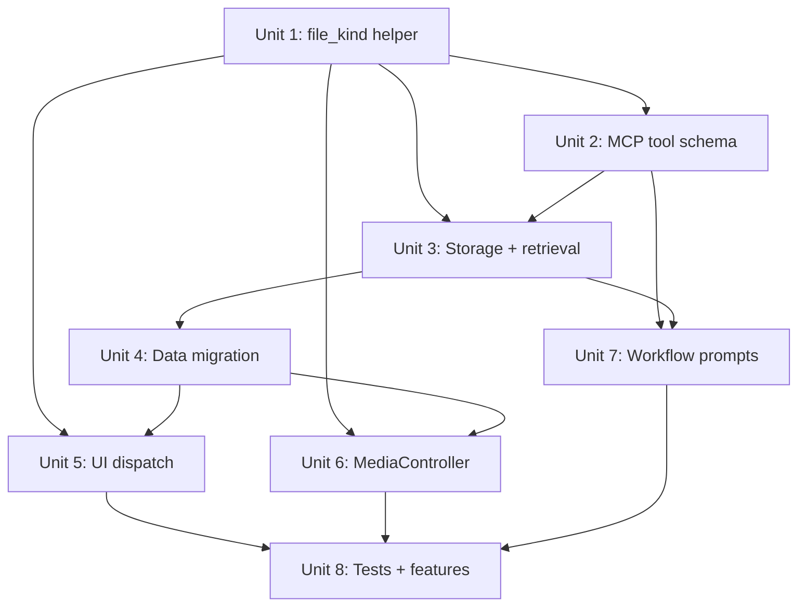

# refactor: Unify text_file and video_file into a single file type

## Overview

The `mcp__destila__session` `export` action currently accepts four `type` values:
`text`, `text_file`, `markdown`, and `video_file`. `text_file` and `video_file`
both carry a filesystem path; they differ only in how the UI renders the referenced
file. This plan collapses both path-bearing types into a single `file` type and
dispatches to the correct renderer (text viewer, markdown viewer, video player)
based solely on the file extension.

This mirrors the existing extension-based dispatch already implemented in
`lib/destila_web/live/workflow_runner_live.ex:420` (which opens the markdown modal
when a `text_file` has a `.md` extension) and extends the same pattern so the AI
tool surface stops carrying redundant type information.

## Problem Frame

- The AI has to choose between `text_file` and `video_file` before exporting, but
  that decision is already encoded in the file's extension. Asking the model to
  duplicate that signal adds no information and creates opportunities for
  mismatch (e.g. exporting a `.mp4` as `text_file`, or a `.txt` as `video_file`).
- The UI already ignores the declared type for at least one branch — a
  `text_file` with a `.md` extension is re-routed to the markdown modal at
  click time (`lib/destila_web/live/workflow_runner_live.ex:420`). The type
  field is therefore a partial lie: the authoritative answer is the extension.
- Every place that handles exported metadata enumerates the path-bearing types
  separately (`lib/destila_web/live/workflow_runner_live.ex:1050-1094`,
  `lib/destila_web/components/chat_components.ex:311`,
  `lib/destila/workflows.ex:12`). Adding a new file-backed renderer today
  requires a change in every one of those places and a new enum value.
- Collapsing to a single `file` type makes the boundary cleaner: the MCP tool
  declares "this value is a filesystem path"; the rendering layer decides how
  to display it.

## Requirements Trace

- R1. The MCP `mcp__destila__session` `export` action accepts exactly three
  `type` values: `text` (default), `markdown`, and `file`. `text_file` and
  `video_file` are removed from the tool schema, prompt descriptions, and
  internal validation.
- R2. When `type: "file"` is exported, the value is persisted as
  `%{"file" => path}` in `workflow_session_metadata.value`.
- R3. When rendering a `file` metadata entry, the system selects the renderer
  (text modal, markdown modal, inline video player + video modal) from the
  file extension alone.
- R4. Existing rows stored as `%{"text_file" => path}` or `%{"video_file" => path}`
  are converted to `%{"file" => path}` by a data migration so no code path
  needs to handle both shapes simultaneously.
- R5. Behavior in the UI is unchanged from a user's perspective: a video plays
  inline and opens in a modal; a `.md` file opens in the markdown modal; any
  other text file opens in the plain text modal.
- R6. Existing Gherkin scenarios continue to reflect observable user behavior,
  with terminology updated from `text_file` / `video_file` to
  `file (with a "<ext>" extension)` where the scenario previously named the
  internal type.

## Scope Boundaries

- No new file kinds beyond text, markdown, and video. This is a rename/merge
  refactor, not a capability expansion.
- No change to the set of supported video extensions. The existing
  `MediaController` only serves MP4 with a hardcoded `video/mp4` content
  type; that stays the same. Video detection therefore matches only `.mp4`.
- No change to inline `text` or `markdown` export behavior. Those types stay
  as-is and continue to hold inline content, not a path.
- No change to how metadata is queried by other sessions
  (`list_sessions_with_exported_metadata/1`) beyond updating the list of
  valid storage keys.
- No new UI affordances (e.g. file-kind icons per extension). The existing
  icons for video / markdown / text entries are reused via extension-based
  selection.
- No backward-compatibility shim for the `text_file` / `video_file` type
  strings in the MCP tool. The tool is closed-schema and workflow prompts
  already enumerate the allowed values; updating both in lockstep is safe.

## Context & Research

### Relevant Code and Patterns

- **MCP tool schema** — `lib/destila/ai/tools.ex:87-91` declares the `type`
  field and `lib/destila/ai/tools.ex:118-122` documents it in the
  `@session_details` prompt appendix. These are the authoritative surfaces
  the AI sees.
- **Valid types list** — `lib/destila/workflows.ex:12` defines
  `@valid_metadata_types` and `lib/destila/workflows.ex:17` exposes it via
  `valid_metadata_types/0`. This is the single source of truth consumed by
  both storage validation and export intake.
- **Export intake** — `lib/destila/ai/conversation.ex:127-147` extracts
  `type` from the MCP tool use, defaults to `"text"`, validates against
  `valid_metadata_types()`, and writes `%{type => value}` to storage.
- **Storage validation** — `lib/destila/workflows.ex:255-289` rejects
  exported values whose single key is not in `@valid_metadata_types` and
  rejects multi-key value maps.
- **Retrieval for cross-session use** —
  `lib/destila/workflows.ex:172-188`'s `extract_metadata_text/1` finds the
  first key from `@valid_metadata_types` and returns its value. This is
  consumed by the Brainstorm Idea → Implement General Prompt workflow
  chain.
- **UI dispatch — inline chat cards** —
  `lib/destila_web/components/chat_components.ex:294-332` branches on
  `export.type` to render `markdown_card`, `video_card`, or `plain_card`.
- **UI dispatch — sidebar entries** —
  `lib/destila_web/live/workflow_runner_live.ex:1046-1140` branches on
  `Map.has_key?(meta.value, ...)` to render video / markdown / text
  sidebar entries.
- **UI dispatch — modal handlers** —
  `lib/destila_web/live/workflow_runner_live.ex:382-449` implements
  `open_video_modal`, `open_markdown_modal`, and `open_text_modal`.
  `open_text_modal` already inspects `Path.extname(path) == ".md"` at
  lines 420-430 and redirects to the markdown modal when appropriate.
- **Streaming endpoint** —
  `lib/destila_web/controllers/media_controller.ex:8` reads the video
  path from `metadata.value["video_file"]` and hardcodes `video/mp4`.
- **Format helper** —
  `lib/destila_web/live/workflow_runner_live.ex:1368-1373` pattern-matches
  on `"text"`, `"markdown"`, `"text_file"`, `"video_file"` for the
  collapsible details view.
- **Workflow prompts referencing the type** —
  `lib/destila/workflows/implement_general_prompt_workflow.ex:122,131,141`
  instructs the AI to export the plan with `type: "text_file"` and reads
  it back via `get_in(["plan", "text_file"])`.
  `lib/destila/workflows/brainstorm_idea_workflow.ex:170-175` instructs the
  AI to export the generated prompt with `type: "markdown"` (no change
  needed there, but the surrounding guidance about valid types should be
  consistent).

### Institutional Learnings

- The existing pattern already established by the project is to decide
  rendering at extension-inspection time rather than at storage time
  (see the `.md` detection in `open_text_modal`,
  `lib/destila_web/live/workflow_runner_live.ex:420`, and the test that
  covers it at `test/destila_web/live/file_metadata_sidebar_live_test.exs:94-136`).
  This plan generalizes that convention rather than introducing a new idea.
- The typed-metadata history
  (`docs/plans/2026-04-08-feat-typed-metadata-exports-plan.md`,
  `docs/plans/2026-04-10-feat-text-and-markdown-file-sidebar-modals-plan.md`,
  `docs/plans/2026-04-13-feat-text-file-md-extension-markdown-viewer-plan.md`)
  shows the type key was always intended to be a lightweight dispatch tag,
  not a semantic classification of the file's contents. Collapsing it is
  consistent with that trajectory.
- Every prior plan added *one more* type key; this is the first plan to
  remove keys. The `@valid_metadata_types` list, `valid_exported_value?/1`,
  and `extract_metadata_text/1` were designed to be edited in lockstep, so
  the refactor stays shallow.

### External References

- None required. The change is entirely internal to the Destila codebase
  and uses Elixir/Phoenix primitives (`Path.extname/1`) that are already
  in use.

## Key Technical Decisions

- **Storage shape: `%{"file" => path}` replaces both path-bearing variants.**
  The current design encodes the type as the map's single key. Keeping that
  convention (one-key map, key is the type tag) minimizes changes to
  `valid_exported_value?/1`, `extract_metadata_text/1`, and the retrieval
  query path. Alternative considered: add a separate column or a
  `{path, kind}` tuple — rejected because it breaks the single-key
  invariant the rest of the codebase relies on and would require a schema
  change rather than a data rewrite.
- **Extension → kind resolution happens at render time, not at write time.**
  Deciding kind when storing would lock in a classification that could be
  wrong if the file is later replaced or if we ever extend the kind set.
  Resolving at render time matches the convention already established by
  the `.md`-in-`text_file` branch and means no re-processing is needed if
  the kind set changes.
- **`file_kind/1` lives as a helper in `Destila.Workflows` (or a new
  `Destila.Workflows.Metadata` module).** Both the web layer (sidebar +
  chat cards + modal handler) and the controller (`MediaController`) need
  the same classification. Co-locating it with the valid types list keeps
  one source of truth. Alternative considered: put it on the
  `SessionMetadata` schema — rejected because classification is derived
  from the value's path string, not from schema fields, and we want the
  web layer to call it without dragging the Ecto struct into pure helpers.
- **Video detection is `.mp4` only.** `MediaController` hardcodes
  `video/mp4` at `lib/destila_web/controllers/media_controller.ex:19,25`.
  Expanding to `.webm` / `.mov` would require MIME-type mapping and is
  outside the scope of this refactor. Any future expansion is a follow-up.
  This matches the current `:video_file` behavior exactly, so R5 (no
  user-visible change) is preserved.
- **Valid types after the refactor: `~w(text markdown file)`.** The list
  shrinks from four to three. `extract_metadata_text/1` keeps working by
  finding the first matching key in the stored value map.
- **Data migration rewrites existing rows in place.** Existing dev/prod
  rows that use `%{"text_file" => ...}` or `%{"video_file" => ...}` are
  rewritten to `%{"file" => ...}` in a single `Ecto.Migration` using the
  JSON `value` column. Alternative considered: handle both shapes at
  render time indefinitely — rejected because it would leave the dispatch
  code branching on two storage shapes forever and defeat the simplification
  goal.
- **Modal handler event names stay the same for now.**
  `open_video_modal` / `open_text_modal` / `open_markdown_modal` are
  template-level details already wired up through `phx-click`. Renaming
  them is a cosmetic follow-up; the refactor only changes what triggers
  each. Keeping the handler names reduces churn in templates and tests.
  (The dispatch logic that picks which event to fire moves from
  "inspect the type key" to "inspect the extension via `file_kind/1`".)
- **Workflow prompts that previously said `type: "text_file"` now say
  `type: "file"`.** `implement_general_prompt_workflow.ex` is the only
  prompt referencing a path-bearing type; it is updated in lockstep with
  the tool schema so the AI's instructions and the tool's accepted values
  stay consistent. The `get_in(["plan", "text_file"])` lookup in the same
  file is updated to `get_in(["plan", "file"])`.

## Open Questions

### Resolved During Planning

- **Q: Where should the extension→kind helper live?**
  A: In `Destila.Workflows` alongside `valid_metadata_types/0`, exposed as
  `file_kind(path_or_value)` returning `:text | :markdown | :video`. This
  keeps classification co-located with the type list and avoids a new
  module for a three-line helper.
- **Q: Should the migration also rewrite non-exported rows?**
  A: Yes. The `text_file` / `video_file` shape could, in principle, appear
  in non-exported metadata as well (since `upsert_metadata/5` does not
  validate non-exported values). Rewriting every row guarantees the
  codebase only ever sees `%{"file" => ...}` and avoids a permanent
  "legacy shape" branch in the format helper.
- **Q: Do we keep a fallback in `format_metadata_value/1` for the old
  shapes?**
  A: No. Because the migration runs before the code is deployed, there is
  no window where the UI would see the old shape. The catch-all
  `is_map(value) -> Jason.encode!` branch at
  `lib/destila_web/live/workflow_runner_live.ex:1372` already handles
  anything unexpected.
- **Q: What about in-flight AI responses that use the old type strings?**
  A: The tool schema is the boundary: the `type` field description now
  only lists `text`, `markdown`, `file`, and the conversation extractor
  rejects any value not in `valid_metadata_types()` (so `text_file` /
  `video_file` from an old cached response would be silently dropped
  rather than stored in the old shape). The ClaudeCode session state in
  `lib/destila/ai/claude_session.ex` isn't persisted across deploys in a
  way that would replay stale tool instructions, so this is bounded to a
  single in-flight response at most.

### Deferred to Implementation

- Exact function signature and placement of `file_kind/1` (module
  location is decided; naming details such as whether to accept a path
  string or a value map are deferred to the implementing change).
- Whether `extract_metadata_text/1` needs any shape change beyond
  updating `@valid_metadata_types`. Expect no change, but confirm when
  touching the module.
- Whether `format_metadata_value/1` collapses
  `%{"text_file" => _}` / `%{"video_file" => _}` into a single
  `%{"file" => _}` clause cleanly or if the head order needs adjustment.
  Mechanical.

## High-Level Technical Design

> *This illustrates the intended approach and is directional guidance for review, not implementation specification. The implementing agent should treat it as context, not code to reproduce.*

```text
                           AI exports metadata
                                   |
                                   v
                MCP tool: mcp__destila__session (export)
                type ∈ { text, markdown, file }
                                   |
                                   v
               conversation.ex extracts {key, value, type}
                                   |
                                   v
               upsert_metadata → %{type => value}  (Ecto JSON)
                                   |
    ---------------------------------------------------------
    |                              |                          |
    v                              v                          v
 "text" key                   "markdown" key              "file" key
 (inline string)              (inline string)             (path string)
    |                              |                          |
    v                              v                          v
 plain_card /                 markdown_card /            file_kind(path)
 text_modal                   markdown_modal                  |
                                                  -------------------------
                                                  |          |            |
                                                  v          v            v
                                               :markdown   :video       :text
                                                  |          |            |
                                                  v          v            v
                                            markdown_modal video_card   text_modal
                                                         + video_modal
```

Key boundary: everything to the left of `file_kind/1` handles opaque strings.
Everything to the right inspects the extension to decide rendering. The box
labeled `file_kind(path)` is the only place in the codebase that encodes the
extension→kind mapping; every UI consumer calls it rather than pattern-matching
on extensions directly.

## Implementation Units



- [ ] **Unit 1: Introduce `file_kind/1` and refactor `@valid_metadata_types`**

**Goal:** Centralize the extension→kind mapping and shrink the valid type
list to `~w(text markdown file)`.

**Requirements:** R1, R3

**Dependencies:** None.

**Files:**
- Modify: `lib/destila/workflows.ex`
- Test: `test/destila/workflows_metadata_test.exs`

**Approach:**
- Replace `@valid_metadata_types` with `~w(text markdown file)`.
- Add a public `file_kind/1` that accepts a path string and returns one of
  `:text | :markdown | :video`. Mapping:
  - `.md`, `.markdown` → `:markdown`
  - `.mp4` → `:video`
  - anything else → `:text`
  - extension comparison is case-insensitive
     (`Path.extname/1 |> String.downcase/1`).
- Confirm `extract_metadata_text/1` still works; it reads from the value
  map using `value[type]` for each type in `@valid_metadata_types`, and
  after the migration every file-backed row is stored as
  `%{"file" => path}`, so iterating over the shrunk list is still correct.
- Keep `valid_exported_value?/1` logic as-is; only the set it checks
  membership against changes.

**Patterns to follow:**
- Module-level constant + public accessor, mirroring the existing
  `valid_metadata_types/0` shape.
- Pure function, no IO, no schema dependency.

**Test scenarios:**
- Happy path: `Workflows.file_kind("plan.md")` returns `:markdown`.
- Happy path: `Workflows.file_kind("/tmp/demo.mp4")` returns `:video`.
- Happy path: `Workflows.file_kind("/tmp/build.log")` returns `:text`.
- Edge case: extensionless paths (`"Makefile"`) return `:text`.
- Edge case: uppercase extensions (`"README.MD"`, `"CLIP.MP4"`) return
  `:markdown` / `:video` respectively.
- Edge case: `.markdown` extension returns `:markdown`.
- Happy path: `Workflows.valid_metadata_types()` returns
  `~w(text markdown file)` exactly.
- Edge case: `valid_exported_value?(%{"file" => "/tmp/x.mp4"})` returns
  `true`; `valid_exported_value?(%{"text_file" => "/tmp/x.txt"})` returns
  `false` (the old key is no longer valid).

**Verification:**
- `mix test test/destila/workflows_metadata_test.exs` passes.
- `iex -S mix` allows calling `Destila.Workflows.file_kind("foo.md")`
  without raising.

- [ ] **Unit 2: Update MCP tool schema and prompt appendix**

**Goal:** The AI sees exactly three valid `type` values: `text`,
`markdown`, `file`.

**Requirements:** R1

**Dependencies:** Unit 1 (valid types list must have been shrunk so the
prompt and schema stay consistent).

**Files:**
- Modify: `lib/destila/ai/tools.ex`

**Approach:**
- Update the `field(:type, ...)` description at
  `lib/destila/ai/tools.ex:87-91` to enumerate only `text` (default),
  `markdown`, `file`.
- Update `@session_details` at
  `lib/destila/ai/tools.ex:118-122` so the exporting-data section lists
  `text` (default), `markdown` (markdown content), and `file` (absolute
  path to a file; rendering is chosen by extension — `.md`/`.markdown`
  viewed as markdown, `.mp4` played as video, anything else treated as
  text).
- No code changes to `execute/1`; it still returns `"Action recorded."`.

**Patterns to follow:**
- Keep the description phrasing consistent with adjacent fields
  (`field(:key, ...)`, `field(:value, ...)`).

**Test scenarios:**
- Test expectation: none — the tool schema is exercised end-to-end via
  conversation/response-processor tests in later units. Direct unit
  testing of the DSL output adds no value beyond duplicating the source.

**Verification:**
- `rg '"text_file"|"video_file"' lib/destila/ai/tools.ex` returns no matches.
- `mix compile --warnings-as-errors` succeeds.

- [ ] **Unit 3: Update export intake in `conversation.ex`**

**Goal:** The conversation extractor stores path-bearing exports under the
`"file"` key.

**Requirements:** R2

**Dependencies:** Unit 1, Unit 2.

**Files:**
- Modify: `lib/destila/ai/conversation.ex`
- Test: `test/destila/workflows_metadata_test.exs` (validates that the
  storage path accepts `%{"file" => _}`)

**Approach:**
- No structural change needed at
  `lib/destila/ai/conversation.ex:135-145`: the `for` comprehension
  already defaults `type = type || "text"`, filters by
  `type in valid_types`, and builds `%{type => value}`. Because Unit 1
  shrinks `valid_types` to `~w(text markdown file)`, any `text_file` /
  `video_file` value from a stale response is silently dropped, which
  is the desired behavior.
- Confirm no other export-extraction site exists by searching for
  `extract_export_actions` usages.

**Patterns to follow:**
- Silent filtering of invalid types, as documented in
  `docs/plans/2026-04-08-feat-typed-metadata-exports-plan.md`.

**Test scenarios:**
- Happy path: a tool use with `type: "file"` and
  `value: "/tmp/demo.mp4"` produces a stored metadata row with
  `value == %{"file" => "/tmp/demo.mp4"}` and `exported == true`.
- Error path: a tool use with `type: "text_file"` (the old value) is
  silently dropped — no metadata row is created, no error is raised.
- Integration: a response containing `type: "markdown"` still stores
  `%{"markdown" => ...}` correctly (regression check).

**Verification:**
- Existing conversation-layer tests still pass.
- The new scenarios above are covered in
  `test/destila/workflows_metadata_test.exs` or the
  `ResponseProcessor` test file, whichever aligns with existing
  conventions in the repo.

- [ ] **Unit 4: Data migration — rewrite `text_file` / `video_file` to `file`**

**Goal:** Every row in `workflow_session_metadata` whose value map has a
single key of `text_file` or `video_file` is rewritten to use the `file`
key, preserving the path value.

**Requirements:** R4

**Dependencies:** Unit 3 (so that any freshly-written data after the
migration uses the new shape).

**Files:**
- Create: `priv/repo/migrations/20260420000000_rename_file_metadata_keys.exs`
- Test: covered by manual verification + a smoke test that exports read
  correctly post-migration (no dedicated migration test needed in this
  codebase's style — see
  `priv/repo/migrations/20260403000000_add_exported_to_session_metadata.exs`
  which ships with no matching test).

**Approach:**
- `use Ecto.Migration` with `def change`.
- The `value` column is stored as JSON/map. Run a single
  `execute/1` with an `UPDATE` that renames the key. Two strategies:
  - SQLite JSON function (`json_set`, `json_remove`) if SQLite is the
    target — check `config/dev.exs` to confirm adapter before choosing.
  - Alternatively, use `Destila.Repo.all/1` + `Repo.update_all/2` in
    small batches inside the migration via `flush/0` if raw SQL gets
    awkward.
- The rewrite only touches rows where the value map has exactly the key
  `text_file` or `video_file`. Multi-key maps (which should only exist
  in non-exported, internal metadata) are left alone, matching the
  existing invariant enforced by `valid_exported_value?/1`.
- Provide an `up/0` migration; `down/0` can reverse by detecting
  extension (`.mp4` → `video_file`, else `text_file`) for the sake of
  completeness, or be omitted if the project convention is one-way
  refactors. Check a recent one-way migration for precedent:
  `priv/repo/migrations/20260406150010_convert_phase_execution_status_to_enum.exs`.

**Patterns to follow:**
- `priv/repo/migrations/20260403000000_add_exported_to_session_metadata.exs`
  for the top-level `use Ecto.Migration` + `def change` shape.
- Any prior migration that uses `execute/1` for a data rewrite, if one
  exists (search `priv/repo/migrations/` for `execute(`).

**Test scenarios:**
- Test expectation: none — migration correctness is covered by running
  the migration against a seeded database and asserting the integration
  test in Unit 8 still loads the post-migration data. Ecto migrations in
  this project do not ship with per-migration tests.

**Verification:**
- After `mix ecto.migrate`, any preexisting row of the shape
  `%{"text_file" => "/tmp/x.txt"}` becomes `%{"file" => "/tmp/x.txt"}`;
  `%{"video_file" => "/tmp/x.mp4"}` becomes `%{"file" => "/tmp/x.mp4"}`.
- `mix ecto.rollback` (if `down/0` is provided) returns rows to their
  original shape based on extension.
- No non-`file` rows are disturbed.

- [ ] **Unit 5: Update UI dispatch (sidebar entries, chat cards, modal handler)**

**Goal:** Every UI branch that used to inspect `Map.has_key?(meta.value, "text_file")`
or `"video_file"` now inspects the `"file"` key and calls `file_kind/1` to
pick the correct renderer.

**Requirements:** R3, R5

**Dependencies:** Unit 1 (`file_kind/1` must exist), Unit 4 (storage
shape is uniform).

**Files:**
- Modify: `lib/destila_web/live/workflow_runner_live.ex`
- Modify: `lib/destila_web/components/chat_components.ex`

**Approach:**
- **Sidebar entries (`workflow_runner_live.ex:1046-1140`):**
  Replace the three `Map.has_key?(meta.value, "<type_key>")` branches with:
  - one branch that matches `%{"file" => path}` and switches on
    `Workflows.file_kind(path)` to pick the icon (video / markdown / text)
    and the `phx-click` event (`open_video_modal` / `open_markdown_modal` /
    `open_text_modal`);
  - keep the existing `%{"markdown" => _}` branch (inline markdown content,
    no path) unchanged;
  - keep the fallback `<details>` branch unchanged for non-typed metadata.
- **Inline chat cards (`chat_components.ex:294-332`):**
  Replace the `export.type == "video_file"` clause with an
  `export.type == "file"` clause that picks the card by
  `Workflows.file_kind(export.value)`:
  - `:video` → `video_card` (existing component, unchanged)
  - `:markdown` → `markdown_card` showing either a rendered view backed by
    the file's contents, or (to minimize scope) simply routing to the
    existing `plain_card` with the path — match the current behavior, where
    the inline card for a `text_file` today is the `plain_card` showing the
    path. The sidebar, not the chat card, is where file contents are
    actually rendered.
  - `:text` → `plain_card` (existing)
- **Modal handler (`workflow_runner_live.ex:413-442`):**
  `open_text_modal` (and the existing `.md` redirect block) is replaced by
  a single handler that matches `%{"file" => path}`, computes
  `Workflows.file_kind(path)`, and dispatches:
  - `:markdown` → read the file and assign `markdown_modal_content/label`
    (as today's `.md` branch does);
  - `:text` → read the file and assign `text_modal_content/label` (as
    today's non-`.md` branch does);
  - `:video` → assign `video_modal_meta_id = meta.id` (equivalent to
    today's `open_video_modal` handler, which is also kept so template
    `phx-click="open_video_modal"` still works).
  The inline `text` case (`%{"text" => content}`) is retained.
- **Format helper (`workflow_runner_live.ex:1368-1373`):**
  Replace the two path-bearing clauses with a single
  `format_metadata_value(%{"file" => path}) when is_binary(path), do: path`.

**Patterns to follow:**
- Existing branching style in `chat_components.ex:294-332`
  (`cond do ... end`).
- Existing `on_click` + modal-assign pattern from current
  `open_video_modal` / `open_markdown_modal` / `open_text_modal` handlers.

**Test scenarios:**
- Happy path (sidebar): a metadata row `%{"file" => "/tmp/x.mp4"}` renders
  a button with `phx-click="open_video_modal"` and the film icon.
- Happy path (sidebar): `%{"file" => "/tmp/plan.md"}` renders a button
  with `phx-click="open_markdown_modal"` and the document icon.
- Happy path (sidebar): `%{"file" => "/tmp/build.log"}` renders a button
  with `phx-click="open_text_modal"` and the document icon.
- Happy path (chat card): an export with `type: "file"` and value
  `"/tmp/demo.mp4"` renders the `video_card` inline.
- Happy path (modal): clicking the sidebar button for a `.md` file opens
  `#markdown-modal`, not `#text-modal`.
- Happy path (modal): clicking the sidebar button for a `.log` file
  opens `#text-modal` and reads the file content into it.
- Edge case (modal): an uppercase extension (`.MD`, `.MP4`) is treated
  the same as lowercase.
- Error path (modal): if `File.read/1` returns `{:error, _}` for a text
  or markdown file, the existing `put_flash(:error, ...)` fallback still
  fires (no regression).
- Integration: the existing inline `text` and `markdown` (no file) code
  paths still render their expected cards and modals.

**Verification:**
- `mix test test/destila_web/live/video_metadata_viewing_live_test.exs` passes.
- `mix test test/destila_web/live/file_metadata_sidebar_live_test.exs` passes.
- `mix test test/destila_web/live/markdown_metadata_viewing_live_test.exs` passes.
- Manual: loading a session with a pre-migration `video_file` row now
  renders the video card and the sidebar play button just as before.

- [ ] **Unit 6: Update `MediaController` to read from the `file` key**

**Goal:** Video streaming reads `metadata.value["file"]` instead of
`metadata.value["video_file"]`.

**Requirements:** R5

**Dependencies:** Unit 4 (so that no row still uses `video_file`).

**Files:**
- Modify: `lib/destila_web/controllers/media_controller.ex`
- Test: `test/destila_web/controllers/media_controller_test.exs`

**Approach:**
- Change `metadata.value["video_file"]` at line 8 to
  `metadata.value["file"]`.
- Leave the hardcoded `video/mp4` response headers as-is (scope per Key
  Technical Decisions).
- Consider (optional but low-cost) raising a clearer error when the
  requested metadata id points to a non-`.mp4` file, using
  `Workflows.file_kind(path)` — but only if doing so is a one-line
  guard. If adding friction, skip and rely on the browser treating a
  non-MP4 stream as unplayable (matches current behavior for corrupted
  files).

**Patterns to follow:**
- Existing single-function controller style in the file; no new
  dependencies.

**Test scenarios:**
- Happy path: a full `GET /media/:id` request for a metadata row stored
  as `%{"file" => "/tmp/x.mp4"}` returns 200 with `content-type:
  video/mp4` and the file bytes (update the existing test's stored
  shape to `%{"file" => path}`).
- Happy path: a `Range: bytes=0-99` request still returns 206 with
  `content-range: bytes 0-99/<size>`.
- Edge case: a `Range: bytes=100-` open-ended range still returns 206
  with the correct `content-range`.
- Error path (optional): a request for a metadata id whose value is
  `%{"text" => ...}` (no file path) raises the same error as today — no
  silent behavior change.

**Verification:**
- `mix test test/destila_web/controllers/media_controller_test.exs` passes.

- [ ] **Unit 7: Update workflow prompts that mention `text_file`**

**Goal:** Workflow prompt strings that instruct the AI to export the plan
stop using the `text_file` type name and use `file` instead. Internal
lookups of the stored value read from the `file` key.

**Requirements:** R1, R5

**Dependencies:** Unit 2 (the MCP tool schema must already accept `file`).

**Files:**
- Modify: `lib/destila/workflows/implement_general_prompt_workflow.ex`

**Approach:**
- Lines 122 and 141: change `type: "text_file"` to `type: "file"` in the
  instruction strings.
- Line 131: change `get_in(["plan", "text_file"])` to
  `get_in(["plan", "file"])`.
- No other prompt mentions a path-bearing type
  (`lib/destila/workflows/brainstorm_idea_workflow.ex:170` uses
  `type: "markdown"` — unchanged).

**Patterns to follow:**
- Existing prompt-string formatting and quoting style in the same file.

**Test scenarios:**
- Test expectation: none — these are instruction strings consumed by the
  AI at runtime. Their correctness is covered by the fact that the MCP
  tool schema (Unit 2) accepts the same type string they instruct.

**Verification:**
- `rg -n '"text_file"|"video_file"' lib/` returns no matches.
- Smoke test: running the Implement General Prompt workflow end-to-end
  in a dev session writes a metadata row with value
  `%{"file" => "<path>"}` and subsequent phases read the plan path
  back successfully.

- [ ] **Unit 8: Update tests and Gherkin feature files**

**Goal:** Every test and feature file that previously asserted on
`text_file` / `video_file` uses `file` (plus the appropriate file
extension) instead, without regressing scenario intent.

**Requirements:** R6

**Dependencies:** Units 1-7 (so the code under test exists in its new
shape).

**Files:**
- Modify: `test/destila/workflows_metadata_test.exs`
- Modify: `test/destila_web/live/file_metadata_sidebar_live_test.exs`
- Modify: `test/destila_web/live/video_metadata_viewing_live_test.exs`
- Modify: `test/destila_web/controllers/media_controller_test.exs`
- Modify: `features/exported_metadata.feature`
- Modify: `features/video_metadata_viewing.feature`

**Approach:**
- **Unit + LV tests:** Replace stored values like
  `%{"text_file" => path}` and `%{"video_file" => path}` with
  `%{"file" => path}`. Where tests iterate over the valid types list
  (`for type <- ~w(text text_file markdown video_file)` in
  `workflows_metadata_test.exs:192`), update to
  `~w(text markdown file)` and adjust the value construction.
- Add new unit tests for `Workflows.file_kind/1` covering the scenarios
  from Unit 1.
- **Video test fixture:**
  `video_metadata_viewing_live_test.exs:47-54` currently emits
  `"type" => "video_file"` inside the simulated `mcp_tool_uses` payload.
  Update that to `"type" => "file"` and the stored metadata map to
  `%{"file" => path}`.
- **`.md` redirect test:** the scenario at
  `file_metadata_sidebar_live_test.exs:94-136` is now the primary test
  for "a `file` with `.md` extension opens the markdown modal". Keep the
  describe block; update the stored-value shape from
  `%{"text_file" => path}` to `%{"file" => path}`.
- **Feature files:**
  - `features/exported_metadata.feature:59-92,103-114`: wherever the
    scenario says `type "text_file"` or `type "video_file"`, rephrase to
    `type "file" with a "<ext>" extension` (e.g., `.txt`, `.mp4`, `.md`).
    The scenario at lines 110-114 already uses this phrasing and is a
    template for the others.
  - `features/video_metadata_viewing.feature:7-8,31-32`: replace
    `"exported video_file metadata"` with
    `"exported file metadata pointing to an .mp4 file"`.

**Patterns to follow:**
- Existing `@tag feature:`/`scenario:` annotations continue to link
  each test to its Gherkin scenario. When rewording a scenario, update
  the matching `@tag scenario: "..."` string in lockstep.
- Gherkin style already established in `features/exported_metadata.feature`.

**Test scenarios:**
- Happy path (meta): `mix test --only feature:exported_metadata` runs
  the full exported-metadata suite with zero failures.
- Happy path (meta): `mix test --only feature:video_metadata_viewing`
  runs the video suite with zero failures.
- Edge case: the `.md`-extension scenario
  (`features/exported_metadata.feature:110-114`) still passes and its
  linked test
  (`test/destila_web/live/file_metadata_sidebar_live_test.exs:122-135`)
  still asserts on `#markdown-modal`.

**Verification:**
- `mix test` passes with no regressions.
- `rg -n '"text_file"|"video_file"' test/ features/` returns no matches.
- `mix precommit` passes.

## System-Wide Impact

- **Interaction graph:** The change touches three dispatch points — the
  MCP tool surface (AI → server), the storage shape in
  `workflow_session_metadata.value`, and the UI render/handler layer. All
  three must move in lockstep because the store's single-key invariant
  means a half-migrated system would produce runtime mismatches in
  `valid_exported_value?/1` and `extract_metadata_text/1`.
- **Error propagation:** Existing failure modes are preserved:
  `upsert_metadata/5` still returns `{:error, :invalid_metadata_type}`
  for disallowed shapes; the conversation extractor still silently drops
  invalid types; `open_text_modal` still puts a flash error on
  `File.read/1` failure; `MediaController.show/2` still raises
  `File.stat!/1` / `File.Error` on missing files. No new error paths
  are introduced.
- **State lifecycle risks:**
  - Data migration must run before the new application code starts, or
    the UI will fail to find `"file"` keys on pre-migration rows.
    Standard for this project (migrations run as part of deploy).
  - Rows stored as `%{"text_file" => ...}` or `%{"video_file" => ...}`
    by older code paths between migration and deploy are not expected
    because the migration runs inside the same release; no additional
    guard is needed.
- **API surface parity:** The MCP tool is the only external API affected.
  It is consumed by the AI only, inside this app's own workflows; there
  are no external clients calling `mcp__destila__session` from outside
  the system. No versioning shim is needed.
- **Integration coverage:** The Brainstorm Idea → Implement General
  Prompt session-chaining path (`list_sessions_with_exported_metadata/1`)
  reads exported metadata from a prior session and uses it as input.
  `extract_metadata_text/1` will keep returning the stored path string
  when it encounters `%{"file" => path}`, matching its previous behavior
  with `%{"text_file" => path}`. Confirm with a test that the chain
  still surfaces pre-migration data correctly after the migration runs.
- **Unchanged invariants:**
  - `value` in `workflow_session_metadata` remains a single-key map for
    exported rows; the key name set is what shrinks.
  - Inline `text` and `markdown` types keep their current behavior, key
    names, and rendering.
  - Video streaming endpoint, URL shape (`/media/:id`), and MP4 content-
    type response stay the same.
  - Modal event names (`open_video_modal`, `open_markdown_modal`,
    `open_text_modal`) stay the same.

## Risks & Dependencies

| Risk | Mitigation |
|------|------------|
| Partial deploy: new code ships before migration runs, so `"file"`-keyed rows don't exist yet and the UI looks empty for existing metadata. | Standard release order: migrations run before application boot. Add a note to the PR description confirming migration order. |
| Stale AI response in flight at deploy time re-uses `text_file` / `video_file` type strings. | The conversation extractor silently drops invalid types (existing behavior). The user will see the AI's response text without the export card; worst case is a missed export that the AI can re-emit on the next turn. No data corruption. |
| Gherkin scenarios updated but tests or tags drift out of sync, breaking `mix test --only scenario:...`. | Unit 8 explicitly updates tests and features together. The `feature:` / `scenario:` tag audit step at the end of that unit catches drift. |
| Extension detection misses videos (e.g., `.webm`) users already rely on. | Current `MediaController` only supports `.mp4`; `.webm` etc. are not part of the existing supported surface. No regression. Follow-up plan can extend kinds once a real need appears. |
| Data migration corrupts non-exported metadata rows that happen to share the `text_file` / `video_file` key name. | Migration only touches rows whose value map has exactly one key equal to `text_file` or `video_file` (the same invariant `valid_exported_value?/1` enforces for exported rows). Multi-key maps are untouched. |

## Documentation / Operational Notes

- Update inline `CLAUDE.md`-level documentation if any agent-facing doc
  lists the four old types. Search the repo for `text_file` /
  `video_file` in `.md` files before merging.
- No rollout flag needed; this is an atomic, non-breaking-from-the-user-
  perspective refactor gated on migration order.
- No monitoring changes; exported metadata already has no telemetry.

## Sources & References

- MCP tool schema: `lib/destila/ai/tools.ex:60-122`
- Valid types + retrieval: `lib/destila/workflows.ex:12-188`
- Storage validation: `lib/destila/workflows.ex:250-289`
- Export intake: `lib/destila/ai/conversation.ex:127-147`
- UI dispatch (sidebar): `lib/destila_web/live/workflow_runner_live.ex:1046-1140`
- UI dispatch (chat cards): `lib/destila_web/components/chat_components.ex:289-332`
- UI dispatch (modal handlers): `lib/destila_web/live/workflow_runner_live.ex:382-449`
- Format helper: `lib/destila_web/live/workflow_runner_live.ex:1348-1373`
- Streaming endpoint: `lib/destila_web/controllers/media_controller.ex`
- Workflow prompt with old type: `lib/destila/workflows/implement_general_prompt_workflow.ex:105-147`
- Related feature files:
  `features/exported_metadata.feature`,
  `features/video_metadata_viewing.feature`,
  `features/markdown_metadata_viewing.feature`
- Related tests:
  `test/destila/workflows_metadata_test.exs`,
  `test/destila_web/live/file_metadata_sidebar_live_test.exs`,
  `test/destila_web/live/video_metadata_viewing_live_test.exs`,
  `test/destila_web/live/markdown_metadata_viewing_live_test.exs`,
  `test/destila_web/controllers/media_controller_test.exs`
- Historical plans:
  `docs/plans/2026-04-08-feat-typed-metadata-exports-plan.md`,
  `docs/plans/2026-04-09-feat-video-metadata-playback-plan.md`,
  `docs/plans/2026-04-10-feat-text-and-markdown-file-sidebar-modals-plan.md`,
  `docs/plans/2026-04-13-feat-text-file-md-extension-markdown-viewer-plan.md`
