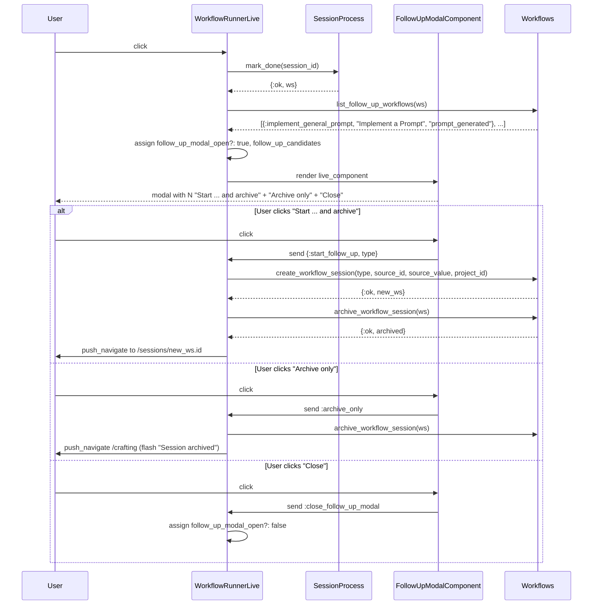

# feat: Post-Completion Follow-Up Modal

## Overview

When a user clicks "Mark as Done" on a workflow session in
`DestilaWeb.WorkflowRunnerLive`, open a modal immediately that offers any
*compatible* follow-up workflows. A workflow is compatible when its
`source_metadata_key/0` matches a key in the just-completed session's exported
metadata. The modal always offers "Archive only" and "Close"; when
compatibilities exist, it additionally offers one "Start … and archive" button
per candidate workflow.

Starting a follow-up auto-creates the new session (pre-populated from the
source's exported metadata value — no user prompt), archives the current
session, and navigates to the new one. The existing header `archive-btn` stays
exactly as it is today.

## Problem Frame

Today, when a user finishes a `brainstorm_idea` session, they see the
completion banner and must manually navigate to a new `implement_general_prompt`
session, copy-paste the generated prompt, and select the source session. The
`source_metadata_key` wiring already exists (brainstorm exports
`prompt_generated` and implement declares `source_metadata_key == "prompt_generated"`),
so the data flow is there — only the UX handoff is missing. This plan closes
that loop for any registered workflow pairing, not just brainstorm → implement.

## Requirements Trace

- R1. Clicking `#mark-done-btn` marks the session done **and** opens the modal
  synchronously after `SessionProcess.mark_done/1` succeeds.
- R2. The modal lists all workflow types whose `source_metadata_key/0` matches
  a key present in the current session's exported metadata, ordered by registry
  (`@workflow_modules`) insertion order, each rendered as a "Start *Label* and
  archive" button.
- R3. The modal always shows "Archive only" and "Close" buttons, even when the
  compatible list is empty.
- R4. "Start … and archive" creates a new session wired to the current session
  as `source_session_id`, pre-populated with the exported metadata value, then
  archives the current session, then navigates to the new one.
- R5. The user is never prompted for free-text input on the follow-up path.
- R6. "Archive only" archives the current session (reusing
  `archive_workflow_session/1`) and redirects to `/crafting`.
- R7. "Close" dismisses the modal; the session remains done but not archived;
  no new session is created.
- R8. If `create_workflow_session/1` fails during the follow-up path, the old
  session is **not** archived, remains only in its `done_at` state, and a
  flash error is shown.
- R9. The existing `#archive-btn`, its confirmation, and the "Workflow complete"
  banner are untouched and remain independently usable.
- R10. Add Gherkin scenarios in `features/post_completion_followup.feature`
  and LiveView tests for all 7 scenarios, tagged appropriately.

## Scope Boundaries

- **In scope:** modal UI + trigger logic, `Workflows.list_follow_up_workflows/1`,
  reusing `create_workflow_session/1` / `archive_workflow_session/1` as-is,
  tests, new feature file.
- **Out of scope:** changing `create_workflow_session/1`'s signature,
  changing `archive_workflow_session/1` or its `ClaudeSession.stop` /
  `ServiceManager.cleanup` side effects, changing the existing Archive button
  or its confirmation, adding new PubSub broadcasts, adding suppression flags
  for existing broadcasts, changing `source_metadata_key/0` semantics, adding
  new workflow types.
- **Non-goal:** cross-project follow-ups — the new session inherits the source
  session's `project_id` unchanged.

## Context & Research

### Relevant Code and Patterns

- `lib/destila/workflows.ex`
  - `@workflow_modules` (line 35) — the registry whose **insertion order**
    drives R2.
  - `create_workflow_session/1` (line 134) — already accepts
    `selected_session_id` and `input_text`, already sets
    `source_session_id`, already skips title generation when
    `selected_session_id` is present, already inherits the source's title,
    and already starts the `SessionProcess`. Reuse as-is.
  - `archive_workflow_session/1` (line 250) — already does the right thing
    (kills service, stops `ClaudeSession`, marks `archived_at`, broadcasts).
    Reuse as-is.
  - `get_exported_metadata/1` (line 339) — returns the session's exported
    `SessionMetadata` rows. The modal's compatibility check uses this.
- `lib/destila/workflows/workflow.ex` — the `source_metadata_key/0` callback
  (line 54); `nil` means the workflow has no source dependency and is never
  compatible.
- `lib/destila/workflows/implement_general_prompt_workflow.ex:100` — the one
  concrete non-nil `source_metadata_key` today (`"prompt_generated"`).
- `lib/destila/workflows/brainstorm_idea_workflow.ex:175` — shows where
  `prompt_generated` is exported as `type: "markdown"`; used as the golden-path
  test fixture (brainstorm → implement).
- `lib/destila_web/live/workflow_runner_live.ex`
  - `handle_event("mark_done", …)` (line 168) — trigger point. After the
    `SessionProcess.mark_done/1` success, eagerly compute candidates and flip
    an "open" flag.
  - `handle_event("archive_session", …)` (line 107) — the existing Archive
    button handler; the modal's "Archive only" button reuses this exact code
    path (not the event name — the modal is a LiveComponent, so it will
    `send`/`handle_info` its own archive request back to the parent, which
    then delegates to the same code).
  - Existing inline modals (video/markdown/text) at lines 1180–1263 — shared
    Tailwind modal chrome pattern (`fixed inset-0 z-50`, backdrop
    `bg-black/70 backdrop-blur-sm`, `hero-x-mark` close). Follow this
    visual style in the new LiveComponent's template.
- `lib/destila_web/live/project_form_live.ex` — the canonical `use
  DestilaWeb, :live_component` pattern in this project, including the
  `send(self(), {…})` callback back to the parent LiveView
  (`ProjectFormLive` line 55: `send(self(), {:project_saved, project})`).
  The follow-up modal should mirror this shape.
- `lib/destila_web/live/projects_live.ex:229` — canonical
  `<.live_component module={…} id={…} …>` invocation.
- `lib/destila/sessions/session_process.ex` — each session has its **own**
  registered process; `ensure_started/1` is called during
  `create_workflow_session/1`. No race with the source session's
  `SessionProcess` (idles in `:done` until timeout; archiving does not kill it
  — it only stops `ClaudeSession` and cleans up the service).
- `lib/destila_web/live/workflow_runner_live.ex:1168` — the "Workflow
  complete" banner; stays unchanged.

### Institutional Learnings

No directly matching `docs/solutions/` entries were found for the follow-up
handoff, but relevant adjacent plans to mirror:

- `docs/plans/2026-03-24-feat-archive-workflow-sessions-plan.md` — established
  the `archive_workflow_session/1` lifecycle, including that archiving stops
  the attached Claude session and cleans up services. Follow-up flow inherits
  that behavior.
- `docs/plans/2026-03-28-feat-implement-general-prompt-workflow-plan.md` —
  introduced the `source_metadata_key` concept and the
  brainstorm → implement pairing. This plan generalizes that handoff from a
  static form-picker into a post-completion modal.
- `docs/plans/2026-04-03-feat-exported-metadata-sidebar-plan.md` — the
  exported-metadata schema the compatibility lookup walks.

### External References

External research was skipped intentionally: this is an in-repo wiring change
following well-established local patterns (`LiveComponent`, `live_component`,
`send(self(), …)` parent callbacks, inline Tailwind modals, `mix precommit`
test runner). Three or more direct local examples exist for every moving part.

## Key Technical Decisions

- **Modal lives in its own `Phoenix.LiveComponent`**
  (`DestilaWeb.FollowUpModalComponent`). The user prompt mandates this.
  Benefits: self-contained markup + event handling; keeps
  `WorkflowRunnerLive`'s already-large render function from growing; mirrors
  the existing `ProjectFormLive` LiveComponent pattern. The component handles
  its own `close_follow_up_modal`, `start_follow_up`, and `archive_only`
  events, and `send`s messages (`:close_follow_up_modal`,
  `{:start_follow_up, workflow_type}`, `:archive_only`) to the parent
  LiveView, which owns the business operations (archive, create, navigate).

- **Compatibility lookup is a new `Workflows.list_follow_up_workflows/1`.**
  Signature: `(session) :: [{workflow_type, label, source_metadata_key}]`,
  ordered by the **registry insertion order** of `@workflow_modules`.
  Rationale: keeps the registry-order rule in one place, is trivially unit-
  testable without a LiveView, and returns a 3-tuple so the template can
  render the label and `phx-value-workflow_type` without round-tripping the
  workflow module.

  *Ordering note on `@workflow_modules`:* the module uses a plain map literal
  with 3 small keys. In practice Elixir's small-map implementation preserves
  insertion order for maps this size, and our tests pin the order, but the
  contract we need is "whatever order `Map.to_list(@workflow_modules)`
  yields". If a future workflow addition ever changes the iteration order,
  tests pinning the order will catch it, and the canonical fix is to switch
  the registry to a list. This is explicitly **not** solved in this plan — we
  simply iterate `@workflow_modules` as given and document the assumption
  under Risks.

- **Reuse `create_workflow_session/1` and `archive_workflow_session/1`
  untouched.** The signature already accepts everything we need; adding a
  new arg or a `skip_broadcast` flag would be wasteful coupling. Per the
  user prompt, no suppression flags for PubSub are introduced.

- **Ordering on "Start … and archive": create → archive → navigate.**
  If creation fails, old session stays intact (R8); if archive fails
  (practically never — it's a single `Repo.update`), the new session still
  exists and the user is navigated to it. This is acceptable because the
  `WorkflowRunnerLive` already handles navigating back to
  unarchived/non-archived sessions cleanly, and archiving failure would be
  surfaced by the existing database layer (we pattern-match `{:ok, _}`).

- **The follow-up path inherits `project_id` from the source session.**
  R5 forbids prompting the user; R2-R4 require zero additional input. Passing
  `source.project_id` into `create_workflow_session/1` keeps project-scoped
  artifacts together. The source session itself is already passed as
  `selected_session_id`, so the title is inherited from source (existing
  behavior in `create_workflow_session/1`).

- **Existing PubSub broadcasts fire normally.** The prompt explicitly says no
  suppression flags. The dashboard, crafting board, and other subscribed
  views will see a `:workflow_session_created` (new follow-up) and a
  `:workflow_session_updated` (old session archived) in quick succession —
  this is the same observable behavior as today's manual flow.

- **Modal opens even when no compatibles exist.** R3. It still offers
  "Archive only" and "Close". This is simpler than gating with a conditional
  open, and it gives the user a one-click archive on completion without
  rearranging existing UI.

- **The modal does not replace the completion banner or header Archive
  button.** R9. Both remain and can be used independently after the modal
  closes.

## Open Questions

### Resolved During Planning

- **Where should the modal's open flag live?** In
  `WorkflowRunnerLive.assigns` (e.g., `:follow_up_modal_open?` and
  `:follow_up_candidates`). The LiveComponent receives those as `assigns`
  from the parent and renders conditionally. This follows the pattern used
  for the existing `video_modal_meta_id` / `markdown_modal_content`
  assigns in `WorkflowRunnerLive`.

- **Should the follow-up session inherit `project_id`?** Yes, from the
  source session. See Key Technical Decisions.

- **How is the exported metadata value extracted?** Via the same
  `extract_metadata_text/1` helper used by
  `list_sessions_with_exported_metadata/1` in `workflows.ex:228`, which
  iterates `@valid_metadata_types` and returns the first non-nil textual
  value. Encapsulate this in the new `list_follow_up_workflows/1` by
  returning the `SessionMetadata` row so the caller can read `value` itself,
  **or** expose a sibling helper that looks up the value for a given
  `{session, source_metadata_key}`. The simpler of the two: have
  `list_follow_up_workflows/1` return `{type, label, key}` tuples, and do the
  value lookup from `WorkflowRunnerLive` at click time via the already-assigned
  `exported_metadata` list. This avoids returning large metadata blobs
  from a listing function.

- **What if the exported value is blank or missing at click time?** The
  candidate list is derived from exported metadata that exists at
  mark-done time; if the value somehow becomes blank before the click
  (concurrent delete — extremely unlikely), `create_workflow_session/1`
  still succeeds because `input_text` may be nil/empty. The UX is acceptable:
  the follow-up session opens with an empty `user_prompt`, which the user can
  still work with. No explicit guard is added.

- **Does the modal need to close when the parent re-renders (e.g. on
  PubSub broadcast)?** No. The component's `:follow_up_modal_open?` flag
  and `:follow_up_candidates` are assigns pushed from the parent and will
  survive re-renders as long as the parent does not clear them. The parent
  clears them only in response to the three explicit modal events
  (`close_follow_up_modal`, `archive_only`, `start_follow_up`).

### Deferred to Implementation

- **Final DOM IDs for test selectors.** The plan names the key ones
  (`#follow-up-modal`, `#follow-up-archive-only-btn`, `#follow-up-close-btn`,
  `#follow-up-start-<workflow_type>-btn`), but exact classnames for the
  modal chrome are best finalized when the template is written next to the
  existing modal markup.

- **Whether the modal should auto-focus the first "Start …" button or the
  Close button for accessibility.** Defer to implementation; the test scenarios
  don't depend on it.

## High-Level Technical Design

> *This illustrates the intended approach and is directional guidance for review, not implementation specification. The implementing agent should treat it as context, not code to reproduce.*



## Implementation Units

- [ ] **Unit 1: `Workflows.list_follow_up_workflows/1`**

**Goal:** Add the compatibility lookup that powers the modal's candidate list.

**Requirements:** R2.

**Dependencies:** None.

**Files:**
- Modify: `lib/destila/workflows.ex`
- Test: `test/destila/workflow_test.exs` (extend existing describe block)
  *or* new `test/destila/workflows_follow_up_test.exs` — pick the file
  whose setup helpers are cheapest. Existing `workflows_metadata_test.exs`
  is an established neighbor.

**Approach:**
- New public function `list_follow_up_workflows/1` takes a `%Session{}`.
- It calls `get_exported_metadata(session.id)` and extracts the set of
  exported keys.
- It iterates `@workflow_modules` in its intrinsic order (using
  `Enum.to_list(@workflow_modules)` or `for {type, mod} <- @workflow_modules`
  so the ordering semantics are honored).
- For each module whose `source_metadata_key/0` returns a non-nil string
  that is in the exported key set, emit `{workflow_type, mod.label(),
  source_metadata_key}`.
- Return the filtered list.
- Document the registry-order contract in `@doc`.

**Execution note:** Test-first. Because this function encodes the compat
rule and the registry ordering invariant, start from the test file with
scenarios for: no exports → empty list; export matching one workflow →
one-element list; multiple matches → registry order preserved; export key
not matching any workflow → empty list; workflow with `source_metadata_key
== nil` is never included.

**Patterns to follow:**
- `list_sessions_with_exported_metadata/1`
  (`lib/destila/workflows.ex:214`) for how to join exported metadata.
- `workflow_type_metadata/0` (`lib/destila/workflows.ex:47`) for how to
  iterate `@workflow_modules` and build return tuples.

**Test scenarios:**
- Happy path: a session with exported key `"prompt_generated"` returns
  `[{:implement_general_prompt, "Implement a Prompt", "prompt_generated"}]`.
- Happy path: a session with multiple exported keys, one of which matches
  a registered workflow, returns only the matching workflow.
- Edge case: a session with **no** exported metadata returns `[]`.
- Edge case: a session whose exported key matches no registered
  `source_metadata_key` returns `[]`.
- Edge case: a workflow whose `source_metadata_key/0` is `nil` is never
  returned, even if any exported key exists.
- Edge case: session metadata rows that are `exported: false` are ignored
  (only `exported: true` rows count).
- Edge case (registry order): when two workflows would both be compatible,
  the returned list preserves the insertion order of `@workflow_modules`
  (add a temporary fake workflow via module attribute, or assert with the
  current registry by constructing a session that exports the brainstorm
  key and confirming no other workflow declares it — then document the
  order-preservation invariant with at least one targeted assertion).

**Verification:**
- `mix test test/destila/workflow_test.exs` (or new file) is green.
- Calling `Workflows.list_follow_up_workflows/1` from `iex` on a brainstorm
  session that exported `prompt_generated` returns the implement workflow.

---

- [ ] **Unit 2: `DestilaWeb.FollowUpModalComponent` (LiveComponent)**

**Goal:** Ship the modal UI as a self-contained `Phoenix.LiveComponent` that
renders its own chrome, lists candidates, and forwards user intent back to
the parent.

**Requirements:** R2, R3, R9 (non-interference with existing modal/banner
chrome).

**Dependencies:** Unit 1 (consumes the `[{type, label, key}]` shape).

**Files:**
- Create: `lib/destila_web/live/follow_up_modal_component.ex`
- Test: exercised indirectly via Unit 4 LiveView tests. No separate
  component-only test file — the component has no standalone logic worth
  testing in isolation.

**Approach:**
- `use DestilaWeb, :live_component`.
- Receives assigns: `:id`, `:open?`, `:candidates` (list of
  `{type, label, key}` tuples), and `:workflow_session` (for data-confirm
  copy if needed).
- `render/1` returns the markup only when `@open?` is true; otherwise
  returns an empty HEEx block so the LiveView can render the component
  unconditionally (consistent with `<.live_component>` lifecycle).
- Markup reuses the inline-modal Tailwind chrome used by video/markdown/text
  modals (`fixed inset-0 z-50`, backdrop `bg-black/70 backdrop-blur-sm`,
  close button with `hero-x-mark`). Root element `id="follow-up-modal"`.
- Body:
  - Title: "Workflow complete — what's next?" (or similar copy; finalize in
    impl).
  - If `@candidates == []`: show a short "No follow-up workflows are
    available." line.
  - Else: list one button per candidate:
    `id={"follow-up-start-#{type}-btn"}`, text
    `"Start #{label} and archive"`, `phx-target={@myself}`,
    `phx-click="start_follow_up"`, `phx-value-workflow_type={type}`.
  - Footer actions: "Archive only" button
    (`id="follow-up-archive-only-btn"`, `phx-target={@myself}`,
    `phx-click="archive_only"`) and "Close" button
    (`id="follow-up-close-btn"`, `phx-target={@myself}`,
    `phx-click="close_follow_up_modal"`).
  - Backdrop click → same as Close.
- `handle_event("close_follow_up_modal", …)` → `send(self(),
  :close_follow_up_modal)`, return `{:noreply, socket}`.
- `handle_event("archive_only", …)` → `send(self(), :archive_only)`,
  return `{:noreply, socket}`.
- `handle_event("start_follow_up", %{"workflow_type" => type_str}, …)`
  → decode to atom via `String.to_existing_atom/1` (safe because registry
  keys already exist), then `send(self(), {:start_follow_up,
  workflow_type})`, return `{:noreply, socket}`.

**Patterns to follow:**
- `lib/destila_web/live/project_form_live.ex` for LiveComponent structure
  and the `send(self(), {…})` parent-callback pattern.
- `lib/destila_web/live/workflow_runner_live.ex:1180-1263` for the inline
  modal Tailwind chrome.

**Test scenarios:**
- Covered via LiveView tests in Unit 4 (rendered markup, event forwarding,
  candidate enumeration, empty-state copy). No separate component tests.

**Verification:**
- Component compiles. Parent LiveView can render
  `<.live_component module={…} id="follow-up-modal" open?={…}
  candidates={…} workflow_session={…} />`.
- Clicking each of the three button families results in the correct parent
  `handle_info` being invoked (verified in Unit 4 tests).

---

- [ ] **Unit 3: Wire `WorkflowRunnerLive` — trigger, handlers, navigation**

**Goal:** Hook the modal into the `Mark as Done` flow; own the business
operations (archive, create, navigate) and own the modal's open/close state.

**Requirements:** R1, R4, R5, R6, R7, R8, R9.

**Dependencies:** Units 1 and 2.

**Files:**
- Modify: `lib/destila_web/live/workflow_runner_live.ex`
- Test: `test/destila_web/live/post_completion_followup_live_test.exs`
  (new, driven by Unit 4).

**Approach:**
- In `mount_session/2`, add `assign(:follow_up_modal_open?, false)` and
  `assign(:follow_up_candidates, [])` alongside the other modal assigns.
- Modify `handle_event("mark_done", …)` (line 168): after the `{:ok, ws}`
  match, compute `candidates = Workflows.list_follow_up_workflows(ws)` and
  assign both `:follow_up_modal_open?` → `true` and `:follow_up_candidates`
  → `candidates`. Keep the existing `:workflow_session` and `:ai_state`
  assigns intact. Do **not** introduce a new broadcast.
- Add `handle_info/2` clauses for the three messages sent by the
  LiveComponent:
  - `:close_follow_up_modal` → assign `:follow_up_modal_open?` → `false`
    (keep `:follow_up_candidates` as-is; doesn't matter since gated by
    `open?`).
  - `:archive_only` → call `Workflows.archive_workflow_session(ws)`,
    `put_flash(:info, "Session archived")`, `push_navigate(to,
    ~p"/crafting")`. This is the same shape as the existing
    `handle_event("archive_session", …)` at line 107.
  - `{:start_follow_up, workflow_type}` → resolve the source metadata
    value: find the `SessionMetadata` row in `@exported_metadata` (already
    assigned in `mount_session`) whose `key ==
    mod.source_metadata_key()` for the selected workflow, extract text via
    the same logic as `extract_metadata_text/1`, and call:
    ```
    Workflows.create_workflow_session(%{
      workflow_type: workflow_type,
      input_text: extracted_value,
      selected_session_id: current_ws.id,
      project_id: current_ws.project_id
    })
    ```
    On `{:ok, new_ws}`: call `archive_workflow_session(current_ws)`
    (pattern-match `{:ok, _}`), then
    `push_navigate(socket, to: ~p"/sessions/#{new_ws.id}")`.
    On `{:error, _}`: do **not** archive, return `put_flash(:error,
    "Could not start follow-up workflow")` and leave the modal state as-is
    (user can try Close or Archive only).
- Render:
  - Place the `<.live_component module={DestilaWeb.FollowUpModalComponent}
    id="follow-up-modal" open?={@follow_up_modal_open?}
    candidates={@follow_up_candidates}
    workflow_session={@workflow_session} />` alongside the other inline
    modals (after the text modal block near line 1263).
  - Do **not** modify the header `#archive-btn`, the completion banner,
    `#reopen-btn`, `#delete-btn`, or any other existing markup.
- Extract the exported-metadata text lookup into a small private helper
  `find_exported_value/2` in `WorkflowRunnerLive` that takes
  `exported_metadata` list + key and returns the first non-nil text across
  `Workflows.valid_metadata_types/0`. This mirrors
  `extract_metadata_text/1` in `workflows.ex` without duplicating it by
  delegating: the helper pattern-matches on `%{"text" => t}`, `%{"markdown"
  => m}`, `%{"file" => f}`. If this ends up identical to what lives in
  `workflows.ex`, promote the `extract_metadata_text/1` function to
  public-in-`Destila.Workflows` and call it from both places.

**Patterns to follow:**
- `lib/destila_web/live/workflow_runner_live.ex:107-114` for the archive
  flash + redirect.
- `lib/destila_web/live/workflow_runner_live.ex:168-179` (existing
  `mark_done`) — extend in place.
- `lib/destila_web/live/create_session_live.ex:203-210` for the
  `handle_info({:project_saved, …}, …)` parent callback pattern.
- `lib/destila_web/live/workflow_runner_live.ex:72-75` (existing modal
  assigns initialization).

**Test scenarios:**
- Covered by Unit 4 LiveView tests.

**Verification:**
- Clicking `#mark-done-btn` opens `#follow-up-modal` in the rendered HTML.
- "Workflow complete" banner remains; `#archive-btn` remains; clicking
  either still works as before.
- Clicking `#follow-up-start-implement_general_prompt-btn` creates a new
  session (observable via `Workflows.get_workflow_session/1` in tests),
  marks the old one `archived_at != nil`, and `push_navigate`s to the new
  session's path.
- `mix precommit` is green.

---

- [ ] **Unit 4: Gherkin feature + LiveView tests (7 scenarios)**

**Goal:** Add the feature file and a LiveView test module that exercises the
behavior end-to-end through the LiveView, one test per Gherkin scenario.

**Requirements:** R10; proves R1–R9 behaviorally.

**Dependencies:** Units 1–3.

**Files:**
- Create: `features/post_completion_followup.feature`
- Create: `test/destila_web/live/post_completion_followup_live_test.exs`

**Approach:**
- Feature file: verbatim from the user prompt's 7 scenarios, under the
  feature block provided.
- Test module:
  - `@moduledoc` references `features/post_completion_followup.feature`.
  - `@feature "post_completion_followup"`.
  - Each test carries
    `@tag feature: @feature, scenario: "<exact scenario name>"`.
  - Uses `ClaudeCode.Test.set_mode_to_shared/0` and the minimal `ClaudeCode`
    stub (same pattern as
    `test/destila_web/live/brainstorm_idea_workflow_live_test.exs`) so
    mounting doesn't boot a real AI session.
  - Builds a brainstorm session via
    `Destila.Workflows.insert_workflow_session/1`, inserts a PE via
    `Destila.Executions.create_phase_execution/3`, and exports the
    `prompt_generated` metadata via
    `Destila.Workflows.upsert_metadata(ws.id, "Prompt Generation",
    "prompt_generated", %{"markdown" => "Build a login form"}, exported:
    true)` — matching the real brainstorm export in
    `lib/destila/workflows/brainstorm_idea_workflow.ex:175`.
  - Setup helper builds a session already on phase 4 with
    `pe_status: :awaiting_input` (or `nil`) so `#mark-done-btn` is enabled.
  - Tests click `#mark-done-btn` via
    `view |> element("#mark-done-btn") |> render_click()`, then assert
    on `#follow-up-modal`, `#follow-up-start-*-btn`,
    `#follow-up-archive-only-btn`, `#follow-up-close-btn`.

**Patterns to follow:**
- `test/destila_web/live/brainstorm_idea_workflow_live_test.exs` —
  `ClaudeCode.Test` stubbing, phase 4 setup, `#mark-done-btn` click
  pattern (line 409).
- `test/destila_web/live/session_archiving_live_test.exs` — archiving,
  `assert_redirect`, flash assertions.
- Selector-only assertions (`has_element?`, `element/2 |> render_click`) —
  no raw HTML assertions.

**Test scenarios:**

- **Happy path** — *Modal opens immediately after Mark as Done*
  - Build brainstorm ws on phase 4 with a `prompt_generated` export.
  - `render_click("#mark-done-btn")`.
  - Assert `has_element?(view, "#follow-up-modal")`.
  - Assert `ws.done_at` is non-nil after reload via
    `Workflows.get_workflow_session!(ws.id)`.

- **Happy path** — *Modal lists all compatible follow-up workflows*
  - Same setup (brainstorm → `prompt_generated` → `implement_general_prompt`
    is the one compatible candidate today).
  - `render_click("#mark-done-btn")`.
  - Assert `has_element?(view,
    "#follow-up-start-implement_general_prompt-btn")`.
  - Assert `has_element?(view, "#follow-up-archive-only-btn")` and
    `has_element?(view, "#follow-up-close-btn")`.
  - If additional compatible workflows exist in the future, the test should
    check that order is preserved against
    `Workflows.list_follow_up_workflows/1` output — for now, assert on the
    single expected candidate.

- **Edge case** — *Modal shows no follow-ups when none are compatible*
  - Build a session whose exported metadata key does **not** match any
    registered `source_metadata_key` (e.g., manually export a key like
    `"random_key"`, or simply use a `code_chat` session which exports
    nothing the registry consumes).
  - `render_click("#mark-done-btn")`.
  - Assert `has_element?(view, "#follow-up-modal")`.
  - Refute any `#follow-up-start-*-btn`.
  - Assert `has_element?(view, "#follow-up-archive-only-btn")` and
    `has_element?(view, "#follow-up-close-btn")`.
  - Assert the empty-state copy is present via a unique selector
    (e.g., `#follow-up-modal-empty-state` or `has_element?` on a stable
    class).

- **Integration** — *Starting a follow-up auto-creates and navigates to
  the new session*
  - Set up brainstorm ws with `prompt_generated` export (markdown: "Build
    a login form") and an existing project.
  - `render_click("#mark-done-btn")`.
  - `render_click("#follow-up-start-implement_general_prompt-btn")`.
  - Assert `assert_redirect(view, ~p"/sessions/<new_ws_id>")` pattern
    (capture new ws via Repo query:
    `Workflows.list_workflow_sessions() |> Enum.find(&(&1.workflow_type ==
    :implement_general_prompt and &1.source_session_id == old.id))`).
  - Assert the new session has `user_prompt == "Build a login form"`,
    `source_session_id == old.id`, `project_id == old.project_id`.
  - Assert the old session now has `archived_at != nil` and `done_at !=
    nil`.

- **Happy path** — *Archive only archives without starting a follow-up*
  - Setup as in scenario 1.
  - `render_click("#mark-done-btn")`.
  - `render_click("#follow-up-archive-only-btn")`.
  - Assert `{path, flash} = assert_redirect(view)`; `path == "/crafting"`
    and `flash["info"] == "Session archived"`.
  - Assert old session `archived_at != nil` and that no new session was
    created (count of `:implement_general_prompt` with
    `source_session_id == old.id` is 0).

- **Happy path** — *Close dismisses the modal without archiving or
  starting a follow-up*
  - Setup as in scenario 1.
  - `render_click("#mark-done-btn")` → modal open.
  - `render_click("#follow-up-close-btn")`.
  - Assert `refute has_element?(view, "#follow-up-modal")`.
  - Reload ws from DB: `done_at != nil`, `archived_at == nil`.
  - Count of child sessions with `source_session_id == old.id` is 0.

- **Happy path** — *Top-of-page Archive button remains available after
  closing the modal*
  - Setup as in scenario 1.
  - Mark done → close the modal.
  - Assert `has_element?(view, "#archive-btn")`.
  - `render_click("#archive-btn")`.
  - Assert `{path, flash} = assert_redirect(view)` with `path ==
    "/crafting"`, `flash["info"] == "Session archived"`.

- **Error path (bonus, not in the Gherkin scenarios but caught by R8)** —
  *create failure leaves old session non-archived*
  - Not required by the user's scenarios list; skip unless the
    implementation makes this easy to trigger. Covered implicitly by the
    defensive `case` in Unit 3's handler.

**Verification:**
- `mix test test/destila_web/live/post_completion_followup_live_test.exs`
  is green.
- `mix test --only feature:post_completion_followup` runs exactly the 7
  scenarios.
- `mix precommit` is green.

---

- [ ] **Unit 5: Run `mix precommit`**

**Goal:** Gate on the project's own precommit alias so formatting, compile
warnings, and the full test suite all pass before concluding.

**Requirements:** Project guideline in `CLAUDE.md`.

**Dependencies:** Units 1–4.

**Files:** No file changes; verification step only.

**Approach:** Run `mix precommit`. Fix any failures.

**Test expectation:** none — this is a verification step, not
feature-bearing code.

**Verification:**
- `mix precommit` exits 0.
- No compile warnings introduced.
- No unrelated test regressions.

## System-Wide Impact

- **Interaction graph:**
  - `WorkflowRunnerLive.handle_event("mark_done", …)` now additionally
    triggers `Workflows.list_follow_up_workflows/1` and assigns modal
    state.
  - `FollowUpModalComponent` → `send(self(), …)` → parent `handle_info/2`
    for the three button actions.
  - `create_workflow_session/1` and `archive_workflow_session/1` fire
    their existing PubSub broadcasts (`:workflow_session_created` and
    `:workflow_session_updated`), which the crafting board, dashboard, and
    any other subscribers already handle. No new consumers needed.
- **Error propagation:** a `create_workflow_session/1` failure halts the
  follow-up flow (old session stays intact, `done_at` set, modal still
  shown, flash error). Archive failures pattern-match only `{:ok, _}`; an
  unexpected `{:error, _}` would raise `MatchError`. Today's code matches
  this strictness (`{:ok, _ws} = Workflows.archive_workflow_session(…)` at
  line 108) — staying consistent is better than introducing bespoke error
  handling for an essentially-impossible case.
- **State lifecycle risks:**
  - Double-click protection: if the user double-clicks
    "Start … and archive", the second click's handler sees a still-present
    modal state but would try to archive the already-archived session;
    this yields `{:ok, _}` again because `archived_at` is just a
    timestamp. Low risk; no lock needed. The navigation that follows the
    first click unmounts the LiveView, which naturally prevents a second
    click in practice.
  - `SessionProcess` of the old session stays alive in `:done` until its
    idle timeout expires; archiving does not kill it. The new session
    registers its own named process via `ensure_started/1` inside
    `create_workflow_session/1`. No registry collision — distinct ids.
- **API surface parity:** none. No public API or route changes. No new
  telemetry, metrics, or flags. No migrations.
- **Integration coverage:** the Unit 4 tests prove the handoff chain
  (click → mark_done → list candidates → render modal → start follow-up →
  create session → archive → navigate). Unit 1 tests prove the
  compatibility rule in isolation. Together they cover happy paths,
  edge cases (empty candidates), and the archive-only / close paths.
- **Unchanged invariants:**
  - The existing `#archive-btn` at
    `lib/destila_web/live/workflow_runner_live.ex:770-778`, its
    `data-confirm` dialog, and the `handle_event("archive_session", …)`
    handler at line 107 are **not modified**.
  - The "Workflow complete" banner at line 1168 is **not modified**.
  - `Workflows.create_workflow_session/1` and
    `Workflows.archive_workflow_session/1` signatures and behavior are
    **not modified**.
  - Gherkin scenarios in `features/brainstorm_idea_workflow.feature` and
    `features/code_chat_workflow.feature` are **not modified** — the
    existing "Mark as Done" coverage in those files still passes unchanged.
  - PubSub broadcasts from `create_workflow_session/1` and
    `archive_workflow_session/1` fire normally; no suppression flag added.

## Risks & Dependencies

| Risk | Mitigation |
|------|------------|
| `@workflow_modules` iteration order could drift if the map grows beyond Elixir's small-map threshold (> 32 keys), silently breaking R2's registry-order guarantee. | Explicit test asserting registry order in Unit 1. The registry has 3 entries today; crossing 32 is distant and would be flagged by the test. If it becomes a concern, switch the registry to a keyword list or `@workflow_order`. Not solved in this plan. |
| `String.to_existing_atom/1` on `workflow_type` in the LiveComponent's event handler could fail if a template typo emits an unknown atom. | Only registered types are rendered (they come from `list_follow_up_workflows/1` which returns registry atoms). `to_existing_atom` safely raises on truly-unknown input rather than leaking into `Workflows.workflow_module/1`. |
| A second click on "Start … and archive" could race with the first (before the LiveView unmounts). | The first click returns `push_navigate`, which unmounts the LiveView; additionally, `archive_workflow_session/1` is idempotent (timestamp update) and `create_workflow_session/1` would succeed again creating a duplicate — acceptable given the ~50ms navigation window and the existing UX conventions (the project does not disable buttons on click for similar flows). Not blocking. |
| `create_workflow_session/1` starts a `SessionProcess` for the new session; if the current VM is under load, this is async work the parent LiveView doesn't await. | This is existing behavior — `CreateSessionLive` has the same pattern and works reliably. No change needed. |
| PubSub broadcasts now fire "in quick succession" from a single user action (`:workflow_session_created` then `:workflow_session_updated`), which could cause a brief inconsistent flash on subscribed views. | Accepted. The per-user's manual flow today generates the same two broadcasts in a similar order. No new state machines. |
| Archiving side effects (stops attached Claude session, kills service) happen for the source session even when the user chose "Start … and archive". | Explicitly intended per user prompt: "this must continue to work through the new flow." |

## Documentation / Operational Notes

- No user-facing docs changes required beyond the new Gherkin scenarios
  (which are the living spec).
- No env var, migration, or rollout changes.
- No monitoring changes — the reused `Workflows` broadcasts already feed
  existing views.

## Sources & References

- Related code (primary):
  - `lib/destila/workflows.ex` — `@workflow_modules`,
    `create_workflow_session/1`, `archive_workflow_session/1`,
    `get_exported_metadata/1`, `valid_metadata_types/0`,
    `list_sessions_with_exported_metadata/1`.
  - `lib/destila/workflows/workflow.ex` — `source_metadata_key/0`
    callback.
  - `lib/destila/workflows/brainstorm_idea_workflow.ex` — golden-path
    source; exports `prompt_generated` as markdown.
  - `lib/destila/workflows/implement_general_prompt_workflow.ex` —
    golden-path target; `source_metadata_key == "prompt_generated"`.
  - `lib/destila_web/live/workflow_runner_live.ex` — trigger point,
    existing modal chrome, existing Archive button.
  - `lib/destila_web/live/project_form_live.ex` — LiveComponent pattern.
- Related plans (prior art):
  - `docs/plans/2026-03-24-feat-archive-workflow-sessions-plan.md`
  - `docs/plans/2026-03-28-feat-implement-general-prompt-workflow-plan.md`
  - `docs/plans/2026-04-03-feat-exported-metadata-sidebar-plan.md`
- Related tests (patterns to mirror):
  - `test/destila_web/live/brainstorm_idea_workflow_live_test.exs`
  - `test/destila_web/live/session_archiving_live_test.exs`
  - `test/destila/workflow_test.exs`
