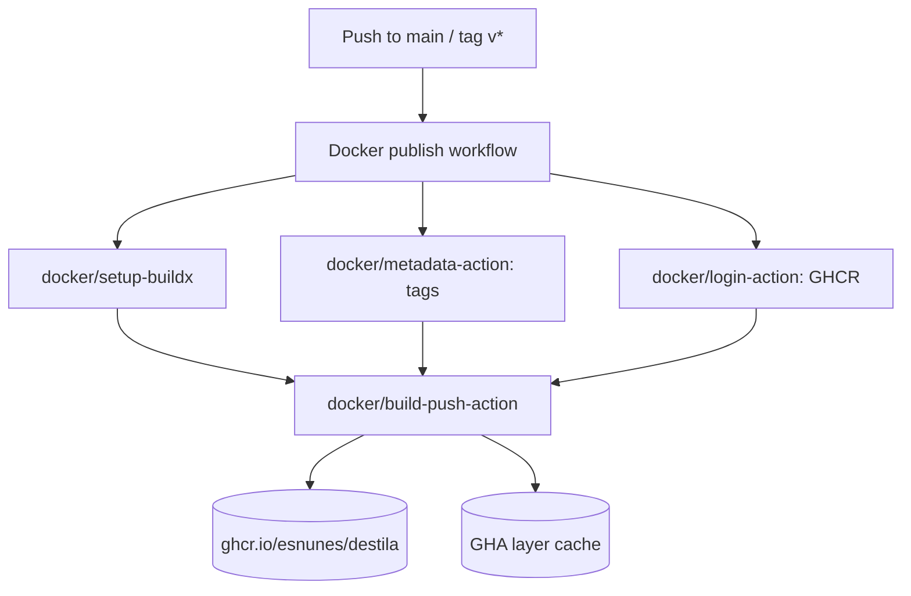

# feat: Dockerfile + GHCR publishing for self-hosted Destila

## Overview

Ship an official Destila container image to the GitHub Container Registry
(`ghcr.io/esnunes/destila`) so users can run Destila locally without first
installing Elixir/OTP, Node, tmux, ffmpeg, the Claude Code CLI, or
`agent-browser`. A GitHub Actions workflow builds and pushes the image on every
push to `main` and on semver tags. The README gains a first-class "Run with
Docker" section that documents mounts for the host's `~/.claude` directory
(Claude CLI credentials + settings) and `~/.cache/destila` directory (per-project
git clones and worktrees), plus an env-var-based auth path
(`CLAUDE_AGENT_OAUTH_TOKEN` or `ANTHROPIC_API_KEY`).

The image wraps a `mix release` build of Destila and ships with every
runtime-required CLI (`claude`, `tmux`, `ffmpeg`, `agent-browser`, `git`)
already on `PATH`.

## Problem Frame

Today the only documented way to run Destila is a local `mix setup` + manual
install of the Claude Code CLI. That path works for contributors but has
friction for anyone who wants to *use* Destila rather than hack on it:
- Five external tools must be installed at specific versions
  (`Destila.Deps.@required_tools` in `lib/destila/deps.ex` enforces
  `claude`, `tmux`, `ffmpeg`, `agent-browser`; `Destila.Git` also calls `git`)
- A native NIF (`expty`) requires a working C toolchain
- Elixir 1.19 + OTP 28 are not yet packaged in most distros
- Claude CLI credentials and the project git cache live on the host and must
  survive restarts — any containerization must preserve them via volumes

A container fixes the "install five tools plus OTP 28" problem and makes the
mount boundary explicit. Publishing to GHCR makes the image pullable by anyone
with a GitHub account and lets us attach the image to releases.

## Requirements Trace

- R1. A top-level `Dockerfile` at the repo root builds a runnable Destila
  image via a multi-stage `mix release`. The final image runs
  `/app/bin/destila start` as its entrypoint.
- R2. The final image ships with every CLI enumerated in
  `lib/destila/deps.ex` (`claude`, `tmux`, `ffmpeg`, `agent-browser`) plus
  `git` on `PATH`. `Destila.Deps.check/0` returns `available?: true` for all
  four when the container boots.
- R3. A `.dockerignore` excludes `_build/`, `deps/`, `*.db`, `*.db-*`,
  `.claude/`, `priv/static/assets/`, `assets/node_modules/`, `landing/`, and
  `docs/` to keep the build context small and prevent dev DB leaks into the
  image.
- R4. A `.github/workflows/docker-publish.yml` workflow builds and pushes
  the image to `ghcr.io/esnunes/destila` on:
  - pushes to `main` (tag `latest` + short SHA)
  - pushes to `v*.*.*` tags (semver tags via `docker/metadata-action`)
  - `workflow_dispatch` (manual)

  The workflow uses `docker/build-push-action@v5`, `docker/metadata-action@v5`,
  and `docker/login-action@v3`, authenticates with the workflow-provided
  `GITHUB_TOKEN`, and enables layer caching via `type=gha`.
- R5. The container supports **three** host-mounted volumes:
  - `/root/.claude` → host `~/.claude` (Claude Code CLI credentials,
    settings, project state)
  - `/root/.cache/destila` → host `~/.cache/destila` (project clones and
    worktrees created by `lib/destila/git.ex:81` and
    `lib/destila/workers/prepare_workflow_session.ex:109`)
  - `/data` → host data dir for the SQLite DB (`DATABASE_PATH=/data/destila.db`)
- R6. The container is configured via these runtime env vars:
  - `SECRET_KEY_BASE` (required; generated via `mix phx.gen.secret`)
  - `PHX_HOST` (default `localhost`)
  - `PORT` (default `4000`)
  - `PHX_SERVER` (default `true` inside the image)
  - `DATABASE_PATH` (default `/data/destila.db`)
  - Auth: `CLAUDE_AGENT_OAUTH_TOKEN` *or* `ANTHROPIC_API_KEY` *or* a
    pre-logged-in `~/.claude` mount
- R7. First-run database migration runs automatically on container start
  via a `Destila.Release` module invoked from an entrypoint script, so
  operators don't need to exec in to run `ecto.migrate`.
- R8. The README gains a "Run with Docker" section that documents:
  - `docker pull` + `docker run` with all three mounts
  - The three auth options and how each maps to a flag on `docker run`
  - The `SECRET_KEY_BASE` generation step
  - How to upgrade (`docker pull` + `docker run`)
  - The limitation that services launched by Destila workflows bind to
    dynamic host ports and therefore need host networking or explicit port
    forwards
- R9. No functional changes to application code beyond the new
  `Destila.Release` module and any minimal path defaulting needed to make
  `~/.cache/destila` work correctly as the non-interactive
  `/root/.cache/destila`.

## Scope Boundaries

- **No** `docker-compose.yml` in this plan — it can follow as a separate
  convenience once the base image ships.
- **No** changes to production deploy targets other than publishing the
  image; the existing `landing` GitHub Pages workflow is untouched.
- **No** Kubernetes manifests, Helm chart, or cloud-run wrappers.
- **No** multi-architecture build (linux/arm64) in v1 — `linux/amd64` only to
  keep CI fast and dependencies simple. A follow-up can add arm64 once we
  verify `expty`, `agent-browser`, and Chromium work on buildx arm64 runners.
- **No** Docker-in-Docker. Destila's git operations operate on mounted
  host directories; it does not need to manage containers from inside the
  container.
- **No** Alpine/musl base — stick to Debian bookworm-slim to avoid `expty`
  NIF and Chromium musl-linking pitfalls (see Key Technical Decisions).
- **No** attempt to containerize **user workflow services** started by
  Destila (those are run by destila via tmux/expty inside the container's
  filesystem and bind host ports). Containerized-service isolation is a
  future concern.
- **No** image signing (cosign/sigstore) in v1 — record as a future
  consideration.
- **No** non-root runtime user in v1. We run as `root` inside the container
  so mounted `~/.claude` and `~/.cache/destila` directories match the host
  user's UID when run with `--user $(id -u):$(id -g)`, documented as the
  recommended pattern. See Risks for the trade-off.

## Context & Research

### Relevant Code and Patterns

- `mix.exs` — `aliases.setup` lists the full dev bootstrap
  (`deps.get`, `destila.setup`, `ecto.setup`, `assets.setup`, `assets.build`,
  `git.hooks`). The Docker build only needs
  `deps.get` + `assets.setup` + `assets.deploy` + `phx.digest` +
  `release`; it must **skip** `destila.setup` (which validates the Claude
  CLI at *build* time — the CLI is installed in the runtime stage, not the
  build stage).
- `mix.exs:100` defines `assets.deploy` (`tailwind --minify`,
  `esbuild --minify`, `phx.digest`). This is the correct pre-release asset
  pipeline to run inside the Dockerfile build stage.
- `mise.toml` pins `erlang = "28.4"` and `elixir = "1.19.0-otp-28"` — the
  base image tag must match these exact versions.
- `lib/destila/deps.ex:10-39` enumerates every runtime CLI the app checks
  for. The Dockerfile must install each one:
  - `claude` via `curl -fsSL https://claude.ai/install.sh | bash`
  - `tmux` via `apt-get install tmux`
  - `ffmpeg` via `apt-get install ffmpeg`
  - `agent-browser` via `npm install -g @every/agent-browser`
    (requires Node + Chromium for the underlying Playwright/Puppeteer driver)
- `lib/destila/git.ex:81` — `cache_home = System.get_env("XDG_CACHE_HOME",
  Path.expand("~/.cache"))` then `Path.join([cache_home, "destila",
  project_id])`. Inside the container this becomes `/root/.cache/destila/<id>`
  (or wherever `XDG_CACHE_HOME` is pointed) — **the `destila/` segment is
  added by Destila, not the user**, so the README must document mounting
  host `~/.cache/destila` → `/root/.cache/destila`, i.e., the directory
  **below** the `destila/` subdir. Getting this wrong would nest
  `destila/destila/...`.
- `lib/destila/workers/prepare_workflow_session.ex:109` —
  `Path.join([local_folder, ".claude", "worktrees", workflow_session.id])`.
  Worktrees live **inside** the project's cache folder, so a single mount
  on `~/.cache/destila` covers both clones and worktrees.
- `config/runtime.exs:26-49` — prod-only config reads `DATABASE_PATH`,
  `SECRET_KEY_BASE`, `PHX_HOST`, `DNS_CLUSTER_QUERY`, and already defaults
  the DB to `Path.join(System.get_env("HOME", "/tmp"), "destila.db")`.
  With the Dockerfile pinning `HOME=/root`, the default would land at
  `/root/destila.db` — not mounted. We override via `DATABASE_PATH=/data/destila.db`
  in the image's default env.
- `config/prod.exs:13-20` — `force_ssl` is enabled with `hosts: ["localhost",
  "127.0.0.1"]` excluded. Users running Destila locally via `docker run
  -p 4000:4000` will hit Destila via `http://localhost:4000` and must not
  be force-redirected to `https` — the existing exclusion already handles
  this. README should tell users to set `PHX_HOST=localhost` (or leave
  default) so the exclusion applies.
- `.github/workflows/deploy-landing.yml` is the only existing workflow —
  use its style (concurrency group, explicit permissions, `actions/cache`
  where useful) as the template for the new publish workflow.
- `.gitignore` — `.claude/` is already ignored at the repo root (worktree
  artifacts live under `.claude/worktrees/`), so we do not need the
  `.dockerignore` to duplicate that pattern — but we include it anyway for
  build-context safety if a user runs `docker build` from an uncommitted
  checkout.

### Institutional Learnings

- `docs/solutions/2026-04-21-erlexec-vs-expty-evaluation.md` exists but
  describes a PTY backend evaluation unrelated to packaging. No prior Docker
  work is recorded in `docs/solutions/`, `docs/plans/`, or `docs/brainstorms/`.
- `lib/destila/ai/claude_session.ex` shells out to the `claude` binary via
  the `claude_code` Elixir library — its binary resolver reads `$PATH`
  and `~/.local/bin/claude`. Installing the Claude CLI to
  `/root/.local/bin/claude` **and** adding that dir to `PATH` in the
  Dockerfile means both resolution strategies succeed.

### External References

- `mix phx.gen.release` Phoenix 1.8 docs — generates `Dockerfile`,
  `.dockerignore`, `rel/overlays/bin/server`, `rel/overlays/bin/migrate`,
  and `lib/destila/release.ex`. We use this task as a starting scaffold
  inside a dedicated implementation unit, then heavily customize the
  Dockerfile for our multi-tool runtime layer (phx.gen.release's default
  is a minimal runtime with just `openssl` + `libstdc++`).
- `hexpm/elixir` Docker Hub image catalog. The exact tag used must pair
  Elixir 1.19.0 with Erlang/OTP 28 on Debian bookworm-slim; we pin to
  `hexpm/elixir:1.19.0-erlang-28.0.1-debian-bookworm-20250317-slim`
  (the nearest published tag; pin **exactly** and bump intentionally).
- GitHub Actions `docker/build-push-action@v5` + `docker/metadata-action@v5`
  — standard pattern for GHCR publishing. We use
  `permissions: { contents: read, packages: write }` at the job level (not
  workflow level) to tighten the token blast radius.
- Claude Code CLI install script docs (already referenced in README and in
  `lib/mix/tasks/destila.setup.ex`): `curl -fsSL https://claude.ai/install.sh
  | bash` installs to `~/.local/bin/claude`. It is a self-contained tarball
  extractor — no extra apt packages required beyond `curl` and `ca-certificates`.
- `@every/agent-browser` npm package depends on Chromium at runtime. On
  Debian bookworm the easiest path is `apt-get install -y chromium` and
  set `PUPPETEER_EXECUTABLE_PATH=/usr/bin/chromium` (confirm at
  implementation time; the unit's deferred questions list this).

## Key Technical Decisions

- **Release-based runtime, not `mix phx.server`.** `mix release` produces a
  self-contained OTP release that does not need Mix, Hex, or the build
  toolchain at runtime. The image is smaller and boots faster. The release
  is invoked via `/app/bin/destila start` (foreground) so Docker supervision
  works correctly.
- **Debian bookworm-slim for both stages.** Alpine/musl breaks `expty`'s
  NIF compilation and complicates Chromium installation for `agent-browser`.
  Debian slim adds ~40MB over Alpine but removes every NIF/Chromium risk.
- **Two stages, single final image — no Chromium-less variant in v1.**
  We accept the image size cost (expected ~1.5GB) to keep the matrix simple.
  If size becomes a complaint, a `-minimal` variant without Chromium +
  `agent-browser` can follow. Do **not** introduce a build arg toggle in
  v1 — it doubles the CI matrix for a hypothetical user.
- **`mix phx.gen.release` as the scaffold.** Phoenix's built-in generator
  is the canonical way to create `rel/overlays/bin/server`,
  `rel/overlays/bin/migrate`, and `lib/destila/release.ex`. We run it once
  (locally, committed) and then customize the generated `Dockerfile` —
  that way future Phoenix upgrades surface diffs against a known baseline.
- **Run as `root` in v1; recommend `--user $(id -u):$(id -g)` in the
  README.** Running as root simplifies volume permission handling for
  users new to Docker. Advanced users can override with `--user` and the
  mount paths (`/root/.claude`, `/root/.cache/destila`) still work because
  `HOME=/root` is just a path — Claude CLI and Destila both honor
  `HOME`/`XDG_CACHE_HOME`. An explicit `destila` non-root user is a future
  hardening task. (See Risks.)
- **Image name `ghcr.io/esnunes/destila`.** Matches the repo origin
  (`git@github.com:esnunes/destila.git`). Lowercase per GHCR rules.
- **Tag strategy via `docker/metadata-action`:** `latest` on default-branch
  push, `sha-<short>` on every push, `X.Y.Z` + `X.Y` + `X` on `v*.*.*`
  tags. No `edge`/`nightly` — the two channels are `latest` and semver.
- **Entrypoint runs migrations before starting the server.** The tini
  entrypoint calls `/app/bin/migrate` (scaffolded by `phx.gen.release`)
  and then `exec /app/bin/destila start`. This mirrors the Phoenix
  recommended pattern and means users never need to run migrations manually.
- **`tini` as PID 1.** The container runs many child processes (tmux,
  expty-spawned shells, Claude CLI). Using `tini` (or Docker's
  `--init`) reaps zombies cleanly. We bake `tini` into the image so users
  don't need `--init`.
- **Do not bake auth credentials into the image.** The README gives three
  mutually exclusive paths: OAuth token env var, API key env var, or
  mount a pre-logged-in `~/.claude`. Images never ship credentials.

## Open Questions

### Resolved During Planning

- **Which registry?** GitHub Container Registry (`ghcr.io/esnunes/destila`) —
  the request names GitHub Packages, and `ghcr.io` is the correct
  namespace for container images on GitHub Packages.
- **Mount path for the Claude CLI directory?** `/root/.claude` — Claude
  CLI reads `$HOME/.claude` and we pin `HOME=/root` per the debian-slim
  base image default.
- **Mount path for Destila's cache?** `/root/.cache/destila`. The
  parent (`~/.cache`) on the host is mounted to `/root/.cache/destila`
  containing Destila's per-project subdirs keyed by `project.id`.
  (Verified against `lib/destila/git.ex:81`.)
- **Should the image run migrations automatically?** Yes — via an
  entrypoint script that calls `/app/bin/migrate`. Users otherwise have
  to learn Phoenix release semantics just to get started.
- **Non-root user in v1?** No — deferred to a future hardening plan.
  Recommend `--user $(id -u):$(id -g)` as the volume-safe pattern in the
  README.
- **Multi-arch (arm64) in v1?** No — single-arch `linux/amd64` to keep CI
  simple and avoid Chromium/Chrome arm64 availability checks.

### Deferred to Implementation

- **Exact `hexpm/elixir` tag** — pick the most recent published tag that
  pairs Elixir `1.19.0` with Erlang/OTP `28.x` on `debian-bookworm-*-slim`
  during Unit 2. If `1.19.0-erlang-28.0.1` is not yet on Docker Hub on
  implementation day, fall back to the closest match and record the decision
  in the plan before landing.
- **Chromium executable path for `agent-browser`** — determine during
  Unit 2 whether `@every/agent-browser` reads `PUPPETEER_EXECUTABLE_PATH`,
  `CHROME_PATH`, or downloads its own browser. If it downloads its own,
  the Dockerfile can skip the `apt-get install chromium` line. Resolve by
  reading the package's README or running a quick smoke test during Unit 2.
- **Final image size and whether the tini binary is static** — runtime
  check during Unit 2. If `apt-get install tini` is available on bookworm-slim,
  use it; otherwise fetch the static binary from the `krallin/tini` release.
- **`DNS_CLUSTER_QUERY` default inside the image** — destila supports
  clustered deployments but self-hosted single-node is the common case.
  Leave unset in the default env; document in README how to enable.
- **Volume ownership edge case on SELinux/Podman hosts** — may need `:Z`
  suffix on `-v` flags. Document the pattern in the README's troubleshooting
  subsection during Unit 6, do not bake into the Dockerfile.

## High-Level Technical Design

> *This illustrates the intended approach and is directional guidance for review, not implementation specification. The implementing agent should treat it as context, not code to reproduce.*

```text
                  ┌──────────────── Build stage ────────────────┐
                  │ hexpm/elixir:1.19.0-erlang-28.0.1-bookworm  │
                  │  • apt: build-essential, git, curl, nodejs,  │
                  │         npm, libncurses-dev                  │
                  │  • mix deps.get --only prod                  │
                  │  • MIX_ENV=prod mix compile                  │
                  │  • (cd assets && npm ci)                     │
                  │  • MIX_ENV=prod mix assets.deploy            │
                  │  • MIX_ENV=prod mix release                  │
                  │  → /app/_build/prod/rel/destila              │
                  └──────────────┬──────────────────────────────┘
                                 │ COPY --from=build
                                 ▼
                  ┌──────────── Runtime stage ─────────────────┐
                  │ debian:bookworm-slim                        │
                  │  • apt: tmux, ffmpeg, git, curl, ca-certs,  │
                  │         tini, chromium, libncurses6,        │
                  │         openssl, locales, nodejs, npm       │
                  │  • npm i -g @every/agent-browser            │
                  │  • curl https://claude.ai/install.sh | bash │
                  │  • ENV HOME=/root PATH=/root/.local/bin:…   │
                  │  • ENV DATABASE_PATH=/data/destila.db       │
                  │  • ENV PORT=4000 PHX_SERVER=true            │
                  │  • VOLUME /root/.claude /root/.cache/destila │
                  │             /data                            │
                  │  • EXPOSE 4000                               │
                  │  • ENTRYPOINT /app/bin/entrypoint.sh         │
                  │    (runs migrate then exec bin/destila start)│
                  └──────────────────────────────────────────────┘

          Host                              Container
          ────                              ─────────
          ~/.claude           ──bind──▶    /root/.claude
          ~/.cache/destila    ──bind──▶    /root/.cache/destila
          ~/destila-data      ──bind──▶    /data  (SQLite)
          4000                ──-p───▶     4000  (Phoenix)
          CLAUDE_AGENT_       ──-e───▶     env inside container
            OAUTH_TOKEN
          SECRET_KEY_BASE     ──-e───▶     env inside container
```



## Implementation Units

- [ ] **Unit 1: Generate release scaffold with `mix phx.gen.release`**

**Goal:** Introduce the Phoenix release artifacts (`rel/`,
`lib/destila/release.ex`, baseline `Dockerfile`, baseline `.dockerignore`)
as a clean, reviewable commit *before* we customize the Dockerfile. This
isolates generator output from our opinionated changes.

**Requirements:** R1, R7

**Dependencies:** None.

**Files:**
- Create: `rel/overlays/bin/server` (generator output)
- Create: `rel/overlays/bin/server.bat` (generator output; commit and leave as-is)
- Create: `rel/overlays/bin/migrate` (generator output)
- Create: `rel/overlays/bin/migrate.bat` (generator output; commit and leave as-is)
- Create: `lib/destila/release.ex` (generator output)
- Create: `Dockerfile` (generator baseline — will be overwritten in Unit 2)
- Create: `.dockerignore` (generator baseline — will be hardened in Unit 2)
- Modify: `mix.exs` — add `releases: [destila: [...]]` block if the generator
  adds one; otherwise leave as-is
- Test: *none for this unit* — it is pure scaffolding

**Approach:**
- Run `mix phx.gen.release --docker` locally and commit the raw output as
  a single atomic commit. Do not edit the generated files in this unit.
- Verify `/app/bin/destila eval "Destila.Release.migrate()"` works in a
  local `mix release` build before moving on.

**Patterns to follow:**
- Phoenix 1.8's `mix phx.gen.release` scaffolding (authoritative source).

**Test scenarios:**
- Test expectation: none — this unit is pure scaffolding committed as
  generator output; behavioral coverage is introduced in Unit 2's smoke
  test and Unit 3's verification step.

**Verification:**
- `mix release` completes locally, producing `_build/prod/rel/destila/bin/destila`.
- `_build/prod/rel/destila/bin/destila eval "Destila.Release.migrate()"`
  creates/migrates a SQLite DB at the configured path without errors.

- [ ] **Unit 2: Customize the Dockerfile for Destila's runtime dependencies**

**Goal:** Replace the Phoenix-generator `Dockerfile` with a multi-stage
build that produces an image containing every tool `Destila.Deps` checks
for, the Claude Code CLI on `PATH`, and an entrypoint script that
auto-migrates on start.

**Requirements:** R1, R2, R5, R6, R7

**Dependencies:** Unit 1.

**Files:**
- Modify: `Dockerfile` (rewrite on top of the Unit 1 baseline)
- Create: `rel/overlays/bin/entrypoint.sh` — runs `/app/bin/migrate`, then
  `exec /app/bin/destila start`. Marked executable via `chmod +x` at build
  time.
- Modify: `.dockerignore` — harden to exclude `_build/`, `deps/`, `*.db`,
  `*.db-*`, `.claude/`, `priv/static/assets/`, `assets/node_modules/`,
  `landing/`, `docs/`, `tmp/`, `test/`, `.elixir_ls/`, `.serena/`,
  `mise.local.toml`, `.env*`

**Approach:**
- **Build stage** based on
  `hexpm/elixir:1.19.0-erlang-28.0.1-debian-bookworm-20250317-slim`
  (confirm tag during implementation):
  - `apt-get install -y --no-install-recommends build-essential git curl
    ca-certificates nodejs npm libncurses-dev pkg-config` (build-essential
    and libncurses-dev required by `expty` NIF compilation)
  - `mix local.hex --force && mix local.rebar --force`
  - `COPY mix.exs mix.lock ./` then `MIX_ENV=prod mix deps.get --only prod`
  - `COPY config config` then `MIX_ENV=prod mix deps.compile`
  - `COPY assets assets` then `cd assets && npm ci --omit=dev`
  - `COPY priv priv`, `COPY lib lib`
  - `MIX_ENV=prod mix assets.deploy`
  - `MIX_ENV=prod mix release`
- **Runtime stage** based on `debian:bookworm-slim`:
  - `apt-get install -y --no-install-recommends tmux ffmpeg git curl
    ca-certificates tini openssl locales libstdc++6 libncurses6 nodejs
    npm chromium` (chromium needed by `agent-browser`; confirm during
    implementation — see Open Questions)
  - `npm install -g @every/agent-browser`
  - `curl -fsSL https://claude.ai/install.sh | bash` (installs to
    `/root/.local/bin/claude`)
  - `COPY --from=build /app/_build/prod/rel/destila /app`
  - `COPY rel/overlays/bin/entrypoint.sh /app/bin/entrypoint.sh && chmod
    +x /app/bin/entrypoint.sh`
  - `ENV HOME=/root PATH=/root/.local/bin:/usr/local/bin:/usr/bin:/bin
    DATABASE_PATH=/data/destila.db PORT=4000 PHX_SERVER=true
    LANG=C.UTF-8 LC_ALL=C.UTF-8` (locale vars required by tmux and Phoenix
    under Debian slim)
  - `VOLUME ["/root/.claude", "/root/.cache/destila", "/data"]`
  - `EXPOSE 4000`
  - `ENTRYPOINT ["tini", "--", "/app/bin/entrypoint.sh"]`
- `entrypoint.sh` contents (directional): run `/app/bin/migrate` (created
  by `phx.gen.release --docker`), then `exec /app/bin/destila start`. Exit
  nonzero on migrate failure — do not start the server with an unmigrated
  DB.

**Patterns to follow:**
- Phoenix 1.8 release Dockerfile pattern (generated by `phx.gen.release
  --docker`).
- `mix.exs:99-104` `assets.deploy` alias — reproduce verbatim; do not
  inline the tailwind/esbuild commands.

**Test scenarios:**
- **Happy path — image builds:** `docker build -t destila:test .` succeeds
  from a clean checkout. Final image contains `/app/bin/destila`,
  `/app/bin/migrate`, `/app/bin/entrypoint.sh`, and `/root/.local/bin/claude`.
- **Happy path — all deps present:** `docker run --rm --entrypoint bash
  destila:test -lc 'which claude tmux ffmpeg agent-browser git'` prints
  five absolute paths on `PATH` and exits 0.
- **Happy path — first-boot migrate + serve:** `docker run --rm -p
  4000:4000 -v $(mktemp -d):/data -e SECRET_KEY_BASE=$(mix phx.gen.secret
  2>/dev/null || openssl rand -hex 32) destila:test` creates
  `/data/destila.db`, runs migrations, and `curl -fs http://localhost:4000/`
  returns HTTP 200 within 30s.
- **Happy path — Destila.Deps check passes inside container:** `docker
  run --rm --entrypoint /app/bin/destila destila:test eval
  'Destila.Deps.check() |> Enum.each(fn t -> IO.inspect({t.name,
  t.available?}) end)'` reports `available?: true` for `claude`, `tmux`,
  `ffmpeg`, `agent-browser`.
- **Edge case — missing SECRET_KEY_BASE:** `docker run --rm destila:test`
  (without setting `SECRET_KEY_BASE`) exits nonzero with the runtime.exs
  `SECRET_KEY_BASE is missing` error message surfaced in stdout.
- **Edge case — volume persistence:** writing a project via the UI
  (through the running container) creates a git clone under
  `/root/.cache/destila/<id>` that survives `docker rm` + `docker run`
  with the same `-v` mount.
- **Error path — migration failure does not start server:** a
  corrupted/read-only `/data` mount causes the entrypoint to exit nonzero
  without leaving a half-started Phoenix process behind.

**Verification:**
- The image builds locally to completion on a clean checkout, the
  container serves the Phoenix homepage on port 4000, and
  `Destila.Deps.check/0` reports `available?: true` for all four required
  tools inside the running container.

- [ ] **Unit 3: `Destila.Release` module (or generator confirmation)**

**Goal:** Ensure the generated `Destila.Release` module is correct for
Destila's SQLite + Oban setup and that `bin/migrate` runs migrations
against the configured `DATABASE_PATH` without needing Mix.

**Requirements:** R7

**Dependencies:** Unit 1.

**Files:**
- Modify: `lib/destila/release.ex` (tune if generator output doesn't
  match our single-repo SQLite setup)
- Test: `test/destila/release_test.exs` *(only if the generator leaves
  non-trivial logic; otherwise this unit is pure verification of
  generator output and the test file is omitted)*

**Approach:**
- Inspect the `phx.gen.release` output for `Destila.Release` — confirm it
  enumerates `[Destila.Repo]` in its `@app`/`repos` helpers and that
  `migrate/0` works against SQLite.
- If the generator emits only PostgreSQL-specific assumptions (it usually
  doesn't — the generated module is repo-agnostic), adjust to ensure
  SQLite path resolution works the first time the container starts with
  an empty `/data`.
- No changes to `config/runtime.exs` — the existing `DATABASE_PATH`
  handling (line 28) is already correct.

**Execution note:** If the generator's output is directly correct, this
unit collapses to a two-line verification; keep the commit anyway so the
reviewer sees the deliberate check.

**Patterns to follow:**
- `phx.gen.release` generated `Release` module (authoritative source).

**Test scenarios:**
- **Happy path — empty DB:** `bin/migrate` creates `/data/destila.db`
  and applies every migration in `priv/repo/migrations/` cleanly.
  Running it a second time is a no-op.
- **Edge case — read-only /data:** `bin/migrate` fails fast with a clear
  error instead of creating a WAL file in a partial state.
- **Integration — Oban.Engines.Lite compatibility:** after migrate, the
  `oban_jobs` table exists and `iex> Oban.check_queue(queue: :default)`
  returns without error inside the container.

**Verification:**
- `docker run --rm -v $(mktemp -d):/data --entrypoint /app/bin/migrate
  destila:test` exits 0 and a subsequent run prints no new migration
  output.

- [ ] **Unit 4: GitHub Actions workflow — build and publish to GHCR**

**Goal:** Continuously publish a signed-by-GitHub-Actions container image
to `ghcr.io/esnunes/destila` on every `main` push and semver tag, with
GHA layer caching to keep builds fast.

**Requirements:** R4

**Dependencies:** Unit 2 (Dockerfile must build before we automate it).

**Files:**
- Create: `.github/workflows/docker-publish.yml`

**Approach:**
- Triggers: `push` on `branches: [main]`, `push` on `tags: ['v*.*.*']`,
  `workflow_dispatch`.
- Permissions on the job: `contents: read`, `packages: write`,
  `id-token: write`. Do **not** elevate workflow-level permissions.
- Concurrency group per ref (`ghcr-${{ github.ref }}`), `cancel-in-progress:
  true` on branch pushes, `false` on tag pushes.
- Steps:
  1. `actions/checkout@v4`
  2. `docker/setup-buildx-action@v3`
  3. `docker/login-action@v3` against `ghcr.io` with
     `username: ${{ github.actor }}`, `password: ${{ secrets.GITHUB_TOKEN }}`
  4. `docker/metadata-action@v5` with `images: ghcr.io/esnunes/destila`
     and tag rules:
     - `type=ref,event=branch` (produces `main`)
     - `type=sha,format=short` (produces `sha-abc1234`)
     - `type=semver,pattern={{version}}` (for `v1.2.3` → `1.2.3`)
     - `type=semver,pattern={{major}}.{{minor}}`
     - `type=semver,pattern={{major}}`
     - `type=raw,value=latest,enable={{is_default_branch}}`
  5. `docker/build-push-action@v5` with `context: .`, `push: true`,
     `tags: ${{ steps.meta.outputs.tags }}`, `labels: ${{ steps.meta.outputs.labels }}`,
     `platforms: linux/amd64`, `cache-from: type=gha`, `cache-to:
     type=gha,mode=max`, `provenance: true` (attestation via actions/attest-build-provenance is a follow-up).
- The workflow does **not** run tests — testing is handled by a separate
  `ci.yml` (if/when added); this workflow exists only to publish.

**Patterns to follow:**
- `.github/workflows/deploy-landing.yml` — concurrency block, explicit
  permissions, `actions/checkout@v4` style.

**Test scenarios:**
- **Happy path — push to main:** a PR merge to main triggers the workflow;
  the workflow succeeds; `docker pull ghcr.io/esnunes/destila:latest`
  succeeds and `ghcr.io/esnunes/destila:sha-<short>` also exists.
- **Happy path — tag push:** pushing `v0.1.0` produces tags
  `ghcr.io/esnunes/destila:0.1.0`, `:0.1`, `:0` (and does **not** move
  `:latest` — that stays on the default-branch commit).
- **Edge case — concurrent main pushes:** back-to-back pushes to main
  cancel the in-flight workflow for the older SHA (via
  `cancel-in-progress: true` on branch pushes) without leaving dangling
  image tags — confirm the final `:latest` tag matches the most recent
  successful build's SHA.
- **Error path — build failure:** intentionally break the Dockerfile in a
  branch PR and confirm the workflow surfaces the error in the PR checks
  without publishing anything to `ghcr.io`.
- **Integration — GHCR visibility:** the published package appears under
  https://github.com/esnunes/destila/pkgs/container/destila and is
  public (manually set visibility once after the first push).

**Verification:**
- After the first successful run on `main`, the image is listed at
  `ghcr.io/esnunes/destila:latest` and `docker pull` + `docker run` work
  end-to-end from a machine that has no prior Destila checkout.

- [ ] **Unit 5: README "Run with Docker" section**

**Goal:** Give users a single copy-pasteable path to run Destila via
`docker run` with the right mounts, env vars, and auth story — without
them having to read `runtime.exs` or `lib/destila/deps.ex`.

**Requirements:** R8

**Dependencies:** Unit 2 (image must exist), Unit 4 (image must be pullable).

**Files:**
- Modify: `README.md`

**Approach:**
- Add a new top-level `## Run with Docker` section **before** the current
  `## Getting started` section (the contributor-oriented `mix setup`
  flow). The "user-who-wants-to-run-Destila" path comes first; the
  "developer-who-wants-to-hack-on-Destila" path follows.
- Subsections:
  1. **Pull the image** — `docker pull ghcr.io/esnunes/destila:latest`.
     Link to the GHCR package page.
  2. **Generate a `SECRET_KEY_BASE`** — `docker run --rm
     ghcr.io/esnunes/destila:latest /app/bin/destila eval
     'Phoenix.Token.sign(Destila.Endpoint, "", "")'` *(correct:
     `openssl rand -hex 32` is simpler and doesn't require the image —
     use that.)* Settle on one canonical command during implementation;
     prefer `openssl rand -hex 32` because it works without Docker.
  3. **Choose an authentication method** — three collapsed subsections,
     one per option from the existing Authentication section:
     - **OAuth token** (`-e CLAUDE_AGENT_OAUTH_TOKEN=...`)
     - **API key** (`-e ANTHROPIC_API_KEY=sk-ant-api03-...`)
     - **Pre-logged-in host** (`-v ~/.claude:/root/.claude`). Call out
       explicitly that these three options are mutually exclusive and in
       the same priority order as `claude_code` resolves them.
  4. **Run the container** with the canonical invocation:
     ```text
     docker run -d \
       --name destila \
       -p 4000:4000 \
       -v ~/.claude:/root/.claude \
       -v ~/.cache/destila:/root/.cache/destila \
       -v ~/destila-data:/data \
       -e SECRET_KEY_BASE=$SECRET_KEY_BASE \
       -e PHX_HOST=localhost \
       ghcr.io/esnunes/destila:latest
     ```
     Then open http://localhost:4000.
  5. **Upgrading** — `docker pull && docker rm -f destila && docker run
     ...`. Call out that persistent data is preserved via the three
     mounts.
  6. **Volumes reference table** — two-column table mapping each host
     path to its container path and a one-line purpose. Source the
     purposes from the Context & Research section (`~/.claude` → Claude
     CLI state, `~/.cache/destila` → project clones + worktrees,
     `~/destila-data` → SQLite DB).
  7. **Limitations** — document:
     - Services started by Destila workflows bind to dynamic host ports
       and won't be reachable unless the container uses host networking
       (`--network host`, Linux only) or you forward those ports
       explicitly when you launch the service.
     - `linux/amd64` only for v1.
     - Running as `root` by default; advanced users can pass `--user
       $(id -u):$(id -g)` and match volume ownership.
  8. **Troubleshooting** — common issues:
     - `SECRET_KEY_BASE` missing → error message and fix
     - Volume permission denied on SELinux → add `:Z` suffix
     - `Destila.Deps.check/0` reports `available?: false` → rebuild image
       from a clean checkout
- Link to the existing `## Authentication` section instead of duplicating
  the three auth methods. README stays DRY.
- Do not touch the existing `## Getting started`, `## Authentication`, or
  `## Learn more` sections except to fix any now-stale cross-references.

**Patterns to follow:**
- Tone and length of the existing `README.md` — imperative voice,
  fenced code blocks, no second-person preamble. Each bash snippet stays
  copy-pasteable.

**Test scenarios:**
- Test expectation: none — documentation-only change. Correctness is
  validated by actually following the steps on a clean machine before
  merging; capture that in the PR's Test plan checklist.

**Verification:**
- A reviewer who has never run Destila can pull the image and reach the
  homepage using only the commands from the new section, and the project
  cache and Claude login persist across a `docker rm && docker run` cycle.
- All internal links (`#authentication`, `#claude-cli`) still resolve.

- [ ] **Unit 6: Smoke test and first publish**

**Goal:** Produce the first published image on GHCR and confirm a
clean-machine user can run it end-to-end. This unit is a
verification-and-publish step, not new code.

**Requirements:** R1–R8 (integration verification)

**Dependencies:** Units 1–5.

**Files:**
- Modify: `README.md` (only if smoke-testing reveals a missing doc
  caveat; treat any additions as small amendments to Unit 5's content)

**Approach:**
- Merge the PR containing Units 1–5. Trigger the workflow (either by
  merging to main or via `workflow_dispatch`).
- On a machine **without** an existing Destila checkout:
  1. `docker pull ghcr.io/esnunes/destila:latest`
  2. Follow the README's Run with Docker steps verbatim.
  3. Create a project in the UI pointed at a public git repo; confirm
     a clone appears under host `~/.cache/destila/<id>/`.
  4. Run a workflow session; confirm the Claude CLI streams output.
  5. `docker rm -f destila && docker run ...` with the same mounts;
     confirm projects, sessions, and Claude login are preserved.
- Set the `ghcr.io/esnunes/destila` package visibility to public via the
  GitHub UI (one-time; GHCR defaults new packages to private).
- File a follow-up issue for each item that surfaces: multi-arch,
  image-size reduction, non-root user, image signing.

**Execution note:** This unit is manual verification — do not skip it.
The other five units can all pass their own test scenarios and still
have a subtly broken publish flow.

**Test scenarios:**
- Test expectation: none — this unit is manual end-to-end verification
  on a clean machine; its output is the follow-up issue list, not
  executable tests.

**Verification:**
- A clean-machine walkthrough succeeds, persistence survives container
  recreation, and the image is visible at
  https://github.com/esnunes/destila/pkgs/container/destila as public.

## System-Wide Impact

- **Interaction graph:** The image is a new external contract surface.
  Any future change to `Destila.Deps.@required_tools`
  (`lib/destila/deps.ex`) must be mirrored in the Dockerfile runtime
  stage; any change to `config/runtime.exs` env-var handling must be
  mirrored in the README's volumes/env table. Add a comment to each of
  those two files pointing to the Dockerfile and README so future
  editors see the coupling.
- **Error propagation:** The entrypoint runs migrations and then
  `exec`s the release's start script. A migration failure must exit
  nonzero so Docker surfaces it; a start failure must not leave a
  zombie `beam.smp` behind (tini handles this). The existing
  `config/runtime.exs` already raises on missing `SECRET_KEY_BASE` —
  that path is unchanged and surfaces correctly through
  `docker logs`.
- **State lifecycle risks:**
  - SQLite DB at `/data/destila.db` — WAL and SHM files live next to it;
    the whole directory must be mounted (not just the `.db` file), or
    SQLite WAL-mode flushes break. The README's canonical mount
    (`-v ~/destila-data:/data`) is correct; document this gotcha in
    Unit 5's troubleshooting subsection.
  - Claude CLI state at `/root/.claude` — `claude setup-token` writes
    `settings.json` here. If the host and container run as different UIDs
    without `--user`, subsequent `claude` commands in the container may
    hit permission errors. Document the `--user $(id -u):$(id -g)` pattern.
  - Project git clones at `/root/.cache/destila/<id>` — worktrees live
    inside each project's cache folder as
    `.claude/worktrees/<session_id>`, so mounting the parent
    (`/root/.cache/destila`) covers both clones and worktrees with a
    single mount. A user who mounts only the clone (not the parent) will
    lose worktrees on container restart.
- **API surface parity:** None — no HTTP API changes. The Phoenix
  endpoint runs identically inside and outside the container; only
  hostname/port semantics change (documented in README).
- **Integration coverage:** Unit 2's happy-path smoke tests exercise
  cross-layer behavior (migrate → start → serve). Unit 6's manual
  walkthrough exercises persistence across container recreation, which
  unit-level assertions cannot prove.
- **Unchanged invariants:** `mix setup` / `mix phx.server` / the
  contributor dev flow are untouched. `mise.toml`, `AGENTS.md`, and the
  existing landing-page deploy workflow are unchanged. No schema
  migrations, no new Elixir dependencies, no changes to auth resolution
  order in `config/runtime.exs` or the `claude_code` library's binary
  resolver.

## Risks & Dependencies

| Risk | Mitigation |
|------|------------|
| `expty` NIF fails to compile on the build image due to a missing system lib. | Base the build image on `hexpm/elixir:1.19.0-erlang-28.0.1-debian-bookworm-slim` and explicitly install `build-essential libncurses-dev pkg-config`; smoke-test the compile as part of Unit 2's happy-path build. |
| Claude CLI install script changes path, script, or output format. | Pin nothing at build time (the script is the officially supported install path); re-run the Dockerfile in CI on every main push so drift surfaces quickly. If breakage occurs, pin a specific tarball URL as a follow-up. |
| `@every/agent-browser` requires a bundled Chromium we don't install. | Deferred question in Open Questions; resolved during Unit 2 by checking the package's browser resolution strategy and installing `chromium` via apt if needed. |
| Image size balloons past ~2GB, making `docker pull` slow on first run. | Accept ~1.5GB target for v1 (Chromium alone is ~400MB). Record size in the Unit 6 follow-up issues and ship a `-minimal` variant if users complain. |
| Running as `root` inside the container surprises security-conscious users. | README documents `--user $(id -u):$(id -g)` as the recommended pattern; a non-root default is a follow-up hardening plan. |
| Users mount `~/.cache` (not `~/.cache/destila`) on the host, causing Destila to clone into `~/.cache/destila/destila/<id>`. | README explicitly documents the correct path (`~/.cache/destila:/root/.cache/destila`) with a worked example; add a troubleshooting line for the nested-path case. |
| Workflow-launched services bind dynamic ports and are unreachable from the host. | Document in the README's Limitations subsection; offer `--network host` (Linux only) or manual `-p` forwarding as workarounds. Not something to fix in v1 — requires a richer port-allocation negotiation. |
| GHCR image accidentally stays private, breaking `docker pull` for users. | Unit 6 includes an explicit "set visibility to public" step; add a line to the PR checklist. |
| `force_ssl` in `config/prod.exs` redirects `localhost` users to `https`. | Not a new risk — the existing `exclude: [hosts: ["localhost", "127.0.0.1"]]` already covers it. README nudges users to keep `PHX_HOST=localhost`. |
| `latest` tag gets moved forward while users are actively running it, causing silent behavioral drift. | Document that `latest` is the default and recommend pinning to a semver tag for production-style use. |

## Documentation / Operational Notes

- README gains a canonical "Run with Docker" section (Unit 5).
- The first published run requires a one-time manual visibility flip on
  the GHCR package page — captured in Unit 6's checklist.
- No runbook, dashboard, monitor, or on-call rotation change is needed
  for v1. A single-binary self-hosted image has no operational surface
  beyond what the user operates locally.
- `AGENTS.md` does not need a Dockerfile reference yet — add one in a
  follow-up once we have a stable enough image to recommend contributors
  use it.

## Sources & References

- Feature description: *Create a Dockerfile and push to GitHub Packages a
  docker container allowing users to run destila in a container with the
  necessary tools pre-installed. Adjust the README.md to include
  instructions on how to run it, paying attention to allowing the user to
  mount in the host machine the claude and cache directories.*
- Related code:
  - `lib/destila/deps.ex` (required CLI list)
  - `lib/destila/git.ex` (cache path resolution)
  - `lib/destila/workers/prepare_workflow_session.ex` (worktree layout)
  - `lib/mix/tasks/destila.setup.ex` (Claude CLI install story)
  - `config/runtime.exs` (prod env vars)
  - `config/prod.exs` (`force_ssl` semantics)
  - `mix.exs` (aliases, dependencies, Elixir version)
  - `mise.toml` (Elixir/OTP versions)
  - `.github/workflows/deploy-landing.yml` (workflow style reference)
- External docs:
  - Phoenix 1.8 `mix phx.gen.release --docker`
  - `hexpm/elixir` Docker Hub tag catalog
  - `docker/build-push-action@v5`, `docker/metadata-action@v5`,
    `docker/login-action@v3`
  - `https://claude.ai/install.sh` (Claude Code install script)
  - `@every/agent-browser` npm package
