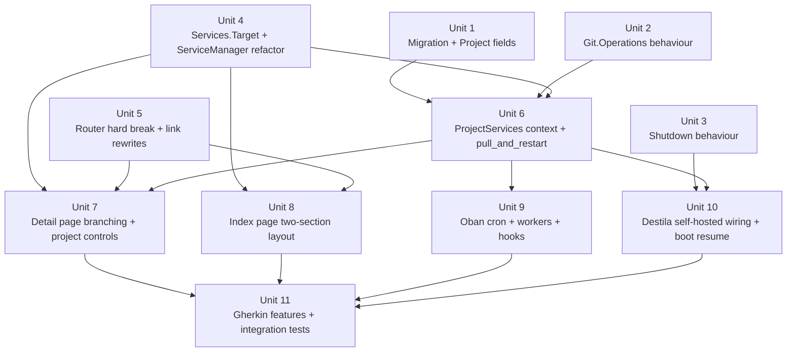

# feat: Add project-level services that run on the default branch

## Overview

Today every Destila service is session-scoped: it runs in window 9 of a workflow session's tmux session, inside the session's isolated worktree. This plan adds a second flavor — a **project-level** service that belongs directly to a project, runs against the project's primary checkout on the default branch, and is independent of any workflow session.

Users will use project-level services as a baseline to compare session work against, as a shared long-running instance, and as an always-on preview of merged code.

| Dimension | Session service (existing) | Project service (new) |
|---|---|---|
| Owner | `Destila.Workflows.Session` | `Destila.Projects.Project` (singleton) |
| cwd | Session's isolated worktree | `project.local_folder` (primary checkout) |
| Branch | Session branch | Default branch (auto-detected) |
| tmux | Session tmux, window 9 | Dedicated tmux session `destila-project-<project_id>` |
| Log path | `tmp/services/<session_id>.log` | `tmp/services/project-<project_id>.log` |
| PubSub topic | `service:<session_id>` | `service:project-<project_id>` |
| Lifecycle | Tied to session archival | Never auto-cleaned; manual remove only |
| Auto-restart | No | Yes — 3 triggers funnel to `pull_and_restart/1` |
| Route | `/services/sessions/:id` (renamed) | `/services/projects/:id` |

The index at `/services` renders two sections — "Project services" above, "Session services" below — each with its own empty state.

A dedicated edge case: when `project.local_folder == File.cwd!()` the project IS the running Destila app itself. In that case a restart is delegated to an external supervisor via `System.stop(0)`; Destila respawns and resumes the service per persisted `service_state.status`.

## Problem Frame

Session-level services run only for the duration of a workflow session's isolated worktree. That makes them unsuitable as:

1. A baseline to compare session work against
2. A shared preview of merged code that stays up across session lifetimes
3. A long-running instance that tracks the default branch

Generalizing the existing `ServiceManager` into a target-agnostic engine and adding a project-owned flavor closes that gap without forking service code. The new flavor also requires two pieces of infrastructure that do not exist today: a way to detect new commits on the default branch and pull fast-forward-only, and a way to restart the Destila app itself without in-process trickery.

## Requirements Trace

- R1. A project can have at most one project-level service (singleton), enforced at the application boundary.
- R2. A project-level service runs from `project.local_folder` on the default branch auto-detected from git.
- R3. Project- and session-level services for the same project coexist independently on different ports.
- R4. Project-level services are manually started/stopped/restarted/cleared from the UI — no auto-start on project creation or app boot; persisted status is used to resume only after an external supervisor-driven respawn of the Destila service itself.
- R5. `ProjectServices.pull_and_restart/1` is the single funnel for three auto-restart triggers: Oban Cron every 5 minutes; hooks on `archive_workflow_session/1` and `SessionProcess.handle_mark_done/2`; manual "Pull latest & restart" button on the detail page.
- R6. Pull strategy is fetch + fast-forward only. Dirty or diverged working trees fail loudly, surface an error to the detail page, and do NOT restart the service.
- R7. Project-level services are never auto-cleaned. Log files are preserved across session archival. Only an explicit user action removes them.
- R8. Routes are restructured with a hard break: `/services/:id` is removed; `/services/sessions/:id` and `/services/projects/:id` are introduced. All internal links, tests, and feature files are updated.
- R9. Setup/run chaining, `{ENV_VAR}` placeholder substitution, OS port reservation, and status transition semantics are preserved unchanged for both kinds of service.
- R10. The Destila self-hosted project's restart path is gated strictly on `project.local_folder == File.cwd!()` and routes through `System.stop(0)`; a misfire on a non-self project is a severe defect.
- R11. Git operations (`fetch`, `default_branch`, `ahead?`, `fast_forward`, `dirty?`) and BEAM shutdown live behind behaviours so tests can stub them without side effects.
- R12. The services index at `/services` renders two sections ("Project services", "Session services"), each with a per-section empty state, with Project services above Session services.
- R13. The existing `features/services_index.feature` and `features/service_detail_page.feature` are updated; a new `features/project_service.feature` is added; every scenario has at least one `@tag`-linked test.

## Scope Boundaries

- No changes to `features/service_status_sidebar.feature` or to the sidebar component. The sidebar keeps showing the session-level service only.
- No multiple project-level services per project — explicitly singleton.
- No UI for creating/removing project-level services yet. Removal semantics are defined, but "explicit user action to remove" is implemented as a "Remove service" control on the detail page (see Unit 7). No bulk-remove, no cross-project operations.
- No support for non-fast-forward pulls (rebase, merge commits) under any trigger.
- No auto-start on project creation or app boot — only resume after an external-supervisor-driven respawn for the Destila self-hosted case.
- No special handling for private repos needing auth beyond what `project.local_folder` already provides; the default branch is read from the checkout's configured remote.
- No service_state migration backfill: new column defaults to `nil`; existing projects are untouched.

## Context & Research

### Relevant Code and Patterns

- `lib/destila/services/service_manager.ex` — current session-scoped `execute(ws, action, opts)`, `cleanup(ws)`, `clear_logs(ws)`, `build_service_command/4`, `reserve_port/0`. Hardcoded `@service_window 9`. `service_target(ws)` composes `"#{Tmux.session_name(ws)}:9"`.
- `lib/destila/services/log_tailer.ex`, `lib/destila/services/logs.ex` — already keyed by binary id (`ws_id`). Generalizing is a matter of passing a different binary prefix (`"project-<id>"`).
- `lib/destila/pub_sub_helper.ex` — `service_topic/1`, `broadcast_service_status/2`, `broadcast_service_log/2`, `broadcast_service_logs_cleared/1` — all keyed on `workflow_session_id`. Needs project-topic siblings.
- `lib/destila/terminal/tmux.ex` — `session_name(ws) -> "ws-#{ws.id}"`. `ensure_session`, `new_window`, `pipe_pane`, `term_panes`, `kill_window` — reusable verbatim.
- `lib/destila/git.ex` — has `pull/1`, `clone/2`, `worktree_add/3`, `worktree_exists?/1`, `effective_local_folder/1`. Missing: `fetch`, `default_branch`, `ahead?`, `fast_forward`, `dirty?`, `diverged?`.
- `lib/destila/projects/project.ex` — schema has `run_command`, `setup_command`, `service_env_var`, `local_folder`, `git_repo_url`. `Project.webservice?/1` already guards service eligibility. No `service_state` column yet.
- `lib/destila/projects.ex` — thin context with CRUD + `broadcast(result, event)` via `PubSubHelper` on `"store:updates"`.
- `lib/destila_web/live/services_live.ex` — index page; already uses LiveView streams with a `hidden only:block` empty state; pattern `subscribed_ids` MapSet + per-entity `service:<id>` subscription is the established live-update model (plan `docs/plans/2026-04-24-002-feat-services-index-page-plan.md`).
- `lib/destila_web/live/service_detail_live.ex` — detail page; terminal mounted via `ServiceLogViewer` hook in `assets/js/hooks/xterm_hook.js`; 404 guarded by `Project.webservice?/1` at mount time.
- `lib/destila_web/router.ex` — live routes at `live "/services"` and `live "/services/:id"`. Both under the default `:browser` pipeline and the `DestilaWeb` scope.
- `lib/destila/workflows.ex` — `archive_workflow_session/1` and `delete_workflow_session/1` already call `ServiceManager.cleanup/1` when `ws.service_state` is set. Natural hook site for enqueueing `ProjectServicePullRestartWorker`.
- `lib/destila/sessions/session_process.ex` — `handle_mark_done/2` at lines 301-317 is the gen_statem handler that transitions a session to `:done`. Second hook site.
- `lib/destila/application.ex` — supervision tree. Adds no new top-level children; the Oban plugin is added via config.
- `lib/destila/workers/title_generation_worker.ex` — example `Oban.Worker` pattern (queue, max_attempts, `perform/1` receiving `%Oban.Job{args: ...}`).
- `lib/destila/ai/history.ex:53` — established pattern for a behaviour implementation swap: `Application.get_env(:destila, :ai_history_module, @default_impl)`. Mirrored for `Git.Operations` and `Shutdown`.
- `config/test.exs` — `config :destila, Oban, testing: :inline` means Oban jobs run inline; Oban Cron plugin does not fire. Good — cron-worker tests directly invoke `perform/1`.
- `priv/repo/seeds.exs` — seeds the `destila` project with `git_repo_url: "https://github.com/esnunes/destila"` and no `local_folder`. For the self-hosted path to work, `local_folder` must match `File.cwd!()` — see Open Questions (resolved).
- `test/test_helper.exs` — `Mimic.copy/1` style is established for `Tmux`, `System`, `ExPTY`; behaviour-based stubs + `Application.put_env/3` in test setup is equally idiomatic (see `Destila.AI.FakeHistory`).

### Institutional Learnings

- From `docs/plans/2026-04-14-001-feat-project-service-management-plan.md`: `service_state` as a JSON column per entity is fine when only one writer touches it. **Caveat**: for project services, cron + archive-hook + manual restart can race. Use Oban `unique` constraints (period-bounded) on `ProjectServicePullRestartWorker` so concurrent triggers dedupe to one job; inside that worker, serialize by taking the "start" path which is already idempotent against a stale tmux window.
- From `docs/plans/2026-04-17-001-refactor-project-service-env-var-plan.md`: `Project.webservice?/1` is the single source of truth for service eligibility across MCP tool, sidebar, detail page, and index page. Project-level service eligibility extends this predicate (`Project.webservice?/1` stays the gate).
- From `docs/plans/2026-04-24-002-feat-services-index-page-plan.md`: two PubSub topics drive the index: `"store:updates"` for membership churn and `service:<id>` for per-row updates. Project services extend this convention with `service:project-<project_id>`.
- From `docs/solutions/2026-04-21-erlexec-vs-expty-evaluation.md`: tmux windows/clients are treated as shared-fate. Every auto-restart leaves tmux windows on the host; we already `kill_window` + `term_panes` before a new run, and `LogTailer` is file-only (no tmux attach) — reuse these habits verbatim.
- SQLite-backed Oban (`Oban.Engines.Lite`) supports `Oban.Plugins.Cron` — no storage-engine gotcha.
- `config :destila, Oban, testing: :inline` in `config/test.exs` suppresses cron firing in the test environment; no extra guard needed to prevent double-scheduling in test. Dev is the concern — gated by `config_env() == :prod` in `config/runtime.exs` if we want to keep cron off in dev; see Key Technical Decisions.
- The existing `restart: :temporary` LogTailer + 250ms poll cadence is already vetted — reuse.

### External References

Not requested — local patterns for `ServiceManager`, LogTailer, Oban workers, behaviour-indirection (`ai_history_module`), and LiveView streams provide sufficient grounding. Official `Oban.Plugins.Cron` docs are referenced indirectly through the crontab syntax.

## Key Technical Decisions

- **`service_state :map` on `projects`, not a new table.** Mirrors `workflow_sessions.service_state`. Keys: `"status"`, `"port"`, `"run_command"`, `"setup_command"`, `"default_branch"`, `"last_pulled_at"`. Default `nil`. Singleton invariant is trivially enforced because there is one row per project; no uniqueness constraint needed. Rationale: lowest-complexity change that matches the existing session-side shape.
- **Service target abstraction via `Destila.Services.Target` struct.** Carries `:kind` (`:session | :project`), `:id`, `:cwd`, `:tmux_session_name`, `:tmux_window`, `:log_key` (binary ID used for log path and registry), `:pubsub_topic`, `:service_env_var`, `:run_command`, `:setup_command`. Constructors: `Target.for_session(ws, opts)` (requires `worktree_path`), `Target.for_project(project)`. `ServiceManager` operates on `Target` throughout. Rationale: the prompt explicitly calls for "service target"; a struct keeps types explicit and keeps session behavior byte-for-byte.
- **Dedicated tmux session per project-level service, window `0`.** `"destila-project-<project_id>"` isolates project-service lifecycle from any workflow session's tmux. Window `0` because it's the first window `tmux new-session` creates. Rationale: avoids colliding with session `@service_window 9`, and tmux session cleanup can target the whole session without risk to user terminal sessions.
- **Log path prefixing, not a new directory.** `tmp/services/project-<project_id>.log` lives alongside `tmp/services/<session_id>.log`. Rationale: keeps `Logs.log_path/1` signature intact (takes a binary) and preserves the existing `@log_dir`.
- **LogTailerRegistry key = target's `log_key`.** For sessions, `ws.id` (no prefix; current behavior). For projects, `"project-#{project.id}"`. Binary IDs, no ambiguity. Rationale: zero-change LogTailer generalization.
- **PubSub topic uses the same `log_key`: `"service:#{log_key}"`.** New helpers `project_service_topic/1`, `broadcast_project_service_*` alongside existing session helpers. Rationale: keeps the topic namespace uniform.
- **Single `ServiceDetailLive` branches on `live_action`.** Router passes `:session` or `:project`; `mount/3` pattern-matches. Shared handlers for `clear_logs`, `start_service`, `stop_service`, `restart_service`, `terminal_ready`, all PubSub handlers. Project-only handler: `pull_and_restart`. Project-only render element: supervisor notice banner when `self_hosted?`. Rationale: one page, one test file, shared log-tailer/terminal path.
- **Hard route break (no redirect).** Remove `live "/services/:id"`. Add `live "/services/sessions/:id", ServiceDetailLive, :session` and `live "/services/projects/:id", ServiceDetailLive, :project`. Routes list has `live "/services"` before both dynamic routes. All `~p"/services/#{ws_id}"` references in templates and tests rewrite to `~p"/services/sessions/#{ws_id}"`. Rationale: the prompt is explicit — breaking change.
- **Three triggers funnel through `ProjectServices.pull_and_restart/1`.** Cron enqueues `ProjectServicePullRestartWorker`; archive/mark-done hooks enqueue the same worker. The worker calls `ProjectServices.pull_and_restart/1`. The manual button on the detail page calls `ProjectServices.pull_and_restart/1` directly inside a `Task.start` (so the LiveView stays responsive). Rationale: one code path, one surface for errors.
- **Oban Cron plugin, configured in `config/runtime.exs`, gated on `config_env() == :prod`.** Dev and test do not schedule the poll automatically; `testing: :inline` already keeps test from firing. Dev engineers can trigger the cron job manually via `Oban.insert/1`. Rationale: avoids accidental cron churn on every `mix phx.server` in dev while keeping production behavior correct without config surprises.
- **Oban unique on `ProjectServicePullRestartWorker`.** `unique: [period: 60, fields: [:args], keys: [:project_id]]` — collapses concurrent enqueues from cron + archive hook + mark-done hook to one job per minute per project.
- **Per-project poll fanout.** `ProjectServicePollWorker` queries for projects whose `service_state["status"]` is `"running"` and enqueues one `ProjectServicePullRestartWorker` per project. Rationale: the poll stays responsive; a slow or broken pull for one project doesn't starve others.
- **`Destila.Git.Operations` behaviour + swap.** Callbacks: `fetch/1`, `default_branch/1`, `ahead?/1`, `fast_forward/1`, `dirty?/1`, `diverged?/1`. Default impl: `Destila.Git` (gains `@behaviour`). Callers resolve via `Application.get_env(:destila, :git_operations, Destila.Git)`. Mirrors `ai_history_module` pattern. Rationale: exactly the behaviour the prompt requested; tests can swap to a deterministic stub without Mimic coupling.
- **`Destila.System.Shutdown` behaviour + swap.** Single callback `stop/1`. Default impl: `Destila.System.Shutdown.Default` (`System.stop/1`). Resolved via `Application.get_env(:destila, :shutdown, Destila.System.Shutdown.Default)`. Rationale: the self-restart path is the highest-risk code in the plan; it must be mockable to be testable.
- **Self-hosted detection at lookup time by comparing `project.local_folder == File.cwd!()`.** No new column, no env var. Implemented as `Destila.Projects.self_hosted?/1`. Rationale: matches the prompt; `File.cwd!()` is stable for the running BEAM; `local_folder` is already a canonical absolute path in practice.
- **Self-restart path: finalize persistence + broadcast → `Shutdown.stop(0)`.** On boot, `Destila.Application` reads project service state and resumes services whose status is `"running"` or `"starting"` by calling `ProjectServices.start/1`. Rationale: external supervisor respawns; persisted status drives resume; no in-process restart.
- **Boot-time resume runs asynchronously after app start** via `Task.start/1` so supervisor boot is not blocked by port-wait (port wait is 60s). Rationale: current `start_service` handler already uses `Task.start` for the same reason.
- **No explicit UI yet for creating/removing a project-level service — but the detail page gains a "Remove service" control in Unit 7** (deletes `service_state`, cleans up tmux and log). Creation happens implicitly the first time a service is started (user action: "Start" from a new "Create project service" entry — see Unit 7). Rationale: the prompt says "never auto-cleaned (only removed by explicit user action)", which requires an explicit removal path.

## Open Questions

### Resolved During Planning

- **Where does `service_state` live for project-level services?** → A `service_state :map` column on `projects`, mirroring `workflow_sessions.service_state`. No new table.
- **What dedicated tmux session name for project services?** → `"destila-project-<project_id>"`, window index `0`.
- **What is the LogTailer registry key for project services?** → `"project-<project_id>"` — passed through the existing binary-keyed LogTailer/Logs API unchanged.
- **How do the three auto-restart triggers dedupe?** → Oban unique on `ProjectServicePullRestartWorker` with `period: 60, keys: [:project_id]`. Manual button bypasses Oban but still goes through `pull_and_restart/1`.
- **Does Oban Cron need an environment guard?** → Test is naturally off via `testing: :inline`. Dev is gated by `config_env() == :prod` in `config/runtime.exs`.
- **How is the Destila self-hosted case detected?** → `project.local_folder == File.cwd!()`. No env var or column.
- **What is the seed data for the Destila self-hosted project?** → Update `priv/repo/seeds.exs` to populate `local_folder: File.cwd!()` alongside the existing fields. Currently the seed only sets `git_repo_url`. Without a `local_folder`, self-hosted detection can never fire. (See Unit 10.)
- **Does "boot resume" retry on failure?** → The resume path just calls `ProjectServices.start/1`. If that errors, the project status stays `"starting"` with an error surfaced on PubSub; user can manually retry. No automatic retry loop at boot.
- **Does the pull check `dirty?` or `ahead?` first?** → `fetch` → `dirty?` (fail fast) → `diverged?` (fail loudly) → `ahead?` (no-op if not ahead of origin) → `fast_forward` → `restart`. Fail-fast on dirty is cheaper and maps to user expectation.
- **Is "Pull latest & restart" visible on stopped project services?** → Yes, but it performs the pull step then restarts (restart on a stopped service is equivalent to start). Detail-page copy makes this explicit.

### Deferred to Implementation

- **Exact shape of the pull-error PubSub message.** The plan specifies that errors surface to the detail page; the concrete message atom/tuple is chosen when wiring `pull_and_restart/1`.
- **Exact placement of the "Remove service" control.** Depends on detail-page layout after the "Pull latest & restart" button lands; implement-time UX detail.
- **Whether the poll worker filters by `archived_at is nil` on the project.** Likely yes — archived projects should not auto-pull. Confirm when writing the query.
- **Whether the self-restart path sets `service_state.status = "restarting"` (new status) or reuses `"starting"`.** Default to `"starting"` since the resume path already handles it; introduce a new status only if UI needs to distinguish.
- **Exact sidebar notice copy for the Destila self-hosted detail page.** Copy decided at render time; plan only specifies the banner exists.

## High-Level Technical Design

> *This illustrates the intended approach and is directional guidance for review, not implementation specification. The implementing agent should treat it as context, not code to reproduce.*

### Unit dependency graph



### `pull_and_restart/1` control flow

```
ProjectServices.pull_and_restart(project_id)
  1. project = Projects.get_project(project_id) or abort
  2. folder = project.local_folder or abort
  3. case Git.Operations.fetch(folder)
       :ok            → continue
       {:error, e}    → broadcast {:project_service_error, :fetch, e}; halt
  4. case Git.Operations.default_branch(folder)
       {:ok, branch}  → merge into service_state.default_branch
       {:error, e}    → broadcast error; halt
  5. case Git.Operations.dirty?(folder)
       {:ok, true}    → broadcast {:project_service_error, :dirty}; halt
  6. case Git.Operations.diverged?(folder)
       {:ok, true}    → broadcast {:project_service_error, :diverged}; halt
  7. case Git.Operations.ahead?(folder)
       {:ok, false}   → persist last_pulled_at; no restart; return :noop
       {:ok, true}    → continue
  8. case Git.Operations.fast_forward(folder)
       :ok            → continue
       {:error, e}    → broadcast error; halt
  9. persist last_pulled_at + default_branch
 10. if Projects.self_hosted?(project):
       ProjectServices.self_restart(project)    # System.stop(0) path
     else:
       ServiceManager.execute(target, "restart")
```

### Self-restart flow (Destila only)

```
ProjectServices.self_restart(project)
  guard: assert project.local_folder == File.cwd!()  # hard gate
  1. persist service_state.status = "starting"
  2. broadcast_project_service_status(project.id, state)
  3. (optional: short sleep or Phoenix.PubSub.broadcast ack — impl-time)
  4. Shutdown.stop(0)           # BEAM exits
  # ── Destila respawns via systemd/launchd ──
  # On boot: Destila.Application hook reads project.service_state
  #          and, for "starting"/"running" statuses, Task.start(ProjectServices.start/1)
```

## Implementation Units

- [ ] **Unit 1: Add `service_state` to projects and helper predicates**

**Goal:** Add the persistence column and the thin predicates that gate project-level service behavior.

**Requirements:** R1, R2, R9

**Dependencies:** None

**Files:**
- Create: `priv/repo/migrations/20260424120000_add_service_state_to_projects.exs`
- Modify: `lib/destila/projects/project.ex` (add `field :service_state, :map`; include in `changeset/2` cast list)
- Modify: `lib/destila/projects.ex` (add `self_hosted?/1`, `has_project_service?/1`)
- Test: `test/destila/projects_test.exs`

**Approach:**
- Migration adds a nullable `:map` column with no default.
- `self_hosted?(%Project{local_folder: local}) when is_binary(local)`: compare against `File.cwd!()`.
- `has_project_service?/1`: `!is_nil(project.service_state)`.
- The existing `Project.webservice?/1` predicate remains the eligibility gate — adding a project service still requires `run_command` and `service_env_var`.

**Patterns to follow:**
- `workflow_sessions.service_state :map` column as the shape reference.
- `Destila.Projects` broadcast pattern (`broadcast(result, event)`).

**Test scenarios:**
- Happy path: `self_hosted?/1` returns `true` when `project.local_folder == File.cwd!()`, `false` otherwise.
- Edge case: `self_hosted?/1` returns `false` when `local_folder` is `nil`.
- Happy path: `has_project_service?/1` returns `true` when `service_state` is a non-nil map and `false` otherwise.
- Happy path: migration round-trips — insert a project with `service_state: %{"status" => "running", "port" => 1234}`, reload, assert map equality.
- Edge case: `Project.webservice?/1` still returns `true`/`false` based on `run_command` + `service_env_var` regardless of `service_state`.

**Verification:**
- `mix ecto.migrate` runs cleanly.
- `Project.changeset/2` accepts a `service_state` attr.

---

- [ ] **Unit 2: Introduce `Destila.Git.Operations` behaviour and fill in the new git helpers**

**Goal:** Put the fetch/default-branch/ahead/fast-forward/dirty/diverged operations behind a mockable boundary.

**Requirements:** R6, R11

**Dependencies:** None

**Files:**
- Create: `lib/destila/git/operations.ex` (behaviour module)
- Modify: `lib/destila/git.ex` (implement behaviour; add `fetch/1`, `default_branch/1`, `ahead?/1`, `fast_forward/1`, `dirty?/1`, `diverged?/1`)
- Modify: `config/test.exs` (set `:git_operations` to a test-friendly stub module path; optional — tests can also use `Application.put_env/3` per-test)
- Test: `test/destila/git_test.exs` (new)

**Approach:**
- Behaviour defines six callbacks, each returning `:ok | {:error, term()}` or `{:ok, result} | {:error, term()}` as appropriate.
- Default impl in `Destila.Git` shells out to `System.cmd("git", [...], cd: local_folder, stderr_to_stdout: true)`.
- `default_branch/1` reads `git symbolic-ref refs/remotes/origin/HEAD` and strips the `refs/remotes/origin/` prefix.
- `ahead?/1` runs `git rev-list --count HEAD..origin/<default>` and returns `true` when count > 0.
- `dirty?/1` runs `git status --porcelain` and returns `true` on non-empty output.
- `diverged?/1` checks whether local is not an ancestor of `origin/<default>` while also being ahead of it (both sides have commits).
- `fast_forward/1` runs `git merge --ff-only origin/<default>`.
- Module dispatcher: `Destila.Git.Operations.impl()` returns `Application.get_env(:destila, :git_operations, Destila.Git)`.
- Mirrors `Destila.AI.History` pattern in `lib/destila/ai/history.ex:53`.

**Patterns to follow:**
- `lib/destila/ai/history.ex` for behaviour + `Application.get_env` swap.
- Existing `Destila.Git.pull/1` for `System.cmd` shape (`stderr_to_stdout: true`, trimmed output).

**Test scenarios:**
- Happy path: with a seeded local repo, `default_branch/1` returns `"main"` or `"master"` depending on remote.
- Happy path: `fetch/1` returns `:ok` on a reachable remote, `{:error, _}` on an unreachable one.
- Error path: `fast_forward/1` returns `{:error, _}` when local has diverged.
- Edge case: `dirty?/1` returns `{:ok, true}` when there's an uncommitted change, `{:ok, false}` otherwise.
- Edge case: `ahead?/1` returns `{:ok, false}` when local is up to date with origin.
- Integration: the behaviour contract is satisfied by `Destila.Git` (compile-time check via `@behaviour Destila.Git.Operations`).

**Verification:**
- Callers can swap the impl via `Application.put_env(:destila, :git_operations, FakeGit)` and observe deterministic results in tests.

---

- [ ] **Unit 3: Introduce `Destila.System.Shutdown` behaviour**

**Goal:** Put the BEAM shutdown primitive behind a mockable boundary so the Destila self-restart path is testable.

**Requirements:** R10, R11

**Dependencies:** None

**Files:**
- Create: `lib/destila/system/shutdown.ex` (behaviour + default impl)
- Modify: `config/test.exs` (swap default to a recording test impl; or document `Application.put_env` usage per-test)
- Test: `test/destila/system/shutdown_test.exs`

**Approach:**
- Behaviour with one callback: `stop(integer()) :: :ok`.
- Default impl `Destila.System.Shutdown.Default` calls `System.stop(status)`.
- Dispatcher: `Destila.System.Shutdown.impl/0` returns `Application.get_env(:destila, :shutdown, Destila.System.Shutdown.Default)`.
- The default impl is trivial; the test value is a module that records the exit code in a mailbox so assertions can verify the call without terminating the test VM.

**Patterns to follow:**
- Same `ai_history_module` pattern as Unit 2.

**Test scenarios:**
- Happy path: `impl()` returns the configured module.
- Integration: test impl receives the exit code via send-to-self and the test asserts on `assert_received {:shutdown, 0}` (or similar).

**Verification:**
- The default impl compiles and behaves identically to `System.stop/1` in production.
- No production caller of `System.stop` is introduced outside this module.

---

- [ ] **Unit 4: `Destila.Services.Target` abstraction and `ServiceManager` generalization**

**Goal:** Refactor the existing session-scoped ServiceManager to operate on a target struct. Session behavior is preserved byte-for-byte; no new functionality yet.

**Requirements:** R3, R9, R12

**Dependencies:** Unit 1 (shared `service_state` shape knowledge only — the refactor itself does not read project.service_state yet).

**Files:**
- Create: `lib/destila/services/target.ex`
- Modify: `lib/destila/services/service_manager.ex` (operate on `Target` throughout; `@service_window` becomes `target.tmux_window`; `service_target/1` reads from target)
- Modify: `lib/destila/services/logs.ex` (no signature change; confirm accepts any binary key)
- Modify: `lib/destila/services/log_tailer.ex` (no signature change; accepts any binary key)
- Modify: `lib/destila/pub_sub_helper.ex` (add `project_service_topic/1`, `broadcast_project_service_status/2`, `broadcast_project_service_log/2`, `broadcast_project_service_logs_cleared/1`)
- Modify: `lib/destila/ai/tools.ex` (ServiceManager call site — update to build a session target)
- Modify: `lib/destila_web/live/workflow_runner_live.ex` (ServiceManager call site — update to build a session target)
- Modify: `lib/destila_web/live/service_detail_live.ex` (update to build a session target; still session-only at this point)
- Modify: `lib/destila/workflows.ex` (cleanup call sites build a session target)
- Modify: `lib/destila/workers/prepare_workflow_session.ex` (if it calls into ServiceManager/Target for post-worktree setup)
- Test: `test/destila/services/target_test.exs`
- Test: `test/destila/services/service_manager_test.exs` (update to pass targets; existing `build_service_command/4` tests unchanged)

**Approach:**
- `Target` is a struct with the fields enumerated in the Key Technical Decisions section.
- `Target.for_session(ws, opts)`:
  - `kind: :session, id: ws.id`
  - `cwd: Keyword.fetch!(opts, :worktree_path)`
  - `tmux_session_name: Tmux.session_name(ws)` (i.e. `"ws-#{ws.id}"`)
  - `tmux_window: 9`
  - `log_key: ws.id`
  - `pubsub_topic: PubSubHelper.service_topic(ws.id)`
  - fields: `service_env_var`, `run_command`, `setup_command` sourced from the project.
- `Target.for_project(project)`:
  - `kind: :project, id: project.id`
  - `cwd: project.local_folder`
  - `tmux_session_name: "destila-project-#{project.id}"`
  - `tmux_window: 0`
  - `log_key: "project-#{project.id}"`
  - `pubsub_topic: PubSubHelper.project_service_topic(project.id)` (i.e. `"service:project-#{project.id}"`)
- `ServiceManager.execute(target, action)` replaces `execute(ws, action, opts)`. Session callers construct the target at the boundary.
- `ServiceManager.cleanup(target)` replaces `cleanup(ws)`. Same pattern.
- `ServiceManager.clear_logs(target)` replaces `clear_logs(ws)`.
- The status-persist layer is target-aware: session target writes to `workflow_sessions.service_state` via `Workflows.update_workflow_session`; project target writes to `projects.service_state` via a new `Projects.update_project_service_state/2` (introduced here or in Unit 6).
  - **Decision for this unit:** introduce a single write helper `ServiceManager.update_state(target, state)` that dispatches on `target.kind` to the right context call. If project-side write helper doesn't exist yet, stub it to call `Destila.Projects` (implemented in Unit 6). For this unit, the `:project` branch is unused and can `raise` or return `{:error, :not_implemented}` — the target refactor lands first with session behavior intact.
- PubSub helpers for broadcasting take the target's `log_key`/`pubsub_topic` directly.

**Patterns to follow:**
- Existing `service_manager.ex` — `do_start/do_stop/do_restart` structure stays the same.
- `Destila.PubSubHelper` shape for new `project_service_*` helpers.

**Test scenarios:**
- Happy path: `Target.for_session(ws, worktree_path: path)` produces a target with `tmux_session_name: "ws-<id>"`, `tmux_window: 9`, `log_key: ws.id`.
- Happy path: `Target.for_project(project)` produces `tmux_session_name: "destila-project-<id>"`, `tmux_window: 0`, `log_key: "project-<id>"`.
- Happy path: every existing `service_manager_test.exs` test that calls `ServiceManager.execute` still passes after migration to the Target API.
- Happy path: `build_service_command/4` pure-function tests are unchanged (no signature change).
- Integration: `clear_logs(target)` broadcasts `:service_logs_cleared` on the correct topic for both target kinds.
- Integration: `cleanup(target)` for a session target kills window 9 of `"ws-<id>"`; for a project target kills window 0 of `"destila-project-<id>"`.

**Verification:**
- All pre-existing session-service tests still pass unchanged in intent.
- `mix precommit` passes.

---

- [ ] **Unit 5: Router hard break — rename routes and rewrite internal links**

**Goal:** Remove `/services/:id`; add `/services/sessions/:id` and `/services/projects/:id` wired into the same `ServiceDetailLive`.

**Requirements:** R8, R12

**Dependencies:** None (deliberately small — behavior branching happens in Unit 7).

**Files:**
- Modify: `lib/destila_web/router.ex`
- Modify: `lib/destila_web/live/service_detail_live.ex` (accept `live_action`; existing behavior maps to `:session`)
- Modify: `lib/destila_web/live/services_live.ex` (row navigate link targets `/services/sessions/:id`)
- Modify: any template referencing `~p"/services/#{ws_id}"` or `~p"/services/#{ws.id}"` — namely the service status sidebar component (search `lib/destila_web` and `lib/destila/ai/tools.ex` system prompts)
- Modify: `features/services_index.feature` — scenario "Row navigates to the service detail page" → path updates (see Unit 11 for the full Gherkin diff)
- Modify: `features/service_detail_page.feature` — paths (see Unit 11)
- Modify: `features/service_status_sidebar.feature` — path in "clicking navigates to" scenario
- Test: `test/destila_web/live/service_detail_live_test.exs`, `test/destila_web/live/services_live_test.exs`, `test/destila_web/router_test.exs` (if present)

**Approach:**
- New router lines:
  - `live "/services", ServicesLive`
  - `live "/services/sessions/:id", ServiceDetailLive, :session`
  - `live "/services/projects/:id", ServiceDetailLive, :project`
- `ServiceDetailLive.mount/3` reads `socket.assigns.live_action` and dispatches to `mount_session/2` vs `mount_project/2`. For this unit, the `:project` branch can raise `NotFoundError` — real behavior lands in Unit 7.
- Every `~p"/services/#{id}"` becomes `~p"/services/sessions/#{id}"`.
- No redirect from the old path. Removing `live "/services/:id"` means that URL 404s.

**Patterns to follow:**
- Existing route ordering rule: static paths (`/services/archived`-like) before dynamic ones.
- `live_action`-driven LiveView branching (Phoenix convention).

**Test scenarios:**
- Happy path: `GET /services/sessions/<valid_id>` mounts `ServiceDetailLive` with `:session` live_action and renders session content.
- Happy path: `GET /services/projects/<id>` mounts `ServiceDetailLive` with `:project` live_action (may still raise `NotFoundError` in this unit; full behavior in Unit 7 is covered then).
- Error path: `GET /services/<id>` returns a routing 404 (no redirect).
- Integration: the services index row link resolves to `/services/sessions/<id>` for a session-backed row.

**Verification:**
- All existing session-service detail tests pass with the updated path.
- `mix precommit` passes.

---

- [ ] **Unit 6: `ProjectServices` context + `pull_and_restart/1`**

**Goal:** New context module that orchestrates project-level service lifecycle and the pull-and-restart funnel.

**Requirements:** R1, R2, R5, R6, R9, R11

**Dependencies:** Units 1, 2, 4.

**Files:**
- Create: `lib/destila/services/project_services.ex`
- Modify: `lib/destila/projects.ex` (add `update_project_service_state/2` — persists service_state + broadcasts `:project_updated`)
- Test: `test/destila/services/project_services_test.exs`

**Approach:**
- Public API:
  - `start(project)` — if `project.service_state["status"]` is already `"running"` or `"starting"`, refuse (one-per-project enforcement). Otherwise build a `Target.for_project/1` and call `ServiceManager.execute(target, "start")`.
  - `stop(project)` — `ServiceManager.execute(target, "stop")`.
  - `restart(project)` — on non-self: `ServiceManager.execute(target, "restart")`. On self: `self_restart(project)`.
  - `clear_logs(project)` — `ServiceManager.clear_logs(target)`.
  - `remove(project)` — calls `ServiceManager.cleanup(target)`, persists `service_state: nil`, deletes `Logs.log_path(target.log_key)`.
  - `pull_and_restart(project_id)` — the full flow in the High-Level Technical Design.
  - `resume(project)` — called at boot for projects with persisted `"running"`/`"starting"` status; delegates to `start/1`.
  - `self_hosted?(project)` — delegates to `Destila.Projects.self_hosted?/1`.
  - `self_restart(project)` — guard: `true = project.local_folder == File.cwd!()`. Persists `"starting"`, broadcasts, calls `Destila.System.Shutdown.impl().stop(0)`.
- The pull funnel uses `Destila.Git.Operations.impl()` for every git call so tests can stub.
- Errors during pull broadcast `{:project_service_error, reason, details}` on the project's PubSub topic and do not attempt restart.
- `update_project_service_state/2` in `Destila.Projects` is a thin `Project.changeset` + `Repo.update` + broadcast (`:project_updated`).
- Enforce one-per-project invariant in `start/1` by checking `project.service_state["status"]` before building the target. A project with no `service_state` or `"stopped"` status is allowed to start.

**Patterns to follow:**
- `ServiceManager.execute/3` signature and error-return shape.
- `Destila.Workflows.update_workflow_session/2` for persistence + broadcast pairing.

**Test scenarios:**
- Happy path: `start(project)` where `service_state` is nil → calls `ServiceManager.execute(target, "start")` with a project target, persists `"running"` on success.
- Happy path: `stop(project)` persists `"stopped"` and leaves `service_state` map with `status`, `port`, `run_command`, `setup_command`, `default_branch` preserved (matches session behavior).
- Edge case: `start(project)` rejects with `{:error, :already_running}` when status is already `"running"` or `"starting"`.
- Edge case: `clear_logs(project)` works regardless of status (matches session behavior).
- Happy path (pull_and_restart): fetch returns `:ok`, ahead? returns `false` → persists `last_pulled_at`, returns `:noop`, no restart call made (assert via stubbed ServiceManager).
- Happy path (pull_and_restart): fetch returns `:ok`, dirty? false, diverged? false, ahead? true, fast_forward `:ok` → persists `last_pulled_at`, calls `ServiceManager.execute(target, "restart")`.
- Error path (pull_and_restart): fetch returns `{:error, _}` → broadcasts `{:project_service_error, :fetch, _}`, no git-fast-forward, no restart.
- Error path (pull_and_restart): dirty? returns `{:ok, true}` → broadcasts `{:project_service_error, :dirty, _}`, no restart.
- Error path (pull_and_restart): diverged? returns `{:ok, true}` → broadcasts `{:project_service_error, :diverged, _}`, no restart.
- Error path (pull_and_restart): fast_forward returns `{:error, _}` → broadcasts error, no restart.
- Happy path (self-hosted): `self_restart(project)` where `project.local_folder == File.cwd!()` persists `"starting"`, broadcasts, and calls `Shutdown.impl().stop(0)` (assert via test impl).
- Error path (self-hosted guard): `self_restart(project)` where `project.local_folder != File.cwd!()` raises or returns `{:error, :not_self_hosted}` and does NOT call `Shutdown.stop/1` (critical assertion — see Risks).
- Happy path (remove): service_state becomes `nil`, log file is deleted, tmux window is killed.
- Integration: all git calls route through `Destila.Git.Operations.impl()` (swap to a recording stub and verify call sequence).

**Verification:**
- The module has exactly one call site for `System.stop` (via `Shutdown.impl()`); a `grep` for `System.stop` in the repo should return only the default impl and test impl.

---

- [ ] **Unit 7: Detail page — project branch, "Pull latest & restart", self-hosted notice, "Remove service"**

**Goal:** Extend `ServiceDetailLive` with the `:project` branch and the project-only controls.

**Requirements:** R4, R5, R7, R10, R12

**Dependencies:** Units 4, 5, 6.

**Files:**
- Modify: `lib/destila_web/live/service_detail_live.ex`
- Modify: `features/service_detail_page.feature` (new scenarios — see Unit 11)
- Test: `test/destila_web/live/service_detail_live_test.exs`

**Approach:**
- `mount/3` for `:project` live_action:
  - Load `project = Projects.get_project(id)`, raise `NotFoundError` when nil.
  - Require `Project.webservice?(project)` — raise 404 otherwise.
  - Subscribe to `PubSubHelper.project_service_topic(project.id)` and `"store:updates"`.
  - Assign: `project`, `service_state`, `self_hosted?`, `terminal_ready: false`, `pending_bytes: read_initial_log_bytes("project-#{project.id}")`, `page_title: "Service — #{project.name}"`, `target_kind: :project`.
- Shared handlers between session and project branches:
  - `start_service` / `stop_service` / `restart_service` / `clear_logs` / `terminal_ready`
  - PubSub: `{:service_status, _}`, `{:service_log, _}`, `{:service_logs_cleared, _}`
  - `{:project_updated, updated_project}` → re-assign service_state (for project branch)
  - `{:workflow_session_updated, _}` → re-assign service_state (for session branch)
- Project-only handlers:
  - `pull_and_restart` event → `Task.start(fn -> ProjectServices.pull_and_restart(project.id) end)`.
  - `{:project_service_error, stage, details}` → `put_flash(:error, ...)` describing the stage (fetch/dirty/diverged/fast-forward) and details.
  - `remove_service` event → `ProjectServices.remove(project)`.
- Render:
  - Project branch renders:
    - "Pull latest & restart" button (visible when service is `running` or `stopped`; on stopped it is effectively "pull + start").
    - Self-hosted notice banner when `self_hosted?`: "Restart will terminate Destila itself. Your external process supervisor must respawn it."
    - Sidebar link to the project page (`~p"/projects"` → eventually to a specific project route; reuse any existing pattern).
    - "Remove service" control.
  - Session branch keeps current behavior (session link, no pull button, no supervisor banner).
- Shared render elements:
  - Terminal, status pill, port, run/setup command.

**Patterns to follow:**
- Current `service_detail_live.ex` structure (header, log viewer, details sidebar).
- `Task.start` for `start_service`/`restart_service` — reuse the same wrapper for `pull_and_restart`.

**Test scenarios:**
- Happy path (session branch): existing scenarios in `features/service_detail_page.feature` continue to pass unchanged.
- Happy path (project branch): detail page for a running project service renders URL `http://localhost:<port>`, run command, setup command, default branch.
- Happy path (project branch): details sidebar links to the project, not to a session.
- Happy path (Pull latest & restart): button visible on project branch; clicking calls `ProjectServices.pull_and_restart/1` (assert via stubbed context).
- Edge case: "Pull latest & restart" button is NOT rendered on session branch.
- Edge case: Destila self-hosted project detail page renders the supervisor-notice banner; non-self project does not.
- Error path: a `{:project_service_error, :dirty, _}` PubSub message puts an error flash describing the dirty working tree.
- Edge case: 404 when project is missing, not a webservice, or archived (align with session-branch 404 rules).
- Happy path (remove): `remove_service` event clears state and re-renders a "Create service" prompt (or redirects — impl-time choice; the scenario asserts `service_state` becomes nil).

**Verification:**
- `mix test test/destila_web/live/service_detail_live_test.exs` — green.

---

- [ ] **Unit 8: Index page — two sections and per-section empty states**

**Goal:** Render "Project services" above "Session services" at `/services`, each with a separate empty state, and route rows to the kind-specific detail path.

**Requirements:** R12

**Dependencies:** Units 4, 5.

**Files:**
- Modify: `lib/destila_web/live/services_live.ex`
- Modify: `features/services_index.feature` (see Unit 11)
- Test: `test/destila_web/live/services_live_test.exs`

**Approach:**
- Add `list_eligible_projects/0`: projects that are `webservice?` and have a non-nil `service_state`. Archived projects are excluded.
- Mount subscribes to `"store:updates"` plus per-kind topics:
  - For each session id in the eligible session list: `service_topic/1`.
  - For each project id in the eligible project list: `project_service_topic/1`.
- Two LiveView streams: `:project_services` and `:session_services` (rename existing `:services` → `:session_services`).
- Two separate `phx-update="stream"` parents with their own `hidden only:block` empty states. Project section is first.
- Row navigate links use the correct kind path.
- Reconciliation on any of `:workflow_session_*`, `:project_updated`, `:project_deleted`, `:service_status` re-queries both lists and re-streams with the MapSet diff pattern already in use.

**Patterns to follow:**
- Existing `ServicesLive` MapSet subscription reconciliation.
- `hidden only:block` empty state from `services_live.ex:114`.

**Test scenarios:**
- Happy path: with one project service + one session service, page renders both in their respective sections.
- Happy path: Project services section is rendered ABOVE the Session services section.
- Edge case: no project services + one session service → Project section shows empty state; Session section lists the row.
- Edge case: one project service + no eligible session services → Session section shows empty state; Project section lists the row.
- Edge case: no services of either kind → both empty states render.
- Happy path: project service row link navigates to `/services/projects/<project_id>`.
- Happy path: session service row link navigates to `/services/sessions/<session_id>`.
- Integration: a `{:service_status, _}` broadcast for a project id refreshes that project row without touching session rows.

**Verification:**
- `mix test test/destila_web/live/services_live_test.exs` — green.

---

- [ ] **Unit 9: Oban cron + polling worker + pull-restart worker + session hooks**

**Goal:** Periodic auto-restart and session-lifecycle auto-restart paths, both funneling through `ProjectServicePullRestartWorker`.

**Requirements:** R5

**Dependencies:** Unit 6.

**Files:**
- Modify: `config/runtime.exs` (add `Oban.Plugins.Cron` plugin under `config_env() == :prod`)
- Modify: `config/config.exs` (add `project_services` queue)
- Create: `lib/destila/workers/project_service_poll_worker.ex`
- Create: `lib/destila/workers/project_service_pull_restart_worker.ex`
- Modify: `lib/destila/workflows.ex` (`archive_workflow_session/1` — after cleanup, if `ws.project_id`, `enqueue_project_service_pull_restart(ws.project_id)`)
- Modify: `lib/destila/sessions/session_process.ex` (`handle_mark_done/2` — after persisting `done_at`, same enqueue call)
- Test: `test/destila/workers/project_service_poll_worker_test.exs`
- Test: `test/destila/workers/project_service_pull_restart_worker_test.exs`
- Test: `test/destila/workflows_test.exs` (hook assertion)
- Test: `test/destila/sessions/session_process_test.exs` (hook assertion)

**Approach:**
- `ProjectServicePollWorker`:
  - Queue `:project_services`, `max_attempts: 1`.
  - `perform/1` queries `Projects` for rows with `service_state["status"] == "running"` AND `archived_at IS NULL`.
  - For each project, enqueues one `ProjectServicePullRestartWorker` with `args: %{"project_id" => project.id}`.
- `ProjectServicePullRestartWorker`:
  - Queue `:project_services`, `max_attempts: 1`, `unique: [period: 60, fields: [:args], keys: [:project_id]]`.
  - `perform/1` calls `Destila.Services.ProjectServices.pull_and_restart(project_id)`.
  - Logs and returns `:ok` on any non-exception outcome (errors already broadcast).
- Cron crontab in runtime: `{"*/5 * * * *", Destila.Workers.ProjectServicePollWorker}`.
- `config/runtime.exs` block: only applied when `config_env() == :prod`.
- Hook helper: new private `Destila.Workflows.enqueue_project_service_pull_restart/1` (reusable from both `archive_workflow_session/1` and `SessionProcess.handle_mark_done/2`). Inserts the worker with the same unique constraint.

**Patterns to follow:**
- `Destila.Workers.TitleGenerationWorker` for worker shape.
- `Oban.insert/1` call in `Destila.Workflows.create_workflow_session/1` for insert style.

**Test scenarios:**
- Happy path (poll worker): with two running project services and one stopped one, `perform/1` enqueues exactly two `ProjectServicePullRestartWorker` jobs.
- Edge case (poll worker): archived projects are skipped.
- Edge case (poll worker): projects with `service_state == nil` are skipped.
- Happy path (pull-restart worker): `perform/1` calls `ProjectServices.pull_and_restart/1` with the right project id; success returns `:ok`.
- Error path (pull-restart worker): when `pull_and_restart/1` returns `{:error, _}`, the worker logs and returns `:ok` (errors already broadcast; no Oban retry needed).
- Integration (hook): `Workflows.archive_workflow_session(ws)` where `ws.project_id` has a running project service → a `ProjectServicePullRestartWorker` job is inserted (assert via `Oban.Testing.assert_enqueued`).
- Integration (hook): `SessionProcess.handle_mark_done/2` same assertion.
- Edge case (hook): `archive_workflow_session(ws)` where `ws.project_id` is nil → no job enqueued.
- Edge case (hook): `archive_workflow_session(ws)` where the project has no project-level service → job is still enqueued but `pull_and_restart/1` returns early (no-op — acceptable).
- Edge case (unique): enqueueing the same project twice within 60s dedupes to one job.

**Verification:**
- `mix test test/destila/workers/` passes.
- `Oban.Testing.assert_enqueued` confirms the hook paths.
- Oban cron is silent in test (`testing: :inline`) and dev (non-prod `config_env()`); manual verification of prod cron cadence is a manual-only test (see Testing Strategy).

---

- [ ] **Unit 10: Destila self-hosted wiring — seed, detail-page banner, boot resume**

**Goal:** Make the Destila project detectable as self-hosted, show the supervisor notice, and resume on boot for persisted `"starting"`/`"running"` statuses.

**Requirements:** R4, R10

**Dependencies:** Units 3, 6, 7.

**Files:**
- Modify: `priv/repo/seeds.exs` (add `local_folder: File.cwd!()` to the destila project)
- Modify: `lib/destila/application.ex` (after supervisor start, invoke `Task.start(fn -> Destila.Services.ProjectServices.resume_all() end)`)
- Modify: `lib/destila/services/project_services.ex` (add `resume_all/0`)
- Test: `test/destila/services/project_services_test.exs` (resume scenarios)
- Test: `test/destila_web/live/service_detail_live_test.exs` (self-hosted banner assertions — may already be covered in Unit 7; include here if split)

**Approach:**
- Seed: ensure `local_folder` is set for the destila project so `self_hosted?/1` returns `true` when the app runs from that checkout. Idempotent update if the project already exists.
- `resume_all/0`:
  - Query projects with `service_state["status"] in ["starting", "running"]` AND `archived_at IS NULL`.
  - For each, `Task.start(fn -> ProjectServices.start(project) end)`.
  - Per-project isolation via `Task.start` so a slow startup doesn't block app boot.
- Application hook:
  - Add a call right before `Supervisor.start_link` returns, or as a supervised `Task` child that runs the resume asynchronously.
  - Simpler: wrap `ProjectServices.resume_all/0` invocation in `Task.start/1` after the supervisor is up.

**Patterns to follow:**
- Existing `Destila.Application` shape — keep the child list minimal; run resume as a side-effect after start.

**Test scenarios:**
- Happy path: `resume_all/0` calls `ProjectServices.start/1` for every project whose persisted status is `"running"` or `"starting"`.
- Edge case: projects with `"stopped"` status are skipped.
- Edge case: archived projects are skipped.
- Integration: the Destila self-hosted detail page shows the supervisor notice (already implied by Unit 7 but re-asserted here with a self-hosted fixture).
- Integration: invoking `self_restart(project)` calls the test `Shutdown` impl exactly once with exit code `0`; does NOT call `ServiceManager.execute(_, "restart")`.

**Verification:**
- On a fresh `mix ecto.reset && mix ecto.setup`, the destila project has a `local_folder` equal to `File.cwd!()`.
- `Destila.Projects.self_hosted?(destila_project)` returns `true`.

---

- [ ] **Unit 11: Gherkin features + integration tests**

**Goal:** Land the new feature file, update the two existing ones, and wire every scenario to at least one `@tag`-linked test.

**Requirements:** R13

**Dependencies:** Units 7, 8, 9, 10.

**Files:**
- Create: `features/project_service.feature`
- Modify: `features/services_index.feature` (new scenarios + extended description per user prompt)
- Modify: `features/service_detail_page.feature` (new scenarios + updated paths)
- Modify: `features/service_status_sidebar.feature` (path update only — `/services/<session_id>` → `/services/sessions/<session_id>`)
- Test: `test/destila_web/live/service_detail_live_test.exs`
- Test: `test/destila_web/live/services_live_test.exs`
- Test: `test/destila/services/project_services_test.exs`
- Test: `test/destila/workers/project_service_poll_worker_test.exs`
- Test: `test/destila/workers/project_service_pull_restart_worker_test.exs`

**Approach:**
- Land scenarios verbatim from the user prompt. Map each scenario to at least one test via `@tag feature: "project_service", scenario: "..."` (and the parallel tags for the other two features).
- For scenarios that require real git, stub `Destila.Git.Operations` via `Application.put_env/3` in the relevant test setup.
- For scenarios that require `System.stop`, stub `Destila.System.Shutdown`.
- For sidebar path scenario, update path-based assertion only.

**Patterns to follow:**
- Existing `@feature @module_attr` + per-test `@tag feature: @feature, scenario: "..."` in `test/destila/services/service_manager_test.exs` and `test/destila/workers/prepare_workflow_session_test.exs`.

**Test scenarios (linkage, not new behavior):**
- Every scenario added in `features/project_service.feature`, `features/services_index.feature`, and `features/service_detail_page.feature` has at least one test with matching `@tag`.
- `mix test --only feature:project_service` runs all new scenarios.
- `mix test --only feature:services_index` still runs existing ones plus the three new.
- `mix test --only feature:service_detail_page` covers the five new scenarios.

**Verification:**
- `mix precommit` passes.
- `mix test --only feature:project_service` runs the full new file.

## System-Wide Impact

- **Interaction graph:** New paths through `Workflows.archive_workflow_session/1`, `SessionProcess.handle_mark_done/2`, and `Destila.Application` boot. `ServiceManager` is called by more entry points (session LiveView, AI MCP tool, `ProjectServices`, Oban worker, detail page manual button). PubSub grows two new topics per project. The Destila self-hosted path invokes `System.stop/0` via `Shutdown.impl()` — the highest-blast-radius action in the plan.
- **Error propagation:** Pull errors propagate via `{:project_service_error, stage, details}` on the project PubSub topic. The detail page renders them as flashes. Workers log and return `:ok` so Oban does not retry; errors are not lost because PubSub + persisted `service_state` surface them.
- **State lifecycle risks:**
  - Race between cron enqueue and archive-hook enqueue: mitigated by Oban `unique` with `period: 60, keys: [:project_id]`.
  - Race between manual pull_and_restart and a worker-driven pull_and_restart: both call into the same shared function; tmux `kill_window + term_panes` + log truncation on start are already idempotent, so a double-restart produces at most one visible disruption.
  - Stale `service_state.status == "starting"` after a crash during pull: left as-is; user can manually stop/restart. Boot resume picks it up as a `"starting"` which then transitions correctly.
  - Destila self-restart with persisted `"starting"`: on boot, the resume path treats `"starting"` identically to `"running"` — both re-invoke `start/1`.
- **API surface parity:** MCP `service` tool in `lib/destila/ai/tools.ex` continues to operate on session targets only. No change to its contract; it picks up the session-target construction via Unit 4.
- **Integration coverage:** LiveView tests alone cannot prove the boot-time resume path; an integration test exercises `ProjectServices.resume_all/0` against a seeded running status and asserts `ProjectServices.start/1` was invoked.
- **Unchanged invariants:**
  - Session-level service behavior is byte-for-byte identical after Unit 4.
  - `Project.webservice?/1` remains the single eligibility check for both kinds.
  - `build_service_command/4`, port reservation, tmux `pipe_pane` log capture, LogTailer poll cadence, and the `@startup_timeout_ms 60_000` port-wait all stay unchanged.
  - The MCP `service` tool's input/output contract is unchanged.

## Risks & Dependencies

| Risk | Mitigation |
|------|------------|
| **Self-restart misfires on a non-self project and kills the BEAM** (severe) | Hard guard: `true = project.local_folder == File.cwd!()` at the top of `self_restart/1`. Tested as a dedicated error-path scenario that asserts `Shutdown.stop/1` was NOT called. Grep for `System.stop` in the repo and confirm only two call sites exist (default impl + test impl). |
| Oban Cron double-schedules across environments | Only `config_env() == :prod` adds the Cron plugin in `config/runtime.exs`. Test uses `testing: :inline` (already configured). Dev relies on manual job insertion. |
| Pull succeeds but restart fails, leaving stale bytecode running | `pull_and_restart/1` executes the fast-forward BEFORE the restart attempt. If the restart fails, the working tree is on the latest commit but the running service is on the old code — surfaced via `{:project_service_error, :restart, _}` on PubSub; user sees it on the detail page. Accepted. |
| A broken/slow project blocks poll-worker progress | Poll worker fans out per-project jobs; each project's pull runs in its own Oban job. One slow project cannot block others. |
| Removing `/services/:id` breaks in-flight links | Hard break is explicit in the user prompt; we audit `~p"/services/..."` across `lib/` and `test/` plus the three feature files. A `git grep "/services/" lib/ test/ features/` pass is required in Unit 5. |
| Tmux session leak for `destila-project-<id>` | `ProjectServices.remove/1` kills the tmux session. If the user removes the project without first removing the service, we also kill on `Projects.delete_project/1` — add a cleanup call there. (If the repo's delete-project flow doesn't exist yet, this is deferred to Unit 6 impl.) |
| Destila self-restart races with an external HTTP request during BEAM shutdown | `System.stop(0)` waits for supervised processes to shut down cleanly. LiveView connections get dropped and reconnect after respawn — acceptable dev-tool behavior. Banner copy makes this explicit. |
| Boot-time resume tries to start a service whose port is still held by the dying BEAM | `reserve_port/0` asks the OS for a fresh port every start, so the old port is irrelevant. The new service binds to whichever port the OS hands out. User's bookmarked URL may break after a self-restart — acceptable (mentioned in the banner copy). |
| One-project-service invariant bypassed via concurrent calls | Enforced at the application boundary in `ProjectServices.start/1`. Two concurrent starts race, but `service_state.status = "starting"` is persisted first; the second `start/1` sees the persisted state and refuses. Accept a short window where both briefly try to proceed — reconcile by re-reading state before calling `ServiceManager.execute/2`. |

## Documentation / Operational Notes

- The Destila self-hosted detail page banner is the primary user-facing operational doc. Copy should name the external supervisor requirement explicitly.
- No production runbook update needed beyond "Destila service restart now terminates the process; supervisor respawns within <X seconds>".
- No release-notes entry planned beyond the standard commit message trail; downstream users are the same team.
- `docs/solutions/` entry is optional; the erlexec/expty evaluation's shared-fate framing applies here too.

## Post-Review Refinements (2026-04-24)

Three parallel document-review passes (coherence, feasibility, scope-guardian) surfaced specification gaps and an over-abstraction risk. The refinements below are authoritative and override earlier sections when they conflict. The base plan is preserved for context, but implementers should treat this section as the final word on the listed items.

### R-1. Drop the behaviour modules — use Mimic directly (supersedes Units 2-prelude and Unit 3)

The codebase already uses Mimic for `Destila.Terminal.Tmux`, `System`, and `ExPTY` without per-module behaviours. Introducing `Destila.Git.Operations` and `Destila.System.Shutdown` behaviours purely for test-swap is speculative abstraction and diverges from established convention.

**Binding decisions:**

- **Unit 2** adds `fetch/1`, `default_branch/1`, `ahead?/1`, `fast_forward/1`, `dirty?/1`, `diverged?/1` as plain functions on `Destila.Git`. No behaviour module, no `impl()` dispatcher, no `Application.get_env` config. Tests use `Mimic.expect(Destila.Git, :fetch, ...)` etc. Remove the `Destila.Git.Operations` module from the unit's file list.
- **Unit 3 is deleted.** The single `System.stop/1` call site in `self_restart/1` stubs `System` via Mimic: `Mimic.expect(System, :stop, fn 0 -> :ok end)`. `System` is already on the Mimic-copied list in `test/test_helper.exs`. No `Destila.System.Shutdown` module, no `:system_shutdown` config key, no dedicated test file.
- Dependency graph in §High-Level Technical Design is updated accordingly: Unit 6 depends on Unit 2 only; Unit 3 is removed.

Rationale: matches `Destila.Services.ServiceManager`'s existing Mimic-based test pattern; removes two behaviour modules, two Default impls, two config keys, and the "stub" unit.

### R-2. Resolve the boot-resume state-machine contradiction (supersedes Unit 6 `start/1` guard and Unit 10 `resume_all/0`)

The original plan had `start/1` reject `"starting"` status *and* `resume_all/0` re-invoke `start/1` for `"starting"` rows — these contradict, and a crash mid-start would strand the service forever.

**Binding decisions:**

- `start/1` guard rejects only `"running"`. `"starting"`, `"stopped"`, and `nil` are all legal entry states.
- On success, `start/1` persists `service_state.status = "running"` via `Projects.update_project_service_state/2` immediately after `ServiceManager.execute(target, "start")` returns `:ok` but before broadcasting the status. The `ProjectServices` context owns the status transition; `ServiceManager` does not touch `service_state`.
- On failure (tmux error, port reservation failure, git failure during `pull_and_restart`), `start/1` persists `service_state.status = "stopped"` and broadcasts `{:project_service_error, stage, details}`.
- `self_restart/1` persists `"starting"` *only* immediately before `System.stop(0)` — this is the intentional boot-time signal for `resume_all/0`.
- `resume_all/0` treats `"starting"` and `"running"` identically and calls `start/1`, which now accepts both.
- `restart/1` (and the `"restart"` action inside `pull_and_restart/1` for non-self projects) is defined as `stop/1 → start/1` composed at the `ProjectServices` layer, so the same status-ownership rules apply.

### R-3. Self-hosted detection must canonicalize paths (supersedes Unit 6 `self_hosted?/1` and Unit 10 seed)

Raw `project.local_folder == File.cwd!()` comparison is fragile under trailing slashes, symlinks (`/private/var` vs `/var`), worktrees, and stale seed data.

**Binding decisions:**

- `Destila.Projects.self_hosted?/1` returns `true` iff both sides canonicalize equal: `Path.expand(project.local_folder) == Path.expand(File.cwd!())`, with `nil`/empty `local_folder` short-circuiting to `false`.
- If this proves insufficient in practice (e.g., symlink pairs), the fallback is an explicit env var (`DESTILA_SELF_HOSTED_PROJECT_ID`) checked first — but the baseline is path canonicalization. Deferred to implementation.
- The Unit 10 seed sets `local_folder: Path.expand(File.cwd!())` so the persisted value is already canonical.
- **Worktree caveat (important):** when Destila runs inside `.claude/worktrees/<uuid>/`, `File.cwd!()` will not match the seeded `local_folder` pointing at the primary clone. This is **intentional** — project services only auto-restart the primary checkout. Inside a worktree, `self_hosted?/1` returns `false` and `pull_and_restart/1` takes the normal `ServiceManager.execute(target, "restart")` branch against the primary clone's tmux session.

### R-4. Clone-only projects: Target.for_project uses effective folder (supersedes Unit 4 `Target.for_project/1` and Unit 6 pull flow step 2)

Most projects have `local_folder = nil` and a real checkout only at `Git.effective_local_folder/1`. The original "folder = project.local_folder or abort" line would disable project services for the common case.

**Binding decisions:**

- `Destila.Services.Target.for_project(project)` sets `working_dir = Destila.Git.effective_local_folder(project)`.
- `ProjectServices.pull_and_restart/1` uses the same helper when invoking git ops. Projects without a clone on disk (no `local_folder`, no cache-path checkout) abort with a clear error, not silently.
- `self_hosted?/1` (per R-3) compares against `Path.expand(File.cwd!())` regardless of whether the project is git-URL-driven or local-folder-driven; the match only fires for whichever project points at cwd.

### R-5. Oban Cron config must merge, not replace (clarifies Unit 9 config changes)

Existing `config :destila, Oban, engine: Oban.Engines.Lite, queues: [...]` is a keyword list. Naively writing `config :destila, Oban, plugins: [...]` in `config/runtime.exs` replaces the entire config and loses `engine` and `queues`.

**Binding decision:** Unit 9 extends the existing Oban config with an appended `plugins:` key so all four entries (`engine`, `queues`, `plugins`, and any `repo`) coexist. The exact form (separate `config_env() == :prod` block vs. unconditional plugin list) is implementer-decided, but the acceptance criterion is: running `mix phx.server` in prod still honors the Lite engine and existing queues.

### R-6. Collapse the two cron workers into one (supersedes Unit 9 PollWorker/PullRestartWorker split)

Two workers + Oban uniqueness for a fanout of N=1 (the Destila project today) is premature. Under R1 (singleton-per-project) a single worker suffices.

**Binding decision:** Unit 9 ships one worker — `Destila.Workers.ProjectServicePullRestartWorker` — that, when no `:project_id` arg is given, enumerates all non-archived projects with `service_state["status"] in ["running", "starting"]` and invokes `ProjectServices.pull_and_restart/1` inline for each. With a `:project_id` arg (from manual button or session hooks), it pulls/restarts that single project. Oban uniqueness on `{worker, args}` with `period: 60` covers both modes. The crontab entry is `{"*/5 * * * *", Destila.Workers.ProjectServicePullRestartWorker}` with empty args.

### R-7. System.stop ordering — persist + broadcast + sync before stop

`System.stop/0` does not block. Broadcasting after it returns is a race with the SIGTERM cascade.

**Binding decision:** `self_restart/1` sequences as:
1. `Projects.update_project_service_state(project, Map.put(state, "status", "starting"))` inside a `Repo.transaction` that commits before returning.
2. `Phoenix.PubSub.broadcast(Destila.PubSub, project_service_topic(project), {:project_service_status, "starting"})`.
3. Brief defensive `_ = :sys.get_state(Destila.PubSub)` (or `Process.sleep(100)` as a pragmatic alternative) to let the broadcast land.
4. `System.stop(0)`.

The sleep/sys.get_state is explicitly called out so implementers do not optimize it away. Reconnecting LiveViews still resubscribe and re-read state from DB — the broadcast is a UX nicety, not correctness.

### R-8. Route audit scope (clarifies Unit 5)

Unit 5's hard route break requires auditing **all** references to `/services/:id`, including:

- `lib/destila_web/` (templates, controllers, LiveViews, components) — primary.
- `lib/destila/ai/` — system prompts, tool descriptions, prompt templates.
- Workflow-runner notification and completion messages.
- `test/` — any integration or LiveView test asserting against the old path.
- `features/` — Gherkin scenarios referencing old URLs.
- `docs/` — cross-doc navigation hints.
- `priv/` — seed data, migrations (none expected, but audit).

Acceptance: `git grep -n "/services/"` across the repo shows only the two new route forms (`/services/sessions/:id`, `/services/projects/:id`) and the index route (`/services`).

### R-9. Status transitions summary (referenced by multiple units)

For clarity, all status transitions are owned by `ProjectServices`. `ServiceManager.execute/2` is a pure side-effect call that returns `:ok` / `{:error, reason}` and never writes to `service_state`.

| Action | Entry states | Exit state on success | Exit state on failure |
|---|---|---|---|
| `start/1` | `nil`, `"stopped"`, `"starting"` | `"running"` | `"stopped"` |
| `stop/1` | any | `"stopped"` | `"stopped"` (best-effort) |
| `restart/1` | `"running"`, `"starting"` | `"running"` | `"stopped"` |
| `self_restart/1` (via `pull_and_restart`) | `"running"` | `"starting"` (then BEAM exits) | reverts to `"running"` before returning error |
| `remove/1` | any | `service_state = nil` | `service_state = nil` (best-effort) |
| `resume_all/0` | `"running"`, `"starting"` (from boot) | → dispatches `start/1` | — |

### R-10. Minor clarifications (consolidated)

- **`port` across stop/restart**: the map field persists but the value is treated as stale. `start/1` always calls `ServiceManager.reserve_port/0` and overwrites. The stale value is preserved only for debugging display and is documented as "last bound port" on the detail page.
- **tmux namespace**: prefix project tmux sessions with `destila-service-project-<id>` (not `destila-project-<id>`) to avoid collision with user-created sessions. Session-level services continue to use `ws-<session_id>`.
- **`has_project_service?/1`** is inlined at its (single) call site; not added to `Destila.Projects`.
- **`resume/1`** (per-project) is dropped from Unit 10's public API; only `resume_all/0` is exposed.
- **Deferred question #3 ("archived_at filter")** is resolved: the worker's enumeration query filters `archived_at IS NULL`. This is confirmed, not deferred.
- **"Remove service" control placement** remains a design-time decision in Unit 7; acceptable.
- **Self-hosted banner copy** remains design-time; acceptable.
- **Singleton race under concurrent triggers** (cron + manual + hook overlap): accepted risk. Oban uniqueness covers cron + hook dedup on a 60-second window; the manual path is user-initiated and naturally serializes. A future hardening could wrap `start/1` in a `Repo.transaction` with an optimistic check, but is deferred.

### R-11. Dependency graph update

After R-1 (drop Unit 3) and the clarifications above, the dependency graph becomes:

```
Unit 1 (schema) ─┬─> Unit 4 (Target + ServiceManager generalize) ─┬─> Unit 5 (router)
                 │                                                  ├─> Unit 6 (ProjectServices) ─┬─> Unit 7 (detail page)
Unit 2 (git)  ──┘                                                  │                              ├─> Unit 8 (index)
                                                                    │                              ├─> Unit 9 (cron + hooks)
                                                                    │                              └─> Unit 10 (self-hosted wiring)
                                                                    └─> (feeds all of 7, 8, 9, 10)
                                                                                                                  │
                                                                                                                  └─> Unit 11 (features + integration tests)
```

Unit 3 is deleted. All previous Unit-3 references should be read as "Mimic the `System` module in the affected test."

---

## Sources & References

- **User prompt (inline in this planning session)** — drives R1-R13, scope boundaries, and the full Gherkin set.
- `docs/plans/2026-04-14-001-feat-project-service-management-plan.md` — original service-management plan; source of `service_state`-on-session shape, tmux-window convention, and port-reservation approach.
- `docs/plans/2026-04-17-001-refactor-project-service-env-var-plan.md` — established `Project.webservice?/1` as the single eligibility gate; relevant for R9 parity.
- `docs/plans/2026-04-22-002-feat-run-command-env-var-placeholder-plan.md` — established `{ENV_VAR}` substitution; preserved unchanged.
- `docs/plans/2026-04-24-001-feat-service-detail-page-plan.md` — source of detail-page structure and `ServiceLogViewer` hook.
- `docs/plans/2026-04-24-002-feat-services-index-page-plan.md` — source of index-page PubSub pattern and empty-state convention.
- `docs/plans/2026-04-22-001-feat-seed-destila-project-plan.md` — source of the destila seed record updated in Unit 10.
- `docs/solutions/2026-04-21-erlexec-vs-expty-evaluation.md` — shared-fate framing for tmux and BEAM shutdown.
- Related code: `lib/destila/services/service_manager.ex`, `lib/destila/services/log_tailer.ex`, `lib/destila/services/logs.ex`, `lib/destila/pub_sub_helper.ex`, `lib/destila/terminal/tmux.ex`, `lib/destila/git.ex`, `lib/destila/projects/project.ex`, `lib/destila/workflows.ex`, `lib/destila/sessions/session_process.ex`, `lib/destila_web/live/service_detail_live.ex`, `lib/destila_web/live/services_live.ex`, `lib/destila_web/router.ex`, `lib/destila/application.ex`, `lib/destila/ai/history.ex`, `config/config.exs`, `config/runtime.exs`, `config/test.exs`, `priv/repo/seeds.exs`.
