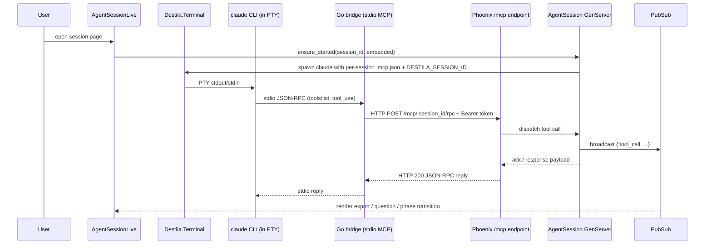
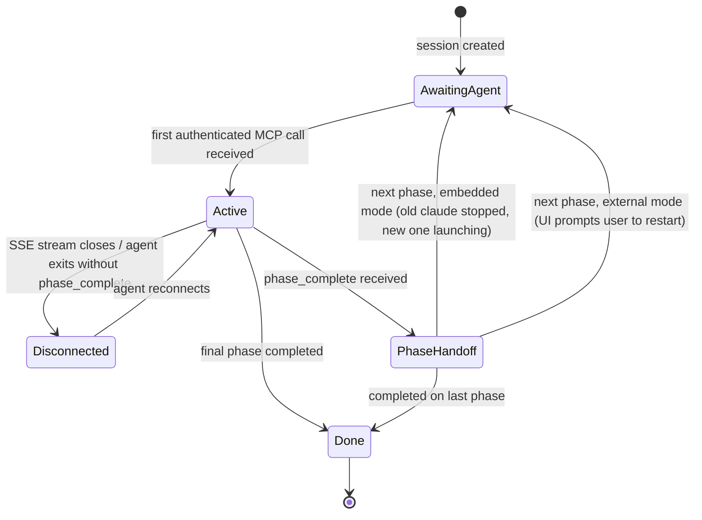
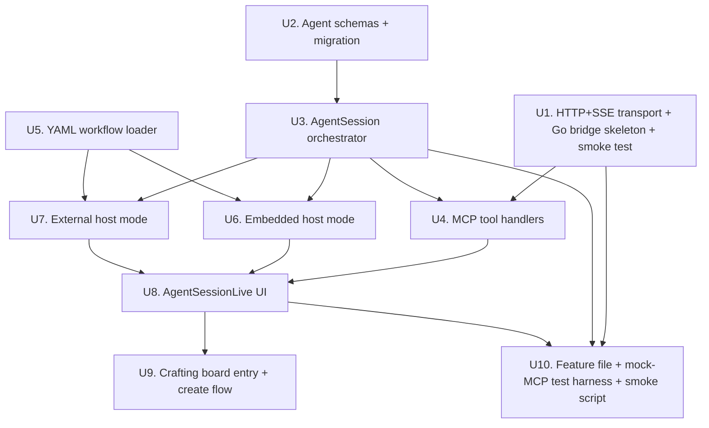

# feat: MCP-driven agent sessions (parallel path)

## Summary

Destila is losing access to the agent's assistant message stream due to a provider ToS change. We pivot the agent-interaction model so Destila operates as an **MCP server**, and the agent communicates back **only via MCP tool calls** — never via parsed assistant text. The user interacts with the agent directly (in Destila's embedded terminal UI or in their own external Claude Code CLI), not through a Destila-owned chat textarea.

This work introduces a **new agent-driven path that runs in parallel with the existing chat-based flow**. The existing chat path (`WorkflowRunnerLive`, `Destila.AI.{ClaudeSession, Conversation, ResponseProcessor, History}`, the 27 existing `.feature` files, the chat workflow Elixir modules under `lib/destila/workflows/`) stays fully functional and untouched until a later cutover. Build the new path alongside, do not refactor the old one.

The largest unknown is Claude Code's tolerance for our hand-rolled HTTP+SSE MCP transport — that smoke test is front-loaded as U1 and gates investment in the rest of the work.

---

## Problem Frame

- The current path reads the agent's assistant text to drive phase transitions, extract exports, and display chat bubbles. That reading channel is going away.
- The replacement must be **agent-driven via explicit MCP tool calls**: phase transitions happen only when the agent calls `mcp__destila__session` with `phase_complete`/`suggest_phase_complete`; exports happen only when the agent calls it with `export`.
- We must support **two host modes**: an embedded terminal Destila controls (where it can push to the agent's stdin) and a fully external Claude Code CLI on the user's machine (where Destila is a pure MCP server with no process-lifecycle authority).
- Destila must not store or parse assistant text anywhere in the new path. The only persisted session content is tool-call events and exports.
- The chat path must remain fully functional throughout; this is a **strict parallel rollout**, not a refactor.

---

## Scope Boundaries

### In scope

- New HTTP+SSE MCP server endpoint on Phoenix, authenticated by a global token from `config/runtime.exs`.
- A Go bridge CLI at `cmd/destila-mcp/` that exposes a stdio MCP server to the agent and translates calls to Destila's HTTP+SSE endpoint.
- New `Agent*` modules (`AgentSession`, `AgentSessionSupervisor`, `AgentSessionLive`, etc.) running alongside chat modules.
- New `agent_sessions` and `agent_session_events` tables; extension of `workflow_session_metadata` with a nullable `agent_session_id` FK so exports reuse the proven infrastructure.
- YAML workflow loader for `priv/workflows/*.yaml`.
- Embedded host mode reusing `Destila.Terminal` (PTY + tmux + xterm.js).
- External CLI host mode with paste-in-UI fallback for kickoff prompts and `ask_user_question` answers.
- Explicit-only phase transitions and exports through the existing `mcp__destila__session` tool surface (transport changes; tool semantics do not).
- Non-blocking `ask_user_question` semantics — MCP tool call returns immediately; answer delivery is out-of-band via stdin (embedded) or paste (external).
- Export-first session UI (`AgentSessionLive`) with collapsible secondary tool-call event log.
- New `features/mcp_driven_session.feature` with the seven sections specified in the request.
- Mock-MCP LiveView test harness as the primary test layer; manual smoke test of the real Go bridge against the dev server.

### Out of scope (strict)

- Any modification to `WorkflowRunnerLive`, `Destila.AI.{ClaudeSession, Conversation, ResponseProcessor, History}`, `DestilaWeb.ChatComponents`, or the chat workflow modules under `lib/destila/workflows/*_workflow.ex`.
- Any modification to the existing 27 `.feature` files.
- Migration of existing chat workflows into the YAML format.
- Multi-tenant authentication or per-session tokens — global token is sufficient for the current single-user deployment.
- Destila managing the external `claude` process lifecycle.
- Storing or parsing any agent assistant text in the new path.

### Deferred to follow-up work

- Cutover plan that retires the chat path and removes its modules and feature files.
- Per-session or scoped tokens once multi-user support is on the roadmap.
- Migrating chat workflow Elixir modules to YAML.
- Richer export rendering (diffs, side-by-side viewers) beyond what `workflow_session_metadata` already supports.
- Observability for the HTTP+SSE transport (structured access logs, latency metrics) once we have a baseline.

---

## Key Technical Decisions

1. **Hand-roll the HTTP+SSE MCP transport on Phoenix.** `ClaudeCode.MCP.Server` (used today in `lib/destila/ai/tools.ex`) is in-process only — the agent process living outside the BEAM cannot reach it through the existing macro. We implement JSON-RPC over HTTP for client→server calls and a long-lived SSE stream for server→client notifications, mounted under a new `/mcp` scope on `DestilaWeb.Endpoint`.

2. **Global token in `Authorization: Bearer …` header.** Read from `runtime.exs` (env `DESTILA_MCP_TOKEN`). Single token grants full access; the session id claimed by the bridge (via the `DESTILA_SESSION_ID` env var, forwarded as a header) is trusted once the token validates. Acceptable for single-user deployment; documented as a trust-model decision rather than a hardened multi-tenant boundary.

3. **Go bridge as a separate release artifact under `cmd/destila-mcp/`.** This repo has no Go code today; the bridge is greenfield. It is shipped separately from the Elixir release. Internal Elixir code never depends on the Go bridge.

4. **Reuse the existing tool surface.** The three tools defined in `lib/destila/ai/tools.ex` (`ask_user_question`, `session`, `service`) keep their JSON schemas exactly. Only the dispatch path changes — new hand-rolled handlers in `lib/destila/agent/tools/*.ex` rather than `ClaudeCode.MCP.Server` callbacks. The new path adds a fourth tool — `mcp__destila__exports_read` — so post-handoff agents can recover earlier-phase exports without inheriting prior conversational context.

5. **Reuse `Destila.Terminal` in embedded host mode.** PTY + tmux + xterm.js (`assets/js/hooks/xterm_hook.js`) are already production-tested. We add a thin launcher that writes a per-session `.mcp.json`, sets `DESTILA_SESSION_ID`, and starts `claude` inside `Destila.Terminal.Server`. Stdin pushes go through the terminal's existing input channel.

6. **Phase handoff in embedded mode = stop old `claude`, start fresh one.** The old conversational context is intentionally discarded. The new agent reads prior exports via the new `mcp__destila__exports_read` tool to recover the context it needs. This matches the user's intent: phases are independent agents, not a single long-running session.

7. **YAML workflows in `priv/workflows/*.yaml`.** Each file carries `name` and `phases: [{name, system_prompt, kickoff_prompt, agent_command}]`. Adds `:yaml_elixir` as a dependency — no existing YAML parser in the project (closest is the hand-rolled frontmatter parser in `lib/destila/workflows/skills.ex`, which is too narrow). Loaded once at app boot into `:persistent_term` for cheap lookup.

8. **New tables, extend existing exports table.** Two new tables (`agent_sessions`, `agent_session_events`) cover lifecycle and the tool-call event log. The existing `workflow_session_metadata` table gains a nullable `agent_session_id` FK so the new path writes exports through the proven schema and reuses the existing render path. Both `workflow_session_id` and `agent_session_id` are nullable but a CHECK constraint requires exactly one to be set.

9. **`ask_user_question` returns immediately.** The MCP tool-call return is a fixed acknowledgement (`{"ok": true, "question_id": "..."}`). The user's selection is delivered later: in embedded mode by writing the chosen value to the agent's stdin via `Destila.Terminal`; in external mode by surfacing the value in the UI for the user to paste. The answer never travels through the MCP return value — sessions can sit unanswered for days without holding HTTP connections open.

10. **PubSub event bus is the single internal coupling.** The HTTP/SSE channel → `AgentSession` GenServer → `AgentSessionLive` LiveView communication runs over `Phoenix.PubSub` (topic `agent_session:<id>`). Tests substitute a mock client that publishes the same events the real HTTP/SSE channel would, letting LiveView tests run without a real HTTP round trip.

---

## High-Level Technical Design

> The following diagrams illustrate the intended approach and are directional guidance for review, not implementation specification. The implementing agent should treat them as context, not code to reproduce.

### Tool-call flow (embedded mode)



### Host-mode decision matrix

| Behavior | Embedded host | External host |
|---|---|---|
| Agent process owner | Destila (via `Destila.Terminal`) | The user's machine |
| stdin available to Destila | Yes (write through `Destila.Terminal.Server`) | No |
| Kickoff prompt delivery | Push to stdin automatically | Surface in UI for user to paste |
| `ask_user_question` answer delivery | Write selection to stdin | Surface in UI for user to paste |
| Phase handoff | Stop old `claude`, start fresh one with new `.mcp.json` + system prompt | Show "restart your agent with these instructions" prompt; no process control |
| `.mcp.json` generation | Per-session temp file written by Destila | User configures their own once at install |
| Primary UI element | xterm.js terminal as agent surface | Connection info card + paste-target panel |

### AgentSession lifecycle



---

## Output Structure

New directories created by this plan:

```
cmd/
  destila-mcp/            # Greenfield Go bridge CLI (separate release artifact)
    go.mod
    main.go
    internal/
      mcpstdio/           # stdio JSON-RPC MCP server
      httpclient/         # HTTP+SSE client to Destila

lib/destila/agent/        # Orchestration (parallel to lib/destila/ai/)
  session.ex              # Ecto schema for agent_sessions
  session_event.ex        # Ecto schema for agent_session_events
  sessions.ex             # Context module
  session_server.ex       # GenServer per active session
  session_supervisor.ex   # DynamicSupervisor
  session_registry.ex     # Registry
  event_router.ex         # Dispatches incoming tool calls into the right session
  embedded_host.ex        # Launches/stops claude via Destila.Terminal
  external_host.ex        # Manages paste-buffer state
  mcp_config_writer.ex    # Writes per-session .mcp.json
  workflow.ex             # WorkflowDefinition struct
  workflow_loader.ex      # YAML loader
  tool_handlers.ex        # Dispatch table
  tools/
    session_tool.ex
    ask_user_question_tool.ex
    service_tool.ex
    exports_read_tool.ex

lib/destila_web/mcp/      # HTTP+SSE transport
  router.ex               # /mcp scope plug
  auth_plug.ex            # Bearer token validation
  rpc_controller.ex       # POST /mcp/:session_id/rpc
  sse_controller.ex       # GET /mcp/:session_id/events
  json_rpc.ex             # JSON-RPC 2.0 encode/decode helpers

lib/destila_web/live/
  agent_session_live.ex
  agent_session_create_live.ex
  agent_session_live/
    exports_panel.ex
    event_log_panel.ex
    question_panel.ex
    embedded_terminal_panel.ex
    external_host_panel.ex

priv/workflows/           # YAML workflow definitions
  example.yaml            # One sample workflow shipped with the plan
```

This tree is a scope declaration showing the expected output shape. Per-unit `**Files:**` sections remain authoritative for what each unit creates or modifies. Implementers may adjust file boundaries when implementation reveals a better layout.

---

## Dependencies



U1 must complete first — it derisks the single largest unknown (Claude Code's tolerance for the hand-rolled transport). U2 and U5 are independently startable but feed U3 and U6/U7. U10 (feature file + harness) is the final integration unit and depends on U8 being landable.

---

## Implementation Units

### U1. HTTP+SSE MCP transport skeleton + Go bridge skeleton + end-to-end smoke test

**Goal:** Derisk the transport. Get a real `claude` CLI connecting through the Go bridge into Destila over HTTP+SSE, exchanging a `tools/list` and invoking a no-op tool. No real session orchestration yet — the endpoint accepts the call, validates the token, echoes back a stub response.

**Requirements:** Establishes the transport layer used by every other unit. Derisks the largest unknown explicitly called out in the request ("Compatibility risk. Claude Code's tolerance for our hand-rolled HTTP/SSE MCP transport is the single largest unknown. Build an end-to-end smoke test of the bridge ↔ Destila HTTP/SSE round trip very early").

**Dependencies:** None.

**Files:**
- `lib/destila_web/mcp/router.ex` — new `Plug.Router` (or Phoenix `scope`) mounted under `/mcp` from `lib/destila_web/router.ex`.
- `lib/destila_web/mcp/auth_plug.ex` — validates `Authorization: Bearer <token>` against `Application.fetch_env!(:destila, :mcp_token)`.
- `lib/destila_web/mcp/rpc_controller.ex` — POST `/mcp/:session_id/rpc`; decodes JSON-RPC 2.0, dispatches via a stub `EventRouter.handle_call/3` (returns `{:ok, %{}}` until U4).
- `lib/destila_web/mcp/sse_controller.ex` — GET `/mcp/:session_id/events`; opens a long-lived SSE stream subscribed to `Phoenix.PubSub` topic `agent_session_outbound:<session_id>`. Until U3 lands, this just emits a hello event on connect.
- `lib/destila_web/mcp/json_rpc.ex` — helpers for JSON-RPC 2.0 request/response envelopes.
- `config/runtime.exs` — read `DESTILA_MCP_TOKEN`.
- `cmd/destila-mcp/go.mod`, `cmd/destila-mcp/main.go` — stdio MCP server that translates `tools/list` and `tools/call` to HTTP+SSE against Destila. Reads `DESTILA_MCP_TOKEN` and `DESTILA_MCP_URL` from env; session id from `DESTILA_SESSION_ID`.
- `cmd/destila-mcp/internal/mcpstdio/`, `cmd/destila-mcp/internal/httpclient/` — split for testability.
- `cmd/destila-mcp/README.md` — short build/install instructions.
- `scripts/mcp_smoke.sh` — drives the smoke test: starts the dev server, builds the Go binary, invokes `claude --mcp-config <generated>.json` against a stub workflow, asserts a no-op tool call round-trips.
- `test/destila_web/mcp/auth_plug_test.exs` — unit tests for token validation.
- `test/destila_web/mcp/json_rpc_test.exs` — unit tests for envelope handling.

**Approach:**
- Mount `/mcp` as a separate Phoenix scope (no `:browser` pipeline; new `:mcp` pipeline with `:accepts ["json"]`, `MCPAuthPlug`).
- SSE uses `Plug.Conn.send_chunked/2` + a per-connection process subscribed to PubSub; on `:DOWN` the process drops the stream.
- The Go bridge implements only the subset of MCP needed by Claude Code (`initialize`, `tools/list`, `tools/call`, `notifications/initialized`). Out-of-spec behavior is documented in `cmd/destila-mcp/README.md`.
- Session id is passed by Claude Code (configured via the per-session `.mcp.json`) as the bridge's stdin transport identifies it through `DESTILA_SESSION_ID`. The bridge sets a `X-Destila-Session-Id` header on every HTTP call, redundantly with the path segment, so misconfiguration is loud.
- The smoke test is **manual / nightly**, not part of `mix test`. It boots the real `claude` binary if installed; otherwise it `skip`s with an explanation.

**MCP protocol surface — concrete contract between bridge and Destila:**

The bridge ↔ Destila protocol is **our own HTTP shape**, not the MCP wire protocol. The bridge speaks the stdio-MCP wire protocol on its inward face (to `claude`) and translates to/from our HTTP+SSE shape on its outward face (to Destila). This is the key insight that lets us hedge against MCP wire-protocol drift: only the Go bridge needs to track upstream MCP changes; Destila's HTTP surface stays stable.

Destila's HTTP surface:

| Method + path | Purpose | Request body | Response |
|---|---|---|---|
| `POST /mcp/:session_id/rpc` | One JSON-RPC 2.0 client→server call | `{"jsonrpc":"2.0","id":<n>,"method":<str>,"params":<obj>}` | `{"jsonrpc":"2.0","id":<n>,"result":<obj>}` or `{"jsonrpc":"2.0","id":<n>,"error":{...}}` |
| `GET /mcp/:session_id/events` | Long-lived SSE stream for server→client notifications | n/a | `Content-Type: text/event-stream`, events framed as `event: <name>\ndata: <json>\n\n` |

JSON-RPC methods the bridge sends:
- `tools/list` — return the four tool schemas (`session`, `ask_user_question`, `service`, `exports_read`); shape mirrors `lib/destila/ai/tools.ex` exactly for the three reused tools.
- `tools/call` — `params: {name, arguments}`; returns `{content: [{type: "text", text: <ack>}], isError: false}` per MCP spec.
- `initialize` — return `{protocolVersion, capabilities, serverInfo: {name: "destila", version}}`. Stub a reasonable static reply in U1; real version pulled from `mix.exs`.
- `notifications/initialized`, `notifications/cancelled` — accept and ack (one-way fire-and-forget; ID absent).
- `ping` — reply with empty result; useful for keepalives during long phases.

SSE event names Destila can push (not required by U1, but documented so U3+ know the channel exists): `agent_handoff`, `kickoff_prompt` (only used if we ever decide to push prompts through MCP instead of stdin — current plan does not).

Headers Destila accepts:
- `Authorization: Bearer <DESTILA_MCP_TOKEN>` — required; mismatched or missing → 401 before any body parsing.
- `X-Destila-Session-Id: <session_id>` — redundant with path segment; if both present and disagree, return 400 with a loud error.
- `X-Destila-Bridge-Version: <semver>` — optional; logged but not enforced in U1.

The bridge's internal handling of `claude`'s stdio framing (LSP-style `Content-Length` headers, newline-delimited JSON, request/response correlation) is entirely inside `cmd/destila-mcp/internal/mcpstdio/`. We can adapt to any MCP transport changes by rebuilding only the bridge; no Elixir change is required.

**Deferred to implementation (U1 will resolve via the smoke test):**
- The exact `tools/call` response envelope Claude Code expects for our tools. The MCP spec is at `https://modelcontextprotocol.io/specification` — operator should fetch the current spec when starting U1 and pin to a specific version.
- Whether Claude Code's MCP HTTP transport mode (vs stdio) would let us skip the bridge entirely. Current plan assumes the bridge is required; the smoke test verifies. If Claude Code natively supports our HTTP shape, the bridge becomes optional and external-host mode could simplify.
- Keepalive / idle behavior on the SSE channel. Sane defaults: emit a `:keepalive` comment line every 15 s; verify Claude Code doesn't drop on idle.

**Patterns to follow:**
- Auth plug pattern: same shape as Phoenix's built-in pipelines (single-purpose plug, `init/1` + `call/2`).
- SSE pattern: search Phoenix docs for the chunked-response idiom; no existing SSE in this repo, so the implementation should be small and well-commented.

**Test scenarios:**
- *Happy path:* a request to `POST /mcp/abc/rpc` with a valid Bearer token returns a JSON-RPC 2.0 response for a stub `tools/list` (responds with the three reused tool schemas; the stub uses hard-coded schemas pending U4).
- *Auth — missing header:* returns 401 with no body content beyond a minimal JSON error.
- *Auth — wrong token:* returns 401.
- *Auth — correct token, wrong session id format:* still 200 (session id trust is post-token; per Decision 2).
- *SSE — connect with valid token:* response uses `Content-Type: text/event-stream`, sends a `:ok` hello event, and terminates cleanly when the client closes.
- *SSE — connect with invalid token:* 401 before stream opens.
- *JSON-RPC malformed request:* returns 200 with a JSON-RPC error envelope (`-32700` parse error).
- *Manual smoke test:* `scripts/mcp_smoke.sh` exits 0 against the dev server. Document expected output in the script's comments.

**Verification:**
- `mix test test/destila_web/mcp/` passes.
- `go build ./cmd/destila-mcp/...` succeeds.
- `scripts/mcp_smoke.sh` round-trips a real `claude` CLI through the bridge into Destila, with a non-zero number of tool-call attempts logged by the controller.

**Execution note:** Land U1 fully before starting U2 in earnest. If the smoke test reveals Claude Code rejects our transport, the cheapest pivot (e.g., to a community MCP HTTP transport library, or to an alternate framing) is at this boundary, not after U2–U9 are built.

---

### U2. Agent session Ecto schemas, migration, and exports table extension

**Goal:** Persistence layer for the new path. Two new tables and a nullable FK on the existing exports table.

**Requirements:** Backs the session-lifecycle scenarios ("Session detail page is reachable while the agent is disconnected", "Exports from prior phases remain available across handoff"), the tool-call event log behind the export-first UI, and the reuse of the existing exports infrastructure.

**Dependencies:** None (can land in parallel with U1).

**Files:**
- `priv/repo/migrations/<timestamp>_create_agent_sessions.exs` — creates `agent_sessions` and `agent_session_events`; alters `workflow_session_metadata` to add nullable `agent_session_id` FK and a CHECK constraint requiring exactly one of (`workflow_session_id`, `agent_session_id`) to be set.
- `lib/destila/agent/session.ex` — Ecto schema for `agent_sessions`: `id` (binary), `project_id` (FK, nullable), `workflow_name` (string), `current_phase_index` (integer), `total_phases` (integer), `host_mode` (enum `:embedded | :external`), `status` (enum `:awaiting_agent | :active | :disconnected | :done`), `connected_at` (utc_datetime), `disconnected_at` (utc_datetime), `title` (string), `archived_at` (utc_datetime), `deleted_at` (utc_datetime), `timestamps`.
- `lib/destila/agent/session_event.ex` — Ecto schema for `agent_session_events`: `id`, `agent_session_id` (FK), `phase_index` (integer), `tool_name` (string), `tool_input` (map), `tool_result` (map), `inserted_at`.
- `lib/destila/agent/sessions.ex` — context module: `list_sessions/1`, `get_session/1`, `create_session/1`, `record_event/3`, `transition_status/2`, `current_phase/1`.
- `lib/destila/workflows/session_metadata.ex` — extend schema with `belongs_to :agent_session, Destila.Agent.Session` (additive; existing chat code untouched because the FK is nullable).
- `test/destila/agent/sessions_test.exs` — context-level tests.

**Approach:**
- `agent_sessions` uses `:binary_id` primary keys to match the existing convention.
- Sessions can exist with no events and no agent connection (covers the "Session detail page is reachable while the agent is disconnected" scenario).
- The CHECK constraint on `workflow_session_metadata` enforces that any single metadata row belongs to exactly one path. This is the only schema-level coupling between the two paths.
- Phase-related state lives on `agent_sessions` (not on a separate `phase_executions` table) because the new path has no "awaiting confirmation" intermediate state — `suggest_phase_complete` is a UI-only handshake, not a persisted phase status.
- Disconnected agents do not transition the session out of `:active` until the SSE channel closes; this is detected via `Process.monitor` on the SSE handler process.

**Database engine and constraint syntax — confirmed:**

This project uses **SQLite** via `ecto_sqlite3 ~> 0.17` (see `mix.exs`). The new tables and the existing `workflow_session_metadata` extension must use SQLite-compatible syntax. Key implications:

- SQLite supports table-level `CHECK` constraints in `CREATE TABLE` but does **not** support adding a CHECK to an existing table via `ALTER TABLE` (only column drops/adds/renames since 3.35). This project has no existing CHECK constraints in `priv/repo/migrations/` — this migration is the first.
- The Ecto helper `create constraint/3` works on SQLite for CREATE-TABLE CHECKs only. To add a CHECK to the existing `workflow_session_metadata` table, the migration must either (a) use a transactional table-rebuild pattern (create new table with constraint, copy data, drop old, rename), or (b) enforce the invariant at the application layer via a changeset validation and document that the DB lacks the hard guard.
- **Decision: choose option (b) — application-level enforcement.** Adding a CHECK via table rebuild on `workflow_session_metadata` (which has production data) is high-risk and offers limited value. The application invariant ("exactly one of `workflow_session_id`, `agent_session_id` is set") will be enforced in `lib/destila/workflows/session_metadata.ex` via `validate_required_one_of([:workflow_session_id, :agent_session_id])` in the changeset. New rows go through `Sessions.record_event/3` or analogous, which calls the changeset. The migration adds the column, the FK, and an index — no CHECK.
- Index: add `create index(:workflow_session_metadata, [:agent_session_id])` so the U4 `exports_read` query (filtered by `agent_session_id`) and the U8 LiveView's exports stream (also filtered) stay cheap as the table grows. Without this index, every export-read scans the table.
- Two further indexes worth creating in this migration: `index(:agent_session_events, [:agent_session_id, :inserted_at])` (event log queries sort by time within a session) and `index(:agent_sessions, [:status])` (the crafting board's "active sessions" view filters by status).

**Patterns to follow:**
- Migration style: see `priv/repo/migrations/20260427044134_add_domain_and_basic_auth_to_projects.exs` for an additive alter.
- Context module style: see `lib/destila/projects.ex` and `lib/destila/workflows.ex`.
- Enum fields: see `lib/destila/executions/phase_execution.ex` for the `Ecto.Enum` pattern this project uses.

**Test scenarios:**
- *Happy path:* `Sessions.create_session/1` inserts a row with `status: :awaiting_agent` and `current_phase_index: 0`.
- *Disconnected sessions:* fetching a session with no recorded events returns the session and an empty event list (`Sessions.get_session/1` with `preload: [:events]`).
- *Event persistence:* `Sessions.record_event/3` writes a row, increments any in-memory counters via PubSub, and round-trips `tool_input`/`tool_result` maps as JSON.
- *Phase increment:* `Sessions.transition_status/2` for `:phase_complete` increments `current_phase_index` and emits a PubSub event.
- *Exports FK exclusivity (changeset-level):* a changeset with both `workflow_session_id` and `agent_session_id` set returns `valid?: false` with the `validate_required_one_of` error; a changeset with neither set returns the same error; a changeset with exactly one set is valid.
- *Exports FK index:* explain-plan of a query filtering by `agent_session_id` uses the new index (`mix ecto.dump` or `EXPLAIN QUERY PLAN` confirms `USING INDEX`).
- *Exports lookup across handoff:* `WorkflowSessionMetadata` rows scoped by `agent_session_id` return all rows including ones written in earlier phases. Covers AE: "Exports from prior phases remain available across handoff."
- *No-op for chat path:* existing `WorkflowSessionMetadata` queries that don't filter by `agent_session_id` still return rows where `agent_session_id IS NULL`. Smoke test the chat-path test suite still passes.

**Verification:**
- `mix ecto.migrate` runs cleanly.
- `mix test test/destila/agent/sessions_test.exs` and `mix test test/destila/workflows/session_metadata_test.exs` pass.
- The full pre-existing chat-path test suite (`mix test`) still passes — verified manually after the migration runs.

---

### U3. AgentSession orchestrator (GenServer + Supervisor + Registry + EventRouter)

**Goal:** The runtime engine that backs each active session. Receives tool calls from the HTTP+SSE transport via `EventRouter`, mutates session state via the `Sessions` context, broadcasts UI events over PubSub, and owns the phase lifecycle.

**Requirements:** Underlies every phase-transition, export, ask-user-question, and disconnect scenario in the feature file. Closes the loop between U1 (transport) and U4 (tool handlers) — the orchestrator is the single dispatch target for both.

**Dependencies:** U2 (schemas).

**Files:**
- `lib/destila/agent/session_server.ex` — GenServer per session; state holds `session` struct, `host_mode`, `current_phase_definition`, pending question id (if any), embedded terminal pid (if any). Handlers: `handle_call({:tool_call, name, params, request_id}, _, state)` returns the tool's reply payload synchronously; `handle_info({:sse_connected, _}, _)` transitions to `:active`; `handle_info({:sse_closed, _}, _)` transitions to `:disconnected`.
- `lib/destila/agent/session_supervisor.ex` — `DynamicSupervisor` named `Destila.Agent.SessionSupervisor`.
- `lib/destila/agent/session_registry.ex` — `Registry` keyed by `agent_session_id`.
- `lib/destila/agent/event_router.ex` — receives JSON-RPC tool calls from `RpcController`, looks up the session via `Registry`, forwards via `GenServer.call/3`. Handles the case where no GenServer is running (re-start from DB state).
- `lib/destila/application.ex` — add the supervisor + registry to the supervision tree.
- `test/destila/agent/session_server_test.exs` — orchestrator tests.
- `test/destila/agent/event_router_test.exs` — router tests.

**Approach:**
- One GenServer per active session, started on first authenticated MCP call. Idle GenServers shut down after a configurable timeout (default: 30 min after last event); the next call rehydrates from DB.
- PubSub topic: `agent_session:<id>` (LiveView subscribes); `agent_session_outbound:<id>` (SSE controller subscribes for server→client notifications, if any are ever needed by the agent).
- Tool calls are handled synchronously inside the GenServer (matching the MCP JSON-RPC request/response contract) — except for `ask_user_question`, which returns immediately with an acknowledgement and emits a PubSub event to the LiveView for user-interactive elicitation. See Decision 9.
- The orchestrator does **not** parse or store assistant text — there is none to store. Only `agent_session_events` rows for tool calls are persisted.
- Phase advancement is **always** the result of an explicit `phase_complete` tool call. The GenServer never advances on its own.

**Patterns to follow:**
- Supervisor + Registry + GenServer trio: see `lib/destila/ai/session_supervisor.ex` + `lib/destila/ai/session_registry.ex` + `lib/destila/ai/claude_session.ex` for the canonical shape.
- PubSub event names: snake_case atom keys to match `Destila.Sessions.SessionProcess` style.

**Test scenarios:**
- *Happy path:* `EventRouter.handle_rpc/3` for a `phase_complete` call on a fresh session writes an event row, increments `current_phase_index`, broadcasts `{:phase_advanced, ...}`, and returns the JSON-RPC reply.
- *Rehydration:* starting a fresh GenServer from a session id that already has events in the DB rebuilds state correctly (current phase index, status).
- *SSE connection lifecycle:* receiving `{:sse_connected, _}` transitions a session in `:awaiting_agent` to `:active`. Receiving `{:sse_closed, _}` transitions it to `:disconnected`. Covers AE: "Session activates when the external agent connects."
- *Idle shutdown:* a GenServer with no events for the configured idle timeout shuts down cleanly and can be re-started on the next call.
- *Concurrency:* two parallel `phase_complete` calls on the same session — only the first advances (idempotent by phase index check).
- *Disconnect mid-phase:* SSE closes while phase is not complete → status `:disconnected`, current phase unchanged. Covers AE: "Agent exit without phase_complete leaves the phase open."
- *No assistant text:* the GenServer rejects any unknown tool name with a JSON-RPC method-not-found error; assert no event row is written for unknown tools.
- *Event log captures only tool calls:* after a sequence of N tool calls, `Sessions.list_events/1` returns exactly N rows; querying for rows with `tool_name IS NULL` or any non-tool-call discriminator returns nothing. Covers AE: "Session log records only tool-call events; no agent assistant text should be stored."

**Verification:**
- `mix test test/destila/agent/session_server_test.exs test/destila/agent/event_router_test.exs` passes.
- A unit test that starts and stops 10 sessions in parallel against the in-memory Registry shows no leaked processes (`Process.alive?` check + DynamicSupervisor child count).

---

### U4. MCP tool handlers (session, ask_user_question, service, exports_read)

**Goal:** Hand-rolled dispatch table for the four MCP tools the new path exposes. Each handler takes parsed JSON-RPC params + a session GenServer pid and returns the JSON-RPC reply payload.

**Requirements:** Implements the semantics for `phase_complete`/`suggest_phase_complete`/`export` (explicit-only transitions scenarios), `ask_user_question` (non-blocking semantics scenario), `service` (parity with chat path), and `exports_read` (multi-phase handoff context recovery — Decision 4 / handoff scenarios).

**Dependencies:** U1 (transport boundary), U3 (orchestrator dispatch target).

**Files:**
- `lib/destila/agent/tool_handlers.ex` — dispatch table mapping tool name → handler module.
- `lib/destila/agent/tools/session_tool.ex` — handles `phase_complete`, `suggest_phase_complete`, `export`.
- `lib/destila/agent/tools/ask_user_question_tool.ex` — emits the question event over PubSub, persists a "pending question" event, returns immediate ack.
- `lib/destila/agent/tools/service_tool.ex` — delegates to `Destila.Services.ServiceManager.execute/3` (already used by the chat path's tool handler).
- `lib/destila/agent/tools/exports_read_tool.ex` — returns the list of metadata rows for the current `agent_session_id`, including earlier phases.
- `lib/destila/ai/tools.ex` — **NOT MODIFIED**. The existing in-process tool definitions stay exactly as they are for the chat path.
- `test/destila/agent/tools/*_test.exs` — per-tool tests, one file each.

**Approach:**
- Tool schemas exposed via `tools/list` are derived from `Destila.Agent.ToolHandlers.schemas/0`. Hard-code the schemas there rather than importing from `lib/destila/ai/tools.ex` — Decision 4 says "reuse the tool surface" semantically; coupling at the schema level would create a refactor risk on the chat path.
- `export` action: persists a `workflow_session_metadata` row with `agent_session_id` set, `exported: true`, and the phase index. Broadcasts `{:export_added, metadata}` so the LiveView's exports panel updates in real time.
- `suggest_phase_complete`: persists an event row, broadcasts `{:suggest_phase_complete, reason}` to the LiveView. The LiveView renders the confirmation prompt; user confirmation triggers a LiveView event that calls `Sessions.transition_status/2`. The tool call itself returns immediately.
- `phase_complete`: persists, increments phase index, broadcasts `{:phase_advanced, new_index}`. Returns immediately.
- `ask_user_question`: writes an `agent_session_events` row with `tool_name: "ask_user_question"` and a generated `question_id`, broadcasts the question to the LiveView, returns `{:ok, %{question_id: q_id}}` immediately. The selection is delivered later via stdin (embedded) or paste (external), wired in U6/U7.
- `exports_read`: reads from `WorkflowSessionMetadata` scoped to the `agent_session_id`. Returns a list of `{phase_name, key, value, type}` maps.

**Patterns to follow:**
- Tool schema shape: mirror `lib/destila/ai/tools.ex` field-for-field so external behavior stays consistent.
- Service tool dispatch: see how `ServiceManager.execute/3` is called from `lib/destila/sessions/session_process.ex`.

**Test scenarios (per handler):**
- *`session.phase_complete`:* writes event row, increments phase index, broadcasts `:phase_advanced`. Covers AE: "phase_complete auto-advances the session."
- *`session.suggest_phase_complete`:* writes event row, broadcasts `:suggest_phase_complete`, does **not** advance phase index. Covers AE: "suggest_phase_complete waits for user confirmation."
- *`session.export` text/markdown/file types:* each persists a `workflow_session_metadata` row with the right `type` annotation in `value`. Covers AE: "New exports appear in real-time at the top of the session view."
- *`ask_user_question` returns immediately:* the handler's return is dispatched within milliseconds; no waiting on user input. Assert the broadcast was sent. Covers AE: "ask_user_question tool call does not block on the user's reply."
- *`ask_user_question` non-blocking under load:* fire 100 questions on a session with no UI subscribers; all 100 return immediately and no events are dropped.
- *`exports_read` cross-phase:* with prior-phase exports present, the handler returns them all. Covers AE: "the new agent should be able to read them via the MCP exports tool."
- *`exports_read` empty:* on a session with no exports, returns an empty list.
- *`service.start/stop/restart/status`:* delegates correctly to `ServiceManager` and propagates errors.
- *Unknown tool:* dispatched name not in the registry returns a JSON-RPC method-not-found error.

**Verification:**
- `mix test test/destila/agent/tools/` passes.
- Integration via `EventRouter` (using a real GenServer) confirms an `export` call shows up in a queried `WorkflowSessionMetadata.exports_for_agent_session/1`.

---

### U5. YAML workflow loader + sample workflow

**Goal:** Load workflow definitions from `priv/workflows/*.yaml`. Each YAML file defines a workflow name and a phases list.

**Requirements:** Underpins the multi-phase scenarios — system prompts, kickoff prompts, and `agent_command` are all phase-level configuration that the embedded/external host code uses when starting an agent.

**Dependencies:** None (U6/U7 consume it).

**Files:**
- `mix.exs` — add `{:yaml_elixir, "~> 2.11"}` to deps.
- `mix.lock` — regenerated by `mix deps.get`.
- `lib/destila/agent/workflow.ex` — `WorkflowDefinition` struct: `name`, `phases: [Phase{name, system_prompt, kickoff_prompt, agent_command}]`.
- `lib/destila/agent/workflow_loader.ex` — `load_all/0` reads `priv/workflows/*.yaml`, validates required fields, caches under `:persistent_term` keyed by workflow name; `get/1` fetches by name.
- `priv/workflows/example.yaml` — one sample workflow with two phases so U6/U7 have something to drive.
- `lib/destila/application.ex` — call `WorkflowLoader.load_all/0` at boot.
- `test/destila/agent/workflow_loader_test.exs` — unit tests.

**Approach:**
- `agent_command` is a list of strings (e.g. `["claude", "--mcp-config", "{{mcp_config_path}}"]`) with `{{...}}` placeholders that the embedded host resolves at launch time. Keeping it explicit per phase makes it possible for different phases to use different models or flags.
- Validation at load time is strict: missing fields fail loud at boot so we never silently launch a misconfigured agent.
- `:persistent_term` is appropriate because workflow definitions are read-many, write-once-at-boot.

**Patterns to follow:**
- The frontmatter loader in `lib/destila/workflows/skills.ex` shows how this project handles file-driven definitions today.
- App-boot one-shot loaders: see `lib/destila/application.ex` for the existing supervised children pattern.

**Test scenarios:**
- *Happy path:* a valid YAML with two phases loads into a `WorkflowDefinition` with two `Phase` structs in order.
- *Missing required field:* a YAML file missing `kickoff_prompt` on one phase raises a descriptive error at `load_all/0`.
- *Empty phases list:* raises.
- *Duplicate workflow name:* raises (two files with the same `name:`).
- *Unknown YAML keys:* allowed (forward-compat) but logged.
- *Lookup by name:* `WorkflowLoader.get("example")` returns the cached struct; `get("missing")` returns `{:error, :not_found}`.

**Verification:**
- `mix test test/destila/agent/workflow_loader_test.exs` passes.
- `mix compile` succeeds with the new dep.
- The example workflow loads on boot in `iex -S mix`.

---

### U6. Embedded host mode (PTY-driven agent lifecycle)

**Goal:** Launch and manage a `claude` process inside `Destila.Terminal` for an `agent_session` in embedded host mode. Write per-session `.mcp.json`, set `DESTILA_SESSION_ID`, push kickoff prompts and `ask_user_question` answers via stdin, and stop/restart the agent at phase boundaries.

**Requirements:** Covers all embedded-host scenarios in the feature file — kickoff push, stdin selection delivery, phase handoff agent restart, exports persistence across handoff.

**Dependencies:** U3, U4, U5.

**Files:**
- `lib/destila/agent/embedded_host.ex` — the lifecycle controller. Functions: `start_phase/2`, `stop_phase/1`, `push_kickoff/2`, `push_answer/2`.
- `lib/destila/agent/mcp_config_writer.ex` — writes a per-session `.mcp.json` to a tmpdir, returns the path. The config registers the Go bridge as an stdio MCP server with `env: {DESTILA_SESSION_ID, DESTILA_MCP_TOKEN, DESTILA_MCP_URL}`.
- `lib/destila/agent/process_launcher.ex` — thin wrapper around `Destila.Terminal.Server` that knows how to substitute the `{{mcp_config_path}}` placeholder in the phase's `agent_command`.
- `lib/destila/agent/session_server.ex` — extended to call `EmbeddedHost.start_phase/2` on phase advance when `host_mode == :embedded`.
- `test/destila/agent/embedded_host_test.exs` — uses Mimic to mock `Destila.Terminal.Server`.

**Approach:**
- The terminal process is the agent's stdin/stdout. `push_kickoff/2` calls the existing `Destila.Terminal.Server.write/2` (or equivalent) to inject the phase's `kickoff_prompt` followed by a newline.
- `push_answer/2` does the same for `ask_user_question` selections.
- The `system_prompt` is delivered via `claude --append-system-prompt <file>` (or whichever flag Claude Code supports for system-prompt injection); the file is written to a tmpdir alongside `.mcp.json`.

**Phase handoff state machine — concrete spec:**

`SessionServer` carries an `embedded` sub-state with these values:
`:idle` → `:starting` → `:running` → `:stopping` → `:awaiting_new_agent` → `:running` (loop) or `:done`.

> The following sketch illustrates the intended approach and is directional guidance for review, not implementation specification.

```mermaid
stateDiagram-v2
  [*] --> Idle
  Idle --> Starting: start_phase(phase_def)
  Starting --> Running: SSE connects + initialize received
  Starting --> Failed: spawn fails OR SSE never connects within 30s
  Running --> Stopping: phase_complete received
  Stopping --> AwaitingNewAgent: old PTY :DOWN received
  Stopping --> Stopping: 5s soft-stop timer (SIGTERM resent); after 10s SIGKILL
  AwaitingNewAgent --> Starting: spawn next phase's agent
  AwaitingNewAgent --> Done: no more phases
  Failed --> Idle: user clicks "Retry" in UI
```



Concrete timings and rules:

1. **`start_phase/2`** (state `:idle` → `:starting`): writes `.mcp.json` + system-prompt file to a per-session tmpdir, spawns `claude` via `Destila.Terminal.Server.start_link/1`, stores the terminal pid, and starts a `Process.monitor`. Records `start_time`.
2. **Spawn-to-active gate**: a `:starting` session does not push the kickoff prompt until both (a) SSE has connected (signaled by `EventRouter` upon first authenticated request) AND (b) the `initialize` JSON-RPC method has been received. The kickoff push is buffered until both fire; sub-state moves to `:running`. If 30 s elapse in `:starting`, transition to `:failed` and broadcast a banner event to the LiveView so the user can retry.
3. **Buffered pushes during gap**: while in `:starting` or `:awaiting_new_agent`, all calls to `push_kickoff/2` and `push_answer/2` append to an in-state FIFO queue `pending_stdin`. On entry to `:running`, the queue is flushed in order with a 50 ms delay between writes (gives the agent a chance to prompt). On entry to `:failed`, the queue is preserved so a retry replays it.
4. **`stop_phase/1`** (state `:running` → `:stopping`): sends a terminal-level interrupt (`Ctrl+C` written through `Destila.Terminal.Server.write/2`) then a `:close` to the PTY. Starts a 5 s timer. If the monitored pid has not exited at 5 s, send SIGTERM via the existing `Destila.Terminal` API. At 10 s total, send SIGKILL. Either way, the `:DOWN` arriving at the `SessionServer` mailbox is the canonical "old agent is gone" signal — transition to `:awaiting_new_agent` only on `:DOWN`.
5. **`:awaiting_new_agent`**: regenerate per-session `.mcp.json` and system-prompt file for the next phase, then call `start_phase/2` again. The session GenServer is the single owner of the tmpdir; old files are overwritten or cleaned per phase.
6. **What if the new agent never connects?**: the same 30 s gate from rule 2 fires. The session transitions to `:failed` and the LiveView shows a banner with "Retry handoff" and "Switch to external mode" actions. Exports from prior phases remain intact (they live in `workflow_session_metadata`, not in process state).
7. **Crash recovery**: if `SessionServer` itself crashes mid-handoff, its supervisor restarts it; the new GenServer rehydrates from DB (status = `:active` or `:disconnected` based on last persisted state). The PTY pid is lost; the new GenServer transitions sub-state to `:idle` and the LiveView prompts the user to restart the agent for the current phase. This is acceptable because handoff crashes are rare and exports are durable.
8. **Concurrent `stop_phase` calls**: idempotent — second call observes sub-state `:stopping` and is a no-op.

**Patterns to follow:**
- `Destila.Terminal.Server` API: see `lib/destila/terminal/server.ex` for write/input.
- Mimic mocking pattern: see how `test/destila/terminal_test.exs` mocks ExPTY today.

**Test scenarios:**
- *Happy path:* `EmbeddedHost.start_phase/2` writes a `.mcp.json` to a tmpdir, calls `Destila.Terminal.Server.start_link` with the resolved command and env, and returns the pid.
- *Kickoff push:* `push_kickoff/2` invokes `Destila.Terminal.Server.write/2` with the phase's `kickoff_prompt` followed by `\n`. Covers AE: "Destila pushes a phase-kickoff prompt to the agent's stdin."
- *Answer push:* `push_answer/2` writes the selected value + newline. Covers AE: "Selection is written to the agent's stdin in embedded host mode."
- *Phase handoff:* on `:phase_advanced`, the old terminal pid receives a stop, then a new pid is created with the next phase's command. The old pid's `:DOWN` is monitored to confirm clean termination. Covers AE: "Phase boundary stops the current agent and starts a fresh one."
- *Handoff under load:* triggering handoff while a kickoff push is in flight queues the push for the new agent rather than dropping it.
- *Agent crash without phase_complete:* terminal exit transitions session to `:disconnected`; phase index unchanged. Covers AE: "Agent exit without phase_complete leaves the phase open."
- *`.mcp.json` content:* the generated file references the absolute path to the `destila-mcp` binary (configurable via `Application.fetch_env(:destila, :mcp_bridge_path)`), the global token, and `DESTILA_SESSION_ID`. Integration test reads the file and asserts shape.
- *Spawn-to-active 30 s gate:* a session in `:starting` whose SSE never connects transitions to `:failed` after 30 s; the LiveView receives a `:phase_failed` event with the reason. Verified by mocking the clock with `Process.send_after` substitution or by injecting a shorter timeout in test config.
- *Buffered stdin during gap:* calls to `push_kickoff/2` during `:starting` accumulate in `pending_stdin`; on `:running` entry the queue is flushed in order with a 50 ms inter-write delay (verifiable via Mimic expectations on `Destila.Terminal.Server.write/2`).
- *Soft-stop escalation:* a `:stopping` session whose monitored pid does not exit at 5 s receives SIGTERM, at 10 s receives SIGKILL. Test injects a fake terminal that ignores the soft-close and asserts SIGTERM/SIGKILL calls (Mimic).
- *Retry after `:failed`:* user-triggered retry replays the preserved `pending_stdin` queue against the new agent and clears it on flush.
- *Concurrent stop calls:* two `stop_phase/1` calls back-to-back result in exactly one termination sequence (idempotent).
- *SessionServer crash mid-handoff:* killing the GenServer with `Process.exit(pid, :kill)` during `:stopping` results in a clean restart with sub-state `:idle`; exports from prior phases are unchanged.

**Verification:**
- `mix test test/destila/agent/embedded_host_test.exs` passes.
- A LiveView integration test (in U10) starts a real embedded session and asserts that the terminal panel renders with a process running.

---

### U7. External CLI host mode (paste-in-UI fallback)

**Goal:** Support sessions where the agent runs on the user's machine and Destila has no stdin channel. Surface MCP connection details for the user to wire into their own `.mcp.json`; surface kickoff prompts and `ask_user_question` answers as paste-ready text.

**Requirements:** Covers the external-host section of the feature file — connection instructions, agent-connect activation, kickoff surfaced for paste, no stdin push attempted, handoff prompting the user to restart.

**Dependencies:** U3, U4, U5.

**Files:**
- `lib/destila/agent/external_host.ex` — surface/notify functions: `connection_info/1`, `queue_kickoff/2`, `queue_answer/2`.
- `lib/destila/agent/session_server.ex` — branches on `host_mode == :external` to call `ExternalHost.queue_kickoff/2` instead of pushing to stdin.
- `lib/destila_web/live/agent_session_live/external_host_panel.ex` — UI component that renders connection info and the paste-target panel.
- `test/destila/agent/external_host_test.exs` — verifies no terminal/process side effects.

**Approach:**
- Connection info: shows the user the bridge install command, the global token (with a "copy" affordance), the MCP server URL, and the `DESTILA_SESSION_ID` value to set when invoking `claude`.
- "Paste targets" (kickoff prompts, `ask_user_question` selections) accumulate in the session GenServer as a list under `pending_paste_items`. The LiveView renders the most recent one prominently with a "Copy" button.
- No process lifecycle: `ExternalHost` never calls anything that could spawn or stop a `claude` process.
- Handoff: when `:phase_advanced` fires in external mode, the LiveView shows a modal "Restart your external agent with the new phase's instructions" and surfaces the new system prompt + kickoff for copying.

**Patterns to follow:**
- LiveComponent style: `DestilaWeb.ChatComponents` for component composition, but **do not** import or use the chat-specific helpers.

**Test scenarios:**
- *Connection info:* `connection_info/1` returns a map containing the bridge path, token, URL, and session id env var name — no surprise fields. Covers AE: "Creating an external-host session shows MCP connection instructions."
- *Agent connect activates:* simulating an SSE connect on an external session transitions it to `:active`. Covers AE: "Session activates when the external agent connects."
- *No stdin push attempted:* on `:phase_advanced` with `host_mode: :external`, `ExternalHost.queue_kickoff/2` is called and `Destila.Terminal` is never touched (verified via Mimic expect-no-calls). Covers AE: "Destila does not attempt stdin pushes in external host mode."
- *Paste target for ask_user_question:* on a `:question_asked` event, the selected value (after the user clicks an option) is added to `pending_paste_items` and surfaced in the UI. Covers AE: "Selection is surfaced for manual paste in external host mode."
- *Handoff prompt:* on `:phase_advanced`, the LiveView shows the restart-your-agent modal. Covers AE: "External host handoff requires user action."

**Verification:**
- `mix test test/destila/agent/external_host_test.exs` passes.
- LiveView test (U10) confirms the external-host UI renders connection info and no terminal panel.

---

### U8. AgentSessionLive — export-first session UI

**Goal:** The new LiveView that backs every MCP-driven session. Export-first layout: exports headline; tool-call event log secondary/collapsible; embedded terminal or external-host panel as the agent surface; question panel that appears when `ask_user_question` is pending.

**Requirements:** Covers every UI-facing scenario in the feature file.

**Dependencies:** U3, U4, U6, U7.

**Files:**
- `lib/destila_web/live/agent_session_live.ex` — main LiveView at `/agent-sessions/:id`.
- `lib/destila_web/live/agent_session_live/exports_panel.ex` — headline exports area.
- `lib/destila_web/live/agent_session_live/event_log_panel.ex` — collapsible secondary tool-call log (streamed via LiveView streams keyed by event id).
- `lib/destila_web/live/agent_session_live/question_panel.ex` — renders `ask_user_question` with clickable options.
- `lib/destila_web/live/agent_session_live/embedded_terminal_panel.ex` — mounts the xterm.js hook for embedded sessions.
- `lib/destila_web/live/agent_session_live/external_host_panel.ex` — already created in U7; this unit only consumes it.
- `lib/destila_web/live/agent_session_live/phase_handoff_modal.ex` — confirmation modal for `suggest_phase_complete` and the external-host "restart your agent" prompt.
- `lib/destila_web/router.ex` — add `live "/agent-sessions/:id", AgentSessionLive` in the existing `:browser` pipeline scope.
- `test/destila_web/live/agent_session_live_test.exs` — primary LiveView test file (most scenarios from the feature file land here).

**Approach:**
- Layout uses Tailwind grid: the exports panel occupies the primary column (top of page), the agent surface (terminal or external-host panel) occupies the secondary column or below, and the event log is a collapsible panel at the bottom.
- Subscribes to `agent_session:<id>` PubSub topic on mount. Handlers for: `:export_added`, `:phase_advanced`, `:suggest_phase_complete`, `:question_asked`, `:question_answered`, `:agent_connected`, `:agent_disconnected`.
- Exports rendered via `Phoenix.LiveView.stream/3` (one stream per session) so new exports appear in real-time without re-rendering the whole list.
- Event log: also streamed; collapsed by default.
- Question selection click handler: emits `{:answer, question_id, value}` to the GenServer, which forwards to `EmbeddedHost.push_answer/2` or `ExternalHost.queue_answer/2` depending on host mode. Either way the UI marks the question as answered.
- No chat textarea anywhere in this LiveView. Covers AE: "Session is created without a chat textarea."
- Empty-state: the exports panel renders a placeholder when the stream is empty. Covers AE: "Empty session shows an exports placeholder, not a chat transcript."
- Disconnected state: the LiveView still mounts and renders normally; the agent-surface panel shows an "agent not connected" indicator. Covers AE: "Session detail page is reachable while the agent is disconnected."

**Patterns to follow:**
- xterm.js hook: `assets/js/hooks/xterm_hook.js` (`TerminalPanel` preset) — exactly the same hook the existing terminal LiveView uses.
- LiveView streams: see `CLAUDE.md` LiveView streams section; the chat path's `WorkflowRunnerLive` is the closest in-repo example, but **do not import from it**.
- Layout shell: `<Layouts.app flash={@flash} current_scope={@current_scope}>` per CLAUDE.md.

**Test scenarios:**
- *No chat textarea:* mount the LiveView, assert `refute has_element?(view, "textarea[name='chat']")` and that there is no `<.form id="chat-form">` element. Covers AE.
- *Exports headline placement:* assert the exports panel has `id="exports-panel"` and sits structurally before `id="event-log-panel"` in the DOM. (Use LazyHTML to assert ordering.) Covers AE.
- *Empty exports placeholder:* with no exports, `#exports-empty-placeholder` is visible and the event-log is collapsed. Covers AE.
- *Real-time export render:* publish an `:export_added` event over PubSub; assert the new export's `id` appears in `#exports-panel` without a navigation. Covers AE.
- *phase_complete auto-advance:* publish `:phase_advanced`; assert the phase header updates and no confirmation modal renders. Covers AE.
- *suggest_phase_complete confirmation:* publish `:suggest_phase_complete` with a reason; assert the modal renders with the reason; clicking confirm fires a LiveView event that calls `Sessions.transition_status/2`. Covers AE.
- *No phase advance without explicit call:* publish unrelated events; assert phase header unchanged. Covers AE: "Phase advances only on an explicit phase_complete tool call."
- *Question render:* publish `:question_asked`; assert option buttons render with the right values; clicking one fires the answer event. Covers AE.
- *Question answered marker:* after a `:question_answered` event, the original question card renders as answered (greyed/checked). Covers AE.
- *Embedded terminal renders:* for `host_mode: :embedded`, `#embedded-terminal` is in the DOM with the `phx-hook="TerminalPanel"` attribute. Covers AE.
- *External-host panel renders:* for `host_mode: :external`, `#external-host-panel` is in the DOM with token + URL elements; no `#embedded-terminal`. Covers AE.
- *Disconnected agent indicator:* publish `:agent_disconnected`; assert `#agent-status` shows "not connected" copy. Covers AE.
- *Direct user input into embedded terminal:* simulate a `phx-event` `terminal_input` from the xterm.js hook with a payload of `"hello\n"`; assert that the LiveView forwards the bytes to the underlying `Destila.Terminal.Server.write/2` (verified via Mimic). Covers AE: "User types directly into the embedded terminal."

**Verification:**
- `mix test test/destila_web/live/agent_session_live_test.exs` passes.
- Manual: open `/agent-sessions/<id>` in the dev server; the page loads with the export-first layout and no chat textarea.

---

### U9. Crafting board entry point + AgentSessionCreateLive

**Goal:** A user-facing entry point to create a new MCP-driven session, choose host mode, choose a workflow from the YAML registry, and land on `AgentSessionLive`.

**Requirements:** Covers the "Session is created without a chat textarea" scenario from the user's perspective (entering the session, not just rendering it).

**Dependencies:** U3, U8.

**Files:**
- `lib/destila_web/live/crafting_board_live.ex` — additive: new "New MCP-driven session" card alongside the existing "Start New Workflow" entry. Routes to `/agent-sessions/new`. **No removal of existing UI.**
- `lib/destila_web/live/agent_session_create_live.ex` — form-based create flow: choose workflow (from `WorkflowLoader.list_all/0`), choose host mode (embedded or external), optional project association. On submit calls `Sessions.create_session/1`, redirects to `/agent-sessions/:id`.
- `lib/destila_web/router.ex` — add `live "/agent-sessions/new", AgentSessionCreateLive`.
- `test/destila_web/live/agent_session_create_live_test.exs` — tests the create flow.

**Approach:**
- The new crafting board card is purely additive — chat-path entries unchanged. Use a distinct label ("New agent-driven session" or similar) and a flag/badge (e.g., "MCP") so it's clearly the new path during the rollout window.
- The form uses `to_form/2` per Phoenix conventions. Workflow dropdown sourced from `WorkflowLoader.list_all/0`. Host mode is a radio.
- Sessions can be created without an attached project (matches the user prompt's lack of project requirement for the new path).

**Patterns to follow:**
- Form pattern: see `lib/destila_web/live/create_session_live.ex` for the existing chat-path create flow as a structural reference (but do not refactor it).
- Crafting board card pattern: see existing cards in `lib/destila_web/live/crafting_board_live.ex`.

**Test scenarios:**
- *Happy path embedded:* fill the form, select "embedded", select a workflow, submit; assert redirect to `/agent-sessions/:id` and that `Sessions.get_session/1` returns a row with `host_mode: :embedded`.
- *Happy path external:* same with "external"; row stored as `:external`.
- *Validation — workflow not chosen:* form re-renders with error.
- *Crafting board card visible:* mount the crafting board, assert the new "New MCP-driven session" card is present with `id="new-mcp-session-card"`.
- *Existing crafting board entries still present:* assert the existing "Start New Workflow" entry is still rendered (regression check that we haven't accidentally removed chat-path UI).

**Verification:**
- `mix test test/destila_web/live/agent_session_create_live_test.exs` passes.
- `mix test test/destila_web/live/crafting_board_live_test.exs` (existing chat-path tests for the crafting board) still passes.

---

### U10. features/mcp_driven_session.feature + mock-MCP test harness + manual smoke test docs

**Goal:** Land the single new Gherkin file with the seven sections specified in the request, the `MockMCPClient` test helper that backs the LiveView tests in U2–U9, and short documentation for running the manual smoke test from U1.

**Requirements:** Codifies all behavioral commitments in the feature file. Closes the loop on the "primary test layer is mock-MCP driving LiveView tests" decision from the request.

**Dependencies:** U1 (smoke script), U3 (event router boundary), U8 (LiveView).

**Files:**
- `features/mcp_driven_session.feature` — the exact seven-section file from the user prompt, verbatim. **Do not modify the existing 27 feature files.**
- `test/support/mock_mcp_client.ex` — helper that publishes the same PubSub events the real HTTP/SSE controller would, plus convenience methods like `simulate_tool_call/3`, `simulate_export/2`, `simulate_question/2`, `simulate_disconnect/1`. Used by every LiveView test in U2–U9 to drive the system without touching HTTP.
- `test/destila_web/live/agent_session_live_test.exs` — gains `@tag feature: "mcp_driven_session", scenario: "..."` on each test mapped to a scenario in the feature file. (The actual tests are written in U8 and U9 — this unit just guarantees every scenario in the feature file has at least one linked test.)
- `docs/mcp_smoke_test.md` — operator documentation for running `scripts/mcp_smoke.sh` against the dev server (when to run it, expected output, troubleshooting).

**Approach:**
- The feature file is copied verbatim from the user prompt — no editorial changes. The seven section dividers (`# --- ... ---`) match the style of `features/exported_metadata.feature`.
- `MockMCPClient` is the standard substitute for the HTTP+SSE controller in LiveView tests. It calls `EventRouter.handle_rpc/3` directly (the public boundary of the orchestrator), bypassing HTTP framing. Any test that needs to exercise real HTTP framing instead goes through `RpcController` test cases in `test/destila_web/mcp/rpc_controller_test.exs` (a small number of tests).
- The manual smoke test (`scripts/mcp_smoke.sh`) is documented in `docs/mcp_smoke_test.md` with a "run before any release that touches the new path" recommendation. It is intentionally not in `mix test`.
- Every scenario in the feature file is mapped to at least one test in U2–U9 via `@tag feature: "mcp_driven_session", scenario: "Scenario name"`. Run `mix test --only feature:mcp_driven_session` as a coverage sanity check.

**MockMCPClient public API — concrete contract:**

`MockMCPClient` is the boundary every U2–U9 LiveView test mocks against. It composes with `EventRouter` (no HTTP, no SSE, no Go bridge in the loop). All functions take an `agent_session_id` (binary) as the first argument.

| Function | Effect on the system | Returns |
|---|---|---|
| `simulate_connect(session_id)` | Broadcasts `{:sse_connected, ref}` to the SessionServer; same effect as a real bridge opening the SSE stream | `:ok` |
| `simulate_disconnect(session_id)` | Broadcasts `{:sse_closed, ref}`; SessionServer transitions to `:disconnected` | `:ok` |
| `simulate_tool_call(session_id, tool_name, arguments)` | Calls `EventRouter.handle_rpc(session_id, %{"method" => "tools/call", "params" => %{"name" => tool_name, "arguments" => arguments}, "id" => auto_id})`. Returns the JSON-RPC reply payload the real RpcController would have returned. | `{:ok, reply_payload}` or `{:error, jsonrpc_error}` |
| `simulate_export(session_id, key, value, opts \\ [])` | Convenience: builds the `arguments` map for a `mcp__destila__session` call with `action: "export"` and calls `simulate_tool_call/3`. `opts` accepts `:type` (`:text \| :markdown \| :file`), `:phase_index`. | `{:ok, reply}` |
| `simulate_phase_complete(session_id, message \\ nil)` | Convenience for `mcp__destila__session` with `action: "phase_complete"`. | `{:ok, reply}` |
| `simulate_suggest_phase_complete(session_id, message)` | Convenience for `action: "suggest_phase_complete"`. | `{:ok, reply}` |
| `simulate_question(session_id, question, options)` | Convenience for `mcp__destila__ask_user_question`. Returns the `question_id` for use with `expect_answer/3`. | `{:ok, %{question_id: id}}` |
| `expect_answer(session_id, question_id, timeout \\ 100)` | Blocks until the SessionServer broadcasts `{:question_answered, question_id, value}` (which happens when the LiveView fires the user's selection event). Returns the answer value. | `{:ok, value}` or `{:error, :timeout}` |
| `take_stdin_pushes(session_id)` | Drains and returns the list of strings the embedded host would have pushed to the agent's stdin since the last call. The mock embedded host (registered via Mimic at test boot) buffers these in an ETS table. | `[binary]` |
| `take_paste_buffer(session_id)` | Analogous to `take_stdin_pushes/1` but for the external host's paste buffer. | `[binary]` |
| `subscribe(session_id)` | Subscribes the calling test process to `agent_session:<id>` PubSub, so the test can `assert_receive {:export_added, _}` etc. | `:ok` |

Composition rule: every LiveView test mounts the LiveView with a real `agent_session_id`, then uses `MockMCPClient` to drive system inputs (tool calls, connect/disconnect) and `take_*` helpers to assert side effects (stdin pushes, paste buffer). The real `EventRouter`, `SessionServer`, `SessionRegistry`, `SessionSupervisor`, and `Tools.*` modules all run in the test — only the HTTP/SSE layer and the embedded-host stdin/paste sinks are mocked.

A `Destila.Agent.EmbeddedHost` Mimic stub is registered in `test/test_helper.exs` so any `push_kickoff/push_answer` call writes to an ETS-backed buffer the `take_stdin_pushes/1` helper reads. This keeps test setup ergonomic — tests do not need to manually wire the stub.

**Patterns to follow:**
- Feature file structure: `features/exported_metadata.feature` for the section-divider style.
- Test tagging: every existing `.feature`-linked test in `test/` (e.g., `test/destila_web/live/workflow_runner_live_test.exs`) uses the `@tag feature: "...", scenario: "..."` pattern.

**Test scenarios:**

Test expectation: this unit's primary deliverables are the feature file, the harness module, and the doc. Behavioral test coverage is delivered in U2–U9 with `@tag feature: "mcp_driven_session"` annotations. This unit's verification asserts cross-referencing integrity:

- *Every scenario in `features/mcp_driven_session.feature` has at least one `@tag scenario:` reference somewhere in `test/`.* A small lint helper (or a one-shot test) parses the feature file and the test files and asserts no scenarios are unlinked.
- *No `@tag scenario:` references a name not present in the feature file.* Same helper.
- *Running `mix test --only feature:mcp_driven_session` exercises a non-zero number of tests.*

**Verification:**
- `mix test --only feature:mcp_driven_session` runs and all tagged tests pass.
- A coverage check confirms every scenario in the feature file has at least one linked test.
- `cat features/mcp_driven_session.feature` shows the file byte-identical to the user-supplied Gherkin.

---

## System-Wide Impact

| Surface | Impact | Mitigation |
|---|---|---|
| `DestilaWeb.Endpoint` | New `/mcp` scope added | Independent pipeline; no overlap with `:browser` |
| `lib/destila/application.ex` | Two new children (`AgentSessionSupervisor`, `AgentSessionRegistry`) + one boot-time call (`WorkflowLoader.load_all/0`) | All additive; chat-path supervision tree unchanged |
| `workflow_session_metadata` table | Nullable `agent_session_id` column + CHECK constraint | Existing rows have `agent_session_id = NULL`; existing queries unaffected as long as they don't introduce a CHECK violation by writing both FKs |
| `lib/destila_web/live/crafting_board_live.ex` | One additive card | Existing cards unchanged; regression test in U9 |
| `mix.exs` | New dep: `:yaml_elixir` | Standard Hex dep, well-maintained |
| `config/runtime.exs` | Reads `DESTILA_MCP_TOKEN` env | Optional in dev (defaults to a documented dev-only value); required in prod |
| Test suite | New test files under `test/destila/agent/`, `test/destila_web/mcp/`, `test/destila_web/live/agent_session_*` | Chat-path tests untouched |
| `priv/workflows/` | New directory | Loaded at boot; missing or empty dir is acceptable |
| `cmd/destila-mcp/` | New Go subdirectory | Separate release artifact; no impact on Elixir release |

---

## Deepening Notes (2026-05-20)

This plan was deepened on 2026-05-20 to sharpen five areas identified as thin in the first pass:

1. **U1 protocol surface.** Made the bridge↔Destila HTTP shape explicit (methods, params, response envelope, headers, SSE event format) and clarified that the MCP wire protocol stays inside the Go bridge — only the bridge needs to track upstream MCP changes. Spec verification deferred to the U1 smoke test with `https://modelcontextprotocol.io/specification` as the reference.
2. **U2 storage engine and constraints.** Confirmed SQLite via `ecto_sqlite3 ~> 0.17`. Replaced the planned table-level CHECK constraint (high-risk on existing data, awkward in SQLite ALTER) with an application-level changeset validation in `lib/destila/workflows/session_metadata.ex`. Added three indexes for the new query shapes.
3. **U6 handoff race.** Replaced "queue pushes during the gap" hand-wave with a concrete sub-state machine (`:idle | :starting | :running | :stopping | :awaiting_new_agent | :failed`), a 30 s spawn-to-active gate, a 5 s soft-stop / 10 s hard-kill escalation, FIFO buffered stdin pushes flushed with 50 ms inter-write delay, and explicit handling of crash mid-handoff. Added six new U6 test scenarios.
4. **U10 mock-MCP harness.** Promoted `MockMCPClient` from a sketch to a concrete 10-function public API. Specified composition rules (`take_stdin_pushes/1`, `take_paste_buffer/1` for assertions; real `EventRouter`/`SessionServer` in the loop) and the Mimic stub registration pattern in `test/test_helper.exs`.
5. **Scenario coverage.** Audited all 23 scenarios in `features/mcp_driven_session.feature` against planned test scenarios across U2–U9. Two gaps found and filled: "Session log records only tool-call events" (added to U3 tests) and "User types directly into the embedded terminal" (added to U8 tests).

No implementation-unit boundaries changed; no U-IDs were renumbered.

---

## Risk Analysis & Mitigation

| Risk | Likelihood | Impact | Mitigation |
|---|---|---|---|
| Claude Code rejects our hand-rolled HTTP+SSE transport | Medium | High — blocks the whole pivot | Front-loaded as U1 with an end-to-end smoke test using the real `claude` binary. Land U1 fully before U2+. |
| SSE long-lived connection leaks under reconnect | Medium | Medium — orphaned processes, memory growth | `Process.monitor` the SSE handler process; `SessionServer` transitions to `:disconnected` on `:DOWN`; idle session GenServers shut down after 30 min. |
| Embedded terminal stdin race during handoff | Medium | Medium — kickoff prompt lost or sent to wrong agent | Concrete state machine in U6: monitor `:DOWN` on the old PTY before spawning the new one; FIFO-buffer pushes during `:starting`/`:awaiting_new_agent`; flush with 50 ms inter-write delay on `:running` entry. 30 s spawn-to-active gate transitions to `:failed` rather than hanging. |
| Application-level CHECK invariant bypassed via raw SQL | Low | Medium — orphaned/dual-FK exports rows possible | Decision in U2: changeset enforcement instead of DB CHECK is the trade-off. Compensate with a unit test that uses `Repo.insert_all/2` (which bypasses changesets) and asserts current behavior so any future code that bypasses changesets is loud. Document the constraint in the schema's `@moduledoc`. |
| Claude Code MCP wire protocol drifts upstream | Medium over time | Low for Destila, Medium for the bridge | The bridge isolates wire-protocol concerns; Destila's HTTP shape is stable. Updates to track upstream MCP changes require only rebuilding `cmd/destila-mcp/`. The smoke test (`scripts/mcp_smoke.sh`) is the canary. |
| `workflow_session_metadata` schema change breaks chat path | Low | High — chat path regression | Additive nullable FK + CHECK constraint; chat-path tests run unchanged in CI. |
| YAML loader silently accepts malformed config | Low | Medium — broken sessions at runtime | Strict validation at boot; missing required fields raise; covered in U5 test scenarios. |
| Global token leakage | Low (single-user deployment) | High in multi-user future | Documented as a trust-model decision; deferred to per-session-token follow-up work. |
| Go bridge versioning skew vs Destila | Medium over time | Medium | Bridge sends a `X-Destila-Bridge-Version` header; mismatch logged loudly. Out of scope to enforce semver gating in this plan. |
| `ask_user_question` answer never delivered (user closes tab) | Medium | Low — question stays open indefinitely | This is by design (the request explicitly states "the question should remain answerable for an indefinite period"). |
| Agent exits cleanly with `phase_complete` but new agent fails to spawn | Low | Medium — session stuck in `:awaiting_agent` | Embedded host surfaces spawn failures to the LiveView as a banner with a retry button. |

---

## Open Questions Deferred to Implementation

These are execution-time unknowns. Resolve in `ce-work`, not here.

- Exact JSON-RPC method names the Go bridge sends for streaming notifications (depends on Claude Code's current MCP client behavior — verify against real traffic during U1).
- Whether `claude --append-system-prompt <file>` or `claude --system-prompt <inline>` is the right flag for system-prompt injection in U6 (depends on current Claude Code CLI version).
- The precise yaml_elixir version (`~> 2.11` is a starting point; update if the lockfile demands).
- Tmpdir cleanup policy for per-session `.mcp.json` files (probably `Application.app_dir(:destila, "tmp/mcp")` + sweep on session deletion).
- Whether `cmd/destila-mcp/` should ship with a `Makefile` or be built via CI directly — depends on release tooling preferences surfaced in `priv/release/`.

---

## Verification Strategy

- **U1:** Unit tests + manual smoke test via `scripts/mcp_smoke.sh`. The smoke test is the gate that authorizes investing in U2+.
- **U2–U9:** Mock-MCP-driven LiveView tests at the `MockMCPClient`/`EventRouter` boundary, plus per-unit unit tests for context modules, schemas, tool handlers, host modules, and the workflow loader.
- **U10:** Feature-file/scenario coverage check ensures every Gherkin scenario has at least one linked test.
- **Chat-path regression:** the full pre-existing `mix test` suite passes unchanged after every unit. This is the explicit guard against accidental coupling.
- **Manual:** the smoke test in `scripts/mcp_smoke.sh` is run before any release that touches the new path. Documented in `docs/mcp_smoke_test.md`.

---

## Operational / Rollout Notes

- The chat path and the new agent path coexist throughout this work. Both are exposed in the crafting board (separate entry points). No feature flag is needed for the rollout — distinct UI entry points and distinct LiveView routes are sufficient isolation.
- `DESTILA_MCP_TOKEN` must be set in production before the new endpoint is reachable. In dev, the runtime config provides a clearly-marked default value. Document this in `config/runtime.exs` comments.
- The Go bridge is shipped as a separate release artifact. Existing release tooling under `config/runtime.exs` and `mix.exs` does not need to learn about it; the Go build can be added to CI separately.
- No data migration of existing chat sessions to the new path is performed by this plan — that is explicit follow-up work.

---

## Alternative Approaches Considered

- **Reuse `ClaudeCode.MCP.Server` macro via an in-process bridge process.** Rejected — `ClaudeCode.MCP.Server` is in-process only; the `claude` binary lives outside the BEAM and cannot reach it. Hand-rolling the HTTP+SSE transport is the lowest-friction path that keeps the existing tool semantics.
- **WebSocket instead of HTTP+SSE.** Rejected — Claude Code's MCP client supports HTTP+SSE transports out of the box; WebSocket framing adds complexity without value here. Reconsider if the smoke test in U1 reveals SSE problems.
- **Refactor the chat path to share `SessionProcess` with the new path.** Rejected by the request's "strict parallel rollout" constraint. Sharing the orchestrator now risks regressions in the chat path during the most active development period of the new path. Consolidation is deferred to the post-cutover refactor.
- **Embed the Go bridge logic directly in a Rustler/Zigler NIF.** Rejected — adds a build-time toolchain dependency on the Elixir side. The Go bridge is a clean release-artifact boundary; rebuilding it doesn't touch the BEAM.
- **Store assistant text in `agent_session_events` for forensic debugging.** Rejected by the request's "no assistant-text storage, ever" constraint. Tool-call events are the only forensic surface.
- **Block `ask_user_question` until the user replies.** Rejected by the request's explicit non-blocking semantics. Holding HTTP connections open for days is not viable.
